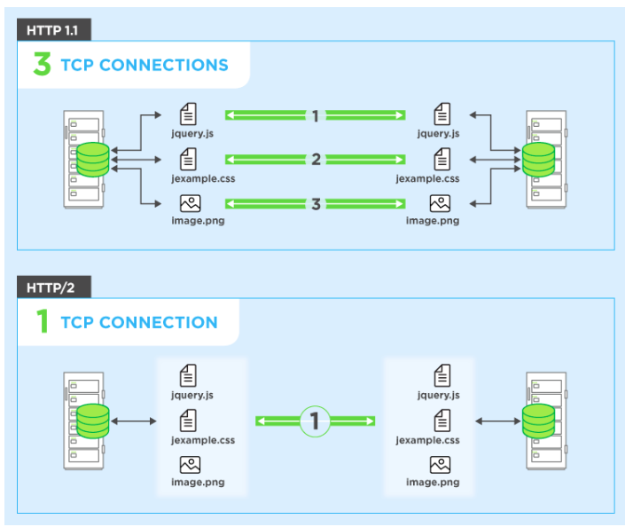

# 10장 HTTP/2.0

## 10.3 HTTP/1.1과의 차이점

### 10.3.1 프레임

    

### 10.3.2 스트림과 멀티플렉싱

> HTTP/2.0 &rarr; 개선된 멀티플렉싱 지원  &rarr; Connection 하나에서 다수의 입출력이 가능

    

### 10.3.3 헤더 압축

| HTTP/1.1                                                     | HTTP/2.0                                               |
|:-------------------------------------------------------------|:-------------------------------------------------------|
| 헤더 압축 X &rarr; 쿠키 등 하나의 웹 페이지를 위해 수많은 요청/응답이 통신하여 큰 영향 끼치게 됨 | `HPACK`을 통해 헤더 80% 이상 압축 O &rarr; 허프만 코드로 인코딩되어 텍스트 압축 |

### 10.3.4 서버 푸시

> HTTP/2.0에서 서버는 클라이언트의 단일 요청에 추가적인 응답 가능

## 10.4 알려진 보안 이슈

### 10.4.1 중개자 캡슐화 공격(Intermediary Encapsulation Attacks)

> HTTP/2.0 &rarr; 헤더 필드에 어떤 문자열이든 허용 &rarr; 위조될 가능성 존재

### 10.4.2 긴 커넥션 유지로 인한 개인정보 노출 우려

> HTTP/2.0 &rarr; HTTP/1.0 보다 훨씬 긴 connection 유지 &rarr; 사용자 동작 파악 가능