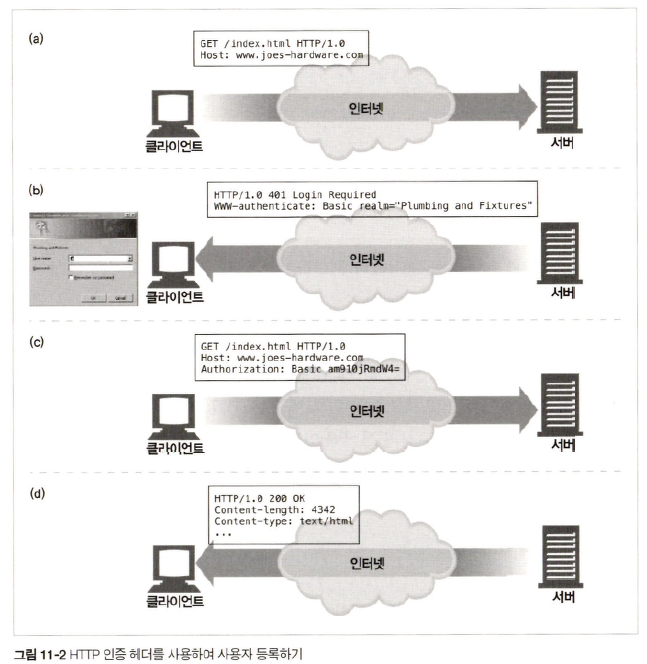
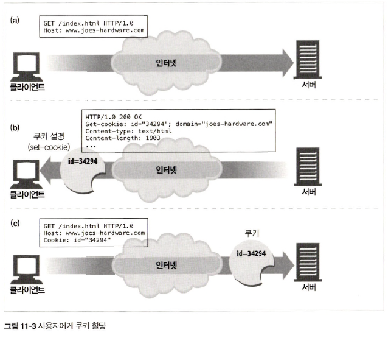
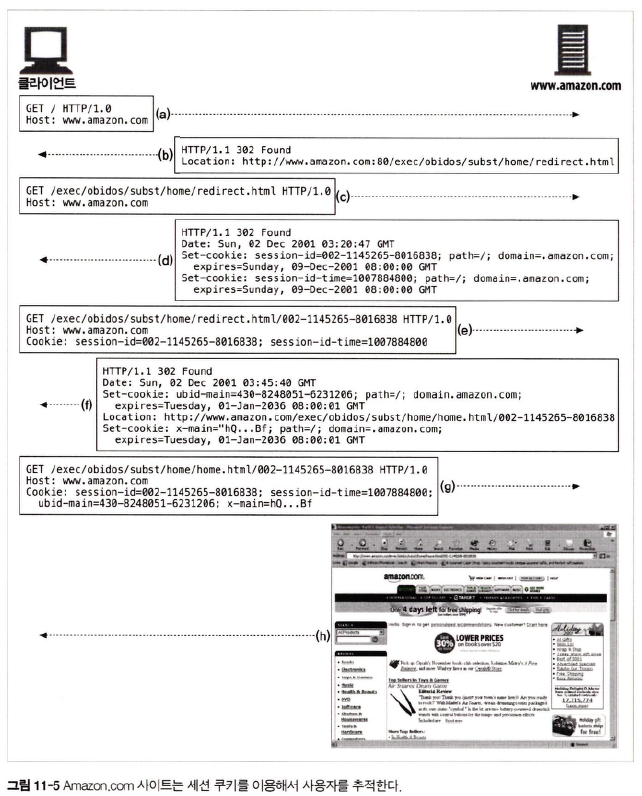

# 11장 클라이언트 식별과 쿠키

## 11.2 HTTP 헤더

|헤더| 설명                   |
|:------:|:---------------------|
|From| 사용자 이메일 주소           |
|User-Agent| 사용자 브라우저             |
|Referer| 사용자가 현재 링크를 타고 온 페이지 |
|Authorization| 사용자 이름과 비밀번호과 관련된 토큰|
|Client-ip|클라이언트의 IP 주소|
|X-Forwarded-For|클라리언트 IP 주소|
|Cookie|서버가 생성한 ID 라벨|

## 11.4 사용자 로그인

<div align="center">
    
</div>

## 11.5 뚱뚱한 URL

> 뚱뚱한 URL이란, 사용타 상태 정보를 포함하고 있는 URL

- `공유하지 못하는 URL` : 특정 사용자와 세션에 대한 상태 정보를 포함한 URL을 공유하게 되면 개인 정보 유출됨
- `캐시를 사용할 수 없음` : URL이 달라져 기존 캐시에 접근 불가능
- `서버 부하 가중` : 뚱뚱한 URL에 해당하는 HTML 페이지 re-rendering
- `이탈` : 뚱뚱한 URL에서 사용자가 이탈하게 되면 기존 진행 상황이 초기화되고 다시 처음부터 동작해야할 가능성 존재 &rarr; `query string` 초기화
- `세션 간 지속성의 부재` : 사용자가 뚱뚱한 URL을 북마크하지 않는 이상 로그아웃하면 모든 정보 초기화

## 11.6 쿠키

### 11.6.1 쿠키의 타입

- Session Cookie
  - 웹 페이지 관련 설정 및 선호 사항 임시 저장 쿠키
  - 사용자가 브라우저 닫으면 삭제
  - `Discard` 파라미터 설정 &rarr; `Session Cookie`
  - `Expires`, `Max-Age` 헤더 x &rarr; `Session Cookie`

- Persistent Cookie
  - 디스크에 저장 
  - 브라우저 닫거나 컴퓨터 재시작해도 쿠키 존재 
  - 사용자가 주기적으로 방문하는 웹 페이지에 대한 설정 정보 및 로그인 정보 유지 목적

### 11.6.3 쿠키 상자: 클라리언트 측 상태

<div align="center">
  
</div>

### 11.6.6 Version 0(넷스케이프) 쿠키

```text
Set-Cookie: name=value [; expires=date] [; path=path] [; domain=domain] [; secure]

Cookie: name1=value1 [; name2=value2] ...
```

|Seet-Cookie 속성| 설명                                                                                                   |
|:------:|:-----------------------------------------------------------------------------------------------------|
|이름=값| ```Set-Cookie: customer=Mary```                                                                      |
|Expires| 쿠키의 생명 주기<br/>```Set-Cookie: foo=bar; expires=Wednesday, 09-Nov-22 23:12:40 GMT```                   |
|Domain| 이 속성에 기술된 도메인을 사용하는 서버 호스트명으로만 쿠키 전송<br/>```Set-Cookie: SHPPING=FEDEX; domain="joes-hardware.com"``` |
|Path| 서버에 있는 특정 데이터에만 쿠키 할당 가능<br/>```Set-Cookie: lastorder=00183; path=/orders```                         |
|Secure| HTTP가 SSL 보안 연결을 사용할 때만 쿠키 전송<br/>```Set-Cookie: private_id=519; secure```                           |

### 11.6.8 쿠키와 세션 추적

<div align="center">
  
</div>

### 11.6.9 쿠키와 캐싱

#### 캐시되지 말아야할 문서가 있다면 표시

> Cookie 헤더를 제외하고 캐시를 해도 되는 경우라면 `Cache-Control: no-cahce="Set-Cookie"` 를 할당  
> 캐시를 해도 되는 데이터에 `Cache-Control: public`을 사용하면 웹 대역폭 절약 가능

#### Set-Cookie 헤더를 캐시하는 것에 유의

> 캐시를 모든 요청마다 원 서버에 재검사 요청  &rarr; `Cache-Control: must-revalidate, max-age=0`

#### Cookie 헤더를 갖고 있는 요청을 주의

> 요청이 Cookie 헤더와 함께 오면 응답이 개인정보 담고 있을 가능성 존재