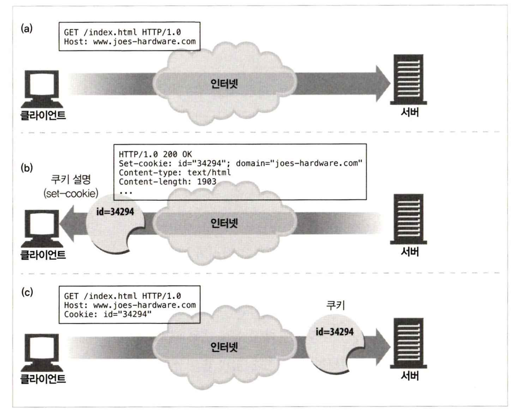
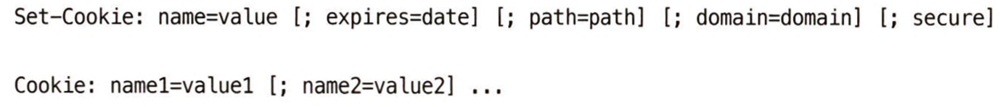
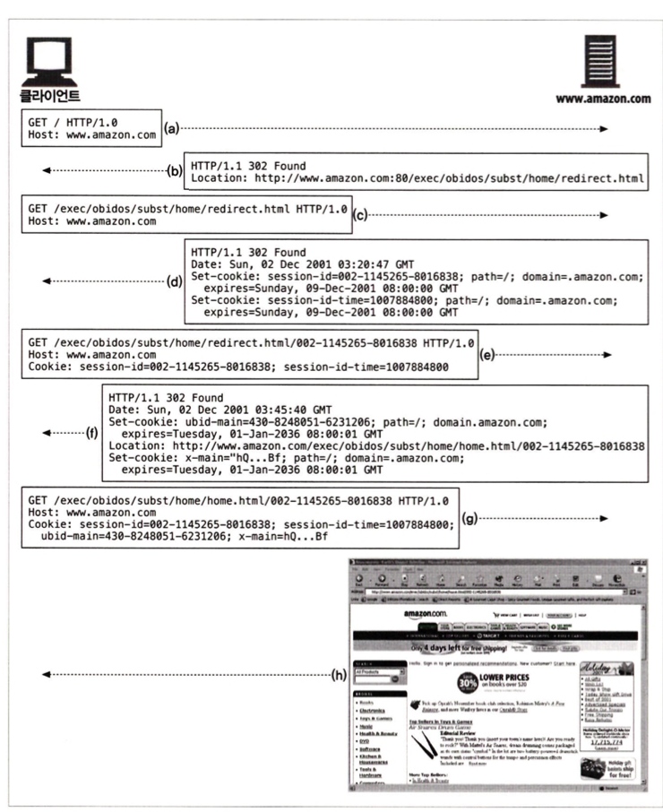

# 11장 클라이언트 식별과 쿠키

</br>

## 1. 개별 접촉

HTTP는 익명으로 사용하며 상태가 없고 요청과 응답으로 통신하는 프로토콜이다.

서버는 클라이언트가 보낸 요청을 처리하고 나서 그 응답을 클라이언트로 전송한다.

웹 서버는 요청을 보낸 사용자를 식별하거나 방문자가 보낸 연속적인 요청을 추적하기 위해 약간의 정보를 이용할 수 있다.

</br>

## 2. HTTP 헤더

### From

- 사용자의 이메일 주소 포함
- 악의적인 서버가 이메일 주소를 모아서 스팸 메일 발송하는 문제 있음

### User-Agent

- 사용자가 쓰고 있는 브라우저의 이름과 버전 정보, 어떤 경우에는 운영체제에 대한 정보까지 포함하여 서버에게 알려줌

### Referer

### 사용자가 현재 페이지로 유입하게 한 웹페이지의 URL을 가리킴

### 사용자의 웹 사용 형태나 사용자의 취향을 파악 가능

</br>

## 3. 클라이언트 IP 주소

세션 간에 사용자를 추적하기 위해 클라이언트 IP 주소를 사용하는 웹사이트가 있지만, 이 방식은 제대로 동작하지 않기 때문에 사용하지 않은다.

</br>

## 4. 사용자 로그인

웹 서버는 사용자 이름과 비밀번호로 인증할 것을 요구해 사용자에게 명시적으로 식별 요청을 할 수 있다.

1. 브라우저는 서버로 요청한다.
2. 서버는 401 Login Required HTTP 응답 코드와 WWW-Authenticate 헤더를 반환하여 로그인하라고 요청한다.
3. 사용자가 사용자 이름과 비밀번호를 입력하고 브라우저는 기존 요청을 다시 보내서 사용자 식별을 시도한다.
4. 서버는 사용자의 식별정보를 안다.

하지만, 웹 사이트 로그인은 사이트마다 서로 다른 사용자 이름과 비밀번호를 기입해야하고 이를 기억해야 한다는 점에서 매우 번거롭다.

</br>

## 5. 뚱뚱한 URL

- URL은 URL 경로의 처음이나 끝에 어떤 상태 정보를 추가해 확장한다.
- 사용자가 그 사이트를 돌아다니면, 웹 서버는 URL에 있는 상태 정보를 유지하는 하이퍼링크를 동적으로 생성한다.
- 사용자의 상태 정보를 포함하고 있는 URL을 뚱뚱한 URL이라고 한다.
- 각 URL은 웹 상점을 돌아다니는 사용자에게 할당된 식별번호를 각 URL 뒤에 붙여서 사용자를 추적한다.
- 사용자가 웹 사이트에 처음 방문하면 유일한 ID가 생성되고, 그 값은 서버가 인식할 수 있는 방식으로 URL에 추가되며, 서버는 클라이언트를 이 뚱뚱한 URL로 리다이렉트 시킨다.

### 뚱뚱한 URL 문제점

- 못생긴 URL
- 공유하지 못하는 URL
- 캐시를 사용할 수 없음
    - URL로 만드는 것은, URL이 달라지기 때문에 기존 캐시에 접근할 수 없는 것을 의미한다.
- 서버 부하 가중
    - 서버는 뚱뚱한 URL에 해당하는 HTML 페이지를 다시 그려야 한다.
- 이탈
    - 사용자가 이탈하게 되면, 지금까지의 진척상항들이 초기화되고 다시 처음부터 시작하게 될 것이다.
- 세션 간 지속성 부재

</br>

## 6. 쿠키

쿠키는 사용자를 식별하고 세션을 유지하는 방식 중에서 현재까지 가장 널리 사용하는 방식이다.

쿠키는 캐시와 충돌할 수 있어서 대부분의 캐시나 브라우저는 쿠키에 있는 내용물을 캐싱하지 않는다.

</br>

### 6.1 쿠키의 타입

세션 쿠키

- 세션 쿠키는 사용자가 사이트를 탐색할 때, 관련한 설정과 선호 사항들을 저장하는 임시 쿠키다.
- 사용자가 브라우저를 닫으면 삭제된다.

지속 쿠키

- 세션 쿠키와 달리 디스크에 저장되며, 브라우저를 닫거나 컴퓨터를 재시작하더라도 남아있다.
- 사용자가 주기적으로 방문하는 사이트에 대한 설정 정보나 로그인 이름을 유지하려고 사용한다.

</br>

### 6.2 쿠키는 어떻게 동작하는가

- 웹 서버는 사용자가 다시 돌아왔을 때, 해당 사용자를 식별하기 위한 유일한 값을 쿠키에 할당한다.
- 쿠키는 임의의 이름=값 형태의 리스트를 가지고, 그 리스트는 Set-Cookie 혹은 Set-Cookie2 같은 HTTP 응답 헤더에 기술되어 사용자에게 전달한다.
- 서버는 이 쿠키 값으로 데이터베이스에서 사용자의 정보를 찾는데 사용할 수 있다.
- 브라우저는 서버로 온 Set-Cookie 헤더에 있는 쿠키 콘텐츠를 브라우저 쿠키 데이터베이스에 저장한다.

</br>

### 6.3 클라이언트 측 상태

브라우저는 쿠키를 저장할 책임이 있는데, 이 시스템을 ‘클라이언트 측 상태’라고 한다.

<div align="center">
    
</div>

</br>

### 6.4 사이트마다 각기 다른 쿠키들

쿠키 Domain 속성

- 서버는 쿠키를 생성할 때 Set-Cookie 응답 헤더에 Domain 속을 기술해서 어떤 사이트가 그 쿠키를 읽을 수 있는지 제어할 수 있다.

```bash
Set-Cookie: user="mary17"; domain='airtravelbargains.com'
```

- .airtravelbargains.com으로 끝나는 사이트를 방문하면 다음 Cookie 헤더가 항상 적용될 것 이다.

```bash
Cookie: user="mary17"
```

</br>

쿠키 Path 속성

- URL 경로의 앞부분을 가리키는 Path 속성을 기술해서 해당 경로에 속하는 페이지에만 쿠키를 전달한다.

```bash
Set-Cookie: pref=compact; domain='airtravelbargains.com'; path=/autos/
```

- [http://www.airtravelbargains.com/autos/cheapo/index.html로](http://www.airtravelbargains.com/autos/cheapo/index.html로) 접근하면 다음과 같은 두 가지 쿠키를 받게될 것 이다.

```bash
Cookie: user="mary17"
Cookie: pref=compact
```

</br>

### 6.6 Version 0(넷스케이프) 쿠키

Set-Cookie 응답 헤더와 Cookie 요청 헤더와 쿠키를 조작하는데 필요한 필드들을 정의했다.

<div align="center">
    
</div>

</br>

### 6.7 쿠키와 세션 추적

<div align="center">
    
</div>

</br>

### 6.9 쿠키와 캐싱

쿠키 트랜젝션과 관련된 문서를 캐싱하는 것은 주의해야 한다.

이전 사용자의 쿠키가 다른 사용자에게 할당돼버리거나, 누군가의 개인 정보가 다른 이에게 노출되는 최악의 상황이 일어날 수도 있다.

- 캐시되지 말아야 할 문서가 있다면 표시하라
- Set-Cookie 헤더를 캐시 하는 것에 유의하라
- Cookie 헤더를 가지고 있는 요청을 주의하라
