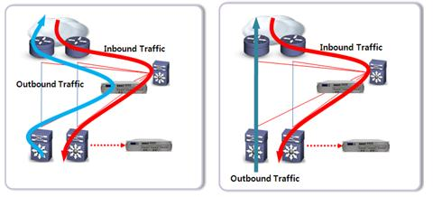

 
 
 

### 11.3 클라이언트 IP 주소
서버에서 클라이언트 IP를 알 수 있는 방법
- nginx 같은 웹 서버에서는 기본적으로 remote_addr 헤더를 통해 클라이언트 IP를 얻을 수 있음
- 그러나 nginx에 도달하기 전에 프록시, 로드밸런서 등을 거치는 경우에는 이러한 클라이언트 IP가 프록시의 IP로 변경될 수 있음   
-> 이 문제를 해결하기 위해 Client-ip, X-Forwarded-For 같은 HTTP 확장 헤더를 사용  

 

> `로드밸런서의 Inline(Proxy) / DSR Mode`  

    

왼쪽은 서버에서 `나가는 트래픽(outbound traffic)도 LB를 거치는` Inline 모드.  
오른쪽은 서버에서 `나가는 트래픽이 Direct Server Return하는` DSR 모드.  
보통 서버에서 나갈 때 LB를 한 번 더 거치며 생기는 병목을 해소하기 위해 많은 기능을 필요로 하지 않는 경우에는 더 많은 트래픽을 감당할 수 있는 DSR 모드를 사용.  
-> Inline 모드일 경우 client ip가 로드밸런서의 ip로 바뀌는 문제를 가지지만, `DSR 모드에서는 client ip가 그대로 유지되어 LB에서 별다른 헤더 추가 없이도 nginx에서 remote_addr로 바로 받아올 수 있음` (Inline 모드일 경우 LB에서 client IP를 식별할 수 있는 HTTP 헤더를 따로 추가해줌)  

 
 

### 웹 사이트가 사용자의 세션을 트래킹하는 방법
cf) 세션 : 분리된 HTTP 트랜잭션을 하나로 모아주는 개념

1. 뚱뚱한 URL   
-> request param에 이전 트랜잭션 정보를 계속 담아주는 방식  
-> 점점 url이 비대해짐. 당연히 보안상 문제.

 

2. 쿠키 : 클라이언트 PC의 쿠키 파일에 데이터를 저장(브라우저마다 저장 방식은 조금씩 다름)하여 웹 페이지들끼리 공유한다.  
> <쿠키를 이용한 데이터 전송 과정>  
> 1) 브라우저로 웹 사이트 접속
> 2) 서버가 데이터를 저장한 쿠키 생성하여 브라우저로 전송 
> 3) 브라우저는 서버에서 받은 쿠키를 쿠키 파일로 저장 
> 4) 브라우저가 재접속 
> 5) 서버는 해당 브라우저에 맞는 데이터 처리 위해 브라우저에게 지난번 받은 쿠키 전송 요청
> 6) 브라우저는 쿠키 정보를 서버로 전달 
> 7) 서버가 받은 쿠키 정보로 작업

 

> <쿠키의 종류>
> 1) Persistence 쿠키
> - 클라이언트 디스크에 파일로 정보 저장 (컴퓨터를 재시작해도 남아있음)
> - 사용자가 만료 시간 지정 가능
> - setMaxAge()(쿠키 유효 시간 설정) 메서드에 인자 값으로 양수 설정하여 파일에 저장하면 생성됨
> 2) Session 쿠키
> - 브라우저가 사용하는 메모리에 생성, 브라우저 종료 시 자동 소멸.
> - 세션(Session)과 같이 사용됨
> - setMaxAge() 메서드에 인자 값으로 음수를 설정하거나 해당 메서드를 사용하지 않는 경우 Session 쿠키로 저장됨

 

3. 세션 : 서버의 메모리에 데이터를 저장하여 웹 페이지들이 공유할 수 있도록 한다.
- 세션은 브라우저당 한 개, 즉 사용자당 한 개가 생성
- 서버가 여러개일 경우 각 서버의 세션이 공유되지 않아 레디스를 session storage로 씀 (sticky session이라는 것도 있지만 잘 쓰지는 않음)

 
 

### 쿠키와 광고
쿠키는 사용자가 방문한 웹사이트에서 사용자에게 편리한 기능을 위해 만드는 `First Party Cookie`와 보통 광고 업체에서 사용자 정보 트래킹을 위해 만드는 `Third Party Cookie`가 있다.  
써드 파티 쿠키는 누구나 만들 수 있지만, 퍼스트 파티 쿠키는 웹 사이트의 host만이 만들 수 있다. 쿠키는 브라우저를 방문했을 때 만들어지고, 페이지를 옮겨다녀도 남아있으며, 마지막으로 방문한 날짜로부터 유효기간이 계속 늘어나는 등의 방식으로 사용자 정보를 추적하는데, 써드 파티 쿠키 역시 이런 방식으로 광고를 위한 데이터를 수집한다.  
애플에는 쿠키와 유사하게 사용자를 트래킹할 수 있는 고유식별자(IDFA)가 있다.  
한편 크롬을 비롯한 많은 브라우저들이 써드 파티 쿠키를 개인정보 침해 문제를 이유로 2022-2023 안에 단계적으로 지원하지 않기로 결정했다. 애플 또한 IDFA를 default 옵션으로 제공하지 않고 앱을 사용하는 사용자에게 동의 여부를 묻도록 방침을 바꿨다.  
[First-Party vs. Third-Party Cookies: The Differences Explained](https://termly.io/resources/articles/first-party-cookies-vs-third-party-cookies/)  
[비판 여론으로 쿠키 지원 중단 연기한 구글, FLoC 관련 쟁점 총정리](https://report.roa.ai/article/171765) -> 구글에서 대체제로 제시한 FLoC

