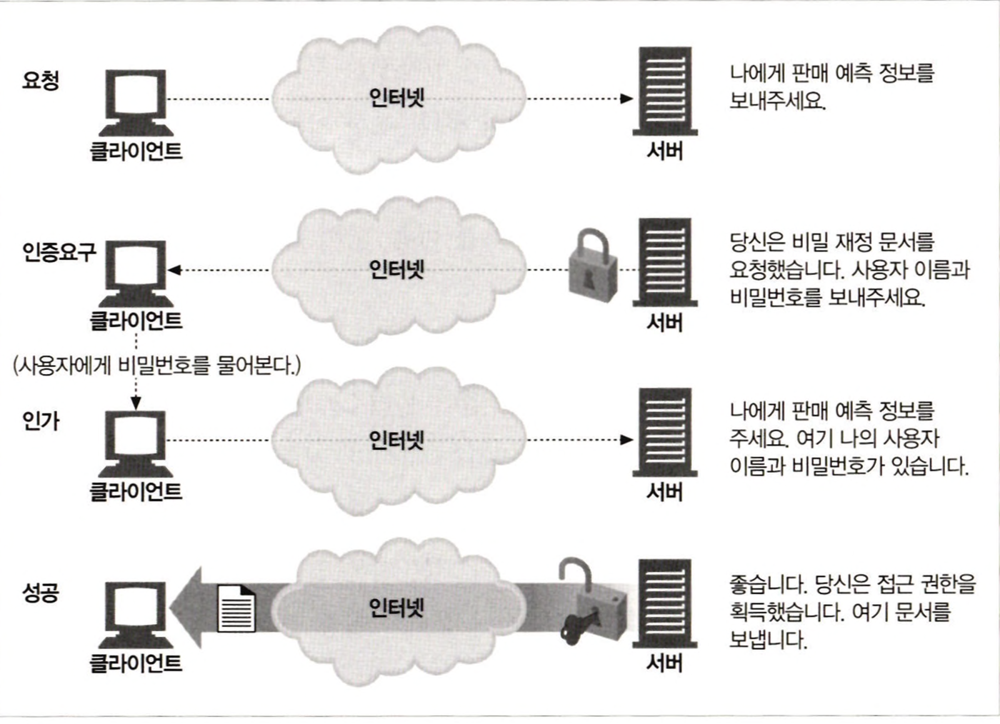
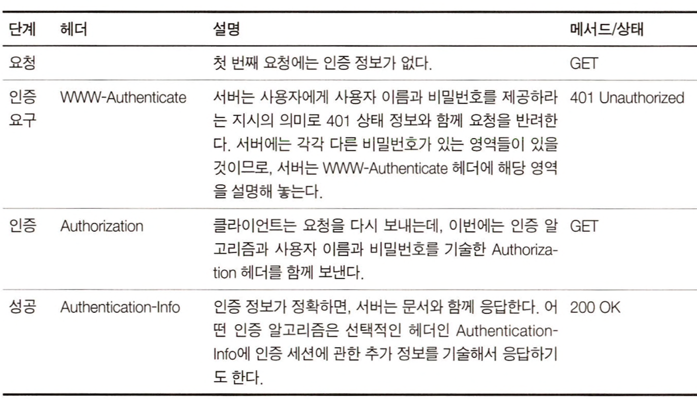
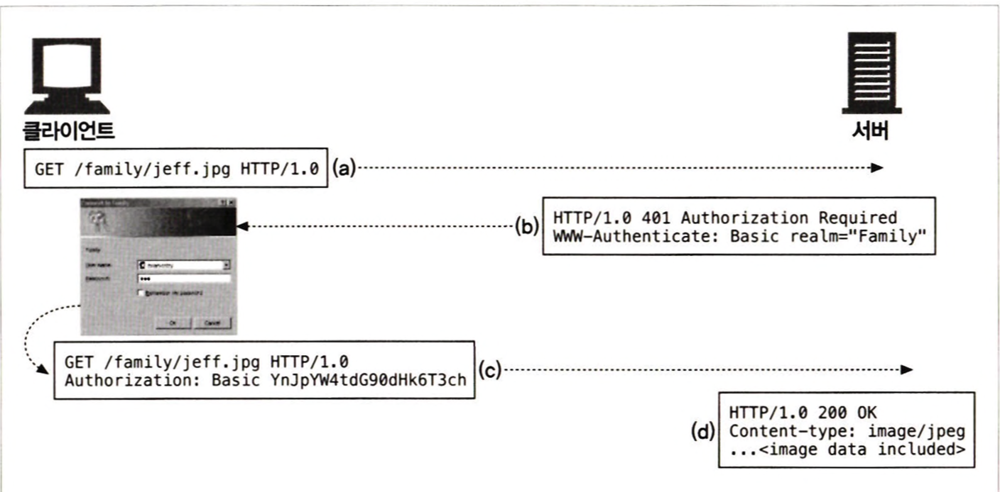
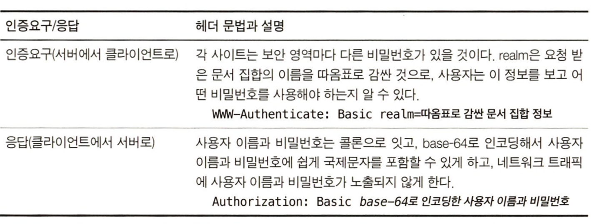
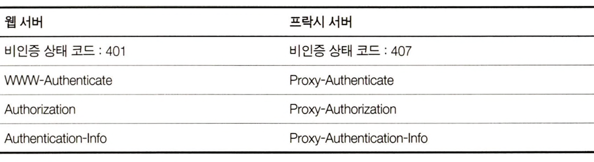

# 12장 기본 인증

</br>

## 1. 인증

</br>

### 1.1 HTTP의 인증요구/응답 프레임워크

HTTP는 사용자 인증을 하는 데 사용하는 자체 인증요구/응답 프레임워크를 제공한다.

1. 클라이언트 : 요청
2. 서버           : 인증 요구
3. 클라이언트 : 비밀번호 입력
4. 서버           : 인증 정보 확인 및 요청 처리

<div align="center">
    
</div>

</br>

### 1.2 인증 프로토콜과 헤더

네 가지 인증 단계

<div align="center">
    
</div>

</br>

### 1.3 보안 영역

웹 서버는 기밀문서를 **보안 영역(realm)** 그룹으로 나눈다.

보안 영역은 저마다 다른 사용자 권한을 요구한다.

realm은 해설 형식으로 되어있어 사용자 이름과 비밀번호를 가지고 있는 사용자가 권한의 범위를 이해하는 데 도움이 되어야 한다.

```bash
HTTP/1.0 401 Unauthorized
WWW-Authenicate: Basic realm="Corporate Financials"
```

</br>

## 2. 기본 인증

</br>

### 2.1 기본 인증의 예

기본 인증은 가장 잘 알려진 HTTP 인증 규약이다.

거의 모든 주요 클라이언트와 서버에 기본 인증이 구현되어 있다.

<div align="center">
    
</div>

</br>

- 사용자가 자신의 가족사진인 /family/jeff.jpg를 요청한다.
- 서버가 **WWW-Authenticate** 헤더와 함께 개인 가족사진에 접근하는 데 필요한 비밀번호를 요구하는 **401 Authorization Required** 응답을 반환한다.
- 브라우저가 401 응답을 받고 Family 영역에 관한 사용자 이름과 비밀번호를 요구하는 대화상자를 띄운다.
사용자가 사용자 이름과 비밀번호를 입력하면, 브라우저는 그것들을 콜론으로 이어 붙이고, base-64 방식으로 인코딩하고, Authorization 헤더에 그 값을 담아 서버로 다시 보낸다.
- 서버가 사용자 이름과 비밀번호를 디코딩하고, 그 값이 정확한지 검사한 후, 문제가 없으면 HTTP 200 OK 메시지와 함께 요청받았던 문서를 보낸다.

<div align="center">
    
</div>

</br>

### 2.2 Base-64 사용자 이름/비밀번호 인코딩

HTTP 기본 인증은 사용자 이름과 비밀번호를 콜론으로 이어서 합치고, base-64 인코딩 메서드를 사용해 인코딩 한다.

</br>

### 2.3 프락시 인증

중개 프락시 서버를 통해 인증할 수도 있다.

프락시 인증은 웹 서버의 인증과 헤더와 상태 코드만 다르고 절차는 같다.

<div align="center">
    
</div>
