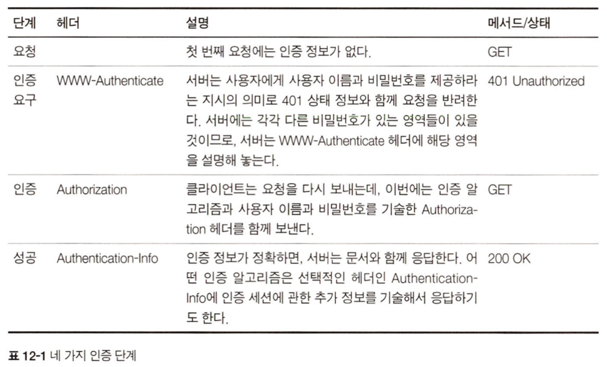
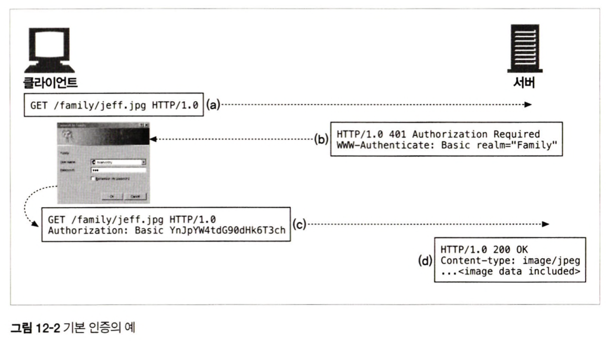
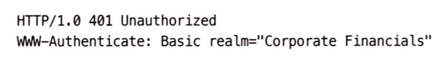
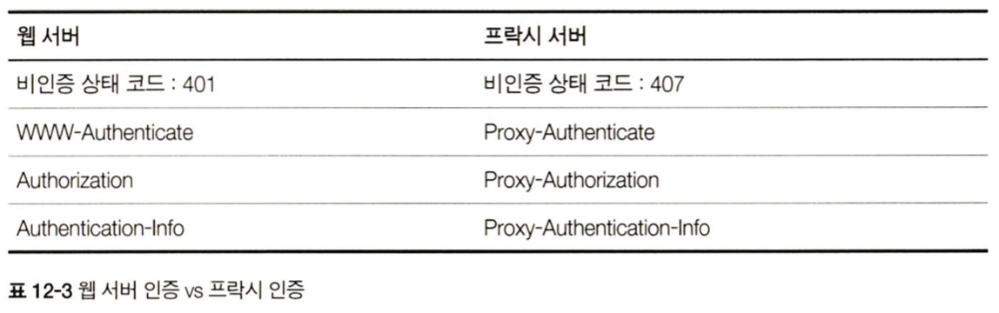

 
 
 

### 12.1.2 인증 프로토콜과 헤더
인증은 내가 누구인지 증명하는 것.  
HTTP에는 `기본 인증`과 `다이제스트 인증`이 있음

    

 

<기본 인증 예시>

    

(a) 요청을 보냄  
(b) 서버가 사용자에게 인증요구를 보냄. 401 Unauthorized + WWW-Authenticate 헤더(어디서 어떻게 인증할지 설명)  
(c) 클라이언트는 Authorization 헤더에 인코딩된 비밀번호와 그 외 인증 파라미터(주로 base-64 인코딩)를 담아서 요청을 보냄 -> ...이라고 하지만 당연히 비밀번호를 바로 인코딩해서 이렇게 보내는 경우는 없음. 로그인에서 많이 쓰는 JWT 로그인의 경우는 JWT를 여기에 담기도 함.   
(d) 응답. 추가적으로 인증 알고리즘에 대한 정보를 Authentication-Info 헤더에 기술할 수도 있음

 
 

### 12.1.3 보안 영역
웹 서버는 기밀 문서를 보안 영역(realm) 그룹으로 나눔  
-> realm 파라미터를 WWW-Authenticate에 함께 기술  

    

 
 

### 12.2.3 프록시 인증
중개 프록시 서버를 통해서도 인증 가능  
프록시 서버는 접근 정책을 중앙 관리할 수 있기 때문에 단일 관리 포인트로 많이 사용  
웹 서버 인증과 헤더명 및 상태 코드가 조금 다름  

    

 
 

### 12.3 기본 인증의 보안 결함
기본 인증은 많은 보안 결함을 가지고 있기 떄문에, 모든 HTTP 트랜잭션을 SSL 암호화 채널을 통해 보내거나, 보안이 더 강화된 다이제스트 인증 같은 프로토콜을 사용하는 것이 좋음.  