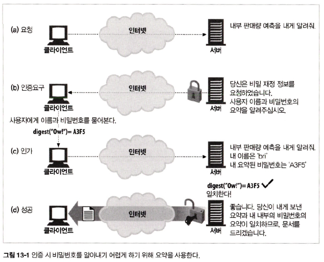
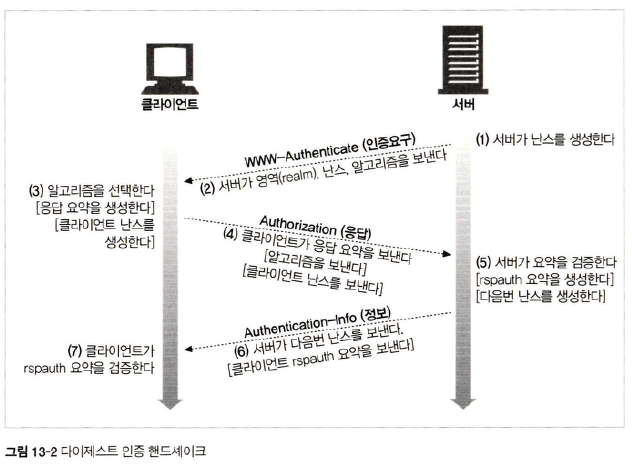
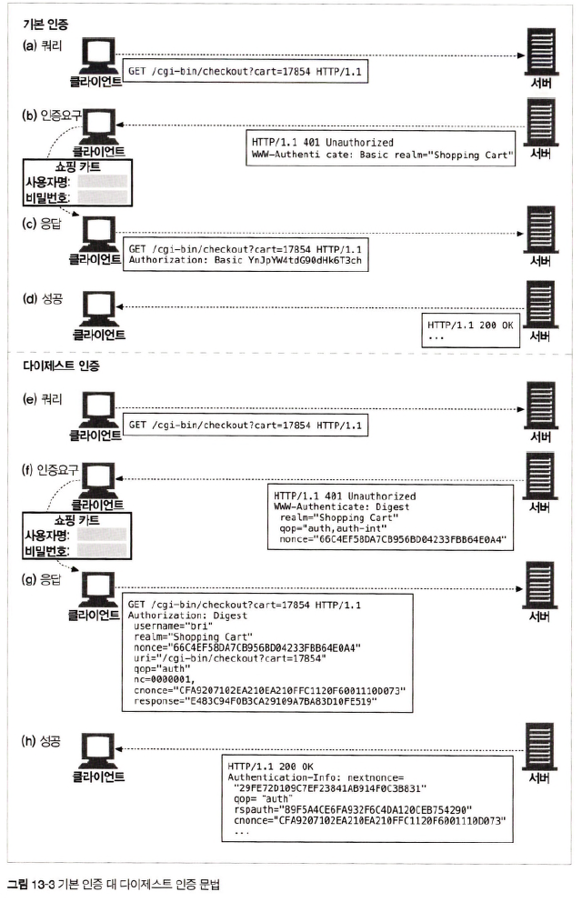
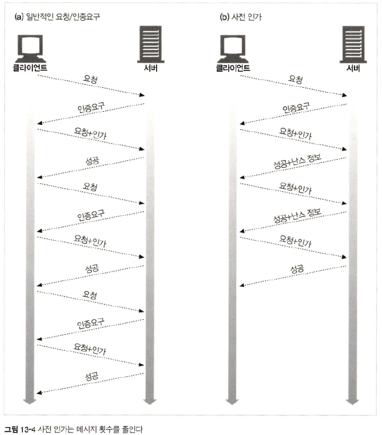
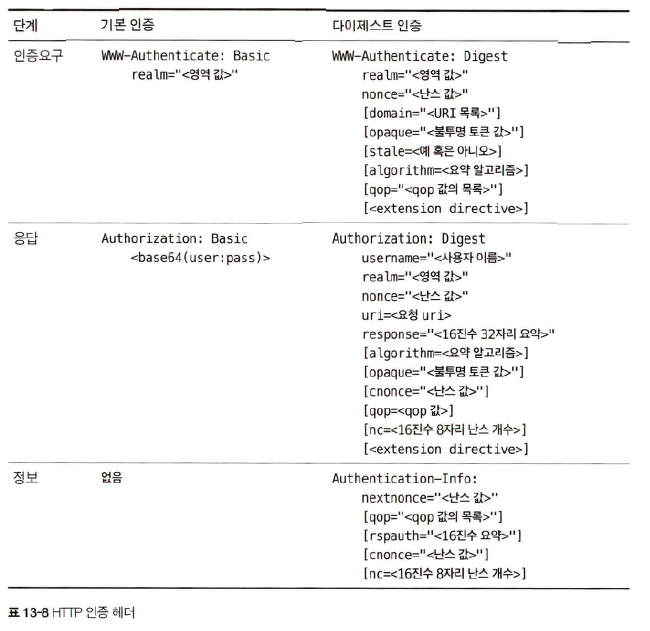

# 13장 다이제스트 인증

## 13.1 다이제스트 인증의 개선점

#### 다이제스트 인증 특징

- 비밀번호를 절대로 네트워크를 통해 평문 전송 x
- 인증 체결을 가로채 재현하는 요청 차단
- 구현에 따라 메시지 내용 위조 차단 가능

### 13.1.1 비밀번호를 안전하게 지키기 위해 요약 사용하기

> 다이제스트 인증 주요점 = `절대로 비밀번호를 네트워크를 통해 전송 X`

<div align="center">
    
</div>

- 클라이언트 &rarr; 서버에 사용자 비밀번호를 요약하여 전송(= 클라이언트가 비밀번호를 알고 있음을 증명)
- 서버는 클라이언트가 전송한 비밀번호를 인증

### 13.1.2 단방향 요약

> 단방향이란, 복호화가 불가능한 암호화

#### MD5 알고리즘 예시

|입력| MD5 출력                           |
|:-----:|:---------------------------------|
|"Hi"| C1A5298F939E87E8F962A5EDFC206918 |
|"bri:Owl!"| BEAAA0E34EBDB072F8627C038AB211F8 |
|"3.14159265358979"|475B977E19ECEE70835BO6DF46F4F6DE|
|"http://www.http-guide.com/index.html"|C617G0C7D1D05F66F595E22A4B0EAAA5|

### 13.1.3 재전송 방지를 위한 nonce 사용

> nonce란, 블록체인에서 목표값 이하의 블록 해시를 찾기 위해 임시로 사용하는 숫자 &rarr; nonce 값을 **한번만 사용**

- 클라이언트 &rarr; 서버 복호화된 비밀번호 전송 시 가로채 서버로 재전송하여 해킹 가능
- 클라이언트 &rarr; 서버 비밀번호 전송 시 `서버가 제공한 nonce 값 + 요약된 비밀번호` 전송 &rarr; 재전송 공격 방지
- 요약된 비밀번호는 **특정 nonce 값에만 유효**하고 **nonce가 바뀔 때마다 비밀번호 요약도 바뀌도록** 설정
- `nonce` &rarr; `WWW-Authenticate` 헤더에 담아 전송

### 13.1.4 다이제스트 인증 핸드셰이크

<div align="center">
    
</div>

<div align="center">
    
</div>

## 13.2 요약 계산

### 13.2.7 사전(preemptive) 인가

<div align="center">
    
</div>

#### 클라이언트가 새로운 `WWW-Authenticate` 인증 요구를 기다리지 않고 올바른 nonce를 요청할 수 있는 방법

1. 서버 &rarr; 다음 `nonce`를 `Authentication-Info` 성공 헤더에 담아 미리 전송
2. 서버가 짧은 시간 동안 같은 `nonce` 값 재사용 허용
3. 클라이언트 &harr; 서버 동기화되어 있고 예측 가능한 `nonce 생성 알고리즘` 사용

#### _1. 다음 `nonce` 미리 생성하기_

> 서버 &rarr; 인증이 성공했을 때 `200 OK` 응답과 함께 이 헤더 미리 전송

```http request
Authentication-Info: nextnonce="<nonce value>"
```

#### _2. 제한된 `nonce` 재사용_

```http request
WWW-Authentication: Digest 
   realm="<영역 값>"
   nonce="<nonce 값>"
   state=true
```

`nonce`를 재사용하면 재전송 공격에 취약해 보안성 &darr;

#### _3. 동기화된 `nonce` 생성_

- 서버와 클라이언트가 순차적으로 같은 `nonce`를 생성할 수 있도록 시간적으로 동기화된 `nonce` 생성 알고리즘 사용

## 13.3 보호 수준(Quality of Protection) 향상

### 13.3.2 다이제스트 인증 헤더

<div align="center">
    
</div>