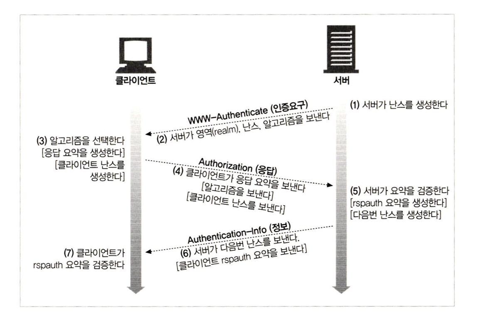

# 13장 다이제스트 인증

사용자 정보에 대해서 메세지를 단순 base-64 인코딩을 이용해 평문으로 보내기 때문에 SSL과 결합하여 보내는 것이 유일한 수단인 기본인증.

⇒ 기본인증과 호환되는 더 안전한 대체재 : 다이제스트 인증

## 13.1 다이제스트 인증의 개선점

HTTP 인증 프로토콜

- 비밀번호를 절대 네트워크를 통해 평문으로 전송하지 않는다
- 인증 체결을 가로채는 악의적 접근을 차단한다
- 메세지 위조를 막는 것이 가능하다

→ 공개키 기반 메커니즘에 비해서는 안전하지 못하다. 다른 사람이 정보를 가로챌 수 있다.

→ 안전한 HTTP 트랜젝션에는 TLS와 HTTPS가 더 적합한 프로토콜이다.

→ 현재는 사용되고 있지 않은 인증 방식이다

### 13.1.1 비밀번호를 안전하게 지키기 위해 요약 사용하기

비밀번호를 보내는 대신 클라이언트는 비밀번호가 변경되지 않게 ‘fingerprint’ 또는 ‘digest’를 보낸다.

클라이언트와 서버가 모두 비밀번호를 알고 있으므로 digest가 비밀번호에 알맞게 대응하는지 검사할 수 있다.

→ digest를 통해서 클라이언트는 자신이 비밀번호를 알고 있음을 증명.

→ 서버는 내부적으로 계산한 digest와 비교

→ 이 과정에서 비밀번호는 네트워크를 통해 전송되지 않는다.

ex ) digest(”Ow!”) = A3F5 : 요약된 비밀번호는 A3F5인 것을 확인

### 13.1.2 단방향 요약

128비트의 유한한 범위의 단방향 요약 함수(암호 체크섬)인 MD5

→ 32글자의 16진수로 표현되며 각 문자는 각각 4비트의 값을 의미

### 13.1.3 재전송 방지를 위한 nonce 사용

digest를 가로채서 서버로 재전송 할 수 있기 때문에 서버는 클라이언트에게 nonce라는 자주 변경되는 증표를 WWW-Authenticate 인증요구에 담아서 준다.

→ nonce가 바뀔 때마다 digest도 바뀌어 재전송 공격을 방지.

### 13.1.4 다이제스트 인증 핸드셰이크

다이제스트 인증 프로토콜은 기본 인증의 헤더에서 새 옵션이 추가 되고, 선택적 헤더인 Authorization-Info가 추가됨.

    

