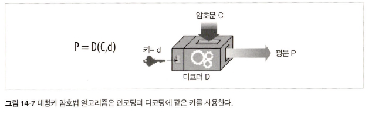

# 14장 보안 HTTP

## 14.1 HTTP를 안전하게 만들기

### 14.1.1 

> 모든 HTTP 요청과 응답 데이터 &rarr; 네트워크로 보내기지 전 보안 계층에서 암호화

    

## 14.2 디지털 암호학

### 14.2.2 암호(cipher)

    

### 14.2.4 키가 있는 암호

    

## 14.3 대칭키 암호법

    

## 14.4 공개키 암호법

> 두 개의 비대칭 키로 인코딩 키와 디코딩 키로 사용

    

    

### 14.4.1 RSA

#### 방식

1. A가 B에게 정보를 안전하게 전송하고 싶어 `RSA 알고리즘` 적용
2. B가 공개키와 개인키를 만들어 A에게 공개키 전송 (개인키는 B만 저장)
3. A가 B로부터 받은 공개키를 이용하여 보낼 정보 암호화
4. A가 암호화된 정보를 B에게 전송
5. B가 암호화된 정보를 받고 개인키를 이용하여 암호 디코딩

## 14.5 디지털 서명

### 14.5.1 서명은 암호 체크섬이다

    

### 14.6.3 서버 인증을 위해 인증서 사용하기

    

## 14.7 HTTPS의 세부사항

### 14.7.2 HTTPS 스킴

    

### 14.7.3 보안 전송 셋업

    

### 14.7.4 SSL 핸드셰이크

#### 핸드셰이크 내용

- 포로토콜 버전 
- 양쪽이 알고 있는 암호 선택
- 양쪽 신원 인증
- 채널 암호화하기 위한 임시 세션 키 생성

    

### 14.7.5 서버 인증서

    

### 14.7.6 사이트 인증서 검사

- 날짜 검사 : 브라우저가 인증서 유효성을 확인하기 위해 인증서 시작/종료일 확인
- 서명자 신뢰도 검사 : 인증기관으로부터 서명된 인증서인지 확인
- 서명 검사 : 서명기관 공개키를 서명에 적용하여 checksum과 비교하여 인증서 무결성 검사
- 사이트 신원 검사 : 브라우저가 인증서의 도메인 이름이 통신 중인 서버 도메인 이름과 비교하여 검사

## 14.9 프락시를 통한 보안 트래픽 터널링

    

    

#### HTTPS SSL 터널링 프로토콜

1. 클라이언트 &rarr; proxy에 클라이언트가 연결하고자 하는 안전한 호스트와 포트 전송
2. 클라이언트 &rarr; proxy가 읽을 수 있도록 `HTTP CONNECT` 메서드로 암호화 이전 데이터 전송
3. `HTTP CONNECT` 메서드 &rarr; 클라이언트 &harr; 서버 사이 데이터 통신 터널 구성
4. connection 수립 위한 **hand-shake 성공 이후 SSL 데이터 전송 시작**

