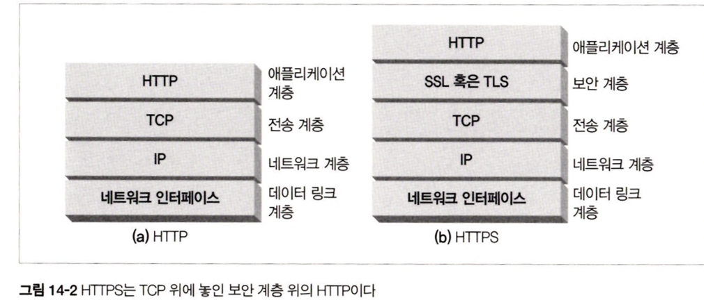
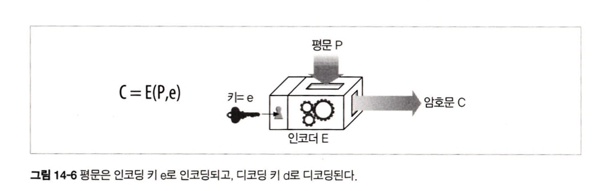
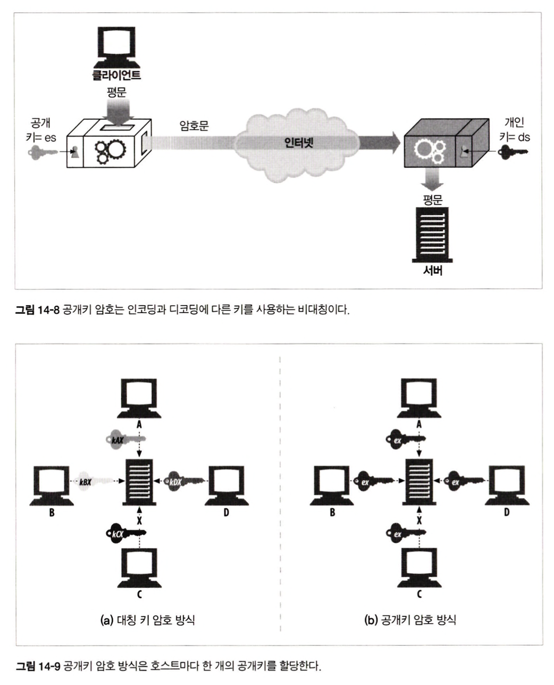
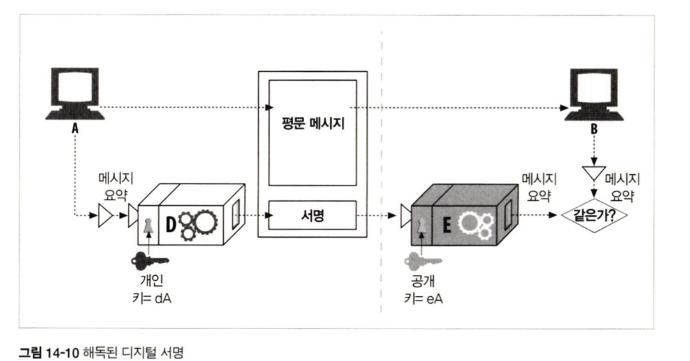
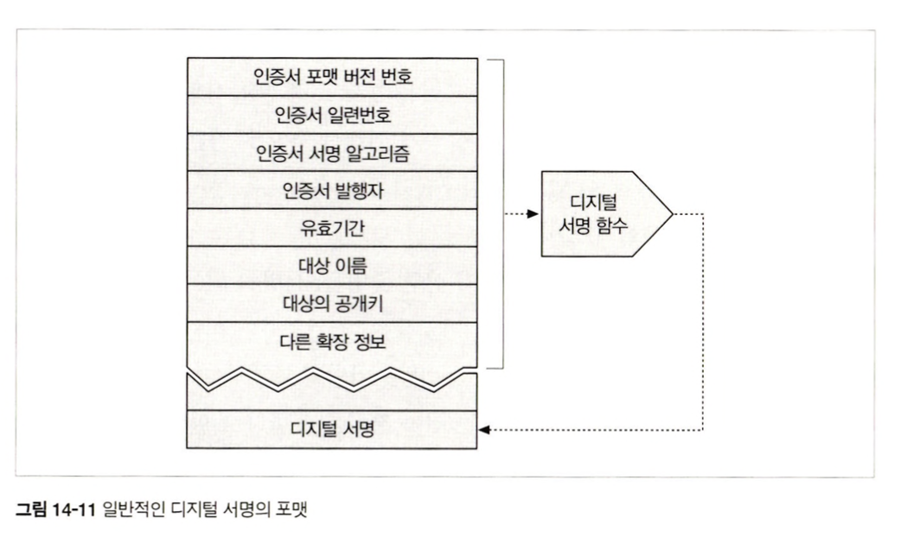
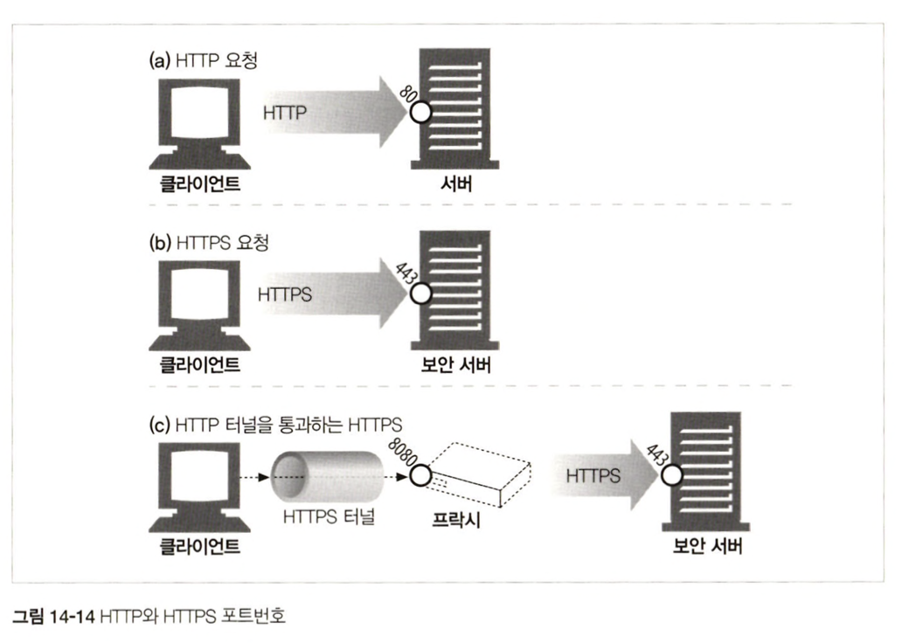
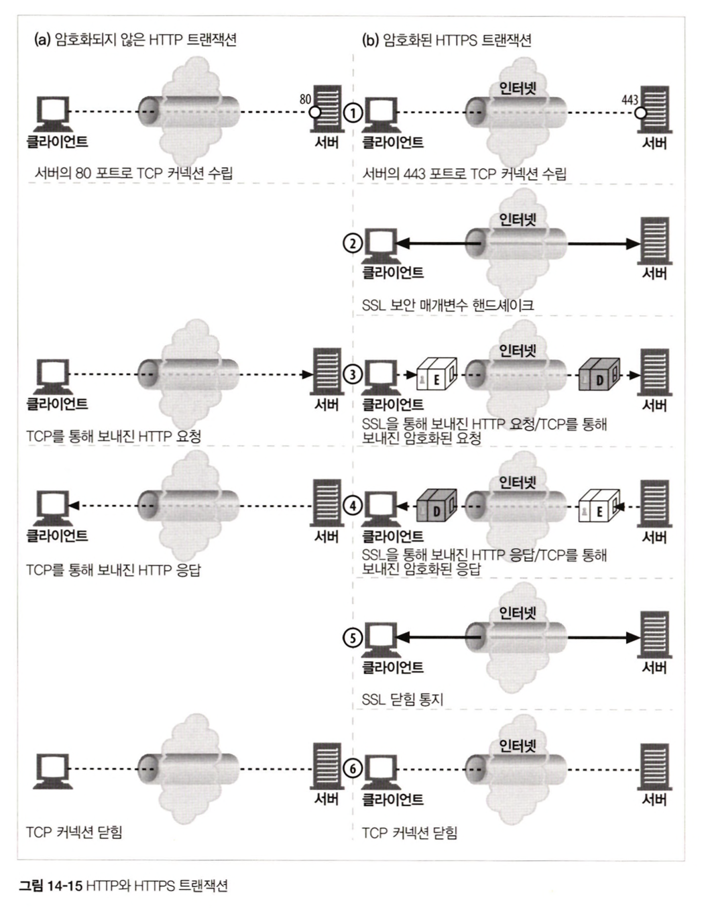
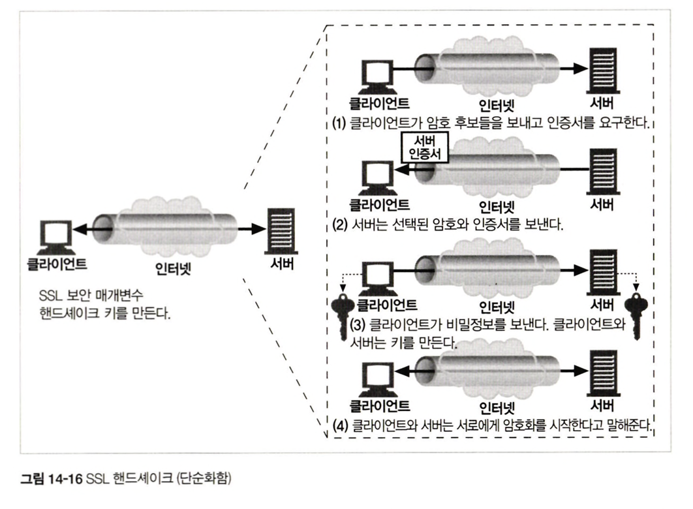

# 14장 보안 HTTP

## 14.1 HTTP를 안전하게 만들기

보다 중요한 웹에서의 트랜잭션을 위해서 HTTP 보안 기술이 필요.

- 서버, 클라이언트 인증
- 무결성 : 데이터 위조에 대해 안전
- 암호화 : 도청 걱정 없이 통신할 수 있어야
- 편재성 : 프로토콜은 모든 클라이언트 서버에 지원되어야
- 관리상 확장성 : 누구든 어디서든 즉각적인 보안 통신
- 적용성 : 최선의 보안 방법 지원
- 사회적 생존성 : 사회의 문화적, 정치적 요구 만족

### 14.1.1 HTTPS

    

- HTTPS에서 HTTP 요청, 응답 데이터는 네트워크로 보내지기 전에 암호화.
- HTTP 하부에 전송 레벨 암호 보안 계층을 제공함으로 동작.
  - SSL 또는 TLS 이용해 구현
  - 어려운 인코딩 디코딩 작업은 SSL 라이브러리에서 구현되어 있다.
  - 대부분의 경우, TCP 입출력 호출을 SSL 호출로 대체하고 추가적인 보안 정보 설정 관리 위한 호출만 있으면 됨.

## 14.2 디지털 암호학

- 암호 : 텍스트 인코딩 알고리즘
- 키 : 암호의 동작을 변경하는 숫자로 된 매개변수
- 대칭키 암호 체계 : 인코딩 키 = 디코딩 키 알고리즘
- 비대칭키 암호 체계 : 인코딩 키 ≠ 디코딩 키 알고리즘
- 공개키 암호법 : 비밀 메세지를 전달하느 수백만 대의 컴퓨터를 쉽게 만들 수 있는 시스템
- 디지털 서명 : 메시지가 위조, 변조되지 않았음을 입증하는 체크섬
- 디지털 인증서 : 신뢰할 만한 조직에 의해 서명되고 검증된 신원 확인 정보

## 14.3 대칭키 암호법

    

발송자는 공유된 비밀 키를 메시지를 암호화하고 그 결과인 암호문을 수신자에게 발송하는데 이용.

수신자는 비밀 키로 암호문을 받고 평문으로 복원하기 위해 해독 함수를 적용하는데 이용.

- DES, RC2 …

### 14.3.1 키 길이와 열거 공격

무차별로 모든 키 값을 대입해보는 공격.

128비트 키 = DES

### 14.3.2 공유키 발급하기

N개의 노드가 있고, 각 노드가 상대 N-1과 대화를 나누기 위해서 N^2의 비밀 키가 필요하다. (관리가 어려움)

## 14.4 공개키 암호법

두 개의 비대칭 키 사용.

하나는 호스트 메시지를 인코딩, 하나는 호스트의 메시지를 디코딩 하기 위한 것

인코딩 키는 모두를 위해 공개, 디코딩 키는 호스트만이 알고 있음

    

각 호스트마다 공개키로 인코딩 키가 할당되어 있기에 대칭 키 쌍이 N^2로 증가하는 것을 피할 수 있음.

디코딩은 개인 키를 갖고 진행됨.

공개 키 인프라 표준 작업이 진행 중

### 14.4.1 RSA

- 공개키, 가로챈 암호문 일부, 메시지와 그것을 암호화한 암호문을 알고 있다해도 비밀 개인 키를 계산 할 수 없다는 알고리즘

### 14.4.2 혼성 암호 체계와 세션 키

노드 사이에 안전한 의사 소통 : 공개 키 사용(계산이 느림)

채널을 통해 임시 무작위 대칭 키 생성 교환 이후 나머지 데이터 암호화 : 빠른 대칭 키 사용

## 14.5 디지털 서명

### 14.5.1 서명은 암호 체크섬이다

- 서명은 메시지를 작성한 저자가 누군지 알려줌. 저자만이 개인 키를 갖고 있어서 저자만이 체크섬 계산.
- 서명은 메시지 위조를 방지. 공격 받은 메시지는 체크섬과 맞지 않게 됨. 비밀 키 때문에 올바른 체크섬 날조가 어려움

비대칭 공개키에 의해서 생성.

    

- 노드 A는 가변 길이 메시지를 고정된 길이로 요약
- 요약에 개인키 매개변수로하는 ‘서명' 함수 적용 : 개인키는 사용자만이 알기에 서명자가 소유자임을 보여줌
- 서명이 계산되면 노드 A는 메시지 끝에 덧붙이고 메시지와 그에 대한 서명 둘 다를 노드 B에게 전송
- 노드 A가 보낸 것을 확인 후 서명 검사 가능.
- 노드 B는 개인 키로 공개 키를 이용한 역함 수를 적용하여 요약을 풀어내어 일치 여부 확인.

## 14.6 디지털 인증서

높은 수준의 신뢰

### 14.6.1 인증서의 내부

    

## 14.7 HTTPS의 세부사항

HTTPS는 HTTP 프로토콜에 대칭, 비대칭 인증서 기반 암호 기법의 강력한 집합을 결합한 것.

### 14.7.1 HTTPS 스킴

웹 서버에게 HTTP 보안 프로토콜 버전을 수행한다고 말해주기 위해서 URL 스킴을 사용.

→ 접두사 https

    

- HTTPS는 443 포트로 연결하고 서버와 바이너리 포맷으로 된 몇몇 SSL 보안 매개변수를 교환하여 핸드셰이크를 하고, 암호화된 HTTP 명령이 뒤를 잇는다.
- SSL과 HTTP 모두가 80번 포트로 도착하면, 브라우저는 바이너리 SSL 트래픽을 잘못된 HTTP로 해석하고 커넥션을 닫는다.

### 14.7.3 보안 전송 셋업

    

- 클라이언트는 웹 서버의 443포트로 연결
- TCP 연결 후 클라이언트와 서버는 암호법 매개변수와 교환 키를 협상하여 SSL 계층을 초기화.
- 핸드셰이크가 완료되면 SSL 초기화는 완료되고 요청 메시지를 보안계층에 보낼 수 있다.
- 메시지는 TCP로 보내지기 전에 암호화된다.

### 14.7.4 SSL 핸드셰이크

암호화된 HTTP 메시지를 보낼 수 있게 되기 전에, 클라이언트와 서버는 SSL 핸드셰이크를 할 필요가 있다.

- 프로토콜 버전 번호 교환
- 양쪽이 알고 있는 암호 선택
- 양쪽 신원 인증
- 채널 암호화하기 위한 임시 세션 키 생성

    

### 14.7.5 서버 인증서

SSL은 서버 인증서를 클라이언트로 나르고, 클라이언트 인증서를 서버로 날라주는 상호 인증을 지원한다.

- 현재 클라이언트 인증서는 웹 브라우징에서 대부분 쓰이지 않음.

보안 HTTPS 트랜잭션은 항상 서버 인증서를 요구

- 조직의 이름, 주소, 서버 DNS 도메인 이름, 사이트 공개키 등이 담겨있다.

### 14.7.6 사이트 인증서 검사

- 날짜 검사
  - 브라우저 인증서 유효함 확인 위해 시작 및 종료일 검사
- 서명자 신뢰도 검사
  - 서버 보증하는 인증 기관에 의해 서명되어 있음.
- 서명 검사
  - 서명기관의 공개키를 서명에 적용하여 그의 체크섬과 비교
- 사이트 신원 검사
  - 인증서의 도메인이 이름이 대화 중인 서버의 도메인의 이름과 비교하여 맞는지 검사.

## 14.8 Open SSL

## 14.9 프락시를 통한 보안 트래픽 터널링

클라이언트가 서버로 보낼 데이터를 서버의 공개키로 암호화하면 프락시는 더이상 HTTP 헤더를 읽을 수 없다.

- HTTPS SSl 터널링 프로토콜
  - 클라이언트는 프락시에게 자신이 연결하고자 하는 안전한 호스트와 포트를 말해준다
  - 클라이언트는 이 내용을 프락시가 읽을 수 있도록 암호화가 시작되기 전의 평문으로 말해준다
  - CONNECT라 불리는 새로운 확장 메서드를 이용해서 평문으로 된 종단 정보를 전송하기 위해 사용.
    - 프락시에게 희망 호스트와 포트번호로 연결을 해달라고 말해주며, 완료되면 클라이언트 서버 사이의 데이터가 직접 오가는 터널을 만든다.
    - 커넥션을 수립하기 위한 핸드셰이크가 성공하면 SSL 데이터 전송이 시작된다.
    - 클라이언트는 프락시로부터 응답을 기다리고, 프락시는 요청을 평가하여 그것이 유효하고 사용자가 그러한 커넥션을 요청할 수 있도록 허가 받았는지 확인한다.
      > CONNECT home.netscape.com:443 HTTP/1.0
      > User-agent : Mozilla/1.1N
      > <SSL로 암호화된 데이터>
      >
      > HTTP/1.0 200 Connection established
      > Proxy-agent : Netscape-Proxy/1.1
