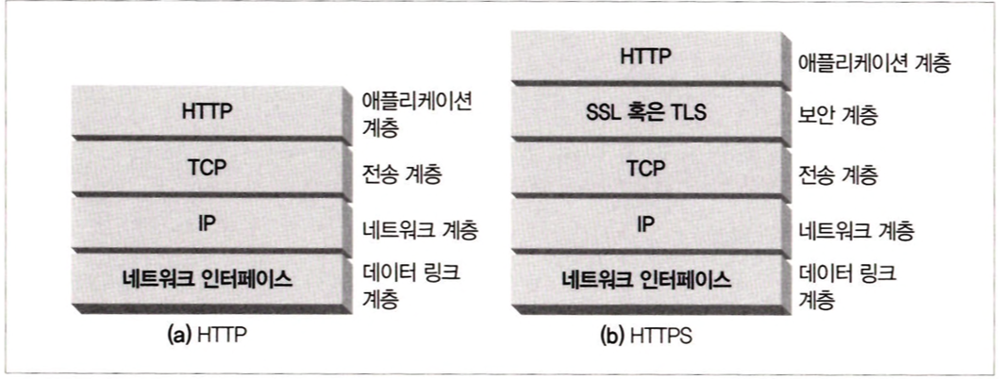
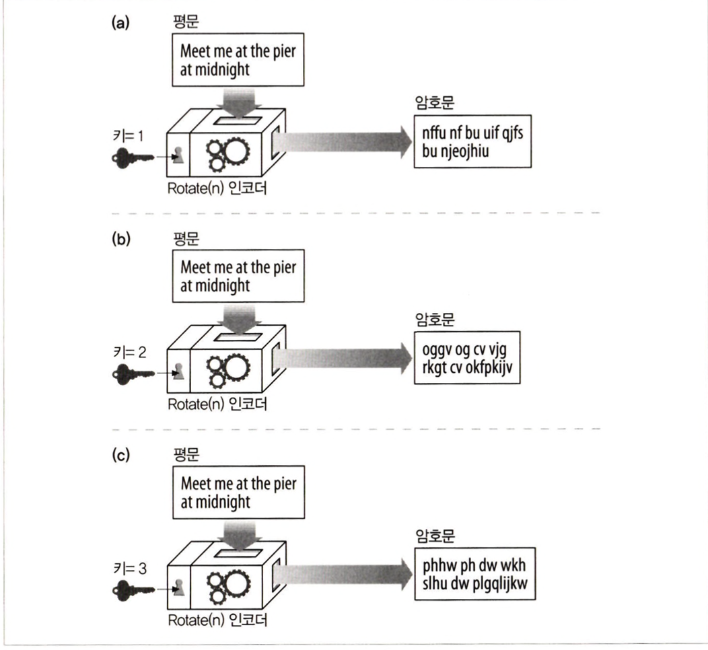
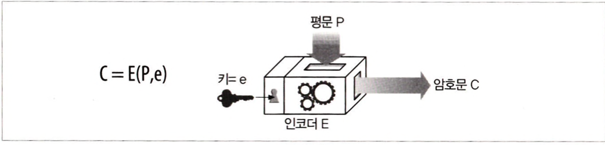
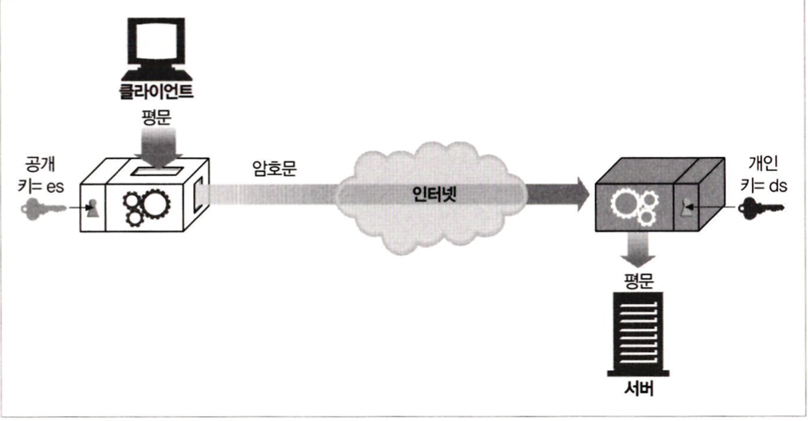
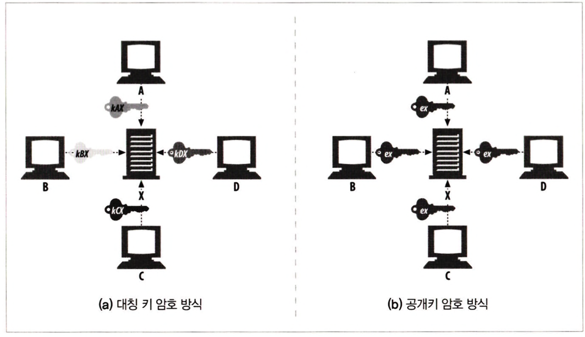
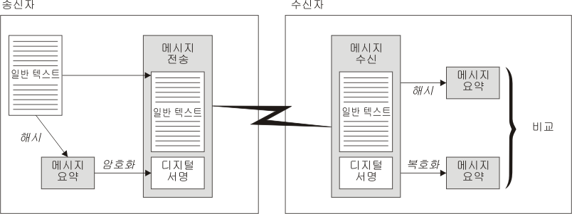

# 14장 보안 HTTP

## 14.1 HTTP를 안전하게 만들기
### HTTPS
- HTTPS는 HTTP를 안전하게 만드는 방식 중에서 가장 인기 있는 것이다.
- HTTPS를 사용할 때, 모든 HTTP 요청과 응답 데이터는 네트워크로 보내지기 전에 암호화된다.
- HTTPS는 HTTP의 하부에 전송 레벨 암호 보안 계층을 제공함으로써 동작한다.
    - 이 보안 계층은 안전 소켓 계층(SSL) 혹은 전송 계층 보안(TLS)를 이용해 구현된다.
- 어려운 인코딩 및 디코딩 작업은 대부분 SSL 라이브러리 안에서 일어나기 때문에, </br>
보안 HTTP를 사용하기 위해 웹 클라이언트와 서버가 프로토콜을 처리하는 로직을 크게 변경할 필요는 없다.

</br>

<div align="center">
    
</div>

</br>

## 14.2 디지털 암호학
### 암호
- 평문 : 인코딩되기 전의 원본 메시지
- 암호문 : 암호가 적용되어 코딩된 메시지

</br>

### 키가 있는 암호
- 코드 알고리즘과 기계가 적에 손에 들어갈 수 있기 때문에, </br>
대부분의 기계들에는 암호의 동작방식을 변경할 수 있는 큰 숫자로 된 다른 값을 설정할 수 있는 다이얼이 달려있다.
- 이러한 암호 매개변수를 <b>키</b>라고 부른다.
- 암호 키는 하나의 암호 기계를 여러 가상 암호 기계의 집합처럼 만들어준다.
- 이 가상 암호 기계들은 서로 다른 키 값을 갖고 있기 때문에 제각각 다르게 동작한다.

</br>

<div align="center">
    
</div>


### 디지털 암호
디지털 계산의 도래로, 두 가지 주요한 발전이 있었다.
- 속도 및 기능에 대한 기계 장치의 한계에서 벗어남으로써, 복잡한 인코딩과 디코딩 알고리즘이 가능해졌다.
- 매우 큰 키를 지원하는 것이 가능해져서, 단일 암호 알고리즘으로 키의 값마다 다른 가상 암호 알고리즘을 만들어낼 수 있게 되었다.
- 평문 메시지 P, 인코딩 함수 E, 디지털 인코딩 키 e가 주어지면 부호화된 암호문 C를 생성할 수 있다.

</br>

<div align="center">
    
</div>

</br>

## 14.3 대칭키 암호법
- 많은 디지털 암호 알고리즘은 대칭키 암호라 불린다.
- 대칭키 암호는 인코딩을 할 때 사용하는 키가 디코딩을 할 때와 같다.
- 잘 알려진 대칭키 암호 알고리즘 : DES, Triple-DES, RC2, RC4

</br>

### 키 길이와 열거 공격
- 열거 공격 : 무차별로 모든 키 값을 대입해보는 공격
- 암호에 기반한 보안에 잇어 키의 길이는 매우 중요하다.
- 키의 길이가 길수록 열거 공격에 강하다.

</br>

## 14.4 공개키 암호법
- 한 쌍의 호스트가 하나의 인코딩/디코딩 키를 사용하는 대신, 공개키 암호 방식은 두 개의 비대칭 키를 사용한다.
- <b>인코딩 키</b>는 모두를 위해 공개되어 있다.
- 호스트만이 개인 <b>디코딩 키</b>를 알고 있다.
- 모든 사람이 X에게 보내는 메시지를 같은 키로 인코딩 할 수 있지만, </br>
X를 제외한 누구도 그 메시지를 디코딩할 수 없다. 왜냐하면 오직 X만이 디코딩 개인 키를 갖고 있기 때문이다.

</br>

<div align="center">
    
</div>

</br>

<div align="center">
    
</div>

### 혼성 암호 체계와 세션 키
- 공개키 암호 방식의 알고리즘은 계산이 느린 경향이 있다.
- 실제로는 대칭과 비대칭 방식을 섞은 것을 쓴다.
- 예를 들어, 노드들 사이의 안전한 의사소통 채널을 수립할 때는 편리하게 공개 키 암호를 사용하고, </br>
이렇게 만들어진 안전한 채널을 통해 임시의 무작위 대칭키를 생성하고 교환하여 </br> 
이후의 나머지 데이터를 암호화할 때는 빠른 대칭 키를 사용하는 방식이 흔히 쓰인다.

</br>

## 14.5 디지털 서명
암호 체계는 메시지를 암호화하고 해독하는 것뿐만 아니라, 누가 메시지를 썼는지 알려주고, </br>
그 메시지가 위조되지 않았음을 증명하기 위해 메시지에 서명을 하도록 하는 데에 이용될 수 있다.

### 서명은 암호 체크 섬이다.
- 디지털 서명은 메시지에 붙어있는 특별한 암호 체크 섬이다.
- 디지털 서명은 보통 비대칭 공개키에 의해 생성된다.
- 개인 키는 오직 소유자만이 알고 있기 때문에, 저자의 개인 키는 일종의 <b>지문</b>처럼 사용된다.

</br>

#### 예시
디지털 서명 프로세스의 단계는 다음과 같다.
1. 송신자가 메시지 요약을 처리한 후, 송신자의 개인 키를 사용하여 요약을 암호화하며, 이것이 디지털 서명을 구성한다.
2. 송신자가 메시지와 같이 디지털 서명을 전송한다.
3. 수신자가 송신자의 공개 키를 사용하여 디지털 서명을 복호화하며 이는 송신자의 메시지 요약을 다시 생성한다.
4. 수신자가 수신된 메시지 데이터로부터 메시지 요약을 처리하고 두 개의 요약이 같은 것인지를 확인한다.
</br>

<div align="center">
    
</div>

</br>

## 14.6 디지털 인증서
디지털 인증서(흔히 'certs라고 불리는)는 신뢰할 수 있는 기관으로부터 보증 받은 사용자나 회사에 대한 정보를 담고 있다.

</br>

### 인증서의 내부
디지털 인증서에는 또한 공식적으로 '인증 기관'에 의해 디지털 서명된 정보의 집합이 담겨있다.
- 대상의 이름(사람, 서버, 조직)
- 유효 기간
- 인증서 방급자 (누가 이 인증서를 보증하는가)
- 인증서 발급자의 디지털 서명
- 추가적으로, 디지털 인증서는 대상과 사용된 서명 알고리즘에 대한 서술적인 정보뿐만 아니라 보통 대상의 공개 키도 담고 있다.

</br>

### X.509 v3 인증서
오늘날 사용되는 대부분의 인증서가 그들의 정보를 X.509라 불리는 표준화된 서식에 저장하고 있다.

</br>

### 서버 인증을 위해 인증서 사용하기
사용자가 HTTPS를 통한 안전한 웹 트랜잭션을 시작할 때, 최신 브라우저는 자동으로 접속한 서버에서 디지털 인증서를 가져온다. </br>
서버 인증서는 다음을 포함한 많은 필드를 갖고 있다. 
- 웹 사이트의 이름과 호스트 명
- 웹 사이트의 공개키
- 서명 기관의 이름
- 서명 기관의 서명
</br>
브라우저가 인증서를 받으면, 서명 기관을 검사한다.</br>
만약 서명 기관이 모르는 곳이라면, 브라우저는 그 서명 기관을 신뢰해야 할지 확신할 수 없으므로, </br>
대개 사용자가 서명 기관을 신뢰하는지 확인하기 위한 대화상자를 보여준다.

</br>

## 14.7 HTTPS의 세부사항
HTTPS는 HTTP 메시지를 TCP로 보내기 전에 먼저 그것들을 암호화하는 보안 계층으로 보낸다.

</br>

### HTTPS 스킴
- URL의 스킴을 통해 웹 서버에게 HTTP의 보안 프로토콜 버전을 수행한다고 알린다.

```bash
https://
```
- 만약 URL이 https 스킴을 갖고 있다면, 클라이언트는 서버에 443번 포트로 연결하고 </br>
서버와 바이너리 포맷으로 된 몇몇 SSL 보안 매개변수를 교환하면서 '핸드셰이크'를 하고, 암호화된 HTTP 명령이 뒤를 잇는다.

</br>

### 보안 전송 셋업
1. 클라이언트는 웹 서버의 443 포토 연결한다.
2. 클라이언트와 서버는 암호법 매개변수와 교환 키를 협상하면서 SSL 계층을 초기화한다.
3. 핸드셰이크가 완료되면 SSL 초기화는 완료되며, 클라이언트는 요청 메시지를 보안 계층에 보낼 수 있다.
4. 이 메시지는 TCP로 보내지기 전에 <b>암호화</b>된다.

</br>

<div align="center">
    
</div>

</br>

### SSL 핸드셰이크
암호화된 HTTP 메시지를 보낼 수 있게 되기 전에, 클라이언트와 서버는 SSL 핸드셰이크를 할 필요가 있다. </br>
핸드셰이크에서는 다음과 같은 일이 일어난다.
- 프로토콜 버전 번호 교환
- 양쪽이 알고 있는 암호 선택
- 양쪽의 신원을 인증
- 채널을 암호화하기 위한 임시 세션 키 생성

</br>

### 서버 인증서
SSL은 서버 인증서를 클라이언트로 나르고 다시 클라이언트 인증서를 서버로 날라주는 상호 인증을 지원한다. </br>
오늘날, 클라이언트 인증서는 웹 브라우징에선 흔히 쓰이지 않는다. </br>
한편, 보안 HTTPS 트랜젝션은 항상 <b>서버 인증서</b>를 요구한다. </br>
서버 인증서는 조직의 이름, 주소, 서버 DNS 도메인 이름, 그리고 그 외의 정보를 보여주는 X.509 v3에서 파생된 인증서이다. </br>
사용자와 사용자의 클라이언트 소프트웨어는 모든 것이 믿을 만한 것인지 확인하기 위해 인증서를 검증할 수 있다. </br>
최신 웹브라우저들을 대부분은 인증서에 대해 간단하게 기본적인 검사를 하고 그 결과를 철저한 검사를 할 수 있는 방법과 함께 사용자에게 알려준다. </br>

</br>

### 가상 호스팅과 인증서
가상 호스트로 운영되는 사이트의 보안 트래픽을 다루는 것은 까다로운 경우도 많다. </br>
리다이렉트를 함으로써, 소유자는 보안 트랙젝션을 시작하는 모든 사용자를 서버 인증서에 나열된 사이트로 보낸다. </br>

</br>

## 14.9 프락시를 통한 보안 트래픽 터널링
클라이언트는 종종 그들을 대신하여 웹 서버에 접근해주는 웹 프락시 서버를 이용한다. </br>
그러나 클라이언트가 서버로 보낼 데이터를 서버의 공개키로 암호화하기 시작하면, 프락시는 더 이상 HTTP 헤더를 읽을 수 없다. </br>
<b>HTTPS SSL 터널링 프로토콜</b>을 사용해 클라이언트는 먼저 프락시에게 자신이 연결하고자 하는 안전한 포스트와 포트를 말해준다. </br>
- HTTP는 CONNECT라 불리는 새로운 확장 메서드를 이용해 평문으로 된 종단 정보를 전송하기 위해 사용된다. </br>
- CONNECT 메서드는 프락시에게 희망하는 호스트와 포트번호로 연결을 해달라고 말해주며, </br> 클라이언트와 서버 사이에서 데이터가 직접 오갈 수 있게 해주는 터널을 만든다.

```bash
CONNECT home.netcape.com:443 HTTP/1.0
User-agent: Mozilla/1.1N

<SSL로 암호화된 데이터가 이 다음에 온다.>
```

