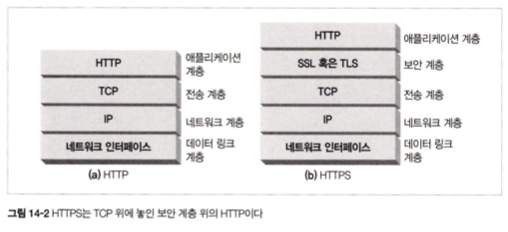
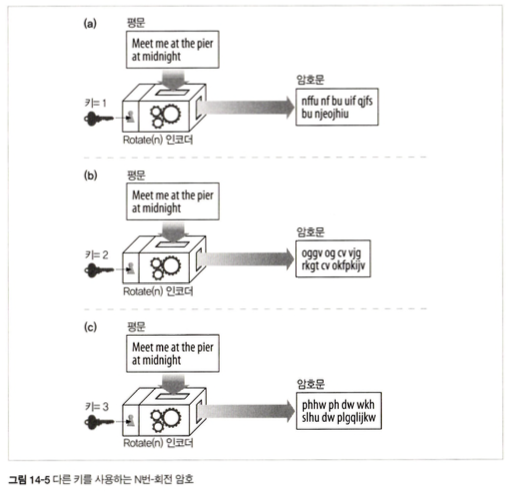
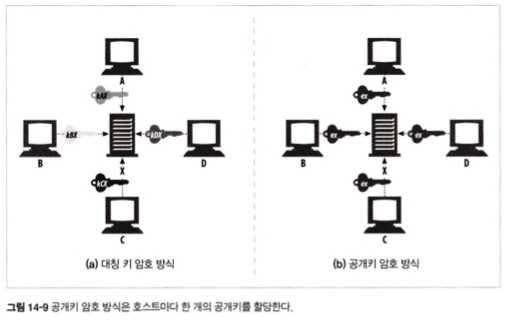
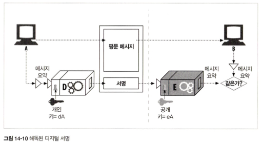
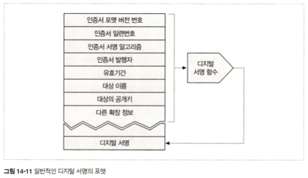
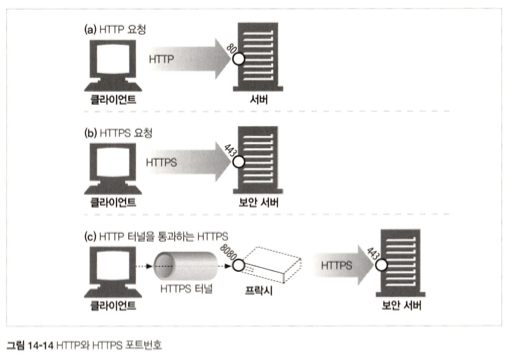
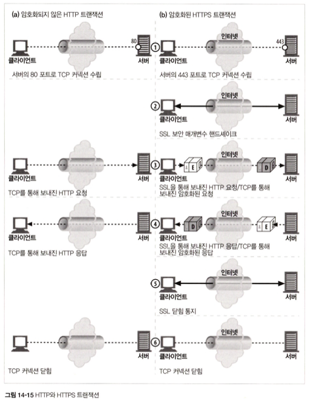
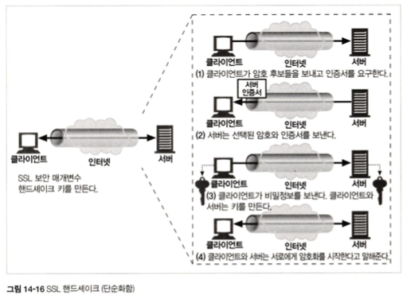
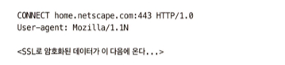
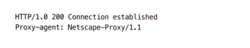

 
 
 

### 14.1.1 HTTPS
HTTPS는 HTTP의 하부에 전송 레벨 암호 보안 계층을 제공함으로써 동작  
이 보안 계층은 Secure Socket Layer(SSL) 혹은 Transport Layer Security(TLS)를 이용해 구현된다  

    

 
 

### 14.2 디지털 암호학
SSL, HTTPS에는 암호 인코딩 기법이 적용된다  

- 대칭키 암호 체계 : 인코딩과 디코딩에 같은 키를 사용하는 알고리즘  
- 비대칭키 암호 체계 : 인코딩, 디코딩에 다른 키를 사용하는 알고리즘  
- 디지털 서명 : 메시지가 위조 / 변조되지 않았음을 인증하는 체크섬  

 
 

### 14.2.2 암호(cipher)
암호는 메시지를 인코딩, 이후 비밀 메시지를 디코딩하는 방법  

    

 
 

### 14.3.2 공유키 발급하기 
 

> - `대칭키 암호법`  
> 한 쌍의 호스트가 하나의 인코딩/디코딩 키를 사용  

 

> - `대칭키 암호의 단점`  
> 발송자와 수신자가 서로 대화하려면 둘 다 공유키를 가져야 한다는 것  
> -> `클라이언트와 서버가 은밀하게 대화를 나누려면 서버가 수천 개의 키를 생성하고 기억해야함`  
> (ex. N개의 서버가 각각 N-1개의 클라이언트랑 대화를 하려면 대략 N^2개의 비밀키가 필요)  

 
 

### 14.3.2 공개키 암호법  

 

> - `공개키 (비대칭) 암호법`  
> 두 개의 비대칭 키를 사용. 
> 하나는 호스트의 메시지를 인코딩하기 위한 것. 다른 하나는 그 호스트의 메시지를 디코딩하기 위한 것.  
> 이때 인코딩 키는 모두에게 공개되어있음  
> -> 모든 사람이 같은 키로 X에게 메시지를 인코딩해서 보낼 수는 있지만, X를 제외한 누구도 그 메시지를 디코딩할 수 없음  

 

    

 

> 표준화된 공개키 기술 묶음을 만드는 것의 중요성 때문에, Public-Key Infrastructure(PKI) 표준화 작업이 25년 넘게 계속 진행 중 (ex. RPC 5280)

 
 

### 14.4.1 RSA  
공개키 비대칭 암호의 과제는 아래 내용을 알고 있다해도 비밀인 개인 키를 계산할 수 없다는 것  

- 공개키
- 네트워크 스누핑을 통해 얻은 암호문의 일부  
- 메시지와 그것을 암호화한 암호문(인코더에 임의의 텍스트를 넣고 실행해서 획득)  

-> 이를 만족하는 공개키 암호 체계 중 유명한 하나가 RSA 알고리즘  

 
 

### 14.4.2 혼성 암호 체계와 세션 키  
 

> - `공개키 암호의 단점`  
> 알고리즘 계산이 느린 편  

 

-> 그래서 `실제로는 대칭과 비대칭키를 섞어서 씀`  
-> 노드들 사이의 `의사소통 채널을 수립할 때는 공개 키 암호를 사용`  
-> 채널을 통해 `임시의 무작위 대칭 키를 생성하고 교환하여 이후의 나머지 데이터를 암호화할 때는 빠른 대칭 키를 사용`  

 
 

### 14.5 디지털 서명

 

1. 서명은 `메시지를 작성한 저자가 누군지 알려줌` -> 저자는 저자의 극비 개인 키를 갖고 있기 때문에, 오직 저자만이 이 체크섬을 계산할 수 있음. 그래서 체크섬은 저자의 개인 서명(signature)처럼 동작  
2. 서명은 `메시지 위조를 방지` -> 송신 중인 메시지를 수정하면 체크섬은 더이상 맞지 않음. 또 체크섬은 저자의 비밀 개인 키와 관련되어 침입자는 위조된 메시지에 대해 올바른 체크섬을 날조할 수 없음.

 

- 노드 A는 가변 길이 메시지를 정제하여 고정된 길이의 요약(digest)로 만듦  
- 노드 A는 그 요약에, 사용자의 개인 키를 매개변수로 하는 '서명' 함수를 적용해서 서명과 메시지를 노드 B에 전송 
- 메시지를 받은 노드 B는 공개키를 이용한 역함수를 적용하여 서명을 검사 -> 이 결과가 노드 B가 갖고 있는 버전의 요약과 일치하지 않는다면, 메시지는 송신 중에 위조되었거나 발송자가 노드 A가 보낸 메시지가 아닌 것.

    

 
 

### 14.6 디지털 인증서
디지털 인증서(certs)는 신뢰할 수 있는 기관으로부터 보증 받은 사용자나 회사에 대한 정보를 담고 있다.  

 
 

### 14.6.1 인증서의 내부  
인증서는 다음 내용을 담고 있다  

- 대상의 이름(사람, 서버, 조직 등)
- 유효 기간  
- 인증서 발급자(누가 이 인증서를 보증하는지)  
- 인증서 발급자의 디지털 서명  
...

    

 
 

### 14.6.3 서버 인증을 위해 인증서 사용하기 

1. 사용자가 HTTPS를 통한 안전한 웹 트랜잭션을 시작할 때, 최신 브라우저는 자동으로 접속한 서버에서 디지털 인증서를 가져온다.  
-> 만약 서버가 인증서를 갖고 있지 않다면, 보안 커넥션은 실패  

<서버 인증서가 포함하는 필드>
- 웹 사이트의 이름과 호스트 명 
- 웹 사이트의 공개키 
- 서명 기관의 이름
- 서명 기관의 서명 

2. 브라우저가 인증서를 받으면, 서명 기관을 검사 
-> 만약 그 기관이 공공이 신뢰할만한 서명 기관이라면 브라우저는 그것의 공개키를 이미 알고 있을 것(보통 브라우저에 여러 서명 기관의 인증서가 미리 설치된 상태)
-> 만약 서명 기관이 모르는 곳이라면, 서명 기관을 신뢰하는지 확인하기 위한 대화상자를 보여줌  

3. '디지털 서명'에서 이야기했던 바와 같이 브라우저는 서명을 검증  

 
 

### 14.7.1 HTTPS 개요
HTTPS는 그냥 보안 전송 계층을 통해 전송되는 HTTP  
HTTPS는 HTTP 메시지를 TCP로 보내기 전에 먼저 그걸 암호화하는 보안 계층으로 보냄  

 
 

### 14.7.2 HTTPS 스킴  

    

 

**`SSL 트래픽은 바이너리 프로토콜`** 이기 때문에, 바이너리 SSL 트래픽을 전송하여 HTTP와는 완전히 다르다.  

 
 

### 14.7.3 보안 전송 셋업 
일단 TCP 연결이 되고 나면, 클라이언트와 서버는 암호법 매개변수와 교환 키를 협상하면서 SSL 계층을 초기화 (SSL 핸드셰이크)  

    

 
 

### 14.7.4 SSL 핸드셰이크  
핸드셰이크에서는 다음과 같은 일이 일어난다

- 프로토콜 버전 번호 교환  
- 양쪽이 알고 있는 암호 선택  
- 양쪽의 신원을 인증  
- 채널을 암호화하기 위한 임시 세션 키 생성  

    

 
 

### 14.7.5 서버 인증서  

- 클라이언트 인증서 -> 보통 쓰지 않음  
- 서버 인증서 -> HTTPS에서 무조건 요구

 
 

### 14.7.6 사이트 인증서 검사  

 

<웹 서버 인증서 검사를 위한 알고리즘의 수행 단계>
1. 날짜 검사  
브라우저 인증서가 여전히 유효함을 확인  
2. 서명자 신뢰도 검사  
`만약 신뢰할 만한 CA가 A 사이트에 서명을 하고, A 사이트가 어떤 사이트 인증서에 서명을 한다면, 브라우저는 그 인증서를 올바른 CA 경로에서 파생된 것으로 받아들일 수 있음`  
3. 서명 검사  
`서명 기관이 믿을 만하다고 판단하면, 브라우저는 서명기관의 공개키를 서명에 적용하여 그의 체크섬과 비교해봄으로써 인증서의 무결성을 검사`  
4. 사이트 신원 검사  
대부분의 브라우저는 인증서의 도메인 이름이 대화 중인 서버의 도메인 이름과 비교하여 맞는지 검사  
-> 몇몇 CA는 와일드카드 표현이 들어있는 인증서를 만들기도 함 (ex. *.google.com)  

 
 

### 14.7.7 가상 호스팅과 인증서  
사용자가 인증서의 이름과 정확히 맞지 않는 가상 호스트 명에 도착했다면 경고 팝업이 뜸  
-> 가상 호스팅인 경우도 그럴 수 있음  
-> 이런 문제를 피하기 위해 웹사이트는 보안 트랜잭션을 시작한 모든 사용자를 서버 인증서에 있는 호스트 명으로 리다이렉트   

 
 

### 14.8.1 OpenSSL  
OpenSSLdms SSL과 TLS의 가장 인기 있는 오픈 소스 구현  

 
 

### 14.9 프락시를 통한 보안 트래픽 터널링  
 

프록시는 방화벽 라우터가 HTTP 트래픽의 교환을 허락한 유일한 장치  
-> HTTPS가 프록시와도 잘 동작할 수 있게 하기 위해, `클라이언트가 프록시에게 어디에 접속하려고 하는지 말해주는 방법을 약간 수정해야 한다`  
-> 인기 있는 기법 중 하나가 `HTTPS SSL 터널링 프로토콜`  

 

> **`HTTPS SSL 터널링 프로토콜`**  
> 클라이언트는 먼저 프록시에게 자신이 연결하고자 하는 안전한 호스트와 포트를 말해줌  
> `클라이언트는 이 내용을 프록시가 읽을 수 있도록 암호화가 시작되기 전의 평문으로 말해줌`  
> 이를 위해 CONNECT 메서드를 이용해서 평문으로 된 endpoint 정보를 전송 -> 이후 클라이언트와 서버 사이에 데이터가 direct로 오갈 수 있는 터널을 만듦  

    

    

