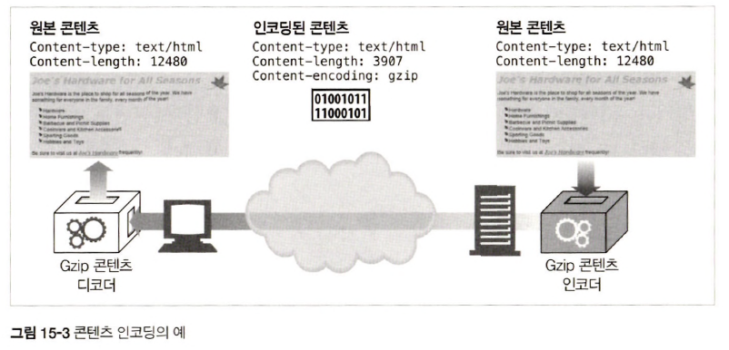

# 15장 엔터티와 인코딩

## 15.1 메시지는 컨테이너, 엔터티는 화물

|        헤더        | 설명                                             |
|:----------------:|:-----------------------------------------------|
|   Content-Type   | 엔터티에 의해 전달된 객체 종류                              |
|  Content-Length  | 전달되는 메시지 길이, 크기                                |
| Content-Language | 전달되는 객체와 가장 잘 대응되는 자연어                         |
| Content-Encoding | 객체 데이터에 대해 행해진 변형 ex) 압축                       |
| Content-Location | 요청 시점을 기준으로 객체의 또 다른 위치                        |
|  Content-Range   | 만약 부분 엔터티라면, 이 헤더는 이 엔터티가 전체에서 어느 부분에 해당하는지 정의 |
|   Content-MD5    | 엔터티 본문 컨텐츠에 대한 check sum                       |
|  Last-Modified   | 서버에서 이 컨텐츠가 생성, 수정된 날                          |
|     Expires      | 이 엔터티 데이터가 더 이상 신선하지 않은 것으로 간주되기 시작하는 날짜, 시각   |
|      Allow       | 이 리소스에 대해 허용되는 메서드 종류                          |
|       ETag       | 이 리소스에 대한 식별자                                  |
|Cache-Control|어떻게 이 리소스가 캐시될 수 있는지에 대한 지시자|

### 15.1.1 엔터티 본문

<div align="center">
    
</div>

## 15.2 Content-Length: 엔터티의 길이

> `Content-Length` 헤더 = 바이트 단위의 메시지 엔터티 본문의 크기

### 15.2.1 잘림 검출

- `Content-Length` 헤더 x &rarr; `connection 정상 종료` vs `메시지 전송 중 서버 충돌 발생` 구분 불가
- `캐시 프록시 서버` &rarr; `Content-Length` 헤더 없는 HTTP 본문 캐시 x

### 15.2.2 잘못된 Content-Length

- HTTP/1.1 `User-Agent` &rarr; 잘못된 `Content-Length` 받고 인지했을 때 사용자에 해당 이슈 전달

### 15.2.3 Content-Length와 지속 커넥션(Persistent Connection)

- `Content-Length` 헤더 &rarr; 지속 connection 내에서 클라이언트 메시지 종료와 다음 시작 위치 알려줌

### 15.2.5 엔터티 본문 길이 판별을 위한 규칙

> 엔터티 본문 길이와 끝나는 위치 판별하기 위한 상황별 규칙  
> 아래 규칙들은 나열된 순서대로 적용

_1. body 허용하지 않는 특정 HTTP 메시지에서는 `Content-Length` 헤더 무시_

- 엔터티 본문을 금지하는 메시지는 반드시 헤더 이후의 첫 번째 빈줄에서 끝나야 함

_2. 메시지가 `Transfer-Encoding` 헤더를 포함하고 있다면 메시지가 connection이 닫혀서 먼저 끝나지 않는 이상 엔터티는 `0 byte chunk`라 불리는 특별한 패턴으로 끝나야 한다._

> `Transfer-Encoding: chunked`이란, chunk 단위로 메시지 전송

_3. 메시지가 `Content-Length` 헤더를 갖는다면 `Transfer-Encoding` 헤더가 존재하지 않는 이상 `Content-Length` 값 = 본문 길이_

- `Transfer-Encoding` 헤더가 존재하면 `Content-Length` 헤더 무시됨 ∵ chunk 단위로 잘라서 메시지 전송

_4. 메시지 타입 = `multipart/byteranges` 미디어 타입, 엔터티 길이가 별도 정의되지 않았다면 multipart 메시지 각 부분은 각자 크기 정의_

- `multipart/byteranges` 유형 = 자신의 크기를 스스로 결정할 수 있는 유일한 엔터티 본문 유형
- 수신자가 이 헤더를 해석할 수 있다는 사실을 송신자가 알기 전까지 전송 x

_5. 위 어떤 규칙에도 해당되지 않는다면 엔터티는 connection 닫힐 때 종료_

- 실질적으로 서버가 메시지 종료를 알리기 위해 connection 종료 가능

_6. HTTP/1.0 애플리케이션 호환을 위해 엔터티 본문을 갖고 있는 HTTP/1.1 요청은 반드시 유효한 Content-Length 헤더 필요_

- `HTTP/1.1` &rarr; 본문은 있지만 `Content-Length` 헤더 없는 경우 `400 Bad Request` 응답, `Content-Length` 요구하고 싶다면 `Length Required` 응답

## 15.4 미디어 타입과 차셋(Charset)

### 15.4.1 텍스트 매체를 위한 문자 인코딩

```text
Content-Type: text/html; charset=iso-8859-4
```

> `charset` 매개변수 &rarr; 엔터티 비트 집합을 텍스트 파일의 글자로 변환하기 위한 기법

## 15.5 콘텐츠 인코딩

### 15.5.1 콘텐츠 인코딩 과정

1. 웹 서버 &rarr; 원본 `Content-Type`, `Content-Length` 헤더를 수반한 원본 응답 메시지 생성
2. 콘텐츠 인코딩 서버 &rarr; 인코딩된 메시지 생성, `Content-Encoding` 헤더를 추가하여 디코딩할 수 있도록 함(`Content-Type`은 같지만 `Content-Length` 다름)
3. 수신 애플리케이션 &rarr; 인코딩된 메시지를 받아 디코딩하여 원본 획득

```text
HTTP/1.1 200 OK
Date: Fri, 05 Nov 1999 22:35:15 GMT
Server: Apache/1.2.4
Content-Length: 6096
Content-Type: image/gif
Content-Encoding: gzip
[...]
```

<div align="center">
    
</div>

### 15.5.2 콘텐츠 인코딩 유형

|콘텐츠 인코딩 값|설명|
|:------:|:-----|
|gzip|GNU zip 인코딩 적용|
|compress|유닉스 파일 압축 프로그램인 compress 실행|
|deflate|zlib 포맷으로 압축|
|identity|어떤 인코딩도 수행 x|

### 15.5.3 Accept-Encoding 헤더

> `Accept-Encoding` 헤더 &rarr; 클라이언트가 지원하는 인코딩 목록    
> `Accept-Encoding` 헤더 x = 어떤 인코딩이든 상관 x = `Accept-Encoding: *`

<div align="center">
    
</div>

## 15.6 전송 인코딩과 청크 인코딩

<div align="center">
    
</div>

### 15.6.2 Transfer-Encoding 헤더

> `Transfer-Encoding` 헤더란, 안전한 전송을 위해 어떤 인코딩이 메시지에 적용되었는지 수신자에 전송

|                                              요청                                              |                                              응답                                              |
|:--------------------------------------------------------------------------------------------:|:--------------------------------------------------------------------------------------------:|
| <div align="center"></div> | <div align="center"></div> |

### 15.6.3 청크 인코딩

<div align="center">
    
</div>

### 15.6.4 콘텐츠와 전송 인코딩의 조합

<div align="center">
    
</div>

### 15.6.5 전송 인코딩 규칙

- 전송 인코딩 집합은 반드시 `chunked` 포함, 유일한 예외 = connection 종료로 메세지 끝나는 경우
- 청크 전송 인코딩이 사용됐다면 메시지 본문에 적용된 마지막 전송 인코딩 반드시 존재
- 청크 전송 인코딩 &rarr; 반드시 메시지 본문에 한번 이상 적용

## 15.8 검사기와 신선도

<div align="center">
    
</div>

### 15.8.2 조건부 요청과 검사기

```text
GET /announce.html HTTP/1.0
If-Modified-Since: Sat, 29 Jun 2002, 14:30:00 GMT
```

<div align="center">
    
</div>

- 약한 검사기 : 리소스 인스턴스 고유하게 식별하지 못하는 경우 존재 ex) 객체 바이트 단위 크기, 최종 변경 시각(정확도가 최대 1초에 불과하기 때문)
- 강한 검사기 : 언제나 고유하게 식별 ex) 리소스 암호 check sum

## 15.9 범위 요청

```text
GET /bigfile.html HTTP/1.1
Host: www.joes-hardware.com
Range: bytes=4000-
User-Agent: Mozifla/4.61 [en] （WinNT; I）
...
```

- 처음 4,000 바이트 이후 부분 요청 &rarr; 클라이언트가 처음 4,000 바이트만 받고 실패했을 때 사용 가능

<div align="center">
    
</div>

## 15.10 델타 인코딩

> 델타 인코딩이란, 객체 전체가 아닌 변경된 부분에 대해서만 통신하여 전송량을 최적화하는 확장된 HTTP 프로토콜

<div align="center">
    
</div>

- 델타 인코딩 관련 헤더

<div align="center">
    
</div>