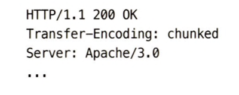
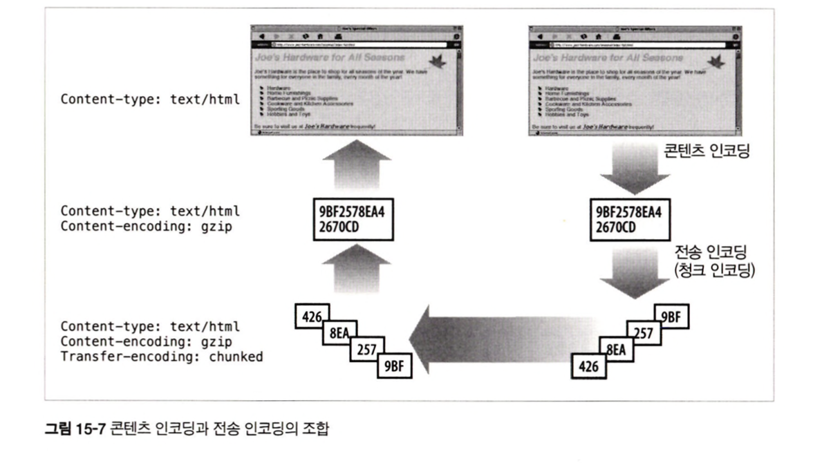
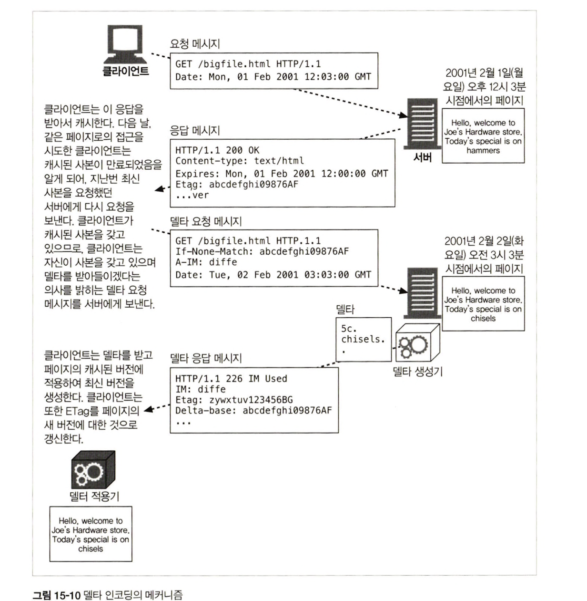

# 15장 엔터티와 인코딩

HTTP는 콘텐츠를 나르기 위해 잘 라벨링된 엔터티를 사용한다.

## 15.1 메시지는 컨테이너, 엔터티는 화물

    

### 15.1.1 엔터티 본문

가공되지 않은 데이터를 담고 있다. CRLF 다음에 위치.

- Content-Type : 전달된 객체의 종류, 어떻게 해석해야하는지 말해줌
- Content-Encoding : 데이터의 압축이나 인코딩 상태를 말해줌

## 15.2 Content-Length : 엔터티의 길이

본문의 크기를 바이트 단위로 나타냄.

gzip의 경우 압축된 후의 크기.

### 15.2.1 잘림 감지

Content-Length를 포함하는 것을 확인함으로써 커넥션의 정상 닫힘을 확인하고, 캐싱 프락시 서버에서 이를 이용해서 잘린 메시지가 캐싱되는 것을 방지할 수 있다.

### 15.2.2 잘못된 Content-Length

잘못된 Content-Length를 감지하여 사용자에게 알려주는 기능이 HTTP/1.1에서는 필수다.

### 15.2.3 Content-Length와 지속커넥션

엔터티 본문의 끝을 알 수 있어 다음 메시지를 구분.

- Content-Length 헤더 없는 지속 커넥션의 상황
  - 청크 인코딩 : 데이터를 각각이 특정한 크기를 갖는 일련의 청크들로 쪼개어 보내는 것
  - 서버가 헤더 생성 시점에 엔터티 전체의 크기를 알 수 없다하더라도 서버는 청크 인코딩으로 엔터티를 정의된 크기의 조각으로 전송 가능

### 15.2.4 콘텐츠 인코딩

HTTP는 보안 강화, 압축을 통한 공간 절약을 위해서 엔터티 인코딩이 가능하다.

- Content-Length는 인코딩된 본문의 길이를 따름.

### 15.2.5 엔터티 본문 길이 판별을 위한 규칙

1. 본문 허용 X의 경우, Content-Length는 부가정보
   - HEAD 응답의 경우 본문을 갖지 않아서 헤더 이후 첫 번째 빈 줄에서 끝나야 한다.
2. 메세지가 Transfer-Encoding 헤더 포함하는 경우 엔터티는 ‘0바이트 청크'여야 한다.
3. 메시지가 Content-Length 헤더를 갖고, Transfer-Encoding 헤더도 가졌다면 Content-Length 헤더는 무시해야한다. (전송 인코딩이 엔터티 본문을 표현하고 전송하는 방식을 바꿀 것이기 때문)
4. multipart/byteranges 미디어 타입을 사용하고 엔터티 길이가 별도로 정의되지 않았다면 멀티파트 메시지의 각 부분은 스스로의 크기를 정의할 것이다. 수신자가 해석할 수 있을 때 송신자가 보내야한다.
5. 위 규칙들에 해당하지 않으면, 엔터티는 커넥션이 닫힐 때 끝난다. 오직 서버만이 응답을 돌려주기 위해 커넥션을 닫을 수 있으며, 클라이언트는 메시지가 끝났다는 신호를 위해 커넥션을 닫을 수 없다.
6. HTTP/1.0과 호환을 위해 HTTP/1.1 요청은 반드시 유효한 Content-Length 헤더도 갖고 있어야한다.

## 15.3 엔터티 요약

전송 중 엔터티 변경 방지로 최초 엔터티 생성 때 송신자는 데이터에 대한 체크섬 생성 가능.

Content-MD5 헤더는 MD5 알고리즘 적용 결과를 보내기 위해 사용. (자주 사용되지는 않음)

- 무결성 검사 : 콘텐츠 인코딩의 적용은 끝났지만 전송 인코딩은 아직 적용하지 않은 엔터티 본문에 대한 MD5를 담고 있음. 전송 인코딩 먼저 디코딩 후 디코딩 된 엔터티 본문에 대해 MD5를 계산해야 한다.
  - gzip 알고리즘 → 압축된 본문 전체에 대해 수행
- 문서 위치 확인, 콘텐츠 중복 저장 방지 해시 테이블 키로 이용.

⇒ Want-Digest 등 다른 여러 요약 알고리즘이 제안되어 나왔다.

## 15.4 미디어 타입과 Charset

MIME 타입 : 전달되는 매체의 기저 형식의 표준화된 이름. 콘텐츠 적절하게 해독하고 처리하기 위해 이용.

    

- 원본 엔터티 본문의 미디어 타입을 명시함.

### 15.4.1 텍스트 매체를 위한 문자 인코딩

내용 유형 더 자세히 지정하기 위한 선택적인 매개변수 지원.

Content-Type: text/html; charset=iso8859-4

### 15.4.2,3 멀티파트 미디어 타입, 폼 제출

여러 개의 메세지를 포함하며 하나의 복합 메세지로 보내짐.

Content-Type: multipart/form-data; boundary=[abadfab]

- boundary는 본문의 서로 다른 부분의 구분자

    

### 15.4.4 멀티파트 범위 응답

각가의 다른 범위 담은 멀티파트 multipart/byteranges 범위 요청에 대한 응답

## 15.5 콘텐츠 인코딩

### 15.5.1 콘텐츠 인코딩 과정

    

- 인코딩된 메시지는 Content-Length가 달라지고, Content-Encoding이 추가.
- Content-Length는 인코딩된 본문의 길이를 나타냄

### 15.5.2 콘텐츠 인코딩 유형

    

gizp 가장 효율적이고 널리 쓰임 (정보 손실 없이 줄이기 위한 무손실 압축 알고리즘)

### 15.5.3 Accept-Encoding 헤더

클라이언트는 자신이 지원하는 인코딩 목록을 Accept-Encoding 헤더를 통해 전달.

Accept-Encoding : \*

Accept-Encoding : compress;q=1.0, gzip; identity;

- Q(quality)는 선호도
- identity는 오직 Accept-Encoding 헤더에만 존재할 수 있고, 클라이언트에 의해 다른 인코딩 알고리즘에 대한 상대적 선호도를 정의하는데 이용.

## 15.6 전송 인코딩과 청크 인코딩

    

메세지 데이터가 네트워크를 통해 전송되는 방법을 바꾸기 위해 전송 인코딩을 메시지에 적용할 수 있다.

⇒ 메시지 자체의 구조를 바꿈

### 15.6.1 안전한 전송

전송 문제

- 알 수 없는 크기
- 보안 : 전송 인코딩 보안은 흔하지 않다

### 15.6.2 Transfer-Encoding 헤더

Transfer-Encoding : 안전한 전송을 위해 어떤 인코딩이 메시지에 적용되었는지 수신자에게 알려준다.

TE : 어떤 확장된 전송 인코딩을 사용할 수 있는지 서버에서 알려주기 위해 요청 헤더에 사용한다.

    

    

### 15.6.3 청크 인코딩

메시지를 쪼개서 보내는 것 : 전송 인코딩의 한 형태이며 본문이 아닌 메시지의 속성

- 메시지를 보내기 전에 전체 크기를 알 필요가 없어짐
- 본문이 동적을 생성, 서버는 일부를 버퍼에 담은 뒤 한 청크를 크기와 함께 보냄

청크와 지속커넥션

커넥션이 지속적이지 않다면 클라이언트는 서버가 커넥션을 닫을 때까지 본문을 읽을 것.

지속 커넥션에서는 반드시 Content-Length에 본문 길이를 담아서 보내줘야함.

동적으로 콘텐츠가 생성되는 경우에는 청크 인코딩을 이용해서 이를 해결 해준다. (청크 0으로 끝을 알림)

    

청크 인코딩된 메시지의 트레일러

- 클라이언트의 TE 헤더가 트레일러를 받아들일 수 있음을 나타내고 있는 경우
- 트레일러가 응답을 만든 서버에 의해 추가되었으며, 콘텐츠는 클라이언트가 이해하고 사용할 필요가 없는 메타데이터이므로 클라이언트가 무시하고 버려도 되는 경우

⇒ 청크 메시지에 트레일러를 추가 (Transfer-Encoding, Trailer, Content-Length를 제외한 어떤 헤더도 트레일러로 보낼 수 있다.)

???

### 15.6.4 콘텐츠와 전송 인코딩의 조합

    

콘텐츠 인코딩으로 HTML을 압축하고 청크 데이터를 전송 인코딩을 사용해서 전송.

### 15.6.5 전송 인코딩 규칙

- chunked 포함, 메시지가 커넥션의 종료로 끝나는 경우 제외
- 청크 전송 인코딩 사용시, 메시지 본문에 적용된 마지막 전송 인코딩 존재해야함
- 청크 전송 인코딩은 반드시 메시지 본문에 한 번 이상 적용되어야함

⇒ 메시지 전송 길이를 수신자가 알 수 있게 함.

## 15.7 시간에 따라 바뀌는 인스턴스

동적인 웹페이지의 경우 방문시 url 리소스가 다름 → 요청이나 응답을 다루는 방법들 : 인스턴스 조작 - 범위 요청, 델타 인코딩

- 클라이언트가 자신이 갖고 있는 리소스의 사본이 서버가 갖고 있는 것과 정확히 같은지 판단, 새 인스턴스를 요청할 수 있는 능력을 가질 것을 요구.

## 15.8 검사기와 신선도

### 15.8.1 신선도

서버가 Expires, Cache-Control 헤더를 통해 명시.

Expires는 NTP와 같은 시간 설정의 문제가 있지만 Cache-Control은 초 단위로 설정하여 더 강력하다.

### 15.8.2 조건부 요청과 검사기

If-Modified-Since 조건부 헤더를 보내서 리소스가 바뀐 경우 변경을 요청할 수 있다.

    

- ETag는 특별한 키워드거나 엔터티와 관련된 버전 식별 태그다.
- 약한 검사기 : 바이트 단위 크기, ‘W/ ‘ → 의미상 두드러진 변화에만 사용
- 강한 검사기 : 암호 체크섬 (MD5) 문서 변경시 함께 변경, ETag 헤더

## 15.9 범위 요청

HTTP는 특정 범위만 요청할 수 있도록 해줌.

전송 받다 실패한 엔터티를 일부 혹은 범위로 요청해서 재개할 수 있다.

    

- Range 헤더로 4,000바이트 이후로 받기

    

## 15.10 델타 인코딩

서버가 새 페이지 전체를 보내는 대신, 페이지에 대한 클라이언트의 사본에 대해 변경된 부분만을 서버가 보낼 경우 더 빠른 페이지를 클라이언트가 얻을 수 있다. (최적화)

- HTTP 프로토콜의 확장
- 인스턴스 조작 : 객체의 특정 인스턴스들에 대한 클라이언트와 서버 사이의 정보 교환에 의존

    

- 델타 = 변경된 부분

    

### 15.10.1 인스턴스 조작, 델타 생성기 그리고 델타 적용기

클라이언트는 A-IM 헤더를 사용해서 받을 수 있는 인스턴스 조작의 종류를 명시할 수 있다.

- 델타 인코딩은 많은 사람이 접근 하는 페이지에서 매 순간의 사본을 모두 유지하고 있어야하기 때문에 디스크 공간이 많이 든다.
