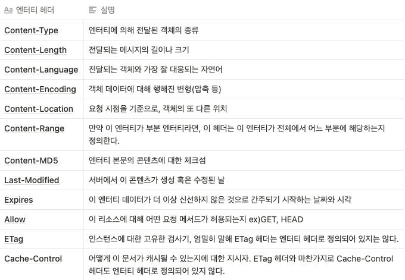
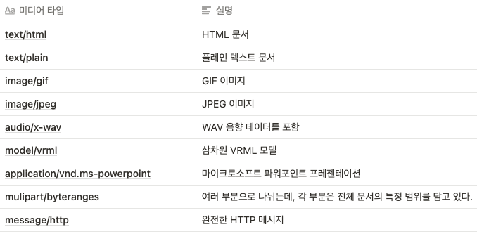
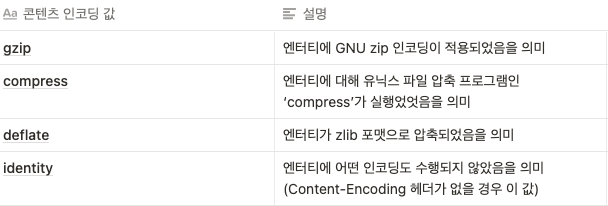

# 15장 엔터티와 인코딩

### 15.1 메시지는 컨테이너, 엔터티는 화물

- HTTP 메시지를 인터넷 운송 시스템의 컨테이너라고 생각한다면, HTTP 엔터티는 메시지의 실질적인 화물이다.
- 엔터티 헤더
    
<div align="center">
    
</div>

    
- 엔터티 본문
    - 엔터티 본문은 가공되지 않은 데이터만을 담고 있고 다른 정보들은 모두 헤더에 담겨 있다.
    - 엔터티 본문은 헤더 필드의 끝을 의미하는 빈 CRLF 줄 바로 다음부터 시작한다.

### 15.2 Content-Length: 엔터티의 길이

- Content-Length 헤더는 메시지의 엔터티 본문의 크기를 바이트 단위로 나타낸다.
- 어떻게 인코딩 되었든 상관없이 크기를 표현할 수 있다.
    - 만약 gzip으로 압축된 테스트 파일이라면, 원래 데이터 크기가 아닌 압축된 후의 크기이다.
- 잘림 검출
    - 클라이언트는 잘림을 검출하기 위해 Content-Length가 필요하다.
    - 캐싱 프락시 서버에서, 잘린 메시지를 캐시하는 위험을 줄이기 위해 명시적으로 Content-Length를 갖고있지 않은 HTTP 본문은 보통 개시하지 않는다.
        - 잘린 콘텐츠를 저장하여 계속 전송하는 오류가 발생할 수 있다.
- 잘못된 Content-Length
    - 잘못된 Content-Length 값은 잘린 컨텐츠 보다 더 큰 피해를 유발할 수 있다.
- Content-Length와 지속 커넥션(Persistent Connection)
    - Content-Length는 지속 커넥션을 위해 필수 헤더이다.
        - 응답이 지속 커넥션을 통해서 온 것이라면, 또 다른 HTTP 응답이 즉시 그 뒤를 이을 것이다.
        - Content-Length 헤더는 클라이언트에게 메시지 하나가 어디서 끝나고 다음 시작은 어디인지 알려준다.
    - 청크 인코딩
        - Content-Length 없는 지속 컨넥션을 만나는 상황
        - 청크 인코딩은 데이터를 각각이 특정한 크기를 갖는 일련의 청크들로 쪼개어 보낸다.
- 콘텐츠 인코딩
    - 보안을 강화하거나, 압축을 통해 공간을 절약할 수 있도록 엔터티 본문을 인코딩할 수 있게 해준다.
    - 본문이 인코딩되었다면 Content-Length 헤더는 인코딩된 본문의 길이를 바이트 단위로 정읳나다.
- 엔터티 본문 길이 판별을 위한 규칙
    - 본문을 갖는 것이 허용되지 않는 특정 타입의 HTTP 메시지에서는, 본문 계산을 위한 Content-Length 헤더가 무시된다.
        - 이 경우 Content-Length 헤더는 부가정보에 불가하며, 실제 본문 길이를 서술하지 않는다.
    - 메시지가 Transfer-Encoding 헤더를 포함하고 있다면, 메시지가 커넥션이 닫혀서 먼저 끝나지 않는 이상 엔터티는 ‘0바이트 청크’라 불리는 특별한 패턴으로 끝나야 한다.
    - 메시지가 Content-Length 헤더를 갖는다면(그리고 메시지 유형이 엔터티 본문을 허용한다면), Transfer-Encoding 헤더가 존재하지 않는 이상 Content-Length 값은 본문의 길이를 담게 된다.
        - 만약 Transfer-Encoding 헤더 필드가 있다면 Content-Length 헤더는 무시해야 한다.
    - 메시지가 ‘multipart/byteranges’ 미디어 타입을 사용하고 엔터티 길이가 별도로 정의되지 않았다면(Content-Length 헤더로), 멀티파트 메시지의 각 부분은 각자 스스로의 크기를 정의할 것이다.

### 15.3 엔터티 요약

- TCP/IP를 사용한다 하더라도 불완전한 트랜스코딩 프락시나 버그 많은 중개자 프락시 등 여러가지의 이유로 전송 중에 변형되는 일이 있다.
- 최초 엔터티가 생성될 때 송신자는 데이터에 대한 체크섬을 생성할 수 있으며, 엔터티의 변경을 잡아내기 위해 체크섬으로 기본적인 검사를 할 수 있다.

### 15.4 미디어 타입과 차셋

- Content-Type 헤더 필드는 엔터티 본문의 MIME 타입을 기술한다.
- MIME 타입
    
<div align="center">
    
</div>

    
- 텍스트 매체를 위한 문자 인코딩
    - 엔터티의 비트 집합을 텍스트 하일의 글자들로 변환하기 위한 ‘charset’ 매개변수가 있다.
        
        ```BASH
        Content-Type: text/html; charset=iso-8859-4
        ```
        
- 멀티파트 미디어 타입
    - MIME 멀티파트 이메일 메시지는 서로 붙어있는 여러 개의 메시지를 포함하며, 하나의 복합 메시지로 보내진다.
    - HTTP는 멀티파트 본문도 지원한다. 그러나 일반적으로는 폼을 채워서 제출할 때와 문서의 일부분을 실어 나르는 범위 응답을 할 때의 두 가지 경우에만 사용된다.
- 멀티파트 폼 제출
    - HTTP 폼을 채워서 제출하면, 가변 길이 텍스트 필드와 업로드 될 객체는 각각이 멀티파트 본문을 구성하는 하나의 파트가되어 보내진다.
    - boundary는 본문의 서로 다른 부분을 구분하기 위한 구분자로 쓰인다.
        
        ```BASH
        Content-Type: multipart/form-data boundry=[abcdefghiklmnopqrstuvwxyz]
        ```
        
- 멀티파트 범위 응답
    - 범위 요청에 대한 HTTP 응답 또한 멀티파트가 될 수 있다.

### 15.5 콘텐츠 인코딩

- HTTP 애플리케이션은 발송하는 쪽에서 콘텐츠에 인코딩을 적용하여, 엔터티 본문에 담아 수신자에게 보낼 수 있다.
- 콘텐츠 인코딩 과정
    - 웹 서버가 원본 Content-Type과 Content-Length 헤더를 수반한 원본 응답 메시지를 생성한다.
    - 콘텐츠 인코딩 서버(원 서버 또는 다운스트림 프락시)가 인코딩 된 메시지를 생성한다.
        - 인코딩 된 메시지는 Content-Type은 같지만 Content-Length는 다르다.
        - 콘텐츠 인코딩 서버는 Content-Encoding 헤더를 인코딩 된 메시지에 추가하여 수신 측 애플리케이션이 디코딩 할 수 있도록 도와준다.
    - 수신 측 애플리케이션은 인코딩 된 메시지를 받아서 디코딩 후 원본을 얻는다.
        
        ```BASH
        Content-Encoding: gzip
        ```
        
        - Gzip 콘텐츠 인코더를 통해 인코딩 된 원본을 Gzip 콘텐츠 디코더를 통해 디코딩 하여 원본을 얻는다.
- 콘텐츠 인코딩 유형
    - HTTP는 몇 가지 표준 콘텐츠 인코딩 유형을 정의하고 확장 인코딩으로 인코딩을 추가하는 것도 허용한다.
    - Content-Encoding 헤더는 표준화된 토큰 값을 이용해서, 인코딩에 사용된 알고리즘들에 대해 기술한다.
    
<div align="center">
    
</div>

    
    - gzip, compress, deflate 인코딩은 전송되는 메시지의 크기를 정보의 손실 없이 줄이기 위한 무손실 압축 알고리즘
    - gzip이 가장 효율적이고 많이 사용됨
- Accept-Encoding 헤더
    - 서버에서 클라이언트가 지원하지 않는 인코딩을 사용하는 것을 막기 위해, 클라이언트는 자신이 지원하는 인코딩 목록을 Accept-Encoding 요청 헤더를 통해 전달한다.
    - Accept-Encoding 헤더를 전달하지 않는다면 서버는 클라이언트가 어떤 인코딩이든 받아들일 수 있다고 간주한다. (= Accept-Encoding: *)
    - Accept-Encoding 헤더의 몇 가지 예
        
        ```BASH
        Accept-Encoding: compress, gzip
        Accept-Encoding:
        Accept-Encoding: *
        Accept-Encoding: compress;q=0.5, gzip;q=1.0
        Accept-Encoding: gzip;q=1.0, identity;q=0.5, *;q=0
        ```
        
    - 클라이언트는 각 인코딩에 Q(quality) 값을 매개변수로 더해 선호도를 나타낼 수 있다. (min: 0.0 ~ max:1.0)

### 15.6 전송 인코딩과 청크 인코딩

- 전송 인코딩은 엔터티 본문에 적용되는 가역적 변환이지만, 구조적인 이유 때문에 적용되는 것이며 콘텐츠의 포맷과는 독립적이다.
- 메시지 데이터가 네트워크를 통해 전송되는 방법을 바꾸기 위해 전송 인코딩을 메시지에 적용할 수 있다.
- 콘텐츠 인코딩된 메시지는 단지 엔터티 부분만 인코딩
- 전송 인코딩된 메시지는 전체 메시지를 인코딩하여 메시지 자체의 구조를 바꿈
- 안전한 전송
    - 알수없는 크기
        - 몇몇 게이트웨이 애플리케이션과 콘텐츠 인코더는 콘텐츠를 먼저 생성하지 않고서는 메시지 본문의 최종 크기를 판단할 수 없다.
        - 이 서버들은 그 사이즈를 알기 전에 데이터의 전송을 시작하려고 한다.
        - HTTP는 데이터에 앞서 Content-Length 헤더를 요구하기 때문에, 몇몇 서버는 데이터의 끝을 알리는 특별한 종결 꼬리말을 포함시켜 전송 인코딩으로 데이터를 보내려 시도한다.
    - 보안
        - 공용 전송 네트워크로 메시지 콘텐츠를 보내기 전에 전송 인코딩을 사용해 알아보기 어렵게 뒤섞는 방법도 있지만 SSL 같은 전송 계층 보안 방식을 주로 사용한다.
- Transfer Encoding 헤더
    - 전송 인코딩을 제어하고 서술하기 위해 정의된 헤더 두 가지
        - Transfer-Encoding
            - 안전한 전송을 위해 어떤 인코딩이 메시지에 적용되었는지 수신자에게 알려준다.
        - TE
            - 어떤 확장된 전송 인코딩을 사용할 수 있는지 서버에게 알려주기 위해 요청 헤더에 사용
            - Accept-Transfer-Encoding과 같은 의미이다.
    - TE 헤더 사용 예
        
        ```BASH
        GET /new_products.html HTTP/1.1
        Host: www.joes-hardware.com
        User-Agent: Mozilla/4.61
        TE: trailers, chunked
        ```
        
        - chunked-encoded 메시지와 메시지의 끝에 트레일러가 오는 것을 받아들일 수 있음을 서버에게 알려주기 위해 작성
    - Transfer-Encoding 헤더 사용 예
        
        ```BASH
        HTTP/1.1 200 OK
        Transfer-Encoding: chunked
        Server: Apache/3.0
        ```
        
        - 이 기초 헤더 뒤에 메시지 구조가 변함
- 청크 인코딩
    - 청크 인코딩은 메시지를 일정 크기의 청크 여럿으로 쪼갠다. 서버는 각 청크를 순차적으로 보낸다.
    - 청크 인코딩을 이용하면 메시지를 보내기 전에 전체 크기를 알 필요가 없어진다.
    - 청크 인코딩이 전송 인코딩의 한 형태이며 본문이 아닌 메시지의 속성임에 주목해야 한다.
    - 청크와 지속 커넥션
        - 지속 커넥션에서는 본문을 쓰기 전에 반드시 Content-Length 헤더에 본문의 길이를 담아서 보내줘야 한다.
        - 콘텐츠가 서버에서 동적으로 생성되는 경우에는, 보내기 전에 본문의 길이를 알아내는 것이 불가능할 것이다.
        - 청크 인코딩은 서버가 본문을 여러 청크로 쪼개 보낼 수 있게 해줌으로써 이것에 대한 해법을 제공한다.
        - 동적으로 본문이 생성되면서, 서버는 그중 일부를 버퍼에 담은 뒤 그 한 덩어리를 그의 크기와 함께 보낼 수 있다.
        - 마지막 청크는 본문의 끝을 의미하기 때문에 크기가 0이다.
        - 예제
            - HTTP응답
                
                ```BASH
                HTTP/1.1 200 OK<CR><LF>
                Content-Type: text/plain<CR><LF>
                Transfer-encoding: chunked<CR><LF>
                Trailer: Content-MD5<CR><LF>
                ```
                
            - 청크 #1
                
                ```BASH
                27<CR><LF>
                We hold these truths to self-envident<CR><LF>
                ```
                
            - 청크 #2
                
                ```BASH
                26<CR><LF>
                , that all men are created equals, that<CR><LF>
                ```
                
            - 마지막 청크
                
                ```BASH
                0<CR><LF>
                ```
                
            - 트레일러
                - 메시지에 트레일러 헤더가 있을 때만 존재한다.
                    
                    ```BASH
                    Content-MD5: gjqei54p26tjisgj3p4utjgrj53<CR><LF>
                    ```
                    
    - 청크 인코딩된 메시지의 트레일러
        - 다음 중 하나 이상의 조건을 만족하면 청크 메시지에 트레일러를 추가할 수 있다.
            - 클라이언트의 TE 헤더가 트레일러를 받아들일 수 있음을 나타내는 경우
            - 트레일러가 응답을 만든 서버에 의해 추가되었으며, 그 트레일러의 콘텐츠는 클라이언트가 이해하고 사용할 필요가 없는 선택적인 메타데이터이므로 클라이언트가 무시하고 버려도 되는 경우
            - 트레일러에는 본문의 콘텐츠가 먼저 생성되어야 한다거나 하는 등의 이유로 메시지 시작 시점에서는 그 값을 알 수 없는 추가적인 헤더 필드를 담을 수 있다.
        - 예로 Content-MD5 헤더가 있는데, Content-MD5 헤더는 문서가 생성되기 전에 그 문서의 MD5를 계산하기 어렵기 때문에 트레일러를 이용할 수 있다.
        - 마지막 청크 다음에 Trailer 헤더에 나열했던 헤더들이 온다.
    - 콘텐츠 전송 인코딩의 조합
        - 콘텐츠 인코딩과 전송 인코딩은 동시에 사용될 수 있다.
        - 콘텐츠 인코딩을 사용해서 HTML 파일을 압축하고 그 청크 데이터를 전송 인코딩을 사용해서 전송
    - 전송 인코딩 규칙
        - 전송 인코딩의 집합은 반드시 ‘chunked’를 포함해야 한다.
        - 청크 전송 인코딩이 사용되었다면, 메시지 본문에 적용된 마지막 전송 인코딩이 존재해야 한다.
        - 청크 전송 인코딩은 반드시 메시지 본문에 한 번 이상 적용되어야 한다.

### 15.7 시간에 따라 바뀌는 인스턴스

- 같은 URL은 시간에 따라 다른 버전의 객체를 가리킬 수 있다.
- 시간이 흐름에 따라 리소스의 다른 인스턴스를 받게 된다.
- 인스턴스 조작
    - 범위 요청과 델타 인코딩이 있다.
    - 리소스의 사본이 서버가 갖고 있는 것과 정확히 같은지 판단하고, 상황에 따라서 새 인스턴스를 요청할 수 있는 능력을 가질 것을 요구

### 15.8 검사기와 신선도

- 클라이언트가 서버로부터 처음 받은 리소스를 캐시에 저장하는데, 만료되면 서버에게 최신 사본을 요구하고 서버는 둘을 비교 한 후 변경되었으면 새로 응답
- 신선도
    - 서버는 Expires와 Cache-Control 헤더를 통해 얼마나 콘텐츠를 캐시하고 있었는지, 그것이 신선하다고 할 수 있는지 정보를 제공한다.
- 조건부 요청과 검사기
    - 클라이언트가 같은 리소스에 한 번 이상 접근했을 때, 우선 현재 사본이 여전히 신선한지 판별
    - 만약 그렇지 않다면, 클라이언트는 반드시 서버로부터 최신 버전을 얻어 와야 한다.
    - 리소스가 변경되지 않은 상황에서 똑같은 사본을 다시 받아오는 상황을 피하기 위해, 클라이언트는 서버에 현재 사본을 유일하게 식별할 수 있는 검사기를 명시해서 조건부 요청을 보낼 수 있다.
    - 서버는 오직 클라이언트의 사본과 다를 때만 리소스의 사본을 보낼 것이다.
    
    <div align="center">
    
    </div>

    
    - 강한 검사기(ETag 헤더)와 약한 검사기(Last-Modified)로 분류된다.
    - 태그 앞에 W/ 가 붙으면 약한 엔터티 태그다.

### 15.9 범위 요청

- 클라이언트가 문서의 일부분이나 특정 범위만 요청할 수 있도록 해준다.
- HTTP 클라이언트는 받다가 실패한 엔터티를 일부 혹은 범위로 요청함으로써 다운로드를 중단된 시점에서 재개할 수 있다.
    
    ```BASH
    GET /bigfile.html HTTP/1.1
    Host: www.joes-hardware.com
    Range: bytes=4000-
    User-Agent: Mozilla/4.61
    ```
    
    - 처음 4,000바이트 이후의 부분을 요청
- 서버는 클라이언트에게 자신의 범위를 받아들일 수 있는지 응답에 Accpet-Ranges 헤더를 포함시켜 알려준다.
- 단위는 주로 바이트
    
      ```BASH
      HTTP/1.1 200 OK
      Date: Fri........
      Server: Apache/1.2.4
      Accept-Ranges: bytes
      ```
    
- 클라이언트의 범위 요청은 오직 클라잉너트와 서버가 같은 버전의 문서를 갖고 있을 때만 의미가 있다.

### 15.10 델타 인코딩

- 만료된 웹 페이지에 대해 새 페이지 전체를 보내는 대신 변경된 부분만 서버가 보낸다면 클라이언트는 더 빨리 페이지를 얻을 수 있다.
- 델타 인코딩은 객체 전체가 아닌 변경된 부분에 대해서만 통신하여 전송량을 최적화하는 HTTP 프로토콜의 확장이다.
- 클라이언트는 페이지의 어떤 버전을 갖고 있는지 서버에게 말해주어야 한다.
    - 이는 클라이언트가 페이지의 최신 버전에 대한 델타(변경된 부분)을 받아들일 의사가 있음을 의미한다.