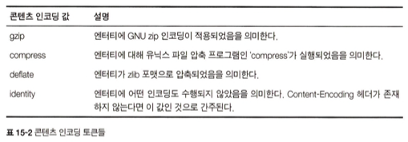
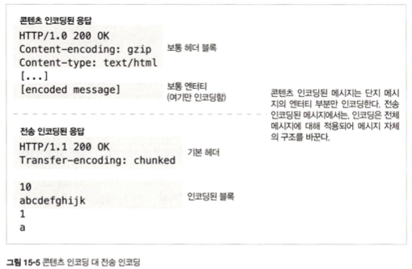
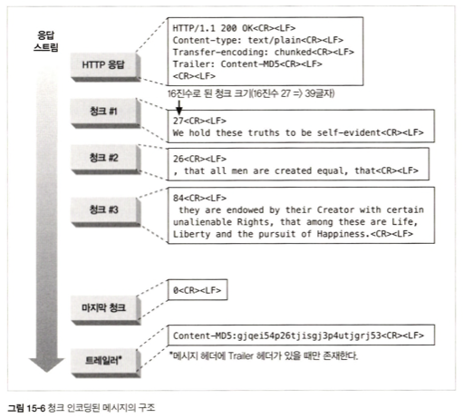
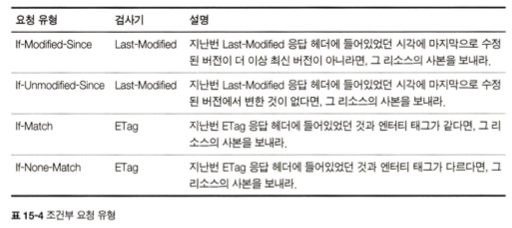
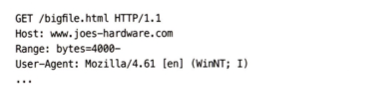
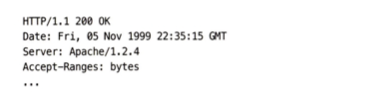
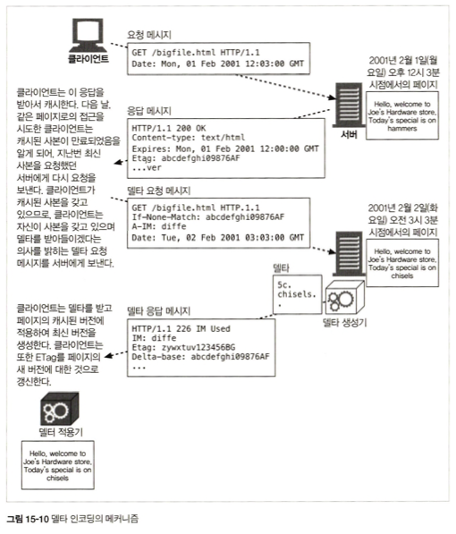

<br>
<br>
<br>


### 15. 엔터티와 인코딩
HTTP는 다음을 보장
- 객체는 올바르게 식별됨 (Content-Type, Content-Language)
- 객체는 올바르게 압축이 풀림(Content-Length, Content-Encoding)
- 객체는 항상 최신(엔티티 검사기, 캐시 만료 제어)
- 사용자의 요구를 만족(Accept)
- 네트워크 사이를 빠르고 효율적으로 이동(범위 요청, 델타 인코딩, 그 외의 데이터 압축)
- 조작되지 않고 온전하게 도착(전송 인코딩, Cotent-MD5 체크섬)

<br>
<br>

### 15.1 메시지는 컨테이너, 엔티티는 화물
- Content-Language: 전달되는 객체와 각장 잘 대응되는 자연어
- Content-Location: 요청 시점을 기준으로 객체의 또 다른 위치
- Content-Range: 이 엔티티가 전체의 어느 부분에 해당하는지
- Content-Encoding: 객체 데이터에 대해 행해진 변형
- Content-MD5: 엔티티 본문의 콘텐츠에 대한 체크섬

<br>
<br>

### 15.2.1 잘림 검출
Content-Length가 없다면 클라이언트는 커넥션이 정상적으로 닫힌 것인지 메시지 전송 중에 서버에 충돌이 발생한 것인지 구분하지 못함.   
메시지 잘림은 캐싱 프록시 서버에 특히 취약 -> 이를 방지하기 위해 `캐싱 프록시 서버는 Content-Length 헤더를 지니지 않은 HTTP 본문은 보통 캐싱하지 않음 ` 

<br>
<br>

### 15.2.4 콘텐츠 인코딩  
HTTP는 콘텐츠 `인코딩을 통해 보안을 강화하거나 압축`  
이때 `Content-Length 헤더는 인코딩된 본문의 길이를 바이트 단위로 정의` (원본의 길이가 아님)  

<br>
<br>

### 15.2.2 엔티티 본문 길이 판별을 위한 규칙
1. HEAD 처럼 본문을 갖지 않는 HTTP 메시지에서는 Content-Length 헤더가 무시됨  
2. 메시지가 Transfer-Encoding 헤더를 보함한다면, 메시지가 커넥션이 닫혀서 먼저 끝나지 않는 이상 엔티티는 '0 바이트 청크'라고 불리는 특별한 패턴으로 끝나야함  
3. Transfer-Encoding 헤더 필드를 갖는 메시지를 받았다면 반드시 Content-Length 헤더를 무시해야함  
4. 멀티파트 유형은 자신의 크기를 스스로 결정할 수 있는 유일한 엔티티 본문 유형  

<br>
<br>

### 15.5.2 콘텐츠 인코딩 유형  
<div align="center">
    
</div>

<br>
<br>

### 15.5.3 Accept-Encoding 헤더
HTTP 요청이 Accept-Encoding 헤더를 포함하지 않는다면 서버는 클라이언트가 어떤 인코딩이든 받아들일 수 있는 것으로 간주  
```yml
Accept-Encoing: gzip;q=1.0, identity; q=0.5, *;q=0
```
Q 값은 선호도, *는 그 외 모두를 의미  

<br>
<br>

### 15.5.6 콘텐츠 인코딩과 전송 인코딩  
`콘텐츠 인코딩`은 콘텐츠 포맷과 긴밀하게 연관됨 -> ex) 텍스트 파일은 흔힉 gzip으로 압축하지만 JPEG 파일은 그렇게 하지 않음(JPEG는 gzip으로 잘 압축되지 않음)  
`전송 인코딩`은 구조적인 이유 떄문에 적용되는 것. 콘텐츠의 포맷과는 독립적 -> 메시지 데이터가 네트워크에 전송되는 방법을 바꾸기 위해 적용. ex) 청크 인코딩 
<div align="center">
    
</div>

<br>

> `청크 인코딩?`  
> 메시지를 일정 크기의 청크로 쪼개어 순차적으로 보내는 것  
> 이를 이용하면 메시지를 보내기 전에 전체 크기를 알 필요가 없어짐  
> 본문이 동적으로 생성되는 상황에서, 서버는 그중 일부를 버퍼에 담은 후 청크 크기가 되면 보냄  
> 수신자가 본문을 재구축하는 절차는 전송 순서와 반대      

<br>

> 미래에 전송 인코딩이 필수가 된다면 ?
> 청크 전송 인코딩이 최상위에 적용되어야 함 -> HTTP/1.1은 청크 인코딩만은 최소한 지원하기 때문  


<br>
<br>

### 15.6.3 청크와 지속 커넥션
지속 커넥션 + 서버에서 콘텐츠가 동적으로 생성되는 상황에서는 메시지를 보내기 전에 본문의 길이를 알아내는 것이 불가능  
-> 이런 상호아에서 청크 인코딩이 해법을 제공   
서버는 크기가 0인 청크로 본문이 끝났음을 알리고 다음 응답을 위해 커넥션을 열린 채로 유지할 수 있음

<div align="center">
    
</div>

> `트레일러` ?  
> 본문의 콘텐츠가 먼저 생성되어야 한다거나 하는 등의 이유로 메시지 시작 시점에서는 그 값을 알 수 없는 추가적인 헤더 필드를 담을 수 있음  
> Transfer-Encoing, Trailer, Content-Length를 제외한 어떤 HTTP 헤더도 트레일러로 보낼 수 있음  

<br>
<br>

### 15.8.2 조건부 요청과 검사기  
<div align="center">
    
</div>

<br>
<br>

### 15.9 범위 요청 
HTTP는 클라이언트가 문서의 일부분이나 특정 범위만 요청할 수 있게 해줌  
<div align="center">
    
</div>
서버는 클라이언트에게 자신의 범위를 받아들일 수 있는지 응답에 Accept-Range 헤더를 포함시키는 방법으로 알려줄 수 있음  

<br>

<div align="center">
    
</div>

`단, 범위 요청은 클라이언트와 서버가 같은 버전의 문서를 갖고 있을 때만 의미가 있다는 것을 유의`  

<br>
<br>

### 15.10 델타 인코딩  
객체 전체가 아닌 변경된 부분에 대해서만 통신하여 전송량을 최적화는 HTTP 프로토콜의 확장  
<div align="center">
    
</div>

A-IM(Accept-Instance-Manipulation) 헤더: 클라이언트가 서버에게 자신이 페이지에 대한 델타를 받아들일 수 있음을 알려주는 헤더  

그러나, 델타 인코딩은 전송 시간을 줄일 수는 있지만 구현 복잡도가 높음  
델타 인코딩을 지원하는 서버는 자신이 제공하는 페이지가 변경되는 매 순간의 사본을 유지하고 있어야함 -> 그래야 클라이언트가 요청을 보냈을 때 변경된 부분을 알아낼 수 있음  
-> 문서를 제공하는데 걸리는 시간이 주는 대신 디스크 공간이 많이 필요  

