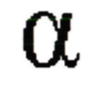

# 16장 국제화

## 16.1 국제적인 콘텐츠를 다루기 위해 필요한 HTTP 자원

- `HTTP Content-Type charset` & `Content-Language` : 서버 &rarr; 클라이언트 리소스 문자 및 언어 정보 제공
- `Accpet-Charset` & `Accept-Language` : 클라이언트 &rarr; 서버 charset encoding 알고리즘 중 선호하는 언어 정보 제공

ex) 영어도 사용하는 프랑스어 사용자

```text
Accept-Lanugae: fr, en;q=0.8
Accept-Charset: iso-8859-1, utf-8
```

- 해당 사용자 브라우저 &rarr; `iso-8859-1` 서유럽어 charset encoding & `UTF-8` unicode charset encoding 지원
- `q=0.8` : quality factor &rarr; 프랑스어(= 기본값 1.0) > 영어(0.8)  우선순위

## 16.2 문자집합과 HTTP

### 16.2.1 Charset은 글자를 비트로 변환하는 인코딩이다

> HTTP Charset : 엔터티 컨텐츠 비트 &rarr; 특정 문자 체계 글자 변경 방식 명시

<div align="center">
    
</div>

```text
Content-Type: text/html; charset=iso-8859-6
```

- `Content-Type: text/html` : 컨텐츠 = HTML 파일
- `charset=iso-8859-6` : 컨텐츠 비트들을 글자로 디코딩하기 위해 iso-8859-6 아랍 문자 집합 디코딩 기법 사용
- `iso-8859-6` : 8비트 값을 숫자, 구두점, 다른 기호를 포함한 라틴 문자와 아랍 문자로 매핑

### 16.2.2 문자집합과 인코딩은 어떻게 동작하는가

<div align="center">
    
</div>

### 16.2.3 잘못된 charset은 잘못된 글자들을 낳는다

ex) 브라우저가 본문으로부터 값 225를 가져온 경우

|       본문 인코딩 방식        |디코딩 값|          언어로 표현된 디코딩 값          |
|:----------------------:|:------:|:-------------------------------:|
| iso-8859-1 = 서유럽 문자 코드 |소문자 라틴문자 a|  |
|   iso-8859-6 = 아랍 코드   |FEH|  |
|  iso-8859-7 = 그리스어 코드  |Alpha|  |
|   iso-8859-8 = 히브리어 코드|BET|  |

### 16.2.4 표준화된 MIME charset 값

> MIME Charset 이란, 특정 문자 인코딩과 특정 코딩된 문자 집합의 결합 ex) iso-8859-1, euc-kr, utf-8

### 16.2.6 Accept-Charset 헤더

> Accept-Charset 헤더 값 = 클라이언트가 지원하는 문자 인코딩 목록

- `Accept-Charset` 요청 헤더에 대응하는 `Content-Charset` 응답 헤더 존재 x
- 응답 문자 집합 &rarr; MIME 호환을 위해 `Content-Type` 응답 헤더 charset 매개변수를 통해 서버로부터 수신

## 16.4 언어 태그와 HTTP

### 16.4.1 Content-Language 헤더

> Content-Language : 엔터티가 어떤 언어 사용자를 대상으로 하고 있는지 서술  
> ex) `Content-Language: fr` &rarr; 프랑스어 사용자 대상

- `Content-Language` &rarr; 텍스트 문서뿐만 아니라 오디오, 동영상, 애플리케이션 등 대상 가능
- 두 개 이상의 언어 지원 가능 ex) `Content-Language: mi, en` &rarr; 마오리 언어 & 영어

### 16.4.2 Accept-Language 헤더

> Accept-Language : 여러 언어로 된 리소스에 대해 웹 서버에 선호하는 언어 정보 전달
> ex) `Accept-Language: es` &rarr; 스페인어로 된 리소스에 대한 클라이언트 요청

### 16.5.4 국제 문자들을 이스케이핑하기

> url 문자 &rarr; US-ASCII 코드 범위(0 - 127) 내 존재해야함  
> iso-8859-1(128 - 255) &rarr; utf-8 인코딩

ex) url에 한글 문자 있는 경우

|                            AS-IS                            |TO-BE|
|:-----------------------------------------------------------:|:-----:|
| https://moccona.co.kr/entry/한글-URL-붙여넣기-할-때-영어와-숫자로-변환-해결방법 |https://moccona.co.kr/entry/%ED%95%9C%EA%B8%80-URL-%EB%B6%99%EC%97%AC%EB%84%A3%EA%B8%B0-%ED%95%A0-%EB%95%8C-%EC%98%81%EC%96%B4%EC%99%80-%EC%88%AB%EC%9E%90%EB%A1%9C-%EB%B3%80%ED%99%98-%ED%95%B4%EA%B2%B0%EB%B0%A9%EB%B2%95|