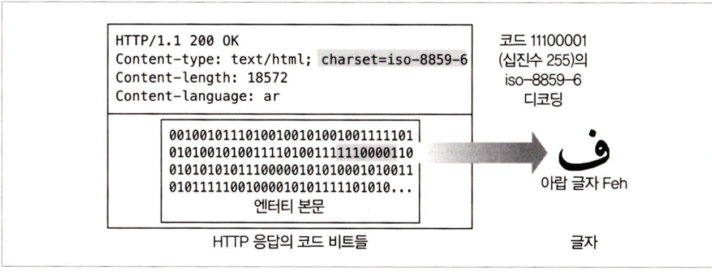
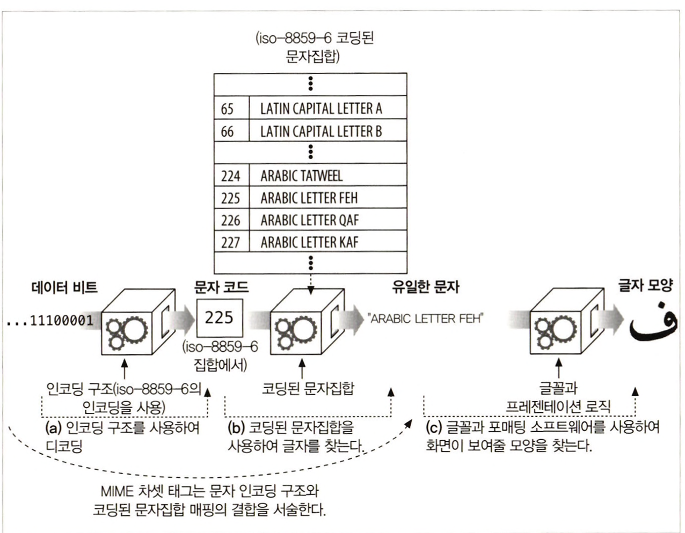
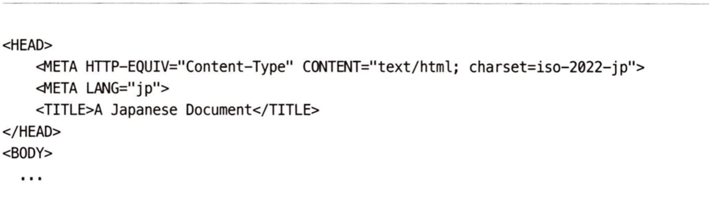

# 16장 국제화

</br>

## 16.1 국제적인 콘텐츠를 다루기 위해 필요한 HTTP 지원
- 서버 -> 클라이언트 : 문서의 문자와 언어
    - Content-Type charset 매개변수
    - Content-Language
- 클라이언트 -> 서버 : 선호하는 차셋 인코딩 알고리즘과 언어
    - Accept-Charset
    - Accept-Language

</br>

## 16.2 문자집합과 HTTP

</br>

### 16.2.1 차셋은 글자를 비트로 변환하는 인코딩이다.
각 차셋 태그는 비트들을 글자로 변환하거나 혹은 그 반대의 일을 해주는 알고리즘을 명명한다.
- Content-Type Header : 콘텐츠가 HTML 파일이다.
- charset 매개변수 : 콘텐츠 비트들을 글자들로 디코딩하기 위해 iso-8859-6 아랍 문자집합 디코딩 기법을 사용해야 한다.

<div align="center">
    
</div>

</br>

### 16.2.2 문자집합과 인코딩은 어떻게 동작하는가
<div align="center">
    
</div>

</br>

### 16.2.3 잘못된 차셋은 잘못된 글자들을 낳는다.
만약 클라이언트가 잘못된 charset 매개변수를 사용한다면, 클라이언트는 이상한 깨진 글자를 보여주게 될 것이다.

</br>

### 16.2.4 표준화된 MIME 차셋 값
- 특정 문자 인코딩과 특정 코딩된 문자집합의 결합을 MIME 차셋이라고 부른다.
- HTTP는 표준화된 MIME 차셋 태그를 Content-Type과 Accept-Charset 헤더에 사용한다.

</br>

### 16.2.5 Content-Type charset 헤더와 META 태그
- 웹 서버는 클라이언트에게 MIME 차셋 태그를 charset 매개변수와 함께 Content-Type 헤더에 담아보낸다.
- 만약 문자집합이 명시적으로 나열되지 않았다면, 수신자는 문서의 콘텐츠로 부터 문서의 콘텐츠로부터 문자집합을 추측하려 시도한다.
- HTTP 콘텐츠에서 문자 집합은 문자 집합을 서술하는 <META HTTP-EQUIV="Content-Type">태그에서 찾을 수 있다.
<div align="center">
    
</div>

</br>

### 16.2.6 Accept-Charset 헤더
- HTTP 클라이언트는 서버에게 정확히 어떤 문자 체계를 그들이 지원하는지 Accept-Charset 요청 헤더를 통해 알려준다.

</br>

## 16.4 언어 태그와 HTTP

</br>

### 16.4.1 Content-Language 헤더
Content-Language 엔터티 헤더 필드는 엔터티가 어떤 언어 사용자를 대상으로 하고 있는지 서술한다.
- 주로 프랑스어 사용자를 대상으로 하고 있는 경우
```BASH
Content-Language: fr
```

</br>

### 16.4.2 Accept-Language 헤더
HTTP는 우리에게 우리의 언어 제약과 선호도를 웹 서버에 전달할 수 있게 해준다.
- 스페인어로 된 콘텐츠에 대한 클라이언트 요청
```BASH
Accept-Language: es
```

</br>

## 16.5 국제화된 URI

</br>

### 16.5.3 이스케이핑과 역이스케이핑
- 이스케이프 : % <HEX> <HEX>
- 애플리케이션은 어떤 URI도 두 번 언이스케이핑 되지 않도록 해야한다. 

</br>

### 16.5.4 국제 문자들을 이스케이핑하기
이스케이프 값들은 US-ASCII 코드의 범위(0~127)에 있어야 한다.