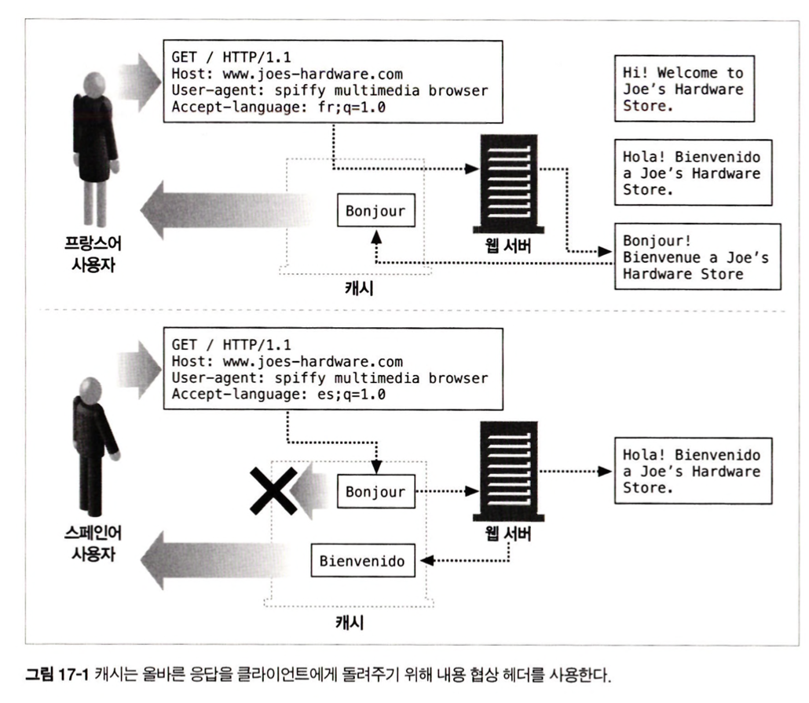
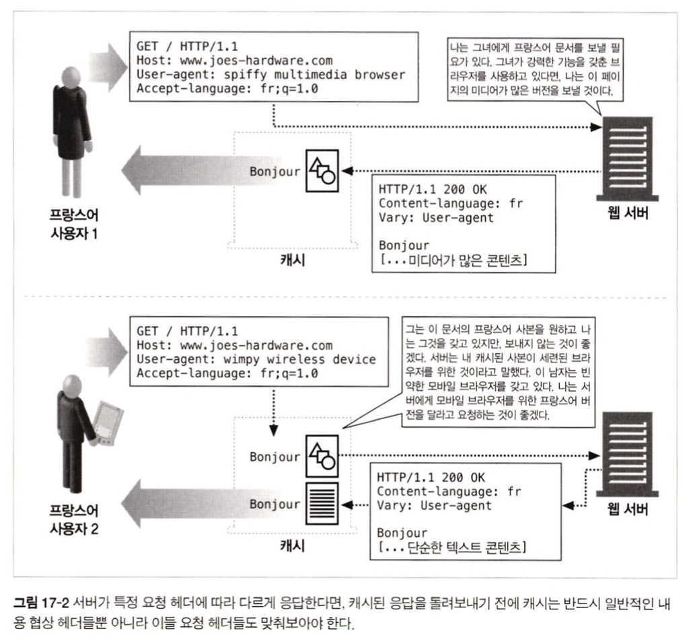

# 17장 내용 협상과 트랜스코딩

## 17.3 서버 주도 협상

### 17.3.2 내용 협상 헤더의 품질값

```text
Accept-Language: en;q=0.5, fr;q=0.0, nl;q=1.0, tr;q=0.0
```

- 0.0 <= q <= 1.0 &rarr; 0.0 : 1.0 = 가장 낮은 선호도 = 가장 높은 선호도
- `네덜란드어(nl)`로 된 리소스를 원하지만 `영어(en)`로 된 리소스도 ok
- `프랑스어(fr)`, `터키어(tr)` 버전은 원하지 않음 

## 17.4 투명 협상

### 17.4.1 캐시와 alternate

<div align="center">
    
</div>

### 17.4.2 Vary 헤더

<div align="center">
    
</div>
