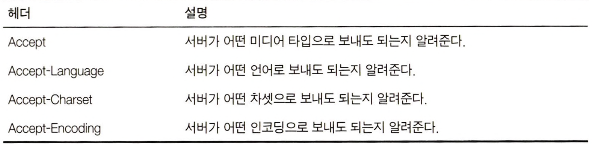

# 17. 내용 협상과 트랜스코딩

</br>

## 17.1 내용 협상 기법
<div align="center">
    
</div>

</br>

## 17.2 클라이언트 주도 협상
서버에서 클라이언트에게 선택지를 표현하는 두 가지 방법
1. 여러 가지 버전에 대한 링크과 가각에 대한 설명이 담긴 HTML 페이지 반환
2. 300 Multiple Choices 응답코드 반환

</br>

## 17.3 서버 주도 협상
클라이언트는 반드시 자신이 무엇을 선호하는지에 대한 충분한 정보를 서버에게 제공해야 한다.
- 적절한 응답을 계산하기 위한 메커니즘
    1. 내용 협상 헤더들을 살펴본다. </br> 서버는 클라이언트의 Accept 관련 헤더들을 들여다보고 그에 알맞는 응답 헤더를 준비한다.
    <div align="center">
        
    </div>
    
    2. 내용 협상 외의 다른 헤더들을 살펴본다. </br> 서버는 클라이언트의 User-Agent 헤더에 기반해 응답을 보내준다.

### 17.3.2 내용 협상 헤더의 품질값
HTTP 프로토콜은 클라이언트가 각 선호의 카테고리마다 여러 선택 가능한 항복을 선호도와 함께 나열할 수 있도록 품질값을 정의하였다.
```BASH
Accept-Language: en;q=0.5, fr;q=1.0, nl;q=1.0, tr;1=0.0
```
- 네덜란드어(nl)로 된 문서를 원하지만, 영어(en)로 된 문서라도 받아들임
- 프랑스어(fr)나 터키어(tr) 버전을 원하지 않음

</br>

## 17.4 투명 협상
- 클라이언트 입장에서 협상하는 중개자 프락시를 둔다.
- 메시지 교환을 최소화 하며 서버 주도 협상으로 인한 부하를 서버에서 제거한다.

</br>

### 17.4.1 캐시와 얼터네이트(alternate)

- 캐시는 클라이언트에게 올바르게 응답을 돌려주기 위해, 서버가 응답을 돌려줄 때 사용했던 로직을 상당부분 사용한다.
- 캐시는 반드시 모든 요청을 서버에게 전달하고 모든 응답을 저장해야 한다.
- 캐시는 같은 URL에 대해 두 개의 다른 문서를 갖게 된다.
- 이 다른 번전은 배리언트(variant)나 얼터네이트(alternate)라고 불린다.

</br>


### 17.4.2 Vary 헤더

- HTTP Vary 응답 헤더는 클라이언트 요청 헤더 모두를 나열한다.
- 캐시가 문서를 클라이언트에게 제공해 주기 전에, 캐시는 반드시 캐시된 응답 안에 서버가 보낸 Vary 헤더가 있는지 확인한다.
- Vary 헤더가 존재한다면, Vary 헤더가 명시하고 있는 헤더들은 새 요청과 오래되고 캐시된 요청의 값이 맞아야 한다.

</br>


## 17.5 트랜스코딩

- 서버가 클라이언트의 요구에 맞는 문서를 가지고 있지 않다면, 서버는 기존의 문서를 클라이언트가 사용할 수 있는 무언가로 변환 할 수 있다. 이 옵션을 **`트랜스코딩`**이라 한다.

</br>


### 17.5.1 포맷 변환

- 데이터를 클라이언트가 볼 수 있도록 한 포맷에서 다른 포맷으로 변환하는 것이다.
- 포맷 변환은 내용 협상 헤더에 의해 주도된다.
- 콘텐츠를 특정 접근 장치에서 볼 수 있도록 하는 것이다.

</br>


### 17.5.2 정보 합성(information synthesis)

- 각 절의 제목에 기반한 문서의 개요 생성이나 페이지에서 광고 및 로고 제거와 같은 예가 있다.
- 웹페이지 디렉토리와 같은 자동화된 웹페이지 분류 시스템에 의해 종종 사용된다.

</br>


### 17.5.3 콘텐츠 주입

- 자동 광고 생성, 사용자 추적 시스템과 같은 예가 있다.
- 특정 사용자를 대상으로 자동으로 광고를 삽입한다.
- 어떻게 페이지가 보여지고 사용자가 웹을 서핑하는 거에 따라 동적으로 콘텐츠를 삽입한다.

</br>


### 17.5.4 트랜스코딩 vs 정적으로 미리 생성

- 트랜스코딩의 대안으로는 웹 서버에서 웹페이지의 여러 사본을 만드는 것이다.
    - 페이지의 작은 변화에 따라 페이지의 수정이 필요하다.
    - 모든 버전을 저장하기 위해 더 많은 공간이 필요하다.
    - 페이지를 관리하고 올바른 페이지를 노출 시키도록 웹 서버를 프로그래밍하기 어려워진다.
- 광고 삽입과 같은 트랜스코딩은 요청한 사용자에게 달려있기 때문에 정적인 방법으로는 수행될 수 없다.
- 루트 페이지를 필요할 때마다 변환하는 것이 좋다.
