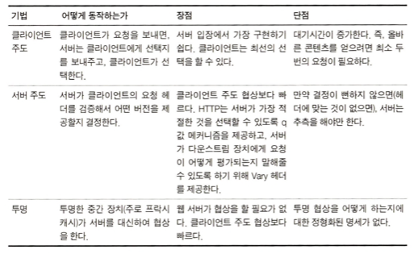
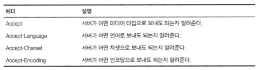
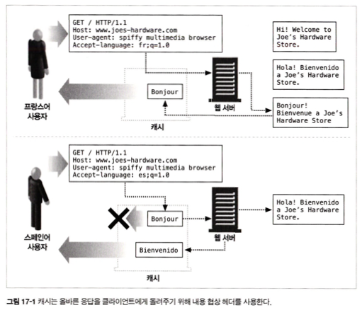
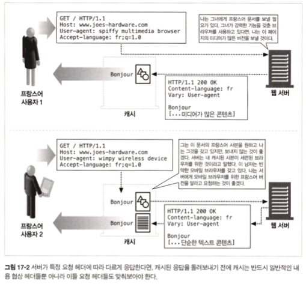

<br>
<br>
<br>


### 17 내용 협상과 트랜스코딩
이상적으로 동작한다면, 서버는 영어 사용자에게는 영어 버전을, 프랑스어 사용자에게는 프랑스어 버전을 보내줘야한다. -> HTTP는 이와 같은 위해 클라이언트와 서버가 이러한 판단을 할 수 있도록 내용 협상(content-negotiation) 방법을 제공한다.

<br>
<br>

### 17.1 내용 협상 기법  
<div align="center">
    
</div>

<br>
<br>

### 17.3 서버 주도 협상

#### 17.3.1 내용 협상 헤더(Accept 관련 헤더)  
서버는 클라이언트의 Accept 관련 헤더를 들여다보고 그에 알맞은 응답 헤더를 준비한다. 
클라이언트는 아래의 Accept 헤더들을 이용해 자신의 선호 정보를 알린다.  
<div align="center">
    
</div>

#### 17.3.3 그 외의 헤더들에 의해 결정
그 외에도, User-Agent 헤더 등에 기반해서 응답을 보내주기도 한다.  

> **`Vary 헤더`**
> Vary 헤더는 캐시에게(+클라이언트와 그 외의 모든 다운스트림 프록시에게) `서버가 최선의 응답을 주기 위해 어떤 요청 헤더를 참고하고 있는지`를 알려준다.

<br>
<br>

### 17.4 투명 협상  
투명 협상은 내용 협상을 중간 장치에서 수행하는 것이다.  
이전에 서버에는 응답에 Vary 헤더를 포함시켜 중간 장치에게 내용 협상을 위해 어떤 헤더를 참고하고 있는지를 알려줄 수 있다고 했다.  
그러면 중간 장치(캐시 프록시)는 이 정보를 이용하여 서버를 대신하여 클라이언트와 협상할 수 있다.  

<br>
<br>

### 17.4.1 캐시와 alternate
캐시 프록시는 서버에서 클라이언트에 전달되는 응답의 사본을 가지고 있다. 이 사본은 variant 혹은 alternate라고 불리는데, 캐시 프록시에서 하는 투명 협상은 해당 variant 중에 클라이언트의 요청에 가장 잘 맞는 것을 선택하는 과정이다.  

``` yml
Vary: User-Agent, Cookie
```
만약 Vary가 위와 같다면, 거대한 수의 User-Agent와 Cookie 값에 해당하는 variant 들이 만들어진다. 그리고 캐시 프록시는 클라이언트에서 요청이 들어왔을 때 Accept 헤더들을 살펴보고, 이에 맞는 variant가 있다면 그것을 주고, 없다면 문서를 서버에서 가져온다.  

<div align="center">
    
</div>

<br>
<br>

### 17.5 트랜스코딩  
그런데 서버가 클라이언트 요구에 맞는 문서를 아예 갖고 있지 않다면?  
보통은 에러로 응답하지만, **`이론적으로 서버는 기존의 문서를 클라이언트가 사용할 수 있는 무언가로 변환할 수 있는데, 이걸 트랜스코딩`** 이라고 한다.

<div align="center">
    
</div>

<br>

> cf)  
> `트랜스코딩 기법은 미디어 콘텐츠에도 많이 활용`되는 듯 하다.  
> 재생을 할 디바이스가 해당 영상의 코덱을 지원하지 못하면 이를 실시간으로 인코딩하여 재생이 가능하도록 바꿔준다.  
> [LINE 트랜스코딩 서버 아키텍처 개선기 - 1](https://engineering.linecorp.com/ko/blog/line-transcoding-server-architecture-improvement-1/)