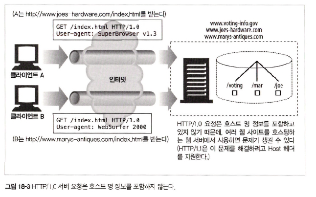
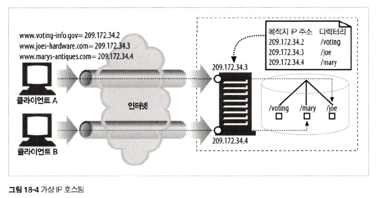
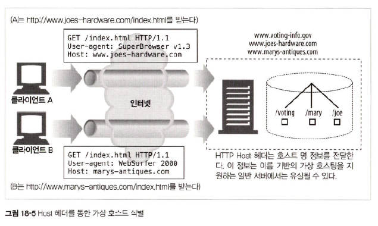
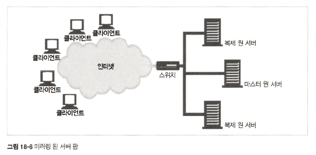
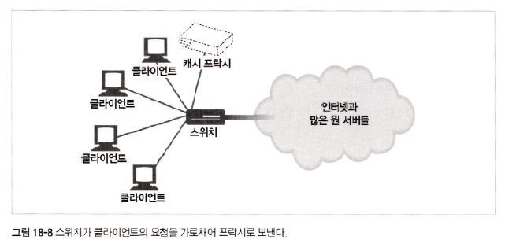

# 18장 웹 호스팅

## 18.2 가상 호스팅

### 18.2.1 호스트 정보가 없는 가상 서버 요청

> HTTP/1.0 요청에는 호스트 명에 대한 정보 x &rarr; 1개의 서버 내 여러 애플리케이션이 동작하는 가상 호스팅 불가능

    

### 18.2. 가상 호스팅 동작하게 하기

> HTTP/1.1을 지원하는 서버 &rarr; HTTP 요청 메시지에 있는 전체 url 처리 해야함

#### _URL 경로를 통한 가상 호스팅_

> 서버가 어떤 사이트를 요청하는 것인지 알 수 있도록 URL에 특별한 경로 컴포넌트 추가

ex) `http://www.joes-hardware.com/joe/index.html` vs `http://www.marys-antiques.com/mary/index.html`

- GET `/joe/index.html` : joe 컴퓨터 가게에 대한 요청
- GET `/mary/index.html` : mary 골동품 가게에 대한 요청

=> 접두어는 불필요하고 혼란스러워 `URL 기반의 가상 호스팅`은 **좋지 않은 방법이라 거의 사용 x**

#### _포트번호를 통한 가상 호스팅_

> 각 사이트에 다른 포트번호를 할당하여 분리된 웹 서버의 인스턴스가 요청 처리

ex) `joe : 80 port` vs `mary : 82 port`

=> 사용자는 URL에 비표준 포트를 쓰지 않고서 리소스 찾기를 원함

#### _IP 주소를 통한 가상 호스팅_

> 각 가상 사이트에 별도 IP 주소를 할당하고 모든 IP 주소를 장비 하나에 연결

ex) `www.joes-hardware.com : 209.172.34.3` vs `www.marys-antiques.com : 209.172.34.4`

    

=> 호스팅 업자에 큰 부담(ip 주소 & 서버 확보 &uarr;&uarr;&uarr;)

#### _Host 헤더를 통한 가상 호스팅_

> 웹 서버 &rarr; Host 헤더로 가상 사이트 식별

    

## 18.3 안정적인 웹 사이트 만들기

웹 사이트에 장애가 생기는 3가지 상황

- 서버 다운
- 트래픽 폭증
- 네트워크 장애 및 손실

### 18.3.1 미러링 된 서버 팜

    

- 마스터 원 서버 : 원본 리소스를 갖고 있는 서버
- 복제 원 서버 : 마스터 원 서버의 리소스를 복제한 리소스를 갖고 있는 서버
- 스위치가 각 서버에 load balance &rarr; 각 서버 ip 주소 = 스위치 ip 주소

#### _HTTP 리다이렉션_

- 리소스 url &rarr; 마스터 원 서버 ip 가리킴
- 마스터 서버 &rarr; 요청을 받는 즉시 복제 원 서버로 redirect

#### _DNS 리다이렉션_

- 리소스 url은 4개 ip 주소를 가리킬 수 있고 DNS 서버는 클라이언트에 전송할 ip 주소 선택 가능

### 18.3.4 CDN의 프락시 캐시

    

- L2, L3 스위치가 프록시가 처리하도록 트래픽 가로챔

