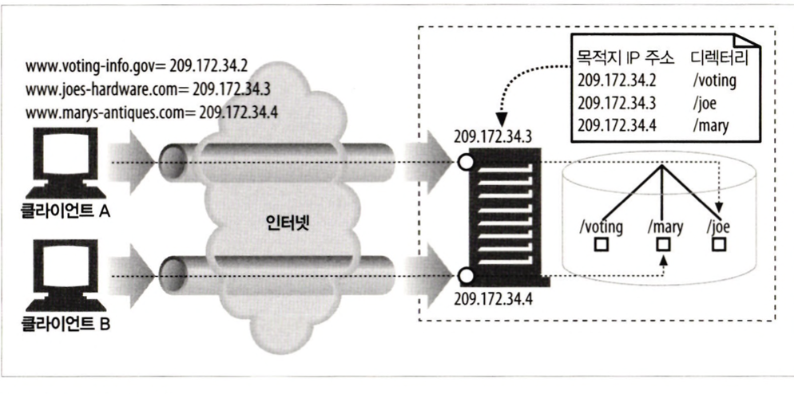
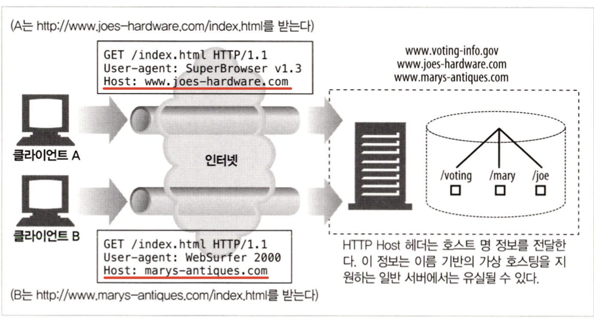
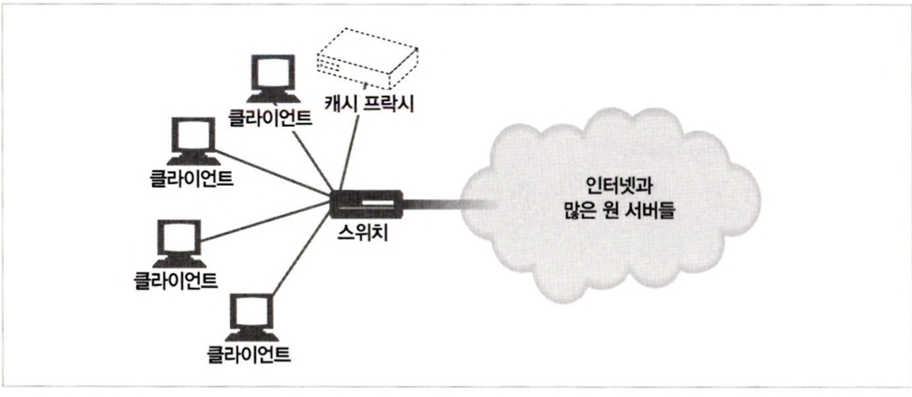

# 18. 웹 호스팅 #

콘텐츠 리소스를 저장, 중개, 관리하는 일을 통틀어 웹 호스팅이라 한다. </br>
콘텐츠를 저장해서 제공하고 관련 로그에 접근하거나 그것을 관리하는 데 서버가 필요하다. </br>
필요한 하드웨어와 소프트웨어를 직접 관리하기 어렵다면, 호스팅 서비스나 호스팅 업체가 필요할 것이다. </br>

## 18.2 가상 호스팅 ##
많은 웹 호스팅 업자는 컴퓨터 한 대를 여러 고객이 공유하게 해서 저렴한 웹 호스팅 서비스 제공한다. </br>
이를 공유 호스팅 혹은 가상 호스팅이라 부른다. </br>
각 웹 사이트는 다른 서버에서 호스팅하는 것처럼 보이겠지만, 사실은 물리적으로 같은 서버에서 호스팅되는 것이다. </br>

 </br>

 ### 18.2.1 호스트 정보가 없는 가상 서버 요청 ###
 HTTP/1.0 명세는 공용 웹 서버가 호스팅하고 있는 가상 웹 사이트에 누가 접근하고 있는지 식별하는 기능을 제공하지 않는다. </br>
 서버가 여러 개의 사이트를 가상 호스팅하고 있으면, 사용자가 어떤 가상 웹 사이트로 접근하려고 하는 것인지 아는데 필요한 정보가 충분하지 않다. </br>

  </br>

 ### 18.2.2 가상 호스팅 동작하게 하기 ###
 초기 명세는 가상 호스팅을 고려하지 않았기 때문에, 웹 호스팅 업자는 공용 가상 호스팅을 지원하는 데 필요한 차선책과 컨벤션을 개발해야 했다. </br>
 그 문제는 모든 HTTP 요청 메시지에 경로 컴포넌트만 보내는 것이 아니라 완전한 URL도 포함해 보내게 해서 간단히 해결했다. </br>
 1. URL경로를 통한 가상 호스팅
 2. 포트번호를 통한 가상 호스팅
 3. IP주소를 통한 가상 호스팅
- 각 가상 웹 사이트에 유일한 IP 주소를 한 개 이상 부여한다. </br>
모든 가상 서버의 IP주소는 같은 공용 서버에 연결되어 있다. </br>
서버는 HTTP 커넥션의 목적지 IP 주소를 보고 클라이언트가 어떤 웹 사이트에 연결하려고 하는지 알 수 있다. </br>
<div align="center">
    
</div>

 4. Host헤더를 통한 가상 호스팅
- HTTP/1.0의 개선 버전과 HTTP/1.1의 공식 버전은 사이트 이름을 알려주는 Host 요청 헤더를 정의했다. </br>
- 웹 서버는 Host 헤더로 가상 사이트를 식별할 수 있다. </br>
- 모든 요청에 호스트 명(그리고 포트)을 Host 확장 헤더에 기술해서 전달한다. </br>
<div align="center">
    
</div>

 </br>

### 18.2.3 HTTP/1.1 Host 헤더 ###
- Host 헤더에는 원본 URL에 있는 요청 리소스에 대한 인터넷 호스트와 포트번호를 기술한다.
```BASH
Host = "Host" ":"호스트[ ":" 포트]
```
1. HTTP 요청 메시지에 전체 URL이 기술되어 있으면, Host 헤더에 있는 값은 무시하고 URL을 사용한다.
2. HTTP 요청 메시지에 있는 URL에 호스트 명이 기술되어 있지 않고 요청에 Host 헤더가 있으면, 호스트 명과 포트를 Host 헤더에서 가져온다.
3. 1단계나 2단계에서 호스트를 결정할 수 없으면 클라이언트에 400 Bad Request 응답을 반환한다.

</br>

## 18.3 안정적인 웹 사이트 만들기 ##

</br>

### 18.3.1 미러링 된 서버 팜 ###
서버 팜은 서로 대신할 수 있고 식별할 수 있게 설정된 웹 서버들의 집합이다. </br>
서버 팜의 서버에 있는 콘텐츠들은 한 곳에 문제가 생기면 다른 한 곳에서 대신 전달할 수 있게 미러링할 수 있다.</br>
- 네트워크 스위치를 사용해서 서버에 분산 요청을 보낸다.
- 서버에 호스팅 되고 있는 각 웹 사이트의 IP 주소는 스위치의 IP 주소가 된다.
- 마스터 원 서버는 복제 원 서버에 콘텐츠를 보낸다.

</br>

클라이언트의 요청이 특정 서버로 가는 두 가지 방법
1. HTTP 리다이렉션
- 콘텐츠에 대한 URL은 마스터 서버의 IP를 가리키고, 마스터 서버는 요청을 받는 즉시 복제 서버로 리다이렉트시킨다.
2. DNS 리다이렉션
- DNS 서버가 클라이언트에게 전송할 IP주소를 선택한다.

</br>

### 18.3.3 CDN의 대리 캐시 ###
대리 캐시는 복제 원 서버를 대신해서 사용될 수 있다. 리버스 프락시라고도 불린다.</br>
대리 서버는 특정 원 서버 집합을 대신해 콘텐츠에 대한 요청을 받는다.</br>
대리 서버는 원 서버의 전체 콘텐츠를 복사하지는 않는다. 클라이언트가 요청하는 콘텐츠만 저장한다.</br>

</br>

### 18.3.4 CDN의 프락시 캐시 ###
<div align="center">
    
</div>