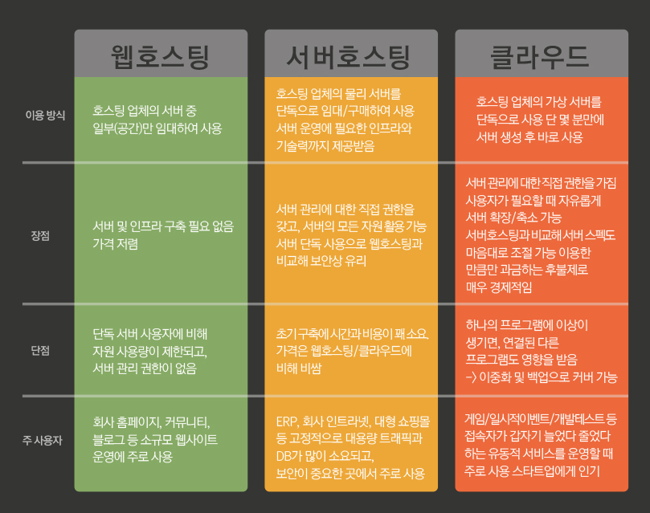

 
 
 

### 18.2 가상 호스팅
웹 사이트 개발자가 직접 서버를 사고 OS를 설치하여 운영하지 않아도 되도록 제공하는 웹 호스팅 서비스. -> 공유 호스팅 혹은 웹 호스팅이라고도 부름
가상 호스팅의 최종 목적은 end user가 물리적으로 분리된 전용 서버에서 호스팅하는 사이트와 구분할 수 없도록 하는 것.  
호스팅 업자는 서버 팜이라고 부르는 복제 서버 더미를 관리  

 

`웹 호스팅과 서버 호스팅, 클라우드의 차이점`

    

일반적으로 웹호스팅에서는 서버를 디렉토리로 구분하여 사용자에게 해당 공간을 임대 -> 운영체제, 서버 리소스 등이 사용자 별로 구분되지 않음 (cf. VM 단위로 호스팅하는 VPS 호스팅)
일반적으로 클라우드에서는 하나의 거대한 서버를 여러 대의 VM(Vertual Machine)으로 구분하여 어디서든 접근 가능한 클라우드 형태로 임대  

 

> `on-premise vs on-demand`  
> - on-premise: 사전에 준비된 서버. 즉 직접 설치해서 쓰는 서버를 말함. 추가적인 서버가 필요하다면 물리적 증설이 필요  
> - on-demand: 수요에 맞게 제공되는 서버. 즉 클라우드 서비스 등에서 서버를 필요한만큼 빌리고, 트래픽이 늘어나면 필요한 만큼 서버 가용치를 늘릴 수 있는 형태.

 
 

### 18.2.2 가상 호스팅 동작하게 하기
가상 호스팅을 하는 데 있어서 HTTP/1.0은 치명적인 설계적 결함이 있었는데, 바로 request 헤더 어디에도 host 정보가 없었던 것.  
-> 하나의 웹 사이트는 무조건 이 사이트만을 서빙하는 전용 서버를 가질 것이라고 예측했기 때문..  

 

<**`해결 방법`**>
1. 가상 호스팅된 웹 사이트들에 유일한 IP 주소(가상 IP)를 하나 이상 부여  
-> 이렇게 하면 클라이언트가 해당 IP를 통해 TCP 커넥션을 맺을 수 있음  
-> IP 주소를 통해 공용 웹 서버 내에서도 어떤 디렉토리(ex. /joe)에 요청(접근)해야할지 알 수 있음  

> `1번 방법의 문제점`  
> - 일반적으로 컴퓨터가 연결할 수 있는 IP 수에는 제한이 있다  
> - IP 주소는 양이 제한된 리소스이다.
> - 부하 분산을 위해 서버를 복제하면 복제된 서버에도 IP 주소를 부여해야하므로 필요한 IP 주소가 기하급수적으로 늘어난다.  

 

2. Host 헤더를 이용 (HTTP/1.0+부터 명세에 추가되었다)  
-> 요청을 할 떄 full url을 주면 좋지만, 이를 처리할 수 없는 서버가 많았기 떄문에, 명세를 확장하여 host 헤더를 추가했다.  

> `host 헤더 사용시 주의할 점`  
> - URL에 host 명이 기술되어 있다면, host 헤더는 IP를 직접 가질 수 없다. (여러 개의 가상 사이트를 한 개의 IP 주소에 연결한 가상 호스트 서버일 수 있기 때문에)  
> - 프록시 서버를 이용한다면, host 헤더에는 프록시가 아닌 origin 서버의 호스트 명과 포트가 기술되어야한다.  
> - 웹 프록시는 요청을 전달하기 전에 요청 메세지에 host 헤더를 추가해야한다.  
> - HTTP/1.1 웹 서버는 host가 없는 요청을 받으면 400으로 응답해야한다.  
> - **`요청 path가 full url이라면 host 헤더는 무시된다.`**

 
 

### 18.4 웹 사이트 빠르게 만들기
웹 사이트 속도를 높이는 또 다른 접근 방법은 콘텐츠 인코딩 -> 클라이언트가 받은 압축을 해제할 수 있다면 콘텐츠를 압축하여 보낸다(15장 참고)  