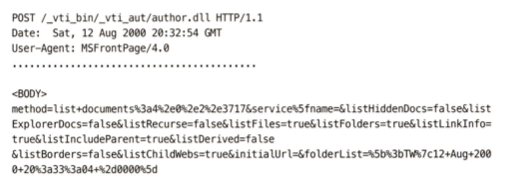
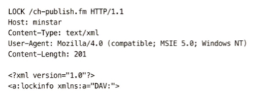
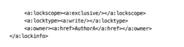

 
 
 

### 19 배포 시스템  
현재와 같은 배포 시스템이 갖춰지기 이전에는, HTML을 텍스트 편집기로 작성하고 해당 파일을 FTP를 통해 웹 서버에 전송했다.  

-> 이후 HTTP 기반의 배포 기술인 FrontPage와 DAV가 등장했다.  

- `FrontPage`

    

위와 같은 방식으로 웹 서버의 콘텐츠를 직접 수정 (보안을 위해 권한 그룹을 나누어 접근 제어)

 

- `WebDAV`(Web Distributed Authoring and Versioning, 웹 분산 저작 및 버전 관리)  
말하자면 git의 시초.  
그러나 여전히 raw하게 HTTP를 직접 이용하여 웹 서버에 접근. -> LOCK 등 원격지의 서버에 있는 데이터를 여러명의 개발자가 함께 수정하기 위한 메서드가 존재.  

    

    

