# 1장 HTTP 개관

 
 

## 2절 웹 클라이언트와 서버

> 클라이언트 (≈ HTTP 클라이언트) : 크롬, 사파리, ...  
> 웹 서버 (≈ HTTP 서버) : 데이터 저장, HTTP 클라이언트가 요청한 데이터 제공

    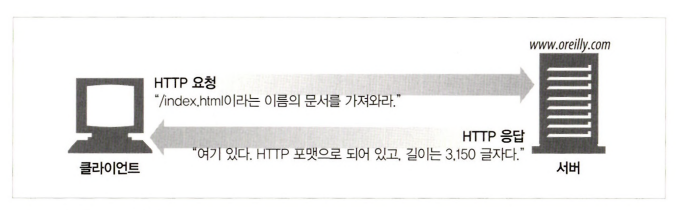

## 3절 리소스

> 웹 리소스 = 정적 리소스 + 동적 리소스  
> 정적 리소스 = 텍스트, HTML, JPEG, AVI, ...  
> 동적 리소스 = 요청에 따라 변화하는 데이터

    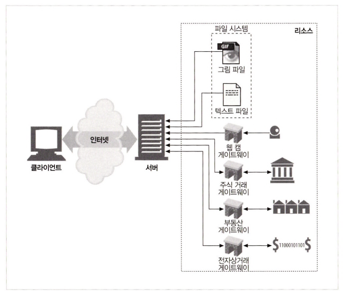

### 미디어 타입

> MIME(= Multipurpose Internet Mail Extensions) 이란, 클라이언트로부터 전송된 데이터 타입

    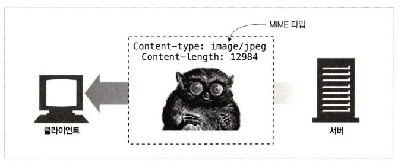

- 웹 서버 &rarr; 모든 HTTP 객체 데이터에 MIME 타입 붙임
- 웹 브라우저 &rarr; 서버로부터 객체를 돌려 받을 때 다룰 수 있는 객체인지 MIME 타입을 통해 확인  

- MIME 타입

|    타입     |                            예시                           |
|:---------:|:--------------------------------------------------------|
|   text    |     text/plain, text/html, text/css, text/javascript    |
| multipart |                  multipart/form-data, multipart/byteranges                  |
|   audio   | audio/midi, audio/mpeg, audio/webm, audio/ogg, audio/wav |
|   video   | video/webm, video/ogg|
|application|application/octet-stream, application/pkcs12, application/vnd.mspowerpoint, application/xhtml+xml, application/xml,  application/pdf|

### URI, URL, URN

> URI(= Uniform Resource Identifier) : 웹 서버 리소스의 고유 식별자  
> URL(= Uniform Resource Location) : 웹 서버 리소스에 대한 구체적인 위치  
> URN(= Uniform Resource Name) : 이름으로 웹 서버 리소스를 특정하는 URI

    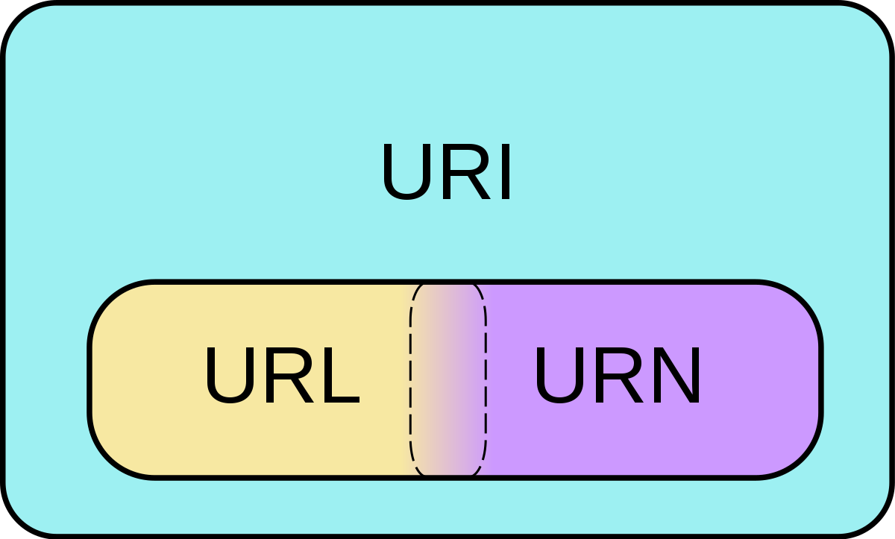

    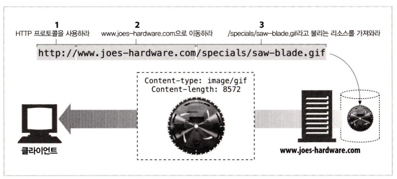

    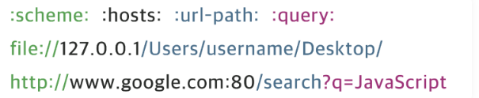

- URL

|명칭|                       설명                       |                부분                |
|:---:|:----------------------------------------------:|:--------------------------------:|
|scheme|                    통신 프로토콜                     |    file://, http://, https://    |
|hosts|    웹 페이지, 이미지, 동영상 등의 파일이 위치한 웹 서버, 도메인, IP    |    127.0.0.1, www.google.com     |
|port|                웹 서버에 접속하기 위한 통로                |         :80, :443, :3000         |
|url path|웹 서버의 루트 디렉토리로부터 웹 페이지, 이미지, 동영상 등의 파일이 위치까지의 경로| /search, /Users/username/Desktop |
|query|               웹 서버에 보내는 추가적인 질문                |                 q=javasript      |

- URN
    - 이름으로 리소스를 특정하는 URI
    - 프로토콜을 제외하고 리소스의 이름을 가리킴
    - 리소스를 영구적이고 유일하게 식별할 수 있는 URI
    - 리소스 접근 방법과 웹 상 위치 표기 X
    - 리소스 자체에 부여된 영구적이고 유일한 이름
    - 실제 자원을 찾기 위해 URN을 URL로 변환하여 이용

## 4절 트랜잭션

> HTTP 트랜잭션 = Http Request + Http Response

  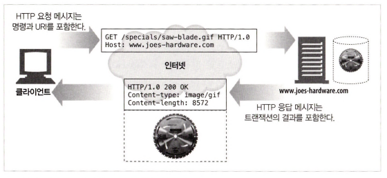

### HTTP 메서드

- HTTP 메서드 종류

|   메서드   | 설명                                          |
|:-------:|:--------------------------------------------|
|   GET   | 리소스 조회                                      |
|  POST   | 요청 데이터 처리, 주로 데이터 등록에 사용                    |
|   PUT   | 리소스를 대체, 해당 리소스가 없으면 생성                     |
|  PATCH  | 리소스 일부만 변경                                  |
| DELETE  | 리소스 삭제                                      |
|  HEAD   | GET과 동일하지만 메세지 부분을 제외하고 상태 줄과 헤더만 반환        |
| OPTIONS | 대상 리소스에 대한 통신 가능한 옵션 조회 &rarr; 주로 CORS에서 사용 |
| CONNECT | 대상 자원으로 식별되는 서버에 대한 터널 설정                   |
|  TRACE  | 대상 리소스에 대한 경로를 따라 메세지 루프백 테스트 수행            |

- HTTP 메서드 속성

|            속성             | 설명 |
|:-------------------------:|:-----|
|    안전(= Safe Methods)     | 계속해서 메서드를 호출해도 리소스를 변경 X ex) GET |
| 멱등(= Idempotent Methods)  | 메소드를 계속해서 호출해도 같은 결과|
| 캐시 가능(= Cachable Methods) | 캐싱을 해서 데이터를 효율적 조회 가능|

| HTTP 메서드 | 요청에 Body 존재 | 응답에 Body 존재 | 안전  | 멱등  | 캐시 가능 |
|:--------:|:-----------:|:-----------:|:---:|:---:|:-----:|
|   GET    |      X      |      O      |  O  |  O  |   O   |
|   POST   |      O      |      O      |  X  |  X  |   O   |
|   PUT    |      O      |      O      |  X  |  O  |   X   |
|   PATCH    |      O      |      O      |  X  |  X  |   O   |
|   DELETE    |      X      |      O      |  X  |  O  |   X  |
|   HEAD    |      X      |      X      |  O  |  O  |   O   |
|   OPTIONS    |    선택 사항    |      O      |  O  |  O  |   X   |
|   CONNECT    |      O      |      O      |  X  |  X  |  X   |
|   TRACE    |      X      |      O      |  O  |  O  |   X   |

### HTTP 상태 코드

  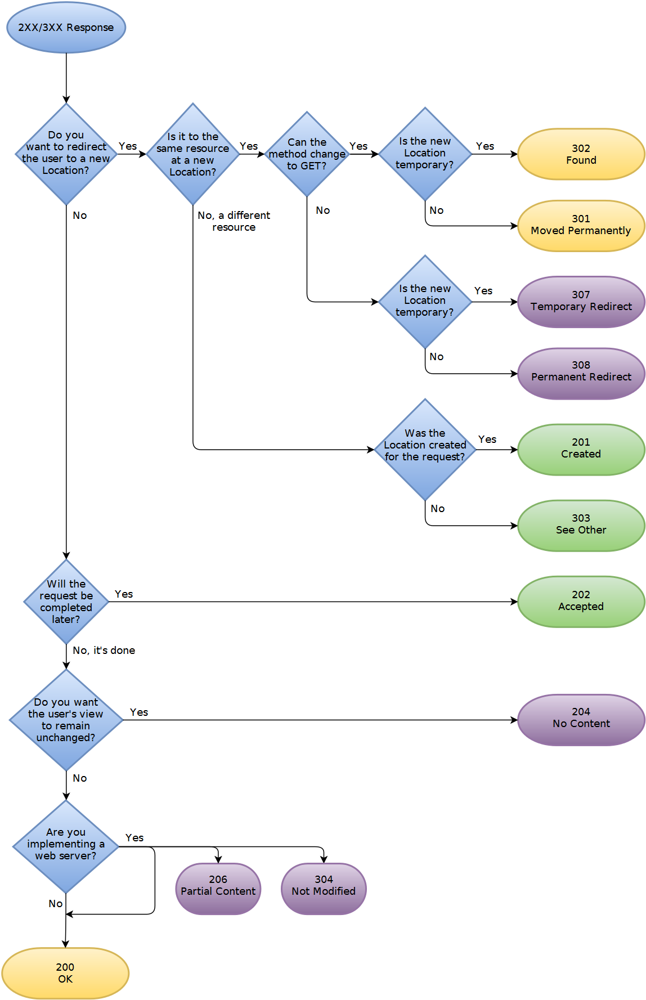

|              상태 코드             | 설명                                                              |
|:------------------------------:|:----------------------------------------------------------------|
|             200 OK             | 요청 성공                                                           |
|           201 Created          | 요청 성공해서 새로운 리소스 생성                                              |
|          202 Accepted          | 요청이 접수되었으나 처릭가 완료되지 않았음                                         |
|         204 No Content         | 서버가 요청을 성공적으로 수행했지만, 응답 페이로드 본문에 보낼 데이터가 없음                     |
|      301 Moved Permanently     | 요청한 리소스가 Location 헤더에 주어진 URL로 완전히 이동                           |
|            302 Found           | 클라이언트가 요청한 리소스가 Location 헤더에 주어진 URL에 일시적으로 이동되었음               |
|          303 See Other         | 요청된 URL이 잠시 다른 URL로 변경                                          |
|        304 Not Modified        | 요청된 리소스를 재전송할 필요 X                                              |
|     307 Temporary Redirect     | 클라이언트가 요청한 리소스가 Location 헤더에 주어진 URL에 일시적으로 이동되었음               |
|     308 Permanent Redirect     | 임시가 아니라 영원히 리다이렉트 되었다는 의미, 완전히 이사를 갔으니, 이제 앞으로는 바뀐 링크를 이용해달라는 요청|
|         400 Bad Reques         | 클라이언트가 잘못된 요청을 해서 서버가 요청을 처리할 수 없음                              |
|        401 Unauthorized        | 클라이언트가 해당 리소스에 대한 인증이 필요함                                       |
|          403 Forbidden         | 서버가 요청을 이해했지만 승인을 거부함                                           |
|          404 Not Found         | 요청 리소스를 찾을 수 없음                                                 |
|    500 Internal Server Error   | 서버 문제로 오류 발생                                                    |
|503 Service Unavailable | 서비스 이용 불가                                                       |

## 5절 메세지

> Http Message = 시작줄 + 헤더 + 본문

  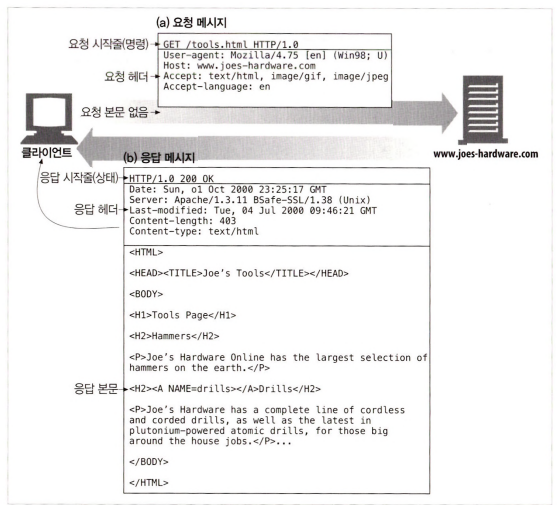

|||
|:---:|:------------------------------------------------------------------------------------------|
| 시작줄 | 요청이나 응답의 상태 &rarr; HTTP 메서드 + 요청 컨텍스트 (URL, 프로토콜, 포트, 도메인 절대 경로) + HTTP 버전                |
| 헤더  | 요청을 지정하거나 메세지에 포함된 본문을 설명하는 헤더 집합                                                         |
| 빈 줄 | 헤더와 본문을 구분하는 빈 줄                                                                          |
| 본문  | 요청, 응답에 관련된 데이터 &rarr; 단일-리소스 본문(Content-Type + Content-Length) + 다중-리소스 본문(보통 HTML form) |

## 6절 TCP 커넥션

- TCP 기능
  - 오류 없는 데이터 전송
  - 순서에 맞는 전달 &rarr; 데이터는 언제나 보낸 순서대로 도착
  - 조각나지 않는 데이터 스트림 &rarr; 언제든 어떤 크기로든 전송 가능

  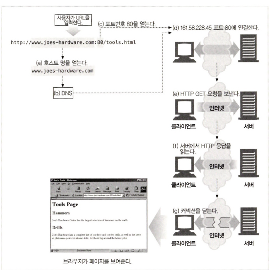 

- HTTP 처리 순서
1. 웹브라우저는 서버의 URL에서 호스트 명을 추출  
2. 웹브라우저는 서버의 호스트 명을 IP로 변환  
3. 웹브라우저는 URL에서 포트번호(있다면)를 추출  
4. 웹브라우저는 웹 서버와 TCP 커넥션  
5. 웹브라우저는 서버에 HTTP 요청 전송  
6. 서버는 웹브라우저 에 HTTP 응답 반환  
7. 커넥션이 닫히면, 웹브라우저는 문서 렌더링

## 7절 프로토콜 버전

### HTTP/0.9
- 단순한 클라이언트-서버, 요청-응답 프로토콜에 사용
- GET만 지원
- 메서드 + 경로로만 요청
- 하이퍼텍스트 타입 응답
- HTTP 헤더 X &rarr; MIME 타입 설정 불가능하여 다른 컨텐츠 유형 파일(이미지, 동영상, 파일 등) 전송 불가능
- URL X
- 상태/오류코드 X

### HTTP/1.0
- HTTP 헤더 도입
- GET, POST, HEAD 지원
- HTTP 프로토콜 버전 도입

### HTTP/1.1
- 지속적인 연결 가능
- 지원되는 메서드 : GET, HEAD, POST< DELETE, TRACE, OPTIONS
- 파이프라이닝, 컨텐츠 협상, 캐시 제어 도입
  - 파이프라이닝 : 첫 번째 요청에 대한 응답 받기 전에 두 번째 요청 전송 가능
  - 컨텐츠 협상 : 클라이언트-서버에서 어떠한 타입의 리소스를 교환할 것인지 정하는 방법
  - 캐시 제어 : 요청 및 응답에서 캐시 정책 수행
  
### HTTP/2.0
- 멀티플렉싱 요청

|            HTTP/1.1            |            HTTP/2.0            |
|:------------------------------:|:------------------------------:|
|  |  |

- 바이너리 프로토콜 : 모든 데이터는 0과 1, 바이너리로 표현되는 프레임 &rarr; 속도와 보안 향상
- 서버 푸시 : 클라이언트가 서버에 요청하기도 전에 서버는 필요한 리소스를 예상하여 미리 클라이언트에 응답
- 헤더 압축 : 중복되는 헤더 프레임 압축 &rarr; HPACK 표준으로 헤더 압축
  - HPACK : 서버로 전송되기 전에 각 헤더의 값을 압축한 다음 전체 헤더 정보를 재구성하기 위해 이전에 전송된 헤더 값 목록에서 인코딩 정보를 찾음
    

      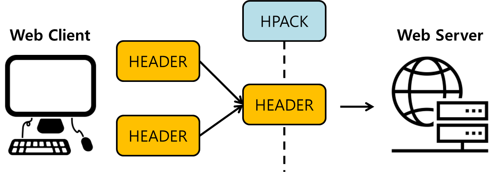
    

## 8절 웹의 구성 요소

