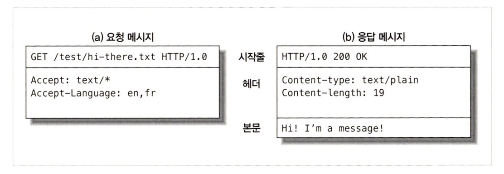
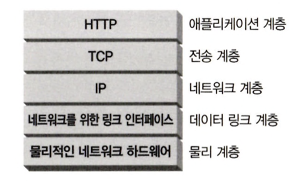

# 1장

### 1.1 ~ 1.2 : 간단한 HTTP 동작 방식

- ‘신뢰성 있는 데이터 전송 프로토콜’ : 통신의 안정성 보장
- 클라이언트(요청) - 서버(응답) 구조 : (웹 리소스) 요청, 연결 이후 응답 대기

 

### 1.3.1 : 미디어 타입(MIME)

Multipurpose Internet Mail Extensions : 전자메일 시스템 데이터 형식 포맷

- HTTP에서 멀티미디어 콘텐츠 기술, 라벨을 붙이기 위해 채택
- 웹 브라우저에서 응답 받은 객체를 확인 할 때 이용
  - HTML → text/html
  - JPEG → image/jpeg

 

### 1.3.2 ~ 1.3.4 : URI, URL, URN

Uniform resource **Identifier** : URI를 통해 리소스를 찾아올 수 있다.

- URL : **(Locator)** 리소스의 구체적인 위치, 접근 방법 표현
  - http://www.joes-hardware.com/specials/saw-blade.gif
    1. Scheme : 리소스 접근 프로토콜
    2. 서버 주소
    3. 웹 서버의 리소스
- URN : **(Name)**

 

### 1.4 : HTTP 트랜잭션

요청 명령과 응답 결과 과정

 

### 1.4.1 : HTTP 메서드

| HTTP 메서드 | 내용                                                                                                         |
| ----------- | ------------------------------------------------------------------------------------------------------------ |
| GET         | GET 메서드는 특정 리소스의 표시를 요청합니다. GET을 사용하는 요청은 오직 데이터를 받기만 합니다.             |
| HEAD        | HEAD 메서드는 GET 메서드의 요청과 동일한 응답을 요구하지만, 응답 본문을 포함하지 않습니다.                   |
| POST        | POST 메서드는 특정 리소스에 엔티티를 제출할 때 쓰입니다. 이는 종종 서버의 상태의 변화나 부작용을 일으킵니다. |
| PUT         | PUT 메서드는 목적 리소스 모든 현재 표시를 요청 payload로 바꿉니다.                                           |
| DELETE      | DELETE 메서드는 특정 리소스를 삭제합니다.                                                                    |
| CONNECT     | CONNECT 메서드는 목적 리소스로 식별되는 서버로의 터널을 맺습니다.                                            |
| OPTIONS     | OPTIONS 메서드는 목적 리소스의 통신을 설정하는 데 쓰입니다.                                                  |
| TRACE       | TRACE 메서드는 목적 리소스의 경로를 따라 메시지 loop-back 테스트를 합니다.                                   |
| PATCH       | PATCH 메서드는 리소스의 부분만을 수정하는 데 쓰입니다.                                                       |

요청 명령 메세지가 갖는 동작

([https://developer.mozilla.org/ko/docs/Web/HTTP/Methods](https://developer.mozilla.org/ko/docs/Web/HTTP/Methods))

 

### 1.4.2 : 상태코드

요청이 성공적으로 완료되었는지 알려준다.

([https://developer.mozilla.org/ko/docs/Web/HTTP/Status](https://developer.mozilla.org/ko/docs/Web/HTTP/Status))

 

### 1.5 : 메시지

- 시작줄
  - 요청 → 요청내용
  - 응답 → 일어난 결과
- 헤더 : (**이름 : 값**)
- 본문 : 문자열 뿐만 아니라 이진 데이터(이미지, 비디오 등) 포함 가능
  - 요청 → 데이터 서버로 보냄
  - 응답 → 클라이언트로 데이터 반환

 

### 1.6 : TCP 커넥션

Transmission Control Protocol

 

### 1.6.1 : TCP/IP

HTTP는 ‘어플리케이션 계층’ 프로토콜 → 세부적인 네트워크 통신 구성은 TCP/IP에 맡김

**TCP가 제공하는 부분**

- 오류 없는 데이터 전송
- 보낸 순서대로 데이터 전달
- 조각나지 않는 데이터 스트림

**TCP/IP**

- TCP와 IP가 층을 이루는, 패킷 교환 네트워크 프로토콜의 집합
- 네트워크와 하드웨어 특성을 숨기고, 신뢰성 있는 의사소통 제공

 

### 1.6.2 : 접속, IP주소, 포트번호

클라이언트가 서버에 메시지를 전송 할 수 있게 하기 전, Internet Protocol 주소와 포트번호를 사용해 클라이언트-서버간의 TCP/IP 커넥션을 맺는다.

- IP 주소와 포트 번호는 URL을 이용한다.
  - http://207.200.83.29:80/index.html
  - http://www.netscape.com:80/index.html
- 글자로 된 도메인 이름(Domain Name Service) : IP를 쉽게 변환해준다.
- 커넥션을 맺고 ⇒ HTTP 트랜잭션이 완료 ⇒ 커넥션을 닫고 문서 보여줌

 

### 1.7 : 프로토콜 버전

| HTTP/0.9          | HTTP/1.0                                         | HTTP/1.0+                                            | HTTP/1.1                                 | HTTP/2.0                              |
| ----------------- | ------------------------------------------------ | ---------------------------------------------------- | ---------------------------------------- | ------------------------------------- |
| GET 메서드만 지원 | HTTP헤더, 추가 메서드, 멀티미디어 객체 처리 추가 | ‘keep-alive’ 커넥션, 가상 호스팅, proxy 연결 지원 등 | 결함 고정, 성능 최적화, 잘못된 기능 제거 | SPDY 프로토콜 기반으로 성능 문제 개선 |

 

### 1.8.1 : Proxy

클라이언트 서버 사이에 위치하여 HTTP 요청과 응답을 중재.

- 성능 최적화, 어플리케이션 통합, 보안, 요청 응답 필터링

 

### 1.8.2 : Cache

클라이언트가 같은 문서를 요청하면 사본을 받을 수 있게 저장 해둔다.

- 빠른 다운로드, 컨텐츠 캐싱, 정보 보호

 

### 1.8.3 : Gateway

HTTP 트래픽을 다른 프로토콜로 변환하기 위해 사용 (진짜 서버인척 요청을 다룸)

 

### 1.8.4 : Tunnel

raw 데이터를 열어보지 않고 그대로 전달해줌. 비 HTTP 데이터를 하나 이상의 HTTP 연결을 통해 그대로 전송해주기 위해 사용

 

### 1.8.5 : Agent

User Agent, 사용자를 위해 HTTP 요청을 만들어주는 클라이언트 프로그램 (웹 브라우저가 대표적).
