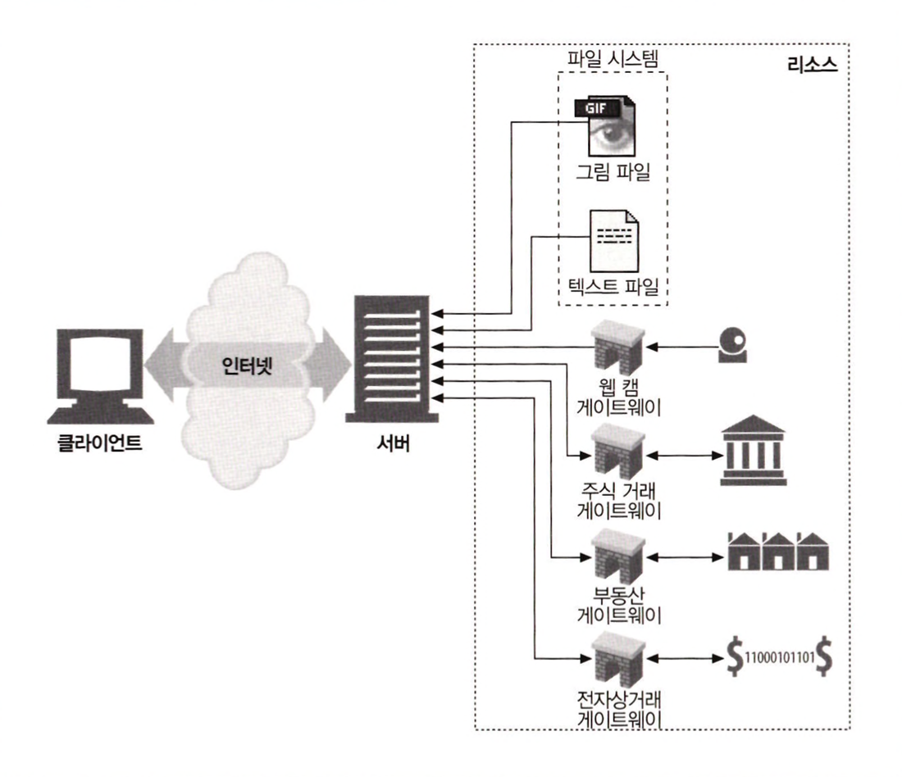

# 1장 HTTP 개관

## 1.1 HTTP: 인터넷의 멀티미디어 배달부

HTTP는 전 세계의 웹 서버로 부터 대량의 정보를 빠르고, 간편하고, 정확하게 사람들의 PC에 설치된 웹브라우저로 옮겨준다.

HTTP는 **신뢰성 있는 데이터 전송 프로토콜**을 사용하기 때문에 개발자는 HTTP 통신이 전송 중 파괴되거나, 중복되거나, 왜곡되는 것을 걱정하지 않아도 된다.

개발자는 인터넷의 결함이나 약점에 대한 걱정 없이 애플리케이션 고유의 기능을 구현하는데 집중할 수 있다.

## 1.2 웹 클라이언트와 서버

HTTP 클라이언트와 HTTP 서버는 월드 와이드 웹의 기본 요소이다.

- **HTTP 서버 ( = 웹 서버)**
    - 웹 서버는 인터넷의 데이터를 저장하고, HTTP 클라이언트가 요청한 데이터를 제공한다.
- **HTTP 클라이언트**
    - 마이크로소프트 인터넷 익스플러러나 구글 크롬 같은 웹브라우저
    - 웹 브라우저는 서버에서 HTTP 객체를 요청하고 사용자의 화면에 보여준다.

1. 웹브라우저는 HTTP 요청을 [www.oreilly.com](http://www.oreilly.com) 서버로 보낸다.
2. 서버는 요청 받은 객체(”/index.html”)을 찾고, 성공했다면 그것의 타입, 길이 등의 정보와 함께 HTTP 응답에 실어서 클라이언트에게 보낸다.

## 1.3 리소스

웹 서버는 웹 리소스를 관리하고 제공한다.

- **정적 파일**
    - 텍스트 파일, HTML 파일, JPEG 이미지 파일 등
- **동적 콘텐츠 리소스**
    - 사용자가 누구인지, 어떤 정보를 요청했는지, 몇 시인지에 따라 다른 콘텐츠를 생성한다.
    - 카메라 라이브 영상, 주식 거래, 부동산 테이터베이스 검색

### 1.3.1 미디어 타입

- MIME (Multipurpose Internet Mail Extensions)
    - 웹 서버는 모든 HTTP 객체 데이터에 MIME 타입을 붙인다.
    - 웹 브라우저는 서버로 부터 객체를 돌려받을 때, 다룰 수 있는 객체인지 MIME 타입을 통해 확인한다.
    - 사선(/)으로 구분된 주 타입(primary object type)과 부 타입(specific subtype)으로 이루어진 문자열 라벨이다.

### 1.3.2 URI

- 통합 자원 식별자 (uniform resource identifier)
    - 인터넷의 우편물 주소와 같이, 정보 리소스를 고유하게 식별하고 위치를 지정할 수 있다.
    - URI에는 URL과 URN이 있다.

### 1.3.3 URL

- 통합 자원 지시자 (uniform resource locator)
    - 리소스 식별자의 가장 흔한 형태이다.
    - 특정 서버의 한 리소스에 대한 구체적인 위치를 서술한다.
    - 대부분의 URL은 세 부분으로 이루어진 표준 포맷을 따른다.
        

### 1.3.4 URN

- 유니폼 리소스 이름(uniform resource name)
    - 콘텐츠를 이루는 한 리소스에 대해, 그 리소스의 위치에 영향을 받지 않는 유일무이한 이름 역할을 한다.
    - 리소스를 여기저기로 옮기더라도 문제없이 동작한다.

## 1.4 트랜젝션

HTTP 트랜젝션은 요청 명령(클라이언트 → 서버)와 응답 결과(서버 → 클라이언트)로 구성되어 있다.

이 상호작용은 **HTTP 메세지**라고 불리는 정형화된 데이터 덩어리를 이용해 이루어진다.

### 1.4.1 메서드

HTTP 메서드는 서버에게 어떤 동작이 취해져야 하는지 말해준다. 

아래는 흔히 쓰는 HTTP 메서드 종류이다.

### 1.4.2 상태 코드

모든 HTTP 응답 메세지는 상태 코드와 함께 반환된다.

**상태 코드**는 클라이언트에게 요청이 성공했는지 아니면 추가 조치가 필요한지 알려주는 세 자리 숫자다.

HTTP는 각 숫자 상태 코드에 텍스트로 된 “**사유 구절(reason phrase)**”도 함께 보낸다.

## 1.5 메시지

HTTP 메시지는 단순한 줄 단위의 문자열이다.

이전 형식이 아닌 일반 텍스트이기 때문에 사람이 읽고 쓰기 쉽다.

- **요청 메시지**
    - 웹 클라이언트에서 웹 서버로 보낸 HTTP 메시지
- **응답 메시지**
    - 서버에서 클라이언트로 가는 메시지

HTTP 메시지는 다음의 세 부분으로 이루어진다.

1. **시작줄**
    
    메시지의 첫 줄은 시작줄로 요청, 응답에 따라 아래의 내용을 나타낸다.
    
    요청 - 무엇을 해야하는지
    
    응답 - 무슨 일이 일어났는지
    
2. **헤더**
    
    각 헤더 필드는 쉬운 구문 분석을 위해 쌍점(:)으로 구분되어 있는 하나의 이름과 하나의 값으로 구성된다.
    
    헤더는 빈줄로 끝난다.
    
3. **본문**
    
    빈 줄 다음에는 어떤 종류의 데이터든 들어갈 수 이는 메시지 본문이 필요에 따라 올 수 있다.
    
    본문은 시작줄이나 헤더와 달리, 본문은 텍스트뿐만 아니라 임의의 이진 데이터를 포함할 수  있다.
    
    요청 분문 - 웹 서버로 데이터를 실어 보낸다.
    
    응답 본문 - 클라이언트로 데이터를 반환한다.
    

## 1.6 TCP 커넥션

### 1.6.1 TCP/IP

HTTP는 애플리케이션 계층 프로토콜이다. HTTP는 네트워크 통신의 핵심적인 세부사항에 대해서 신경쓰지 않는다.

대신 대중적으로 신뢰성 있는 인터넷 전공 프로토콜인 TCP/IP에 밑긴다.

TCP는 다음을 제공한다.

- 오류 없는 데이터 전송
- 순서에 맞는 전달 (데이터는 언제나 보낸 순서대로 도착한다.)
- 조각나지 않는 데이터 스트림 (언제든 어떤 크기로 보낼 수 있다.)

TCP/IP는 TCP와 IP가 층을 이루는, 패킷 교환 네트워크 프로토콜의 집합이다.

TCP/IP는 각 네트워크와 하드웨어의 특성을 숨기고, 어떤 종류의 컴퓨터나 네트워크든 서로 신뢰성 있는 의사소통을 하게 해준다.

HTTP 프로토콜은 TCP 위의 계층이다. HTTP는 자신의 메시지 데이터를 전송하기 위해 TCP를 사용한다.

### 1.6.2 접속, IP 주소 그리고 포트 번호

HTTP 클라이언트가 서버에 메시지를 전송할 수 있게 되기 전에, 인터넷 프로토콜(Internet protocol, IP) 주소와 포트번호를 사용해 클라이언트와 서버 사이에 TCP/IP 커넥션을 맺어야 한다.

TCP에는 서버 컴퓨터에 대한 IP 주소와 그 서버에서 실행 중인 프로그램이 사용 중인 포트 번호가 필요하다.

웹브라우저 연결의 기본적인 절차는 다음과 같다.

(a) 웹 브라우저는  서버의 URL에서 호스트 명을 추출한다.

(b) 웹 브라우저는 서버의 호스트 명을 IP로 변환한다.

(c) 웹 브라우저는 URL에서 포트번호를 추출한다.

(d) 웹 브라우저는 웹 서버와 TCP 커넥션을 맺는다.

(e) 웹 브라우저는 서버에 HTTP 요청을 보낸다.

(f) 서버는 웹 브라우저에 HTTP 응답을 돌려준다.

(g) 커넥션이 닫히면, 웹 브라우저는 문서를 보여준다.

## 1.7 웹의 구성요소

### 1.7.1  프락시

프락시는 클라이언트와 서버 사이에 위치하여, 클라이언트의 모든 HTTP 요청을 받아 서버에 전달한다.

프락시는 주로 보안을 위해 사용된다. 즉, 모든 웹 트래픽 흐름 속에서 신뢰할 만한 중개자 역할을 한다.

요청과 응답을 필터링한다.

### 1.7.2 캐시

웹캐시와 캐시 플락시는 자신을 거쳐 가는 문서들 중 자주 찾는 것의 사본을 저장해 두는, 특별한 종류의 HTTP 프락시 서버다.

클라이언트는 멀리 떨어진 웹 서버보다 근처의 캐시에서 훨씬 더 빨리 문서를 다운받을 수 있다.

### 1.7.3 게이트웨이

게이트 웨이는 다른 서버들의 중개자로 동작한 특별한 서버다.

게이트 웨이는 주로 HTTP 트래픽을 다른 프로토콜로 변환하기 위해 사용된다.

예를 들어, HTTP/FTP 게이트웨이는 FTP URI에 대한 HTTP 요청을 받아들인 뒤, FTP 프로토콜을 이용해 문서를 가져온다. 받아온 문서는 HTTP 메시지에 담겨 클라이언트에게 보낸다.

### 1.7.4 터널

터널은 두 커넥션 사이에서 날 데이터를 열어보지 않고 그대로 전달해주는 HTTP 애플리케이션이다.

HTTP 터널은 주로 비 HTTP 데이터를 하나 이상의 HTTP 연결을 통해서 그대로 전송해주기 위해 사용된다.

예를 들어, HTTP/SSL 터널은 HTTP 요청을 받아들여 목적지의 주소와 포트번호로 커넥션을 맺는다. 이후부터는 암호화된 SSL 트래픽을 HTTP 채널을 통해 목적지 서버로 전송할 수 있게 된다.

### 1.7.5 에이전트

사용자 에이전트는 사용자를 위해 HTTP 요청을 만들어주는 클라이언트 프로그램이다.

예를 들어, 사람의 통제없이 스스로 웹을 돌아다니며 HTTP 트렌젝션을 일으키고 콘텐츠를 받아오는 자동화된 사용자 에이전트가 있다.
