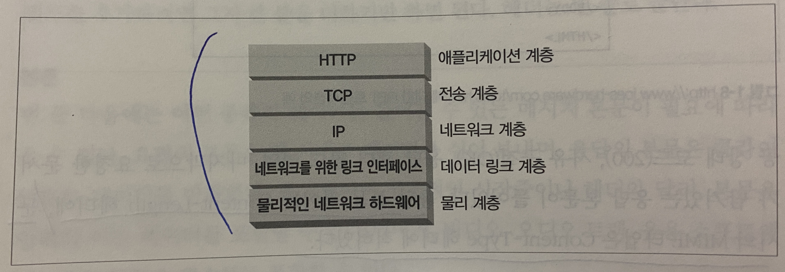

 

단락 번호는 책 내용 위치 참고를 위한 것입니다

 

### 1.3.1 미디어 타입
HTTP는 웹에서 전송되는 객체 각각에 `MIME(Multipurpose Internet Mail Extension) 타입`이라는 데이터 포맷 라벨을 붙인다.  
MIME은 이름에서 알 수 있듯 이메일에서 사용되던 것으로, HTTP에서도 멀티미디어 콘텐츠를 기술하고 라벨을 붙이기 위해 채택됐다.  

웹브라우저는 이 MIME 타입을 통해 서버에서 받은 객체가 다룰 수 있는 객체인지를 판단한다.

> **MEME TYPE 형식**  
> 주 타입 / 부 타입  
> ex. text/html, text/plain(plain ASCII 텍스트 문서), image/jpeg, video/quicktime,..

 

### 1.3.2 URI (Uniform Resource Identifier)
URI는 인터넷의 우편물 주소 같은 것. 리소스를 고유하게 식별하고 위치를 지정할 수 있게함.

 

### 1.3.3 URL (Uniform Resource Locator)
URI의 한 종류. 특정 서버의 한 리소스가 어떤 위치에 있는지 구체적으로 서술한다.

> ex)  
> http:// **(스킴-사용되는 프로토콜을 서술)** www.joes-hardware.com **(서버의 인터넷 주소를 제공)** /specials/saw-blade.gif **(웹 서버의 리소스를 가리킴)**

오늘날 대부분의 URI = URL

 

### 1.3.4 URN (Uniform Resource Name)
URI의 한 종류. 리소스 위치에 영향 받지 않는 유일무이한 이름의 역할.  
리소스가 그 이름을 변하지 않게 유지하는 한, 여러 종류의 네트워크 프로토콜로 접근해도 문제가 없다.

> ex)  
> urn:ietf:rfc:2141

그러나 URN은 여전히 실험 중인 상태.

 

### 1.4 트랜잭션

HTTP 트랜잭션은 요청 명령과 응답 결과로 구성된다.  
HTTP 메서드 종류 - GET, PUT, DELETE, POST, HEAD

> HEAD?  
> 지정한 리소스에 대한 응답에서 HTTP 헤더 부분만 보내라는 뜻의 메서드

하나의 웹페이지는 대량의 HTTP 트랜잭션을 필요로 한다.

 

#### 1.6.1 TCP/IP
HTTP는 애플리케이션 계층 프로토콜로, 네트워크 통신의 세부사항에 대해서는 신경쓰지 않는다.  
이런 세부사항은 인터넷 전송 프로토콜인 TCP/IP에 맡긴다.

> TCP가 제공하는 것?
> - 오류 없이
> - 순서대로
> - 언제든 어떤 크기로든 전송 가능

TCP/IP는 TCP와 IP가 층을 이루는 `패킷 교환 네트워크 프로토콜`의 집합이다.  
TCP/IP는 네트워크와 하드웨어의 특성을 숨기고, 어떤 종류의 컴퓨터나 네트워크든 서로 신뢰성 있는 의사소통을 하게 해준다.  

    

 

### 1.6.2 접속, IP 주소 그리고 포트번호

1) URL에서 호스트 명 추출
2) 호스트 명을 IP로 변환 (via DNS)
3) 포트번호를 추출(없다면 80이 default)
4) 웹브라우저와 웹서버가 TCP 커넥션을 맺음
5) 요청을 보냄
6) 응답을 보냄

 

### 1.7 프로토콜 버전
현재 우리가 보편적으로 사용하는 HTTP는 HTTP/1.1로 HTTP/1.0+에서 추가된 keep-alive 커넥션과 그 외 많은 성능 최적화가 이뤄진 버전이다.  
일반적으로 현재 REST API는 이 HTTP/1.1을 기반으로 한다.  
한편 몇 년 전부터 떠오르는 HTTP/2 기반의 [gRPC](https://grpc.io/docs/what-is-grpc/)도 있다. (HTTP/2는 내부적으로 구글의 [SPDY](https://d2.naver.com/helloworld/140351) 프로토콜을 기반으로 한다)  
다만 gRPC는 HTTP/2를 기반으로 하고 아직 웹브라우저는 서버와의 통신에서 HTTP/2를 지원하지 않기 때문에, 현재까지는 서버 to 서버 통신의 새로운 대안으로 많이 사용된다.  
REST API에서 통신에 사용하는 데이터 타입인 JSON은 스펙이 루즈한 편이라 serialization/deserialization에 비교적 많은 비용이 든다. 한편 gRPC는 공유되는 protocol buffer를 사용하여 이런 문제를 상당 부분 개선한다.  
 
 

### 1.8 프락시
HTTP 프락시 서버는 웹 보안, 애플리케이션 통합, 성능 최적화 등의 기능을 하는데, 그 중에서도 특히 주로 보안을 위해 사용되며, 요청과 응답을 필터링한다.
 
 

### 1.8.1 캐시
HTTP 프락시 서버의 일종. 성능 향상을 위해 자주 찾는 문서의 사본을 프락시 캐시에 저장해둔다.
 
 

### 1.8.2 게이트웨이
게이트웨이는 다른 서버들의 중개자로 동작하는 특별한 서버다. 주로 HTTP 트래픽을 다른 프로토콜로 변환하는 용도로 사용된다.
 
 

### 1.8.4 터널
터널은 두 커넥션 사이에서 raw 데이터를 열어보지 않고 그대로 전달해주는 HTTP 애플리케이션이다. 주로 비 HTTP 데이터를 하나 이상의 HTTP 연결을 통해 그대로 전송해주기 위해 사용된다.  
대표적 예로, 암호화된 SSL 트래픽을 HTTP 커넥션으로 전송함으로써 웹 트래픽만 허용하는 사내 방화벽을 통과시키는 것이 있다.
 
 

### 1.8.5 에이전트
사용자 에이전트는 사용자를 위해 HTTP 요청을 만들어주는 클라이언트 프로그램이다. 따라서 웹 브라우저는 기본적으로 HTTP 에이전트이며,
그 외에도 사람의 통제 없이 스스로 웹을 돌아다니며 HTTP 트랜잭션을 일으키고 콘텐츠를 받아오는 자동화된 에이전트인 스파이더와 같은 것도 있다.

 

 

`그 외 참고 자료`

https://velog.io/@ruthetum/TCP-UDP
