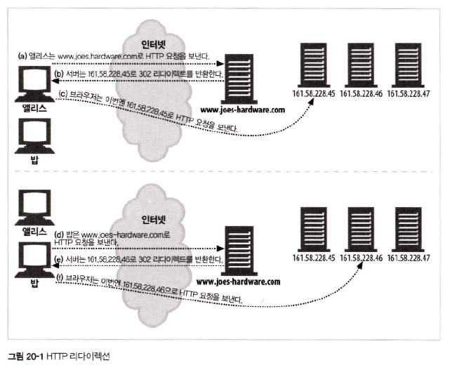
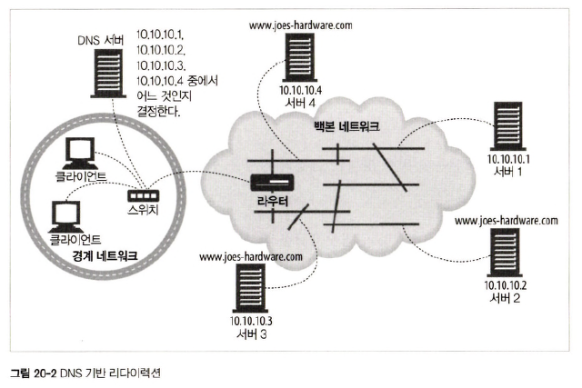
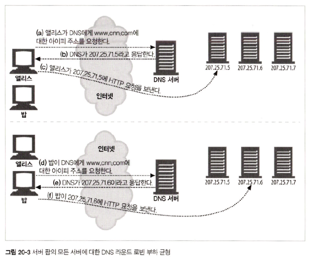
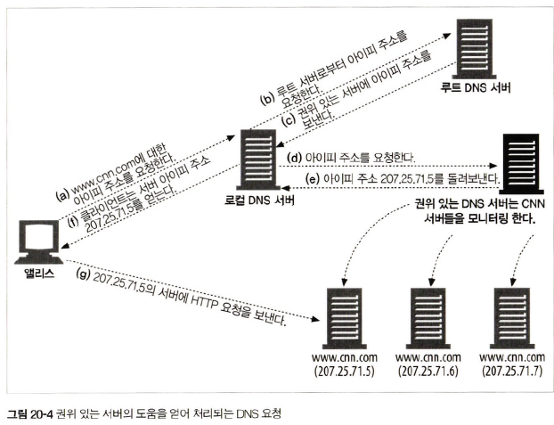
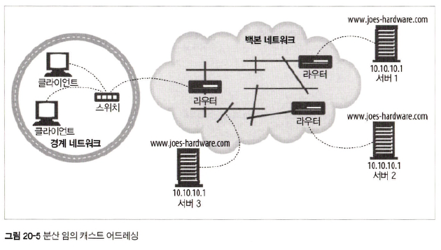

# 20장 리다이렉션과 부하 균형

## 20.4 일반적인 리다이렉션 방법

### 20.4.1 HTTP 리다이렉션

    

### 20.4.2 DNS 리다이렉션

    

1. client &rarr; `www.joes-hardware.com` 접근
2. dns server &rarr; `10.10.10.1`, `10.10.10.2`, `10.10.10.3`, `10.10.10.4` 중 택 1

    

    

### 20.4.3 Anycast Addressing
> Anycast 통신이란, 가장 가까운 Node와 통신하는 방식  
> 즉, 동일한 Anycast Address가 서로 다른 Node들의 Interface에 할당되어 있을 때, 해당 Anycast Address로 IPv6 Packet을 전송하면 가장 가까이 있는 Node로 전달

    

