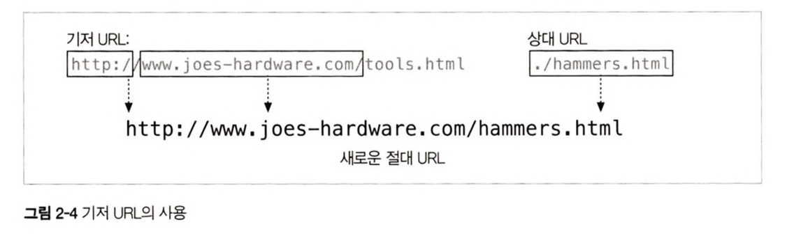
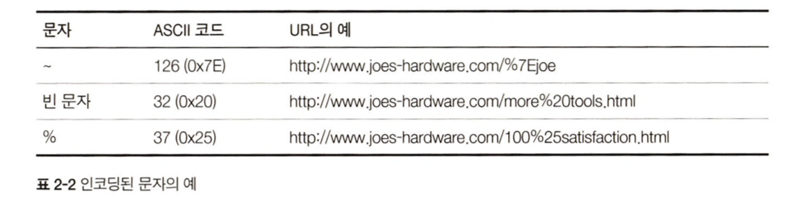

# 2장 URL과 리소스

URL : 리소스 공유를 위해 정보가 어디 있는지 가리키는 ‘표준 이름’

 

## 2.1 : 인터넷의 리소스 탐색하기

URL은 리소스의 **위치**를 가리킨다. ⇒ 정보를 제공한다.

- 브라우저에 URL을 입력하면 브라우저는 리소스를 얻기 위해 HTTP 및 적절한 프로토콜을 사용하여 메시지를 전송한다.
- 리소스를 일관된 방식으로 지칭할 수 있게 하여 어플리케이션이 리소스에 접근 할 수 있는 방법을 제공한다. (스킴://서버위치/경로)

 

## 2.2 : URL 문법

스킴에 따라서 조금씩 바뀌지만 서로 유사한 형식을 가진다.

 

### 2.2.1 : 스킴 - 사용할 프로토콜

- URL을 해석하는 어플리케이션이 어떤 프로토콜을 사용하여 리소스를 요청해야하는지 알려준다.
  - http:// , HTTP:// (알파벳으로 시작, 대소문자 구분 X)

 

### 2.2.2 : 호스트와 포트 컴포넌트

- 리소스를 호스팅 하는 장비와 장비 내 리소스에 접근할 수 있는 서버의 위치를 알려준다
  - ‘www.joes-hardware.com’ , ‘161.58.228.45’ (호스트명, IP 주소) ⇒ 인터넷상 호스트 장비를 가리킴
  - ‘www.joes-hardware.com:80’ (TCP 프로토콜 사용하는 HTTP는 기본 포트로 80 이용)

 

### 2.2.3 : 사용자 이름과 비밀번호

- 서버가 데이터 접근을 허용하기 전에 요구하는 컴포넌트

 

### 2.2.4 : 경로

- 서버가 리소스의 위치를 찾는데 사용하는 정보
  - http://www.joes-hardware.com:80**/seasonal/index-fall.html**

 

### 2.2.5 : 파라미터

- 경로가 가지는 자체 컴포넌트
- 어플리케이션이 서버에 정확한 요청을 하기 위해 필요한 입력 파라미터를 받는데 사용
  - http://www.joes-hardware.com/hammers**;sale=false**/index.html**;graphics=true**
    - hammers → sale=false / index.html → graphics=true

 

### 2.2.6 : 질의 문자열

- 요청받을 리소스 형식의 범위를 좁히기 위해 사용
  - http://www.joes-hardware.com/inventory-check.cgi**?item=12731&color=blue**
    (게이트웨이를 가리키는 URL의 경로 컴포넌트와 함께 전달)

 

### 2.2.7 : 프래그먼트

- HTML 문서의 더 작게 나뉘어진 리소스들의 일부를 가리키기 위해서 사용
  - http://www.joes-hardware.com/tools.html/**#drills**
    (프래그먼트는 서버에 전송하지 않고 전체 리소스를 내려받은 후 보고자하는 일부를 보여줌)

 

## 2.3 : 단축 URL

### 2.3.1: 상대 URL

리소스에 접근하는데 필요한 모든 정보를 base라고 하는 다른 URL을 사용하여 나타낸다. = 짧게 표기하는 방식

- base URL을 사용하면서 프래그먼트나 URL 일부만 사용해도 스킴과 호스트를 알 수 있다.
  ⇒ 리소스 집합을 쉽게 변경 할 수 있다.
- base URL이 없는 경우 절대 URL(리소스 정보 다 표기)을 사용한다.

 

### 2.3.2 : URL 확장

브라우저에 URL 입력 시 자동으로 확장하는 것 ⇒ 빠른 입력을 도와줌

- 호스트 명 확장
  - 단순한 휴리스틱만 사용 : 시간 절약해주지만 프락시에 문제를 야기할 수도 있다.
    - ‘yahoo’ → ‘www.yahoo.com’
- 히스토리 확장
  - 과거에 사용자가 방문했던 URL 기록을 저장해 놓는 것

 

## 2.4 : 안전하지 않은 문자

정보가 유실될 위험 없이 URL 전송 + 가독성 ⇒ 알파벳 이외 문자 포함, 이스케이프 기능을 통한 인코딩

 

### 2.4.1 : URL 문자 집합

기본적으로 US-ASCII 문자 집합 (영어 중심 7비트 사용)

- 다른 언어 지원 X, 특정 이진 데이터 포함 하는 경우 발생 ⇒ 이스케이프 문자열 쓸 수 있게 설계

 

### 2.4.2 : 인코딩 체계

URL에 있는 안전하지 않은 문자들을 표현할 수 있는 인코딩 방식.

 

### 2.4.3 : 문자 제한

URL에서 특별한 의미가 있어 반드시 인코딩해야하는 문자들이 존재한다.

 

### 2.4.4 : 좀 더 알아보기

클라이언트 어플리케이션에서 안전하지 않거나 제한된 문자를 변환하는 것이 좋다. (공유할 수 있는 URL 원형 유지 가능)

⇒ 최초로 URL을 입력받을 수 있는 어플리케이션에서 하는 것이 어떤 문자를 인코딩해야 하는지 결정하기에 가장 좋은 방법이다.

 

## 2.5 : 스킴의 바다

| 스킴             | 설명                                                                                                 |
| ---------------- | ---------------------------------------------------------------------------------------------------- |
| https            | HTTP 커넥션의 양 끝단에서 암호화를 위해 Secure Sockets Layer(SSL)을 사용하는 것                      |
| ftp              | File Transfer Protocol로 서버에 있는 파일의 접근에 이용                                              |
| rtsp, rtspu(UDP) | Real Time Streaming Protocol을 통해서 읽을 수 있는 오디오 및 비디오와 같은 미디어 리소스 식별자이다. |

 

## 2.6 : 미래

URL은 리소스가 옮겨지면 변경해야하는 단점이 있다.

⇒ 객체의 위치와 상관없이 그 객체를 가리키는 실제 객체 이름을 사용하자

⇒ URN (Persistent uniform resource locator를 사용하면 URL로 URN 기능을 제공)

- 리소스의 실제 URL 목록을 관리하고 추적하는 리소스 위치 중개 서버를 두고, 해당 리소스를 우회적으로 제공한다. 클라이언트는 리소스를 가져올 수 있는 영구적인 URL을 요청할 수 있으며, 이 URL은 리소스의 실제 URL로 연결해준다.
  ⇒ 표준화 작업에서 많은 시간이 걸려서 사용이 안되고 있음.
