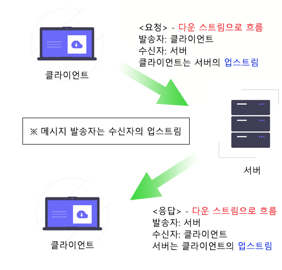
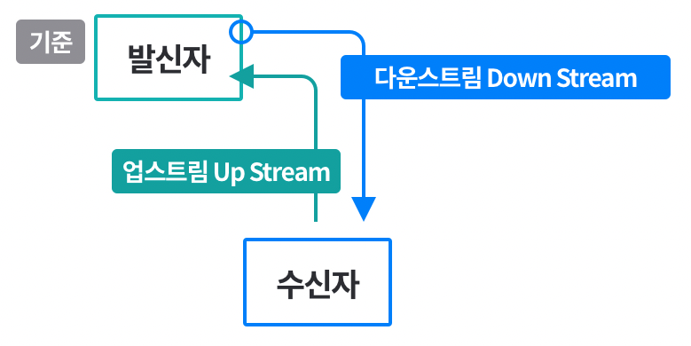
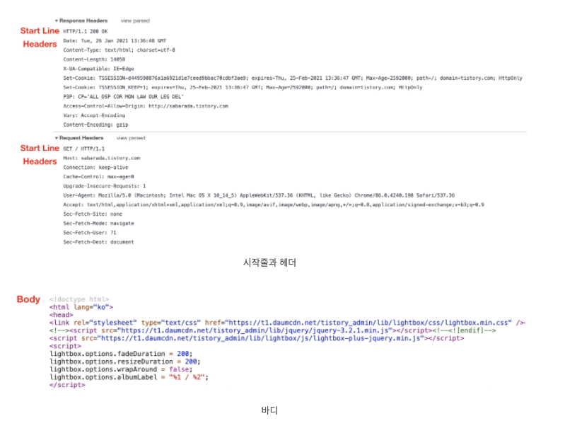
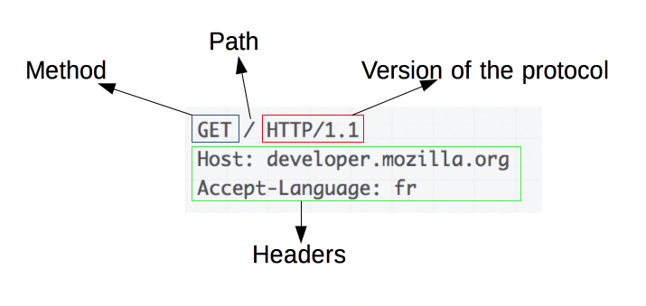
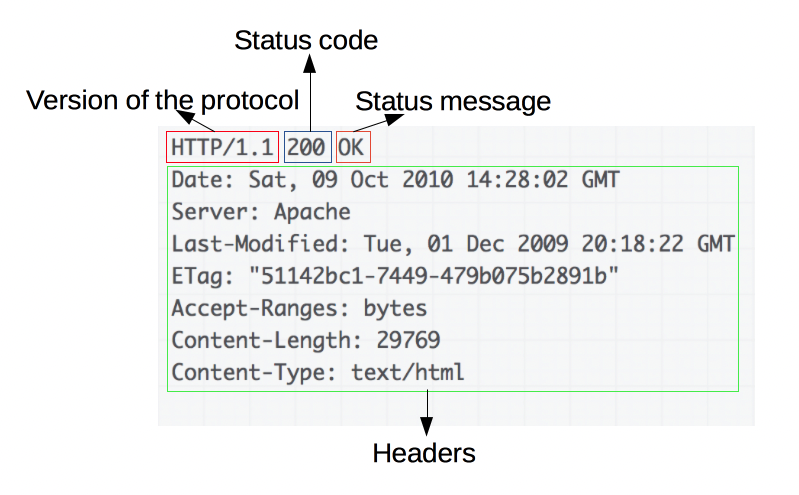

# 3장 HTTP 메시지

## 3.1 메시지의 흐름

> Client &lrarr; Proxy &lrarr; Server by HTTP Message  
> 메시지 방향 = `Inbound`, `Outbound`, `Upstream`, `Downstream`

### 3.1.1 메시지는 원 서버 방향을 인바운드로 하여 송신된다

    

- `Inbound` : 서버 방향
- `Outbound` : 사용자 에이전트 방향

### 다운스트림으로 흐르는 메시지

    
    

- 모든 메시지(= `요청 메시지` + `응답 메시지`) &rarr; `Downstream`
- 메시지 `발송자` = `수신자의 Upstream`

## 3.2 메시지의 각 부분

> HTTP Message = 시작줄 + 헤더 + 바디

    

### 3.2.1 메시지 문법

|요청 메시지|응답 메시지|
|:-----:|:------:|
||

|부분|설명|
|:----:|:-----|
|**메서드**|클라이언트 측에서 서버가 **리소스에 대해 수행**해주길 바라는 동작|
|**요청 URL**|요청 대상이 되는 **리소스를 지칭**하는 완전한 URL, URL 경로 구성 요소|
|**버전**|해당 메시지에서 사용중인 **HTTP 버전**|
|**상태 코드**|요청 중에 **무엇이 일어났는지** 설명하는 3 자리 숫자|
|**사유 구절(reason-phrase)**|숫자로 된 **상태 코드의 의미**를 사람이 이해할 수 있도록 설명해주는 짧은 문구|
|**헤더**|**서버에 대한 추가 정보**를 전달하는 선택적 헤더|

### 3.2.2 시작줄

## 참고 자료

[HTTP 완벽 가이드 3장 HTTP 메시지](https://blog.naver.com/PostView.naver?blogId=dudu1104&logNo=222541964448&parentCategoryNo=&categoryNo=47&viewDate=&isShowPopularPosts=true&from=search)

[HTTP 메시지란?](https://velog.io/@gparkkii/HTTPMessage)