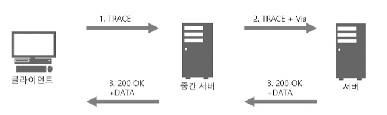
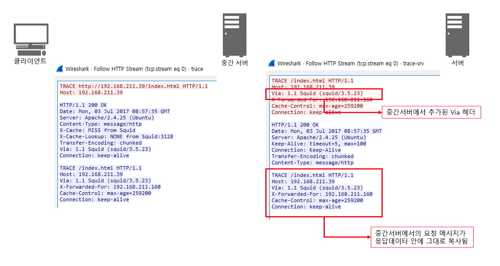
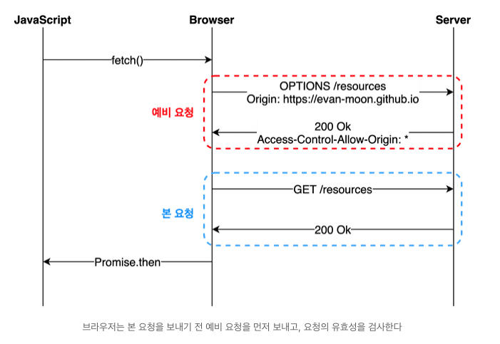

# 3장 HTTP 메시지

## 3.1 메시지의 흐름

> Client &lrarr; Proxy &lrarr; Server by HTTP Message  
> 메시지 방향 = `Inbound`, `Outbound`, `Upstream`, `Downstream`

### 3.1.1 메시지는 원 서버 방향을 인바운드로 하여 송신된다

<div align="center">
    
</div>

- `Inbound` : 서버 방향
- `Outbound` : 사용자 에이전트 방향

### 3.1.2 다운스트림으로 흐르는 메시지

<div align="center" style="display:flex;">
    
    
</div>

- 모든 메시지(= `요청 메시지` + `응답 메시지`) &rarr; `Downstream`
- 메시지 `발송자` = `수신자의 Upstream`

<br>

## 3.2 메시지의 각 부분

> HTTP 메시지 = 시작줄 + 헤더 + 바디

<div align="center">
    
</div>

### 3.2.1 메시지 문법

|요청 메시지|응답 메시지|
|:-----:|:------:|
||

|부분|<div align="center">설명</div>|
|:----:|:-----|
|**메서드**|클라이언트 측에서 서버가 **리소스에 대해 수행**해주길 바라는 동작|
|**요청 URL**|요청 대상이 되는 **리소스를 지칭**하는 완전한 URL, URL 경로 구성 요소|
|**버전**|해당 메시지에서 사용중인 **HTTP 버전**|
|**상태 코드**|요청 중에 **무엇이 일어났는지** 설명하는 3 자리 숫자|
|**사유 구절(reason-phrase)**|숫자로 된 **상태 코드의 의미**를 사람이 이해할 수 있도록 설명해주는 짧은 문구|
|**헤더**|**서버에 대한 추가 정보**를 전달하는 선택적 헤더|

### 3.2.2 시작줄

> 모든 HTTP 메시지는 시작줄로 시작  
> 요청 메시지의 시작줄 : 무엇을 해야 하는지  
> 응답 메시지의 시작줄 : 무슨 일이 일어났는지

#### HTTP 메서드 종류

|   메서드   | <div align="center">설명</div>                                           |
|:-------:|:--------------------------------------------|
|   GET   | 리소스 조회                                      |
|  POST   | 요청 데이터 처리, 주로 데이터 등록에 사용                    |
|   PUT   | 리소스를 대체, 해당 리소스가 없으면 생성                     |
|  PATCH  | 리소스 일부만 변경                                  |
| DELETE  | 리소스 삭제                                      |
|  HEAD   | GET과 동일하지만 메세지 부분을 제외하고 상태 줄과 헤더만 반환        |
| OPTIONS | 대상 리소스에 대한 통신 가능한 옵션 조회 &rarr; 주로 CORS에서 사용 |
| CONNECT | 대상 자원으로 식별되는 서버에 대한 터널 설정                   |
|  TRACE  | 대상 리소스에 대한 경로를 따라 메세지 루프백 테스트 수행            |

#### 사유 구절

> 상태 코드에 대한 설명 ex) `HTTP/1.0 200 OK` &rarr; `사유 구절` : OK

#### 버전 번호

> HTTP 어플리케이션이 따르는 프로토콜 버전 

- 버전 비교할 때 분수로 다루지 않고 각각 분리된 숫자로 생각 
- `HTTP/2.22` > `HTTP/2.3` &rarr; 22 > 3

### 3.2.3 헤더

#### 헤더 분류

|분류|<div align="center">설명</div>|
|:----:|:-----|
|일반 헤더|요청과 응답 양쪽 모두 가능|
|요청 헤더|요청에 대한 부가 정보 제공|
|응답 헤더|응답에 대한 부가 정보 제공|
|Entity 헤더|본문 크기와 컨텐츠, 리소스 자체 서술|
|확장 헤더|명세에 정의되지 않은 새로운 헤더|

[[Network] HTTP 헤더의 종류 및 항목](https://gmlwjd9405.github.io/2019/01/28/http-header-types.html)

<br>

## 3.3 메서드

### 3.3.1 안전한 메서드(Safe Method)

|            속성             | <div align="center">설명</div> |
|:-------------------------:|:-----|
|    안전(= Safe Methods)     | 계속해서 메서드를 호출해도 리소스를 변경 X ex) GET |
| 멱등(= Idempotent Methods)  | 메소드를 계속해서 호출해도 같은 결과|
| 캐시 가능(= Cachable Methods) | 캐싱을 해서 데이터를 효율적 조회 가능|


| HTTP 메서드 | 요청에 Body 존재 | 응답에 Body 존재 | 안전  | 멱등  | 캐시 가능 |
|:--------:|:-----------:|:-----------:|:---:|:---:|:-----:|
|   GET    |      X      |      O      |  O  |  O  |   O   |
|   POST   |      O      |      O      |  X  |  X  |   O   |
|   PUT    |      O      |      O      |  X  |  O  |   X   |
|   PATCH    |      O      |      O      |  X  |  X  |   O   |
|   DELETE    |      X      |      O      |  X  |  O  |   X  |
|   HEAD    |      X      |      X      |  O  |  O  |   O   |
|   OPTIONS    |    선택 사항    |      O      |  O  |  O  |   X   |
|   CONNECT    |      O      |      O      |  X  |  X  |  X   |
|   TRACE    |      X      |      O      |  O  |  O  |   X   |

### 3.3.3 HEAD

> GET처럼 행동하지만, 서버는 헤더만 반환  
> 서버 보장 &rarr; 반환되는 헤더 = GET 반환값

|<div align="center">`HEAD` 메서드로 얻는 이점</div>|
|:-------|
|리소스를 가져오지 않고도 그에 대한 정보 파악 가능|
|응답의 상태 코드를 통해 개체가 존재 여부 파악 가능|
|헤더를 확인하여 리소스 변경 여부 파악 가능|

- 예제
  - Web Server **Health Check**
  - check `availability`, `size`, `last modification date of a resource` **without download** by `Content-Length` & `Last-Modified headers`

### 3.3.6 TRACE

> 웹 서버로 가는 네트워크 경로 체크

<div align="center">
    
</div>

```text
1. 클라이언트 -> TRACE 요청
2. Proxy 서버 -> 요청 메시지 + Via 헤더 정보(= Proxy 서버 정보) 전달
3. 웹 서버 -> 클라이언트 요청 메시지 전체를 응답 데이터에 포함하여 전달
4. 클라이언트 -> 클라이언트 Via 정보를 통해 Proxy 정보 확인
```

<div align="center">
    
</div>

### 3.3.7 OPTIONS

> 서버가 지원하는 메서드 종류 요청

[Preflight](https://evan-moon.github.io/2020/05/21/about-cors/) 에서의 `OPTIONS` 메서드 사용 예시

<div align="center">
    
</div>

### 3.3.9 확장 메서드

|메서드|<div align="center">설명</div>|
|:------:|:-------|
|LOCK|사용자가 리소스에 **lock**|
|MKCOL|사용자가 문서를 **생성**할 수 있도록 함|
|COPY|서버 리소스 **복사**|
|MOVE|서버 리소스 **이동**|

<br>

## 3.4 상태 코드

<div align="center">
  
</div>

|              상태 코드             | <div align="center">설명</div>                                                               |
|:------------------------------:|:----------------------------------------------------------------|
|100 Continue|요청의 시작 부분 일부가 받아들여졌으며 클라이언트는 나머지를 계속 이어서 보내야 함. 서버는 반드시 요청을 받아 응답|
|101 Switching Protocols|클라이언트가 Upgrade 헤더에 나열한 것 중 하나로 서버가 프로토콜을 바꾸었음을 의미|
|             200 OK             | 요청 성공                                                           |
|           201 Created          | 요청 성공해서 새로운 리소스 생성                                              |
|          202 Accepted          | 요청이 접수되었으나 처릭가 완료되지 않았음                                         |
|         204 No Content         | 서버가 요청을 성공적으로 수행했지만, 응답 페이로드 본문에 보낼 데이터가 없음                     |
|      301 Moved Permanently     | 요청한 리소스가 Location 헤더에 주어진 URL로 완전히 이동                           |
|            302 Found           | 클라이언트가 요청한 리소스가 Location 헤더에 주어진 URL에 일시적으로 이동되었음               |
|          303 See Other         | 요청된 URL이 잠시 다른 URL로 변경                                          |
|        304 Not Modified        | 요청된 리소스를 재전송할 필요 X                                              |
|     307 Temporary Redirect     | 클라이언트가 요청한 리소스가 Location 헤더에 주어진 URL에 일시적으로 이동되었음               |
|     308 Permanent Redirect     | 임시가 아니라 영원히 리다이렉트 되었다는 의미, 완전히 이사를 갔으니, 이제 앞으로는 바뀐 링크를 이용해달라는 요청|
|         400 Bad Reques         | 클라이언트가 잘못된 요청을 해서 서버가 요청을 처리할 수 없음                              |
|        401 Unauthorized        | 클라이언트가 해당 리소스에 대한 인증이 필요함                                       |
|          403 Forbidden         | 서버가 요청을 이해했지만 승인을 거부함                                           |
|          404 Not Found         | 요청 리소스를 찾을 수 없음                                                 |
|    500 Internal Server Error   | 서버 문제로 오류 발생                                                    |
|503 Service Unavailable | 서비스 이용 불가                                                       |

## 참고 자료

[HTTP 완벽 가이드 3장 HTTP 메시지](https://blog.naver.com/PostView.naver?blogId=dudu1104&logNo=222541964448&parentCategoryNo=&categoryNo=47&viewDate=&isShowPopularPosts=true&from=search)

[HTTP 메시지란?](https://velog.io/@gparkkii/HTTPMessage)

[HTTP HEAD Request Method](https://reqbin.com/Article/HttpHead)

[[HTTP] 프로토콜 강좌#5 HTTP 요청 방식 OPTIONS, HEAD, TRACE](https://withbundo.blogspot.com/2017/07/http-5-http-optionsheadtrace.html)