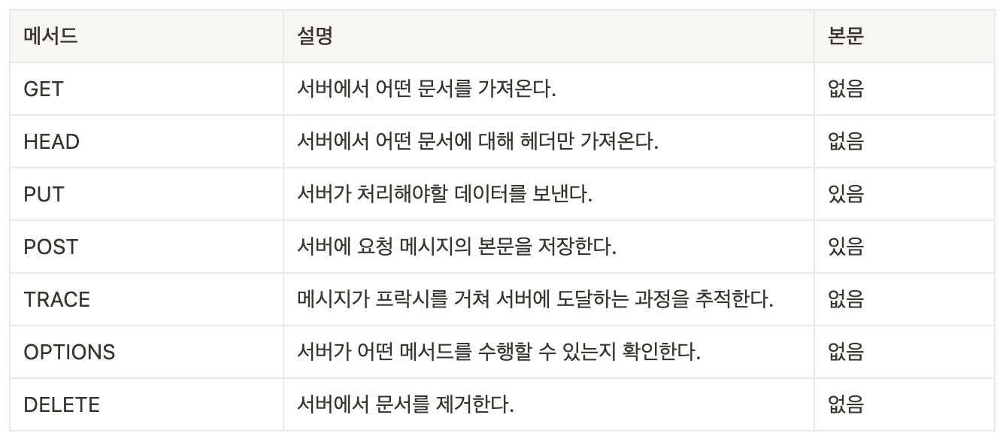
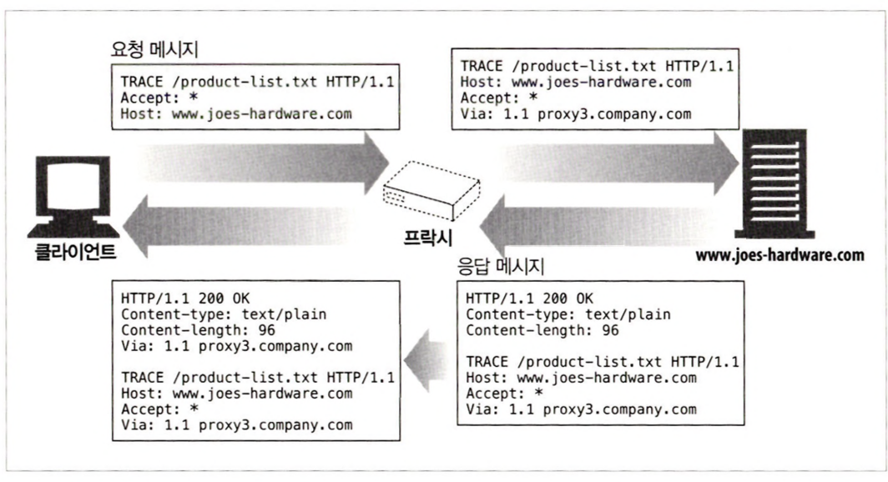
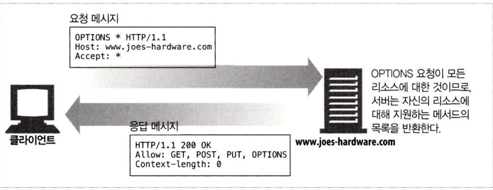
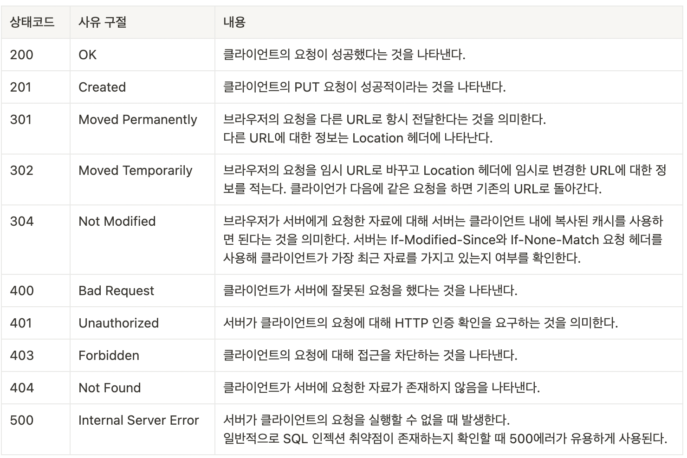

# 3장 HTTP 메시지

## 3.1 메시지의 흐름

HTTP 메시지는 HTTP 애플리케이션 간에 주고받은 데이터 블록이다.

인바운드, 아웃바운드, 업스트림, 다운스트림은 메시지의 방향을 의미하는 용어다.

- 인바운드, 아웃바운드
    - 인바운드, 아웃바운드 : 트렌젝션 방향 표현
    - 인바운드 : 클라이언트 → 서버
    - 아웃바운드 : 서버 → 클라이언트
- 다운스트림, 업스트림
    - 모든 메시지는 다운스트림으로 흐른다.
    - 메시지 발송자는 수신자의 업스트림이다.
    

## 3.2 메시지의 각 부분

메시지는 시작줄, 헤더 블록, 본문 세부분으로 이루어진다.

- 시작줄
    - 어떤 메시지인지 서술한다.
    - 줄 단위로 분리된 아스키 문자열
- 헤더 블록
    - 속성를 담는다.
    - 줄 단위로 분리된 아스키 문자열
- 본문
    - 데이터를 담는다.
    - 시작줄과 헤더와 달리, 텍스트나 이진 데이터 포함 가능

### 3.2.1 메시지 문법

헤더나 엔티티 본문이 없더라도 HTTP 헤더의 집합은 항상 빈줄로 끝나야 한다.

- 요청 메시지 (클라이언트 → 서버)

```jsx
<메서드> <요청 URL> <버전>
<헤더>

<엔디티 본문>
```

- 응답 메시지 (서버 → 클라이언트)

```jsx
<버전> <상태 코드> <사유 구절>
<헤더>

<엔디티 본문>
```

### 3.2.2 시작줄

- 요청줄
    - 메서드 : 서버에서 어떤 동작이 일어난야 하는지 설명
    - 요청 URL : 메서드에 대한 대상을 지정
    - HTTP 버전 : 클라이언가 어떤 HTTP 버전으로 말하고 있는지 서버에게 전달
- 응답줄
    - HTTP 버전
    - 상태 코드
    - 사유 구절

### 3.2.3 헤더

시작줄 다음에는 0개, 1개 혹은 여러 개의 HTTP 헤더가 온다.

HTTP 헤더 필드는 요청과 응답 메시지에 추가 정보를 더한다.

헤더 줄은 추가 줄 앞에 최소 하나의 스페이스 혹은 탭 문자를 붙임으로써 여러 줄로 나눌 수 있다.

- 일반 헤더
    - 요청과 응답 양쪽에 모두 나타날 수 있음
- 요청 헤더
    - 요청에 대한 부가 정보를 제공
- 응답 헤더
    - 응답에 대한 부가 정보를 제공
- Entity 헤더
    - 본문 크기와 콘텐츠 혹은 리소스 그 자체를 서술
- 확장 헤더
    - 명세에 정의되지 않은 새로운 헤더
    

### 3.2.4 엔티티 본문

HTTP 메시지는 이미지, 비디오 HTML 문서 소프트웨어 애플리케이션, 신용카드 트랜젝션, 전자우편 등 여러 종류의 디지털 데이터를 실어 나를 수 있다.

## 3.3 메서드

모든 서버가 모든 메서드를 구현하지는 않는다.

### 3.3.1 안전한 메서드

안전한 메서드의 목적은 서버에 어떤 영향을 줄 수 있는 안전하지 않은 메서드가 사용될 때 사용자들에게 그 사실을 알려주는 HTTP 애플리케이션을 만들 수 있도록 하는 것에 있다.

### 3.3.2 메서드 종류

<div align="center">
    
</div>)

### **PUT**

- 서버가 요청의 본문을 가지고 요청 URL의 이름대로 새 문서를 만들거나 이미 URL이 존재한다면 본문을 사용해서 교체한다.
- PUT은 콘텐츠를 변경할 수 있게 하기 때문에 비밀번호를 입력해 로그인을 해야하는 경우가 있다.

### POST

- 서버에 입력 데이터를 전송하기 위해 설계되었다.
- HTML 폼을 지원하기 위해 흔히 사용된다.

### PUT과 POST의 차이점

- POST
    - 데이터 생성
    - POST는 요청 시 마다, 새로운 리소스가 생성된다.
- PUT
    - 데이터 생성 및 수정
    - PUT은 요청 시 마다, 같은 리소스를 반환한다. (속성만 변경)

POST와 PUT을 여러번 사용했을 때의 반응은 다음과 같다.

- POST
    
    리소스를 생성하기 위한 메서드로 요청한 횟수마다 새로운 리소스를 생성한다.
    

```jsx
post/member
{
    "name":"hyeok"
    "age":26
}

post/member
{
    "name":"hyeok"
    "age":26
}

post/member
{
    "name":"hyeok"
    "age":26
}

HttpResponse
200 OK
{
  "id":1
  "name":"hyeok"
  "age":26
}
HttpResponse
200 OK
{
  "id":2
  "name":"hyeok"
  "age":26
}
HttpResponse
200 OK
{
  "id":3
  "name":"hyeok"
  "age":26
}
```

- PUT
    
    PUT 메서드를 3번 실행해도 처음에 한 번만 생성되고 더 생성되지 않는다.
    

```jsx
put/member/2
{
    "name":"hi",
    "age":2
}
put/member/2
{
    "name":"hi",
    "age":2
}
put/member/2
{
    "name":"hi",
    "age":2
}
200 ok
{"id":2,"name":"hi","age":2}
```

결론 : PUT은 멱등하지만, POST는 멱등하지 않다. (멱등하다 = 여러번 하더라도 결과가 달라지지 않는다)

### TRACE

TRACE 요청방식은 웹서버로 가는 네트워크 경로를 체크하는 메소드이다. 웹서버와 클라이언트 사이에 중간서버(웹프록시 또는 웹캐시서버등)가 존재할 경우 TRACE 방식을 이용하여 확인할 수 있다.

클라이언트가 TRACE로 웹서버에 요청을 하면, 중간서버가 이를 먼저 받고 요청 메시지를 그대로 웹서버로 전달한다. 바로 이때, 클라이언트의 요청 메시지에 Via 헤더 정도를 추가하여 전달하는데 Via에는 중간서버의 정보를 포함하게 된다.

웹서버는 Via가 포함된 클라이언트의 요청메시지를 받게 되면, 요청메시지 전체를 응답데이터에 포함하여 클라이언트에게 전달하게 된다.

클라이언트가 웹서버로부터 전달된 데이터를 받으면, 데이터에 포함된 Via 정보를 통해 경로상에 중간서버가 존재함을 확인하게 된다.

<div align="center">
    
</div>

### OPTIONS

서버에게 특정 리소스에 대해 어떤 메서드가 지원되는지 물어볼 수 있다.

<div align="center">
    
</div>

### 확장 메서드

HTTP는 필요에 따라 확장해도 문제 없도록 설계되어있다.

확장 메서드는 HTTP/1.1에 정의되지 않은 메서드다.

프락시는 종단 간 행위를 망가뜨리지 않을 수 있다면, 알려지지 않은 메서드가 담긴 메시지를 다운스트림 서버로 전달하려고 시도한다. 그렇지 않으면 프락시는 501 Not Implemented 상태 코드를 응답해야한다.

## 3.4 상태코드

- **1xx(정보) :** 요청을 받았으며 프로세스를 계속 진행합니다.
- **2xx(성공) :** 요청을 성공적으로 받았으며 인식했고 수용하였습니다.
- **3xx(리다이렉션) :** 요청 완료를 위해 추가 작업 조치가 필요합니다.
- **4xx(클라이언트 오류) :** 요청의 문법이 잘못되었거나 요청을 처리할 수 없습니다.
- **5xx(서버 오류) :** 서버가 명백히 유효한 요청에 대한 충족을 실패했습니다.

### 주요 상태코드

<div align="center">
    
</div>

## 3.5 헤더

### 3.5.1 일반 헤더

클라이언트와 서버 양쪽 모두가 사용한다. 클라이언트, 서버, 그리고 어딘가에 메시지를 보내는 다른 애플리케이션들을 위해 다양한 목적으로 사용된다. 예를 들어 Date 헤더는 서버와 클라이언트를 가리지 않고 메시지가 만들어진 일시를 지칭하기 위해 사용하는 일반 목적 헤더이다.

### 3.5.2 요청 헤더

서버에게 클라이언트가 받고자하는 데이터의 타입이 무엇인지와 같은 부가 정보를 제공한다.

### 3.5.3 응답 헤더

클라이언트에게 부가 정보를 제공한다.

### 3.5.4 엔티티 헤더

엔터티 본문에 들어있는 데이터 타입이 무엇인지등 엔터디 본문에 대한 헤더이다.

### 3.5.5 확장 헤더

애플리케이션 개발자들에 의해 만들어졌지만 아직 승인된 HTTP 명세서에는 추가되지 않은 비표준 헤더다.

## 참고문헌

[HTTP 상태 코드 정리](https://www.whatap.io/ko/blog/40/)

[HTTP에서 POST와 PUT의 차이점](https://guseowhtjs.tistory.com/entry/HTTP%EC%97%90%EC%84%9C-POST%EC%99%80-PUT%EC%9D%98-%EC%B0%A8%EC%9D%B4%EC%A0%90%EC%9D%80-%EB%AC%B4%EC%97%87%EC%9E%85%EB%8B%88%EA%B9%8C)

[HTTP 요청방식 OPTIONS,HEAD,TRACE](https://withbundo.blogspot.com/2017/07/http-5-http-optionsheadtrace.html)
