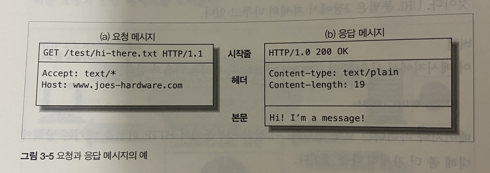
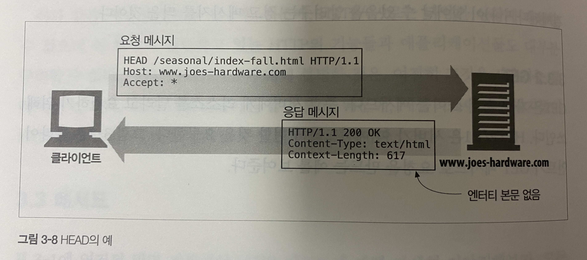
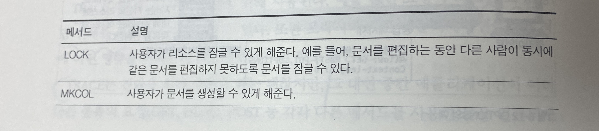
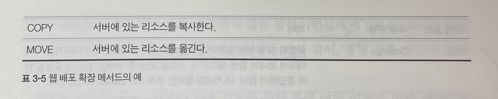

 
 
 

### 3.1 메시지의 흐름
 

>  1. 인바운드 : 클라이언트 > 서버 방향 (서버 방향)  
> 2. 아웃바운드 : 서버 > 클라이언트 방향 (사용자 에이전트 방향)  
> 3. 업스트림 : 메시지의 발송자  
> 4. 다운스트림 : 메시지의 수신자

 

### 3.2.1 메시지 문법

 

`요청 메시지의 형식`

<메서드> <요청 URL> <버전>  
<헤더>  
<엔티티 본문>
 
 

`응답 메시지의 형식`

<HTTP 버전> <상태 코드> <사유 구절>  
<헤더>  
<엔티티 본문>
 
 

HTTP 헤더의 집합은 항상 빈 줄(CRLF) 하나를 포함해야하지만 엔티티 본문이 없는 경우에 간혹 CRLF 줄을 빠뜨리기도 한다  
-> 이런 경우도 클라이언트/서버가 받아드릴 수 있어야함

    

 
 

### 3.2.2 시작줄

 

#### 메서드
`TRACE` : 메시지가 프록시를 거쳐 서버에 도달하는 과정을 추척한다 (메시지 본문 없음)  
`OPTIONS` : 서버가 어떤 메서드를 수행할 수 있는지 확인한다 (메시지 본문 없음)

이외에도 서버가 자기만의 메서드를 추가로 구현했을 수도 있는데, 이걸 확장 메서드라고 한다.

 

#### 상태코드

|   전체 범위     |    전체 범위     |            분류              |
|:---------:|:-------------------:|:-------------------:|
|   100-199   |     100-101   | 정보   |
| 300-399 |      300-305        | 리다이렉션              |

 

#### 사유구절
HTTP 명세에는 사유 구절이 어때야 한다는 엄격한 규칙은 없다

 

#### 버전 번호
버전 번호는 이걸 받는 애플리케이션들에게 대화 상대의 능력과 메시지 형식에 대한 단서를 제공해주는 것이다  
-> 그래서 어떤 애플리케이션이 지원하는 가장 높은 HTTP 버전을 명시해야한다

> cf)  
> 버전 번호의 숫자는 소수가 아니라 따로따로 읽는다  
> 예를 들어 2.22가 2.3보다 크다

 
 

### 3.2.3 헤더

 

#### HTTP 헤더의 분류
1. `일반 헤더` : 요청과 응답 양쪽에 모두 나타날 수 있음
2. `요청 헤더` : 요청에 대한 부가 정보를 제공 (ex. Accept: * / *)
3. `응답 헤더` : 응답에 대한 부가 정보를 제공 (ex. Server: Tiki-Hut/1.0)
4. `Entity 헤더` : 본문 크기와 콘텐츠, 혹은 리소스 그 자체를 서술 (ex. Content-Type: text/html; charset=iso-lation-1)
5. `확장 헤더` : 명세에 정의되지 않은 새로운 헤더

 
 

### 3.3.3 HEAD

HEAD는 GET 요청을 하기 전에 간단하게 확인할 부분을 확인하는 용도로 사용하는 메서드이다.

-> `GET과 HEAD의 차이?`  
HEAD와 GET의 차이는 메시지 본문을 포함하지 않는다는 것이다.  
그러나 그렇다고해서 HEAD가 GET보다 속도 면에서 빠르기 때문에 HEAD를 사용하는 건 아니다.  
엔티티 바디를 전송하지 않기는 하지만, HEAD가 Content-Length를 포함하는 한, GET과 마찬가지로 body를 조회할 필요가 있고, 최종적으로 body를 보내지 않는 것일 뿐이므로 성능 차이를 기대하기는 어렵다.  

-> `그렇다면 GET 요청을 안하고 HEAD 요청을 하는 이유는 뭘까?`   
대부분의 경우는 차이가 없지만, 보내야 하는 resource의 크기가 크거나, 또는 캐시 된 데이터가 최신의 것인지 확인하기 위함이라면 HEAD 메서드를 쓰는 것이 효율적이다.  
그러나 너무 빈번하게 정보가 업데이트되는 경우라면 HEAD 메서드를 썼을 때 요청이 2배로 증가하기 때문에 오히려 독이 될 수 있다.

    

 

### 3.3.6 TRACE

TRACE 메서드는 주로 진단을 위해 사용된다. 예를 들면 요청이 의도한 요청/응답 연쇄를 거쳐가지는 검사할 수 있다. 또한 프록시나 다른 애플리케이션들이 요청에 어떤 영향을 미치는지 확인해보고자 할 때도 좋은 도구이다.

 

### 3.3.7 OPTIONS

OPTIONS 메서드를 활용하면, 특정 리소스에 대해 어떤 메서드가 지원되는지 물어볼 수 있다.

> OPTIONS 사용 이유와 CORS의 관계  
> https://nukeguys.github.io/dev/options-request/

 

### 3.3.8 DELETE

DELETE 메서드를 이용한 HTTP 메시지를 서버에 보냈다고 해서, 클라이언트는 삭제가 수행됐다는 것을 확실할 수 없다. 왜냐하면, HTTP 명세 자체는 서버가 클라이언트에게 알리지 않고 요청을 무시하는 것을 허락하기 때문이다.

 

### 3.3.9 확장 메서드

<확장 메서드의 대표적인 예시>

    
    

확장 메서드를 다룰 때에는 '엄격하게 보내고 관대하게 받아들여라'라는 룰을 지키는 것이 좋다.

 

### 3.4.1 100-199: 정보성 상태 코드

#### `100 Continue`
100 Continue는 서버가 다루거나 사용할 수 없는 큰 엔티티를 서버에게 보내지 않으려는 목적으로만 사용해야한다.  
즉 클라이언트가 100-continue 값이 담긴 Expect 헤더를 서버에게 보내면서 엔티티를 받을 준비가 되어있는지 서버에게 묻고,  
서버는 100 Continue 응답을 통해 받을 수 있다는 의사 표시를 한다. 

그러나 클라이언트는 서버의 100 Continue 응답을 하염없이 기다려서는 안되며, 약간의 timeout 후에는 엔티티를 보내야한다.  
이떄 서버는, 자신의 100 Continue 응답을 보내기 전에 클라이언트로부터 엔티티를 수신하게 될 수도 있는데, 이 경우에는 100 Continue 응답을 생략해도 된다. 

서버는 요청을 다 받은 후에는 해당 요청에 대한 최종 응답을 보내야한다.  
한편, 100-continue expect 헤더를 받은 경우, 서버는 에러 등의 이유로 불가피하게 요청을 닫아야하는 상황이라고 해도 그냥 응답을 보내고 연결을 닫아서는 안된다.  
 클라이언트가 응답을 받을 수 없게 되기 때문이다. (자세한건 4장의 TCP 끊기와 리셋 에러 참조)

  

 #### cf) `Proxy와 100 Continue`
 클라이언트로부터 100-continue expect 헤더를 받은 경우, 프록시는 다음 홉(next-hop) 서버에게 기본적으로 이 헤더를 포함하여 요청을 전달한다.   
 한편, 간혹 프록시가 다음 홉 서버들의 상태 몇 가지와 그들이 지원하는 HTTP 버전을 기억해두는 경우가 있는데, 이 경우에 다음 홉 서버가 HTTP 1.1보다 이전 버전을 따른다면, 프록시는 자기 단에서 417 EXpectation Failed 응답을 보낸다.   
 또한 프록시가 HTTP 1.1 이전 버전을 따르는 클라이언트를 대신해서 다음 홉 서버에게 100-continue expect 헤더를 넘겨주기로 결정했다면, 이때 서버에서 받은 100 Continue 응답을 클라이언트에 그대로 전달해서는 안된다.  
 
  

 ### 3.4.3 300-399: 리다이렉션 상태코드
 리다이렉션 상태 코드는 해당 리소스에 대해 다른 위치를 사용하라고 말해주거나, 그 리소스 대신 다른 대안 응답을 제공한다.  
 예를 들어, 클라이언트가 문서가 1997년 10월 이후 수정된 경우에만 문서를 가져오라고 말하기 위해 특별한 If-Modified-Since 헤더를 사용했을 때,  
 그 문서가 해당 날짜 이후 변한 것이 없다면 서버는 콘텐츠 대신 304 상태 코드로 답한다.

 일반적으로, HEAD가 아닌 요청에 대해 300대 응답을 할때에는 리다이렉트될 URL과 설명을 포함시키는 것이 좋은 습관이다.

 

 

**참고**

안전한 메서드와 HEAD 메서드의 사용
: https://kscodebase.tistory.com/330