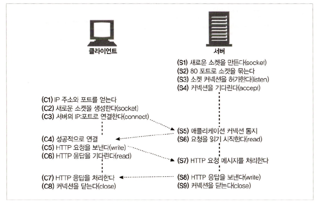

# 4장 커넥션 관리

## 4.1 TCP 커넥션

> 웹 브라우저 &rarr; TCP Connection을 통한 웹 서버 요청

```http
http://www.joes-hardware.com:80/power-tools.html
```

```text
1. 브라우저 -> www.joes-hardware.com 이라는 호스트 명 추출
2. 브라우저 -> 이 호스트 명에 대한 IP 주소 검색
3. 브라우저 -> 포트 번호(= 80) 검색
4. 브라우저 -> 202.43.78.3 IP의 포트 번호 80으로 TCP Connection 생성
5. 브라우저 -> 서버로 HTTP GET 요청 메시지 전송
6. 브라우저 -> 서버에서 온 HTTP 응답 메시지 수신
7. 브라우저 Connection 해제
```

### 4.1.2 TCP 스트림은 세그먼트로 나뉘어 IP 패킷을 통해 전송된다

> HTTPS = HTTP + 보안 기능(= TLS, SSL &rarr; HTTP와 TCP 사이에 있는 암호화 계층)

<div align="center">
    
</div>

<div align="center">
  
</div>

`HTTP`가 메시지를 전송할 때 `TCP 연결`을 통해 메시지 내용을 순서대로 전송  

아래 과정은 개발자에게 노출 X

```text
1. TCP -> 세그먼트 단위로 데이터 스트림 분할
2. 각 TCP 세그먼트는 IP 패킷에 담아 전달
```

<div align="center">
    
</div>

### 4.1.3 TCP 커넥션 유지하기

> 발신지 IP 주소, 발신지 포트, 수신지 IP 주소, 수신지 포트 &rarr; TCP Connection 식별

| 커넥션 |발신지 IP 주소|발신지 포트|목적지 IP 주소|목적지 포트|
|:---:|:---------:|:---------:|:---------:|:---------:|
|  A  |209.1.32.34|2034|204.62.128.58|4133|
|  B  |209.1.32.35|3227|204.62.128.58|4140|
|  C  |209.1.32.34|3105|207.25.71.25|80|
|  D  |209.1.32.89|5100|207.25.71.25|80|

### 4.1.4 TCP 소켓 프로그래밍

<div align="center">
    
</div>

## 4.2 TCP 성능에 대한 고려

> HTTP 트랜잭션 성능 &larr; TCP 성능 영향 // 계층이 바로 위 아래 존재하기 때문

### 4.2.1 HTTP 트랜잭션 지연

> 트랜잭션 처리 시간 < TCP Connection 설정, 요청 전송, 응답 메시지 전송 시간  
> 대부분 HTTP 지연 &rarr; TCP 네트워크 통신에서 발생

- HTTP 트랜잭션 처리 과정

<div align="center">
    
</div>

- HTTP 트랜잭션 지연 원인
  - **최근 호스트 접속 기록이 없으면** `DNS`를 통해 URI에 있는 호스트 명을 IP 주소로 변환하는 데 큰 시간 소비
  - 비효율적인 TCP Connection 설정 시간 &rarr; **새로운 TCP Connection에서 항상 설정 시간이 발생**
  - 요청 메시지가 인터넷을 통해 전달되고 서버에 의해 처리되는 시간 발생
  - 웹 서버 HTTP 응답 전송 시간 발생

### 4.2.3 TCP Connection Hand Shake 지연

> 새로운 TCP Connection을 열 때 Connection을 위한 조건을 맞추기 위해 연속으로 IP 패킷 교환  
> 작은 크기의 데이터 전송에 Connection 사용되면 매우 비효율적

> 50% 이상의 지연 차지  
> 클라이언트 &harr; 서버 Connection 위해 `SYN`, `ACK` hand shake 하는데 이 때 지연 발생 

- TCP Connection Hand Shake 순서

<div align="center">
  
</div>

```text
1. 클라이언트 -> 새로운 TCP Connection 위해 작은 TCP 패킷(= SYN, Connection 생성 요청 Flag) 서버 전송
2. 서버 -> Connection 요청이 받아들여졌음을 의미하는 SYN, ACK Flag를 TCP 패킷에 담아 클라이언트 전송
3. 클라이언트 -> Connection 완료를 알리기 위해 서버에 다시 확인 응답 신호 전송
```

### 4.2.4 확인 응답 지연

1. 성공적인 데이터 전송을 보장하기 위해 TCP &rarr; 확인 체계 운영
2. 세그먼트 수신 성공 &rarr; 확인 응답 패킷 전송
3. 확인 응답 패킷 크기 &darr; &darr; &darr; &rarr; 효율 위해 같은 방향으로 송출 되는 데이터 편승
4. **같은 방향 송출 데이터 패킷 찾지 못하면 지연 발생**

### 4.2.5 [TCP 느린 시작(slow start)](https://goodgid.github.io/Error-Flow-Control/#슬로우-스타트slow-start)

1. TCP Connection 첫 생성 시에 속도 제한 &rarr; 전송 성공 시에 속도 제한 &uarr; &uarr; &uarr;  
2. `지속 Connection` : 이미 존재하는 Connection **재사용**

### 4.2.6 네이글(Nagle) 알고리즘과 TCP_NODELAY

> Nagle 알고리즘이란, 세그먼트가 최대 크기가 되기 전까지 전송 지연
 
- **목표 패킷까지 채우지 못하면** 지연 심해짐
- `확인 응답 지연`과 함께 쓰이면 매우 비효율적
- `TCP_NODELAY` &rarr; `Nagle 알고리즘` 비활성화

### 4.2.7 TIME_WAIT의 누적과 포트 고갈

- TCP Connection의 종단에서 TCP를 끊으면 종단에서는 Connection의 IP 주소와 포트 번호를 메모리의 작은 제어영역에 기록 (일정 시간동안 TCP Connection 생성 방지 목적)
- 이전 Connection의 패킷이 그 해당 Connection과 **같은 연결 값으로 생성되면 패킷이 중복되며 TCP 데이터 충돌**
- 포트 고갈 문제를 겪지 않더라도 많은 Connection 연결이나 많은 대기 상태의 제어 블록이 있는 상황은 주의
- 현대의 빠른 라우터들 적용 이후 Connection 닫힌 후 패킷이 중복되는 경우 거의 사라짐

## 4.3 HTTP 커넥션 관리

### 4.3.1 흔히 잘못 이해하는 Connection 헤더

> HTTP 헤더 필드명 : 해당 Connection에만 해당되는 헤더 나열  
> 임시 토큰 : Connection에 대한 비표준 옵션  
> Close : Connection 작업 완료되면 종료되어야함 의미

- `Connection 헤더` + 메세지 전달 받으면 요청에 기술된 모든 옵션 적용
- `Connection 헤더` 모두 삭제

### 4.3.2 순차적인 트랜잭션 처리에 의한 지연

> 각 트랜잭션 마다 새로운 Connection &rarr; `각 Connection 맺는데 발생하는 지연` + `slow start 지연`

<div align="center">
  
</div>

## 4.4 병렬 커넥션

> HTTP 클라이언트 &rarr; 여러 개의 TCP connection &rarr; Connection 내 트랜잭션 병렬 처리

### 병렬 Connection 장점

1. 각 Connection의 **지연 시간을 겹치게** 하면 총 지연 시간 &darr; &darr; &darr;
2. 클라이언트 인터넷 대역폭을 한 개의 Connection이 다 사용하지 않는다면 나머지 요청을 내려 받는 데 **남은 대역폭 사용 가능**

- 예시 : HTML 렌더링 시에 3개 이미지 필요

> 이미지를 병렬로 내려 받아 Connection 지연이 겹침 &rarr; 총 지연 시간 &darr; &darr; &darr;

<div align="center">
  
</div>

1. *Connection-1* 로 HTML 페이지 내려 받음
2. 3개의 트랜잭션이 각각 별도의 Connection에서 동시 처리


- 총 지연 시간 비교
```text
Connection 생성 시간 : 1초
처리 시간 : 1초
Connection 해제 시간 : 1초

// 순차적 Connection -> 3번의 요청 -> 총 지연 시간 = 9초
// 병렬 Connection -> 3초 안에 원하는 요청 모두 처리 -> 총 지연 시간 = 3초
```

### 병렬 Connection 단점

- 각 트랜잭션 마다 새로운 Connection을 맺고 끊어 시간과 대역폭 소요
- 각 새로운 Connection &rarr; `TCP slow start`로 인한 성능 저하
- 실제로 연결할 수 있는 `병렬 Connection` **유한정**

### 병렬 Connection 현실

- 브라우저는 실제로 적은 수의 `병렬 Connection` 사용
- 다수의 Connection &rarr; 메모리 소모 &uarr; &uarr; &uarr; &rarr; 성능 문제
- **네트워크 대역폭이 좁다면** `병렬 Connection`을 `순차적 Connection`처럼 사용

## 4.5 지속 커넥션

> Connection 연결/해제 발생 지연을 해소하기 위해 처리가 완료된 후 연결을 끊지 않고 계속 Connection 유지

- 장점
  - Connection 맺기 위한 **준비 시간 절약**
  - 이미 맺어져 있는 Connection은 `TCP slow start`로 인한 지연을 피해 **더 빠른 데이터 전송 가능**
  
- 지속 Connection 종류
  - `HTTP/1.0+`: `Keep-Alive` Connection
  - `HTTP/1.1` : 지속 Connection

### 4.5.1 지속 커넥션 vs 병렬 커넥션

- `병렬 Connection`에 비한 `지속 Connection` 장점
  - Connection 수 &darr;
  - `튜닝된 Connection` 유지
  - Connection을 맺기 위한 **사전 작업** & **지연 시간** &darr;

> 튜닝된 Connection이란, slow start 과정을 겪으면서 한 번에 다수 패킷을 전송할 수 있는 권한을 얻은 상태의 Connection

### 4.5.2 HTTP/1.0+의 Keep-Alive 커넥션

> Keep Alive란, 이미 연결되어 있는 TCP 연결을 재사용하는 `Keep Alive`라는 기능을 default로 지원  
> 즉 `Hand Shake` 과정이 생략되어 성능 향상 기대

<div align="center">
  
</div>

#### Keep Alive 사용 X

```
$ telnet pungjoo.com 80
Trying 121.124.124.74...
Connected to pungjoo.com.
Escape character is '^]'.
GET / HTTP/1.0
Host: pungjoo.com
HTTP/1.1 302 Moved Temporarily
Date: Tue, 15 Jan 2008 01:33:56 GMT
Set-Cookie: JSESSIONID=B4329BFEDB1363BB90FCFA9568DDBF0B; Path=/
Location: http://pungjoo.com/servlet/com.pungjoo.blog2005.Action
Content-Type: text/html;charset=EUC-KR
Content-Length: 0
Connection: close

Connection to pungjoo.com closed by foreign host.
```

- Response 메시지와 함께 Connection 종료

#### Keep Alive 사용 O

```
$ telnet pungjoo.com 80
Trying 121.124.124.74...
Connected topungjoo.com.

// [1]
GET / HTTP/1.1
Host: pungjoo.com
Connection: Keep-Alive
HTTP/1.1 302 Moved Temporarily
Date: Tue, 15 Jan 2008 01:36:26 GMT
Set-Cookie: JSESSIONID=2B3EE2FE56868BD9588A7B55C405974B; Path=/
Location: http://pungjoo.com/servlet/com.pungjoo.blog2005.Action
Content-Type: text/html;charset=EUC-KR
Content-Length: 0
Keep-Alive: timeout=5, max=100
Connection: Keep-Alive

// [2]
GET / HTTP/1.1
Host: pungjoo.com
Connection: Keep-Alive
HTTP/1.1 302 Moved Temporarily
Date: Tue, 15 Jan 2008 01:36:35 GMT
Set-Cookie: JSESSIONID=E4E3D9B9CFE3693DC5AFC3D6ABDE5564; Path=/
Location: http://pungjoo.com/servlet/com.pungjoo.blog2005.Action
Content-Type: text/html;charset=EUC-KR
Content-Length: 0
Keep-Alive: timeout=5, max=99  // max 감소 -> 최초 연결된 Port에 대해 기존엔 max=100이었지만 1번 요청이 더 이뤄져 추가적으로 99번 요청 가능
Connection: Keep-Alive

// [3]
Connection to pungjoo.com closed by foreign host. // timeout(=5초) 이후 출력 -> Server/Client 연결 5초간 유지
```

- `Telnet(연결)`은 한 번만 이뤄졌고 `GET Method`는 2번 요청 &rarr; `Keep Alive`

#### Keep Alive 특징

- `Keep Alive` 유지 시간 = 정의된 시간 내 Access 이루어 지는 시간
- 세선 유지 &rarr; 연결된 소켓에 `I/O Access 마지막 종료` ~ `정의된 시간` 

> Keep Alive Timeout은 왜 필요할까? 

- 서버 자원 유한정
- 접속 계속 유지 &rarr; 서버 손실 
- 서버와 연결 맺는 socket 한정적 &Rarr; **연결이 오래 지속되면 다른 연결 불가능**

#### Keep Alive 성능 

- 장점 
  - Connection 연결/해제 작업 &darr; &rarr; 시간 &darr;
- 단점
  - **정적 자원(HTML, 이미지 파일 등)으로만** 구성된 웹 서버에 `Keep Alive` 사용하면 **약 50% 성능 향상**
  - 하지만 바쁜 서버 환경에서 `Keep Alive` 기능 사용할 경우 모든 요청마다 연결 유지 필요 &rarr; 프로세스 수 &uarr; &uarr; &uarr; `MaxClient` 값 초과  &rarr; 메모리 사용량 &uarr; &uarr; &uarr; &rarr; 성능 저하

### 4.5.6 Keep-Alive와 멍청한(dumb) 프락시

> 멍청한 프록시란, Connection 헤더를 이해하지 못하고 요청 그대로를 전달하는 클라이언트와 서버 사이의 멍청한 프록시 서버

<div align="center">
  
</div>

#### Step 1

- 클라이언트 &rarr; 프록시에 `Connection : Keep-Alive`헤더와 함께 메시지 전송
- 클라이언트는 **Connection 유지하자는 요청에 대한 응답 확인 위해 기다림**

#### Step 2

- `멍청한 프록시` &rarr; 요청 받은 HTTP의 `Connection 헤더` 이해 X
- `Keep-Alive`를 모르기 때문에 **다음 서버에 메시지 그대로 전달**
- Connection 헤더 = `hop-by-hop` 헤더

> Hop = 각 서버  
> Hop-by-Hop이란, 특정 두 서버 간에만 영향을 미치고 다른 서버 간에는 영향을 미치지 않음

#### Step 3

- 프록시가 **Connection 유지하기를 원하는 것으로 잘못 판단**
- 서버가 프록시와 Connection 유지 &rarr; `Connection : Keep-Alive`헤더를 포함하여 응답
- 하지만 프록시는 **헤더 이해 X**

#### Step 4

- `멍청한 프록시`는 서버로부터 받은 `Connection : Keep-Alive` 헤더를 포함하고 있는 응답 메시지 클라이언트에게 전달
- 클라이언트는 이 헤더를 통해 **프록시가 Connection 유지 하는 것에 동의한다고 판단**
- 하지만 `Keep-Alive`를 **이해하지 못한 프록시**는 다르다

#### Step 5

- 프록시는 서버 **Connection 해제 기다림**
- 서버는 **프록시가 자신에게 Connection 유지하기를 요청**한 것으로 알고 있어 **Connection 해제 X**
- 클라이언트는 다음 요청 보내기 시작할 때 **Connection 유지 되는 프록시에 요청 전송**
- 해당 요청은 **프록시로부터 무시됨**∂ &rarr; `Connection : Keep-Alive` 이해 X &rarr; 결국 무한 대기 이후 Timeout &rarr; Connection 끊김

### 4.5.7 Proxy-Connection 살펴보기

> 멍청한 프록시 해결 위해 `Proxy-Connection` 차선책 제시  
> 일반 Connection Header 대신 Proxy-Connection 확장 헤더 프록시에 전달

<div align="center">
  
</div>

- 프록시가 `Proxy-Connection` 헤더를 무조건 전달하더라도 웹 서버는 무시
- `Keep-Alive` 헤더를 이해하는 프록시는 `Proxy-Connection` &rarr; `Connection 헤더`로 전환 &rarr; `지속 Connection` 유지

#### 차선책 한계

- 위 방식은 클라이언트 &harr; 서버 사이에 **1개의 프록시만 있는 경우 동작**  
- 만약 `멍청한 프록시`가 `똑똑한 프록시` **앞에 존재한다면 같은 문제 발생**

<div align="center">
  
</div>

### Keep Alive 사용법

#### HTTP/1.0+

```text
Client(Browser)는 http 1.1을 준수하고 이해 할 수 있다고 Request에 Connection헤더에 Keep-Alive 값을 넣어 Server에 전송한다.
ex) Connection : Keep-Alive, ... 

Request를 받는 Server는 Kepp Alive 기능을 활성화하고 Keep Alive Timeout을 설정한다.
```

#### HTTP/1.1

디폴트로 동작하여 설정에 신경 쓰지 않아도 됨

#### HTTP/1.0 vs HTTP/1.1

- 1.0+에서는 `Keep-Alive`를 **사용하기 위해** 설정
- 1.1에서는 `Keep-Alive`를 **끊기 위해** 설정
- 설정의 목적이 `사용하기 위함` vs `끊기 위함` 으로 생각

#### 주의 사항

- 모든 **TCP 세션을 무한정 유지할 수 없으므로** `Timeout` & `Max` 설정을 통해 관리
- `Keep Alive Timeout` : 요청에 대한 응답을 보낸 후 Timeout을 위한 timer 동작
- `Event-driven` 구조로 인해 `non-blocking`을 사용하는 Nginx 등은 `Keep Alive`를 하면서도 **Thread를 점유하지 않기에 동시 처리에 유리**

#### Keep Alive 예시

```text
1. 이미지를 4개 보여줘야 하는 상황 
2. Client는 동시에 2개의 이미지만 받을 수 있다
3. Image를 받아 오는데 2초 소요
4. Port 여는데 1초 소요
```

- `Keep Alive` = *false*
```text
처음 Server에 2개의 Port를 열고 Image를 받고 Client Socket의 닫는다. ( 3초 ) 
다시 Server에 2개의 Port를 열고 Image를 받고 Client Socket의 닫는다. ( 3초 ) 
총 6초가 걸린다.
```

- `Keep Alive` = *true*
```text
처음 Server에 2개의 Port를 열고 Image를 받는다. ( 3초 ) 
재요청 시 기존에 열어 둔 Port로 Image를 받아온다. ( 2초 )
총 5초가 걸린다.
```

## 4.6 파이프라인 커넥션

> HTTP/1.1의 경우 `지속 Connection`을 활용해 요청을 `파이프라이닝`  
> 지속해서 데이터를 전송하여 네트워크 상의 왕복으로 인한 시간 &darr; 

<div align="center">
  
</div>

## 4.7 커넥션 끊기에 대한 미스터리

### 4.7.1 마음대로 커넥션 끊기

- 클라이언트, 서버, 프록시 상관없이 언제든지 `TCP Connection` 해제 가능
- 보통 메시지 다 보낸 이후 종료, 에러 상황에선 트랜잭션 중간에 종료 가능
- `지속 Connection`이 유휴 상태에 있으면 Connection 종료 가능

### 4.7.2 Content-Length와 Truncation

> 각 HTTP 응답은 본문의 정확한 크기 값을 가지는 `Content-Length` 헤더 필수

- 클라이언트, 프록시 Connection 해제 HTTP 응답 받은 후 `실제 전달된 엔티티 길이`와 `Content-Length`가 상이하면 수신자는 **데이터 정확한 길이 서버에 요청**
- 수신자가 `캐시 프록시`일 경우 응답 캐시 X &rarr; `Content-Length`를 정정하지 말고 메시지 받은 그대로 전달

### 4.7.3 커넥션 끊기의 허용, 재시도, 멱등성

> HTTP 애플리케이션 예상치 못하게 Connection이 끊긴 상황 대응 준비 필요

- 클라이언트 트랜잭션 중 Connection 끊기면 Connection 재연결 후 전송 재시도
- `파이프라인 Connection`에서 **클라이언트는 여러 요청을 큐에 쌓아** 놓을 수 있지만 **서버는 처리해야 할 요청을 남겨둔 채로 Connection 종료** 가능

> 멱등성이란, 몇번 실행됐는지 관계 없이 같은 결과를 반환하는 트랜잭션 성질

- 클라이언트는 `POST`처럼 **멱등이 아닌 요청은 `파이프라인`을 통해 요청 X**

### 4.7.4 우아한 커넥션 끊기

<div align="center">
  
</div>

- TCP Connection 양방향 &rarr; 양쪽 모두 `입력 큐` + `출력 큐` 존재

#### 전체 끊기와 절반 끊기

<div align="center">
  
</div>

- `전체 끊기` : `TCP Connection` 입력 채널과 출력 채널 Connection **모두 종료**
- `절반 끊기` : 입력 채널이나 출력 채널 중 하나를 **개별적으로 종료**

#### 우아하게 커넥션 끊기

> 애플리케이션 자신의 출력 채널을 먼저 끊고 다른 쪽 기기 출력 채널 끊기는 것을 기다림

- 양쪽에서 **더이상 데이터를 전송하지 않을 것**으로 알려줌 &rarr; Connection 리셋 위험 없이 온전히 **종료**
- 데이터나 스트림 끝을 알기 위해 입력 채널에 대해 주기적으로 상태 검사 필요


## 참고자료

[HTTP Connection 성능 향상 기술 : 병렬(Parallel)/지속(Persistent) Connection](https://goodgid.github.io/HTTP-Connection-Tech/)

[HTTP Keep Alive 알아보기](https://goodgid.github.io/HTTP-Keep-Alive/)