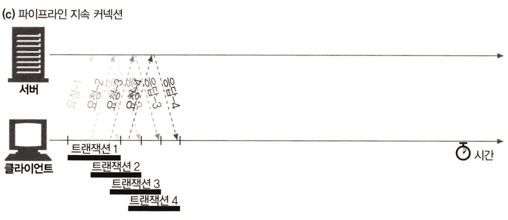

# 4장 커넥션 관리

# TCP/IP 5 Layer

### Application Layer

- 응용 프로그램이 있는 곳. 응용 프로그램은 전송 계층을 사용해 원격 호스트에 연결하라는 요청을 보낸다.

### Transport Layer

- 서로 다른 호스트에서 실행되는 응용 프로그램 간의 연결을 설정한다. 네트워크 호스트 간에 가상 TCP 커넥션을 생성한다.
- Application Layer에서 받은 Message에 TCP 또는 UDP 헤더를 추가한다. TCP 헤더에는 Source & Destination Port 번호 이상이 포함된다.
- TCP는 세그먼트라는 단위로 데이터 스트림을 잘게 나누고, 세그먼트를 IP 패킷이라고 불리는 봉투에 담에서 인터넷을 통해 데이터를 전달한다.

<div align="center">
    
</div>


### Network Layer

- 네트워크를 통해 이용하는 패킷 생성을 담당한다.
- Transport Layer에서 수신한 데이터에 Source & Destination 주소를 포함하는 헤더를 추가한다.

### Data Link Layer

- 네트워크를 통해 이동하는 Frame 생성을 담당한다. Frame은 패킷을 캡슐화하고 MAC 주소를 사용해 소스와 대상을 식별한다.
- Network Layer에서 수신한 패킷에 Source & Destination MAC 주소를 포함하는 헤더를 추가한다. 네트워크의 모든 호스트에는 적어도 하나의 MAC 주소가 있다.

<div align="center">
    
</div>  

<br/><br/>

# 4장 커넥션 관리

## 4.1 TCP 커넥션

죠의 컴퓨터 가게에서 전동공구의 최신 가격 목록 가져오기

```jsx
http://www.joes-hardware.com:80/power-tools.html
```

1. [브라우저] www.joes-hardware.com 라는 호스트명 호출하기
2. [브라우저] 호스트 명에 대한 IP 주소 찾기
3. [브라우저] 포트 번호(80) 얻기
4. [브라우저] IP의 80포트로 TCP 커넥션 생성하기
5. [브라우저] 서버로 HTTP GET 요청 보내기
6. [브라우저] 서버에서 온 HTTP 응답 메시지 읽기
7. [브라우저] 커넥션 끊기

### TCP 커넥션 유지하기

- TCP는 포트 번호를 통해서 여러 개의 커넥션을 유지한다.
- IP 주소는 해당 컴퓨터에 연결되고 포트 번호는 해당 애플리케이션으로 연결된다.
- 아래의 네 가지 값으로 유일한 커넥션을 생성한다.

```jsx
<발신자 IP 주소, 발신자 포트, 수신자 IP 주소, 수신자 포트>
```

### TCP 소켓 프로그래밍

소켓 API를 사용하면, TCP 종단 데이터 구조를 생성하고, 원격 서버의 TCP 종단에 그 종단 데이터 구조를 연결하여 데이터 스트림을 읽고 쓸 수 있다.

<div align="center">
    
</div>

<br/><br/>


## 4.2 TCP의 성능에 대한 고려

### HTTP 트랜젝션 지연

- 트랜젝션을 처리하는 시간은 TCP 커넥션 설정하고, 요청을 전송하고, 응답 메시지를 보내는 것이 비하면 상당히 짧다.
- TCP 네트워크 지연은 하드웨어의 성능, 네트워크와 서버의 전송 속도, 요청과 응답 메시지의 크기, 클라이언트와 서버 간의 거리에 따라 크게 달라진다.

### TCP 커넥션 핸드셰이크 지연

1. 클라이언트는 새로운 TCP 커넥션을 생성하기 위해 작은 TCP 패킷을 서버에게 보낸다. 
플래그 = SYN
2. 서버는 그 커넥션을 받으면 몇 가지 커넥션 매개변수를 산출하고, 커넥션 요청이 받아들여졌음을 의미하는 TCP 패킷을 클라이언트에게 보낸다. 
플래그 = SYN + ACK
3. 마지막으로 클라이언트는 커넥션이 잘 맺어졌음을 알리기 위해서 서버에게 다시 확인응답 신호를 보낸다. 
플래그 = ACK

<div align="center">
    
</div>


### TCP 느린 시작

**혼잡**

- 라우터가 패킷처리 속도보다 더 빠르게 패킷을 수신하는 경우 발생
- 혼잡 발생 → 패킷 손실 → 확인 응답 전송 불가 → 송신 TCP 세그먼트 재전송 → 혼잡 증가

**TCP 느린 시작**

- TCP가 한 번에 전송할 수 있는 패킷의 수를 제한한다.
- 처음에는 커넥션의 최대 속도를 제한하고 데이터가 성공적으로 전송됨에 따라서 속도 제한을 높여나간다.

<br/><br/>

## 4.3 HTTP 커넥션 관리

### Connection 헤더

**HTTP 통신 과정**

- HTTP는 클라이언트와 서버 사이에 프록시 서버, 캐시 서버 등과 같은 중개 서버가 놓이는 것을 허락한다.
- HTTP 메시지는 클라이언트에서 서버까지 중개 서버들을 하나하나 거치면서 전달된다.

**Connection 헤더 특징**

- HTTP Connection 헤더 필드의 값은 쉼표로 구분한다.
- Connection 헤더에 있는 모든 헤더 필드는 메시지를 다른 곳으로 전달하는 시점에 삭제하여 다음 커넥션에 전달시키지 않아야한다.
- Connection 헤더에는 홉별 헤더 명을 기술하는데 Connection 헤더에 명시된 헤더들이 다른 커넥션에 전달되는 것을 방지하기 때문에 헤더 보호기라고 한다.

**Hop-by-Hop**

- 홉은 각 서버를 의미한다.
- 홉별은 특정 두 서버 간에만 영향을 미치고 다른 서버 간에는 영향을 미치지 않음을 뜻한다.

**Connection 헤더 적용**

- HTTP 애플리케이션이 Connection 헤더와 함께 메시지를 받으면 수신자는 송신자에게서 오 ㄴ요청에 기술되어 있는 모든 옵션을 적용한다.
- 다음 홉에 메시지를 전달하기 전에 Connection 헤더에 기술되어 있던 모든 헤더를 삭제한 후 다음 커넥션 요청을 실시한다.

**예시**

```jsx
서버 ----------> 클라이언트 혹은 프록시

HTTP/1.1 200 OK
Connection : meter, close, bill-my-credit-card
...
```

1. Connection 헤더는 meter 헤더를 다른 커넥션으로 전달 X
2. 해당 트랜잭션이 끝나면 커넥션을 종료
3. bill-my-credit-card 옵션을 적용

<br/><br/>

## 4.4 병렬 커넥션

- HTTP는 클라이언트가 여러 개의 커넥션을 맺음으로써 여러 개의 HTTP 트랜잭션을 병렬로 처리할 수 있게 한다.
- 각 커넥션의 지연 시간을 겹치게 하면 총 지연 시간을 줄일 수 있다.
- 클라이언트의 인터넷 대역폭을 한 개의 커넥션이 다 써버리는 것이 아니라면 나머지 객체를 내려받는 데에 남은 대역폭을 사용할 수 있다.

<br/><br/>

## 4.5 지속 커넥션

### 병렬 커넥션의 단점

- 각 트렌젝션마다 새로운 커넥션을 맺고 끊기 때문에 시간과 대역폭이 소요된다.
- 각각의 새로운 커넥션은 TCP 느린 시작 때문에 성능이 떨어진다.
- 실제로 연결할 수 있는 병렬 커넥션의 수에는 제한이 있다.

<br/>

### Keep-Alive 동작

HTTP/1.0+ 지속 커넥션

1. [client] 커넥션을 유지하기 위해 요청에 Connection : Keep-Alive 헤더 포함
2. [server] 커넥션 유지하고자 하면, 응답 메시지에 같은 헤더 포함시켜 응답
3. [client] Connection : Keep-Alive 헤더가 없으면, 응답 메시지가 전송되고 나면 서버 커넥션 끊음

다음은 서버가 약 5개의 추가 트랜젝션이 처리될 동안 커넥션을 유지하거나, 2분 동안 커넥션을 유지하라는 내용의 Keep-Alive 응답헤더다.

```jsx
Connection : Keep-Alive
Keep-Alive: max=5, timeout=120
```

<div align="center">
    
</div>

<br/>

### Keep-Alive와 멍청한(dumb) 프락시

**Connection 헤더의 무조건 전달**<br/>
프락시는 Connection 헤더를 이해하지 못해서 해당 헤더들을 삭제하지 않고 요청 그대로를 다음 프락시에 전달한다.
1. 웹 클라이언트는 프락시에 Connection: Keep-Alive 헤더와 함께 메시지를 보내고, 커넥션 유지를 요청한다.
2. 멍청한 프락시는 Connection 헤더를 이해하지 못하고 그대로 전달한다. 하지만, Connection 헤더는 홉별(hop-by-hop) 헤더다.
3. 웹 서버는 프락시가 커넥션을 유지하자고 요청하는 것으로 잘못 판단한다. Connection : Keep-Alive 헤더를 포함해 응답한다.
4. 멍청한 프락시는 서버로 부터 받은 Connection: Keep-Alive를 포함하고 있는 응답 메시지를 클라이언트에게 전달한다.
5. 클라이언트와 서버는 커넥션을 유지하고 있다고 생각하지만, 프락시는 서버가 커넥션을 끊기를 기다린다.
6. 클라이언트가 다음 요청을 보내면 요청은 프락시로부터 무시되고 브라우저는 아무 응답없이 로드 중이라는 표시만 나온다.
7. 타임아웃이 발생해 커넥션이 끊길 때까지 기다린다.

<div align="center">
    
</div>

<br/>

### Proxy-Connection 살펴보기
클라이언트의 요청이 중개서버를 통해 이어지는 경우 모든 헤더를 무조건 전달하는 문제를 해결하기 위해 Proxy-Connection이라는 헤더를 사용한다.
- 프락시가 Proxy-Connection 헤더를 무조건 전달하더라도 웹 서버는 그것을 무시하기 때문에 문제가 발생하지 않는다.
- 영리한 프락시는 의미 없는 Proxy-Connection 헤더를 Connection 헤더로 바꿈으로써 원하던 효과를 얻게된다.
- Proxy-Connection은 **클라이언트와 서버 사이에 한 개의 프락시만 있는 경우**에서만 동작한다.

<div align="center">
    
</div>

<br/>

### HTTP/1.1의 지속 커넥션
HTTP/1.1에서는 별도 설정을 하지 않는 한, 모든 커넥션을 지속 커넥션으로 취급한다.

<br/>

## 4.6 파이프라인 커넥션
- 여러 개의 요청은 응답이 도착하기 전까지 큐에 쌓인다.
- 첫 번째 요청이 네트워크를 통해 지구 반대편에 있는 서버로 전달되면, 이어 두 번째와 세 번째 요청이 전달될 수 있다.
- 대기 시간이 긴 네트워크 상황에서 네트워크상의 왕복으로 인한 시간을 줄요서 성능을 높여준다.
- HTTP 클라이언트는 커넥션이 언제 끊어지더라도, 완료되지 않은 요청이 파이프라인에 있으면 언제든 다시 요청을 보낼 준비가 되어 있어야 한다.
- 비멱등 요청은 파이프라인을 통해 보내면 안된다.
<div align="center">
    
</div>

<br/>

## 4.7 커넥션 끊기
### Content-Length와 Truncation
- Content-Length 헤더 : HTTP 응답에서 본문의 정확한 크기 값을 나타냄
- 클라이언트나 프락시가 커넥션이 끊어졌다는 HTTP 응답을 받은 후, <br/> 실제 전달된 엔티티의 길이와 Content-Length의 값이 일치하지 않거나 Content-Length 자체가 존재하지 않으면 수신자는 데이터의 정확한 길이를 서버에게 물어봐야 한다.

<br/>

### 커넥션 끊기의 허용, 재시도, 멱등성
- 멱등하다 : 한 번 혹은 여러 번 실행됐는지의 상관없이 같은 결과를 반환한다.
- 클라이언트는 POST와 같이 멱등이 아닌 요청은 파이프라인을 통해 요청하면 안 된다.
- 비멱등인 요청을 다시 보내야 한다면, 이전 요청에 대한 응답을 받을 때까지 기다려야 한다.

<br/>

### 우아한 커넥션 끊기
- TCP 커넥션의 양쪽에는 데이터를 읽거나 쓰기 위한 입력 큐와 출력 큐가 있다.
- 전체 끊기 : Close(). TCP 커넥션의 입력 채널과 출력 채널의 커넥션을 모두 끊는다.
- 절반 끊기 : shutdown(). 입력 채널이나 출력 채널 중 하나를 개별적으로 끊는다.

<br/>

**TCP 끊기와 리셋 에러**
- 클라이언트가 이미 끊긴 입력 채널에 데이터를 전송하면 서버의 운영체제는 TCP 'connection reset by peer' 메시지를 클라이언트에 보낸다.
- 대부분 운영체제는 이것을 심각한 에러로 취금해 버퍼에 저장된 아직 읽히지 않은 데이터를 모두 삭제한다.
- 아직 애플리케이션이 읽지 않은 응답이 운영체제의 버퍼에 남아있다면 입력 버퍼에 남아있는 아직 읽지 않은 응답 데이터가 지워지게 된다.
--> 결론 : **절반 끊기 선호. 커넥션의 출력 채널을 끊는 것이 안전.**

<br/>

**우아하게 커넥션 끊기**
- 애플리케이션 자신의 출력의 채널을 먼저 끊고 다른 쪽에 있는 기기의 출력 채널이 끊기는 것을 기다린다.
- 양쪽에서 더는 데이터를 전송하지 않을 것이라고 알려주면, 커넥션은 리셋의 위험 없이 온전히 종료된다.
- 상대방이 절반 끊기를 구현했다는 보장이 없다. <br/> 따라서, 커넥션을 우아하게 끊고자 하는 애플리케이션은 출력 채널에 절반 끊기를 하고 난 후에도 데이터나 스트림의 끝을 식별하기 위해 입력 채널에 대해 상태 검사를 주기적으로 해야한다.
