 
 
 

### 4.1.2 TCP 스트림은 세그먼트로 나뉘어 IP 패킷을 통해 전송된다  
 

HTTP는 그림과 같이 'IP, TCP, HTTP'로 구성된 '프로토콜 스택'에서 최상위 계층이다.  
그리고 여기에 보안 계층인 TLS(SSL)이 추가된 것이 HTTPS이다.  
 

    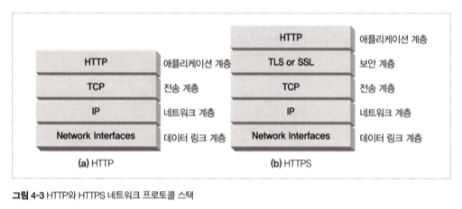

 

TCP는 `세그먼트`라는 단위로 데이터 스트림을 잘게 나누고, 세그먼트를 `IP 패킷`이라고 불리는 봉투에 담아서 인터넷을 통해 데이터를 전달한다.  
IP 패킷은 발신지와 목적지 IP 주소, 크기, 기타 플래그를 가진다.  
세그먼트는 포트 번호, 제어 플래그, 데이터 순서와 무결성을 검사하기 위해 사용하는 숫자 값을 포함한다.  

 

    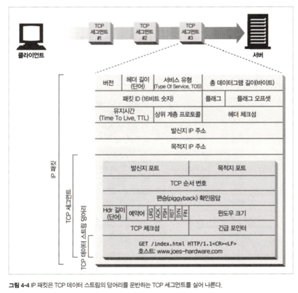

 

데이터 스트림 조각 < TCP 세그먼트 < IP 패킷

 
 

### 4.1.3 TCP 커넥션 유지하기

 

TCP 커넥션은 네 가지 값으로 식별한다  

> 1. 발신지 IP 주소
> 2. 발신지 포트
> 3. 수신지 IP 주소
> 4. 수신지 포트

 

    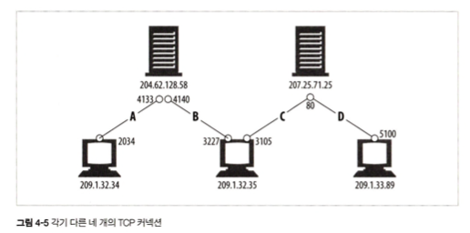

 

네가지 구성요소를 모두 똑같이 가리키고 있는 커넥션은 있을 수 없다.  
커넥션 생성은 서버와의 거리, 서버의 부하, 인터넷 혼잡도에 따라서 시간이 다르게 걸린다.

 
 

### 4.2.1 HTTP 트랜잭션 지연

 

그런데, 실제 서버에서 트랜잭션을 처리하는 시간은 TCP 커넥션을 설정하고, 요청 및 응답을 전송하는 시간에 비하면 매우 짧다.  
즉, 대부분 HTTP 지연은 TCP 네트워크 지연 때문에 발생한다.

 

    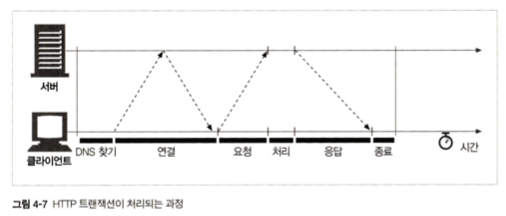

 
 

## 4.2.2 성능 관련 중요 요소

### 4.2.2 TCP 커넥션 핸드셰이크로 인한 지연

 

    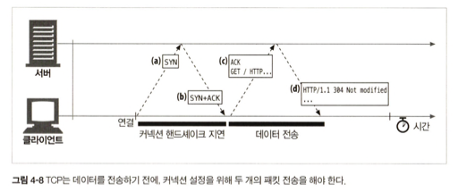

 

>(a) 커넥션 생성 요청  
>(b) 커넥션 요청이 받아들여졌음  
>(c) 클라이언트의 확인 응답 + 실제 요청 데이터  
>(d) 응답

 

이 과정에서, 보통은 SYN / SYN+ACK 핸드셰이크가 눈에 띄는 지연을 발생시킨다.  
TCP의 ACK 패킷은 HTTP 요청 메세지 전체를 전달할 수 있을 만큼 큰 경우가 많고, 서버의 응답 메세지는 하나의 IP 패킷에도 담길 수 있는 경우가 많기 때문이다.  
결국, 크기가 작은 HTTP 트랜잭션은 50% 이상의 시간을 TCP를 구성하는 데 쓴다.  
=> HTTP에서 커넥션을 재활용하는 이유1

 
 

### 4.2.2 확인응답 지연 알고리즘으로 인한 지연

세그먼트의 수신자는 세그먼트를 온전히 받으면 작은 확인응답 패킷을 송신자에게 반환한다.  
송신자는 특정 시간 안에 이 확인응답을 받지 못하면, 패킷이 중간에 파기되었거나 오류가 생긴 것으로 판단하고 데이터를 재전송한다.  
그런데, 이 확인응답은 크기가 작기 떄문에, TCP는 같은 방향으로 송출되는 데이터 패킷에 확인응답을 `편승(piggyback)`시킨다.  
=> 이런 편승을 늘리기 위해 사용하는 것이 `확인응답 지연 알고리즘`이다.

 

> **확인응답 지연 알고리즘**  
> 송출할 확인응답을 특정 시간 동안(보통 0.1~0.2초) 버퍼에 저장해두고, 확인응답을 편승시키기 위한 송출 데이터 패킷을 찾는다.  
> 송출 패킷을 찾지 못하면 별도 패킷을 만들어 확인응답을 전송한다.

 

그런데! 요청과 응답 두 가지 형식으로만 이루어지는 HTTP 동작 방식에서는 이 알고리즘이 잘 동작하지 않고, 오히려 지연을 초래한다.  
그래서 운영체제에 따라 다르지만, 보통 TCP 설정을 수정해서 이런 알고리즘을 비활성화할 수 있는다.

 
 

### 4.2.5 TCP의 느린 시작으로 인한 지연

TCP 커넥션은, 시간이 지나면서 점차 데이터 전송 속도 제한을 풀어간다는 특징이 있다. (TCP 커넥션 튜닝)  
따라서, TCP 커넥션은 처음 맺어졌을 떄 속도가 가장 느리고, 그걸 `TCP의 느린 시작(slow start)`라고 부른다.  

TCP 느린 시작은 TCP가 한번에 전송할 수 있는 패킷 수를 제한하고, 패킷이 성공적으로 전달되는 시점에 송신자는 추가로 2개(Ex)의 패킷을 더 전송할 수 있는 권한을 얻는다. (opening the congestion window)
=> HTTP에서 커넥션을 재활용하는 이유2

 
 

### 4.2.6 네이글(Nagle) 알고리즘으로 인한 지연

TCP는 데이터가 얼마나 작든 전송을 허용하는데, 이때 각 TCP 세그먼트는 40바이트 상당의 플래그와 헤더를 포함하여 전송하기 떄문에, 아주 크기가 작은 데이터를 너무 자주 전송하면 네트워크 성능이 크게 떨어지게 된다.   
이런 이유로 `네이글 알고리즘`이 등장했다.

> **네이글 알고리즘**  
> 세그먼트가 최대 크기가 되지 않으면 전송을 하지 않는 것.  
> 다만 다른 모든 패킷이 확인응답을 받았을 경우에는 최대 크기보다 작은 패킷의 전송을 허락한다.

 

> **네이글 알고리즘의 문제점**  
> 1. 앞으로 생길지 안생길지 모르는 데이터를 계속 기다림  
> 2. 확인응답 지연과 같이 쓰일 경우 최악의 퍼포먼스 -> 네이글 알고리즘은 확인응답이 도착할 때까지 데이터 전송을 멈추는 반면, 확인응답 지연 알고리즘은 확인응답을 100~200밀리초 지연시킴

때문에 애플리케이션에서 TCP_NODELAY 파라미터 값을 설정해서 네이글 알고리즘을 비활성화하기도 한다.

 
 

### 4.2.7 TIME_WAIT의 누적과 포트 고갈
 

TCP 커넥션을 끊으면, 종단에서는 커넥션의 IP 주소와 포트 번호를 메모리의 작은 제어영역(control block)에 기록해둔다.  (커넥션 종료 지연)  
이 정보는 같은 주소와 포트 번호를 사용하는 새로운 TCP 커넥션이 일정 시간 동안 생성되지 않게 하기 위한 것으로, 이 시간을 `TIME_WAIT`라고 한다.  
(보통 세그먼트의 최대 생명주기의 두 배 정도로 설정되며 2분 정도 : 2MSL)

#### `TIME_WAIT 사용 이유 1` : 지연 패킷이 새로운 커넥션에 끼어드는 것을 막을 수 있다

    

TIME_WAIT을 사용하면 이전 커넥션의 지연 패킷이 새로운 커넥션에 삽입되는 문제를 방지할 수 있다.  
매우 드문 경우이긴 하지만, SEQ=3의 패킷이 지연된 후 새로운 커넥션이 생성되었고, 때마침 해당 커넥션에 SEQ=3이 들어올 타이밍이었다면 데이터 무결성 문제가 발생할 수 있다.

#### `TIME_WAIT 사용 이유 2` : LAST_ACK가 유실된 경우를 막을 수 있다

    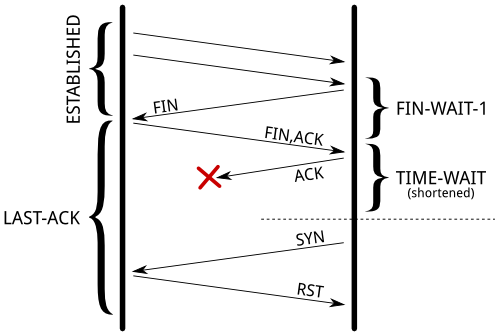

위 사진처럼 마지막 ACK가 유실된 경우, 상대는 LAST_ACK 상태에 빠지고, 새로운 커넥션이 SYN 패킷 전달시 RST를 리턴한다.  
따라서 반드시 TIME_WAIT이 일정 시간 남아있어서 패킷의 오동작을 막아야 한다.

> cf)  
> 이런 커넥션 종료 지연은 평상시에는 큰 문제가 되지 않지만, 부하 테스트 상황에서는 문제가 될 수도 있어서 주의가 필요하다.  
> 요즘은 빠른 라우터 때문에 커넥션이 닫힌 후에 지연 패킷이 오는 경우가 거의 없어졌다. 그래서 이 TIME_WAIT 값을 2분보다 짧게 수정하는 운영체제들도 있다. 이 값은 커널 헤더에 하드 코딩 되어 있어서 애플리케이션 단에서는 수정할 수 없다.

 
 

### 4.3.1 흔히 잘못 이해하는 Connection 헤더
 

HTTP Connection 헤더 필드는 커넥션 토큰을 쉼표로 구분하여 가지고 있으며, 그 값들은 다른 커넥션에 전달되지 않는다.  
커넥션 헤더에는 다음 세 가지 값이 전달될 수 있다 :  
> 1. `HTTP 헤더 필드 명 (홉별 헤더 명)`  : 여기 적힌 헤더들은 모두 다른 곳으로 전달하는 시점에는 삭제되어야 한다  
> 예외적으로 여기에 적혀 있지 않아도 홉별 헤더인 것들도 있다 : Proxy-Authenticate, Proxy-Connection, Transfer-Encoding, Upgrade
> 2. `임시적인 토큰 값` : 커넥션에 대한 비표준 옵션
> 3. `close 값 ` : 이 트랜잭션이 끝나면 커넥션이 끊길 것이라는 뜻

 

    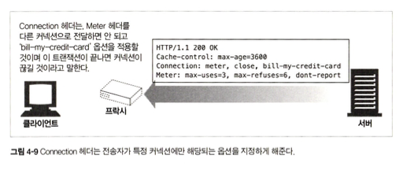

 
 

### 4.3.2 순차적인 트랜잭션 처리에 의한 지연

커넥션을 모두 순차적으로 처리하면 시간이 오래 걸리기 떄문에, 요즘 HTTP는 병렬 커넥션을 이용한다.

 

> **HTTP 커넥션 성능을 향상시킬 수 있는 최신 기술**  
> 1. `병렬(parallel) 커넥션` : 여러 개의 TCP 커넥션을 통한 동시 HTTP 요청. 
> 2. `지속(persistent) 커넥션` : 커넥션을 맺고 끊는 데서 발생하는 지연을 제거하기 위한 TCP 커넥션 재활용
> 3. `파이프라인(pipelined) 커넥션` : 공유 TCP 커넥션을 통한 병렬 HTTP 요청
> 4. `다중(multiplexed) 커넥션` : 요청과 응답들에 대한 중재 (실험적 기술)

 
 

### 4.4 병렬 커넥션

클라이언트의 인터넷 대역폭을 하나의 커넥션이 다 써버리는 것이 아니라면 여러 커넥션이 이 대역폭을 나눠쓴다.  
그러나 병렬 커넥션은 클라이언트 네트워크 대역폭이 좁을 때에는(ex. 브라우저가 28.8Kbps 모뎀으로 인터넷에 연결되어 있는 경우) 오히려 데이터 전송 시간이 더 오래 걸릴 수 있다.   
다수의 커넥션은 메모리를 많이 소모하고, 자체적인 성능 문제를 발생시킨다. 따라서 복잡한 웹페이지는 수십 개에서 수백 개의 객체를 포함하기는 하지만, 그렇다고 해서 **브라우저가 수백 개의 커넥션을 허용하지 않는다.** `서버는 다른 여러 사용자의 요청도 함께 처리`해야하고, `인터넷 대역폭의 한계`도 있기 떄문이다.  
또 서버도 특정 클라이언트로부터 과도한 수의 커넥션이 맺어졌을 경우, 그것을 임의로 끊어버릴 수 있다.

> `브라우저의 서버/프록시 당 병렬 커넥션 허용 수`  
> 크롬 : 6개 (대부분의 브라우저가 6개)  
> IE10 : 8개  
> 엣지 : 6개

> **병렬 커넥션의 단점**  
> 1. 새로운 커넥션을 맺고 끊기 때문에 시간과 대역폭이 소모된다
> 2. TCP 느린 시작 때문에 성능이 떨어진다
> 3. 실제 연결할 수 있는 병렬 커넥션 수의 제한이 있다

 
 

### 4.5 지속 커넥션  

보통 클라이언트는 웹페이지 내의 여러 데이터를 가져오기 위해 같은 서버에 여러 번 요청을 하게 되는 경우가 많다. 이 속성을 사이트 지역성(site locality)라고 부른다. 이런 이유로, HTTP/1.1을 지원하는 기기는 처리가 완료된 후에도 TCP 커넥션을 유지하여 앞으로 있을 HTTP 요청에 재사용한다.

지속 커넥션은 병렬 커넥션의 단점을 보완해준다. 커넥션을 맺기 위한 사전 작업과 지연을 줄여주고, 튜닝된 커넥션을 유지하며, 커넥션 수를 줄여준다.  
따라서 병렬 커넥션은 지속 커넥션과 함께 사용될 때에 가장 효과적이다.  
지속 커넥션에는 두 가지 타입이 있는데, `HTTP/1.0+에는 keep-alive 커넥션`이 있고, `HTTP/1.1에는 persistent 커넥션`이 있다.

 
 

### 4.5.4 Keep-Alive 옵션
keep-alive는 HTTP/1.1 명세에서 빠졌지만, 아직 keep-alive 핸드셰이크가 널리 사용되고 있기 떄문에, HTTP 애플리케이션은 이를 처리할 수 있게 개발되어야 한다.  
Keep-Alive 커넥션은 Keep-Alive 헤더를 이용한 커넥션이다. 그러나 이 헤더를 포함한 요청은 커넥션을 유지하기를 바라는 요청일 뿐이며, 서버가 그걸 무조건 따를 필요는 없다. 언제든 현재의 keep-alive 커넥션을 끊을 수 있고, keep-alive 커넥션에서 처리되는 트랜잭션 수를 제한할 수도 있다.  
keep-alive 동작은 Keep-Alive 헤더의 쉽표로 구분된 옵션들로 제어할 수 있다.  
 

    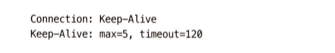

 

1. timeout 파라미터: 커넥션이 얼마간 유지될건지. (동작 보장 x)
2. max 파라미터: 커넥션이 몇 개의 HTTP 트랜잭션을 처리할 때까지 유지될 건지. (동작 보장 x)
3. 디버깅을 주목적으로 하는 임의의 속성. 이름=값 형식

 
 

### 4.5.5 Keep-Alive 커넥션 제한과 규칙
- keep-alive는 HTTP/1.0의 디폴트값이 아니다. 사용하기 위해서는 반드시 Connection: Keep-Alive 요청 헤더를 보내야한다.
- 커넥션을 계속 유지하기 위해서도 Connection: Keep-Alive 요청 헤더를 모든 메시지에 포함해야한다.
- 엔티티 본문이 정확한 Content-Length 값과 멀티파트 미디어 형식(multipart media type)을 가지거나, 청크 전송 인코딩(chunked transfer encoding)으로 인코딩되어야한다. -> 그래야 메시지의 시작과 끝점을 정확히 알 수 있다.
- 프록시와 게이트웨이는 메시지를 전달하거나 캐시에 넣기 전에 Connection 헤더에 명시된 모든 헤더 필드와 Connection 헤더를 제거해야 한다.
- keep-alive 커넥션은 Connection 헤더를 인식하지 못하는 프록시 서버와는 맺어지면 안된다(Dumb Proxy로 인해 헤더가 다음 홉으로 넘어가기 떄문에. 그러나 그런 경우가 많이 발생한다)
- HTTP/1.0을 따르는 기기로부터 받은 모든 Connection 헤더 필드는 무시해야한다.
- 클라이언트는 응답 전체를 모두 받기 전에 커넥션이 끊어진 경우, 요청을 다시 보낼 수 있게 준비되어 있어야 한다.

 
 

### 4.5.6 Keep-Alive와 멍청한 프록시 문제

 

    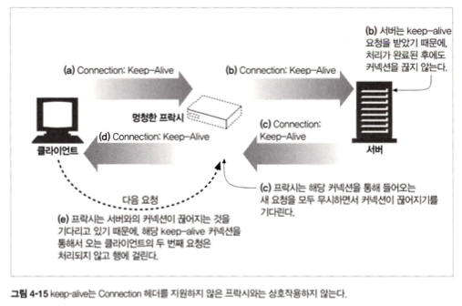

 

이런 잘못된 통신을 막으려면, 프록시는 홉별 헤더를 절대로 전달해서는 안된다.

 
 

### 4.5.7 Proxy-Connection 살펴보기
 

모든 웹 애플리케이션이 HTTP 최신 버전을 지원하지 않아도 멍청한 프록시 문제를 해결할 수 있는 차선책으로 제시된 게 Proxy-Connection 헤더이다.  
이걸 이용하면, 프록시가 Proxy-Connection 헤더를 전달하더라도, 웹 서버는 이걸 무시하기 때문에 별문제가 되지 않는다. 하지만 영리한 프록시(지속 커넥션을 이해하는)라면, 의미 없는 Proxy-Connection 헤더를 Connection 헤더로 바꿈으로써 원하던 효과를 얻을 수 있다.

그러나, 이 방식은 서버와 클라이언트 사이에 프록시가 단 한개 존재하는 경우에만 동작한다. 프록시가 2개 이상이고, 그 사이에 멍청한 프록시가 섞여있는 경우 결국 똑같은 문제가 발생한다.

 
 

### 4.5.8 HTTP/1.1의 지속 커넥션
 

HTTP/1.1은 keep-alive 커넥션을 지원하지 않는 대신, 설계가 개선된 지속 커넥션을 지원한다. HTTP/1.1에서 지속 커넥션은 디폴트로 설정되어 있다. 별도 설정을 하지 않는 한, 모든 커넥션은 지속 커넥션이다.  
HTTP/1.1 애플리케이션은, 트랜잭션이 끝난 후 다음 커넥션을 끊기 위해서는 Connection : close 헤더를 명시해야 한다.  
그러나, 이걸 보내지 않는다고 해서 서버가 커넥션을 영원히 유지하겠다는 것을 뜻하지는 않는다.  

 
 

### 4.5.9 지속 커넥션의 제한과 규칙

- keep-alive와 마찬가지로 엔티티 본문은 정확한 Content-Length를 가지거나 청크 전송 인코딩되어 있어야 한다.
- HTTP/1.1 프록시는 클라이언트와 서버 각각에 대해 별도의 지속 커넥션을 맺고 관리해야 한다.
- 단, 프록시 서버는 클라이언트의 커넥션 관련 지원 범위를 알고 있지 않은 한 지속 커넥션을 맺으면 안된다(오래된 프록시가 Conenction 헤더를 전달하는 문제가 생길 수 있기 때문에)
- HTTP/1.1 애플리케이션은 중간에 끊어지는 커넥션을 복구할 수 있어야 한다. 클라이언트는 다시 보내도 문제가 없는 요청이라면 가능한 한 다시 보내야 한다.

 
 

### 4.6 파이프라인 커넥션
 

HTTP/1.1은 지속 커넥션을 통해 요청을 파이프라이닝 할 수 있다. (하나의 TCP 커넥션을 통한 병렬 HTTP 요청이 가능)

그러나 파이프라인에는 여러가지 제약사항이 있다.
- HTTP 클라이언트는 커넥션이 지속 커넥션인지 확인하기 전까지는 파이프라인을 이어서는 안된다.
- HTTP 응답은 요청 순서와 같게 와야 한다. 이걸 순서에 맞게 정렬시킬 방법은 없다.
- HTTP 클라이언트는 언제 연결이 끊어지더라도 완료되지 않은 요청이 파이프라인에 있으면 언제든 다시 요청을 보낼 준비가 되어 있어야 한다.
- `POST 요청과 같이 반복해서 보낼 경우 문제가 생기는 요청(비멱등한 요청)은 파이프라인을 통해 보내면 안된다.` 에러가 발생하면 파이프라인을 통한 요청 중 어떤 것이 서버에서 처리되었는지 클라이언트는 알 수 없고, POST 같은 비멱등 요청을 재차 보내면 문제가 생길 수 있기 때문이다.

    

 
 

## 4.7 커넥션 끊기에 대한 미스터리
커넥션 관리(특히 언제 어떻게 커넥션을 끊는가)에 대한 명확한 기준은 없다. 이 이슈는 굉장히 미묘하고, 이에 관한 기술 문서도 별로 없다.

 

### 4.7.1 '마음대로' 커넥션 끊기
어떠한 HTTP 클라이언트, 서버, 혹은 프록시든 언제든 TCP 전송 커넥션을 끊을 수 있다. 예를 들어, 지속 커넥션이 일정 시간 동안 요청을 전송하지 않고 유휴 상태에 있으면 서버는 그 커넥션을 끊을 수 있다.  
그러나 이렇게 커넥션을 끊은 후 클아이언트가 새롭게 요청을 보낸다면 문제가 생긴다.  

 

### 4.7.2 Content-Length와 Truncation
각 HTTP 응답은 본문의 정확한 크기 값을 가지는 Content-Length 헤더를 가지고 있어야 한다.  
클ㄹ라이언트나 프록시가 커넥션이 끊어졌다는 HTTP 응답을 받은 후, 실제 전달된 엔티티의 길이와 Content-Length가 일치하지 않거나, Content-Length 자체가 존재하지 않으면 수신자는 데이터의 정확한 길이를 서버에게 물어봐야 한다.  

 

### 4.7.3 커넥션 끊기의 허용, 재시도, 멱등성

비멱등한 요청은 파이프라인을 통해 요청할 수 없고, 해당 요청을 다시 보내야 한다면, 이전 요청에 대한 응답을 받을 때까지 기다려야 한다. 또한 비멱등인 메서드는 자동으로 재시도해서는 안된다. 그래서 대부분 브라우저는 캐시된 POST 요청 페이지를 다시 로드하려고 할 때, 요청을 다시 보내기를 원하는지 묻는 prompt를 보여준다.  

 

### 4.7.4 우아한 커넥션 끊기

TCP 커넥션은 양방향이다. 입력 큐와 출력 큐가 각각 하나씩 양쪽 끝에 존재한다.

#### **`전체 끊기와 절반 끊기`**

    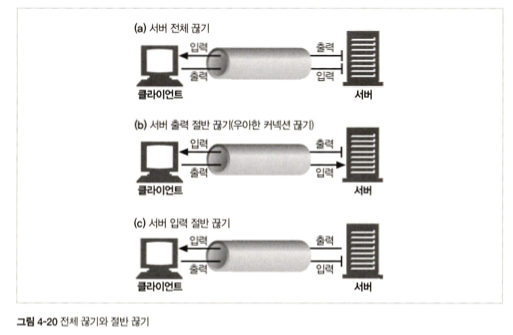

#### **`TCP 끊기와 리셋 에러`**
단순한 HTTP 애플리케이션은 전체 끊기만 사용할 수 있다.  
하지만, 애플리케이션이 각기 다른 HTTP 클라이언트, 서버, 프록시와 통신할 때, 그리고 그들과 파이프라인 지속 커넥션을 사용할 때, 기기들에 예상치 못한 쓰기 에러가 발생하는 것을 예방하기 위해 '절반 끊기'를 사용해야 한다.  

`보통은 출력 채널을 먼저 끊는 것이 안전`하며, 이걸 `우아한 커넥션 끊기`라고 한다. 클라이언트는 모든 데이터를 버퍼로부터 읽고 나서 데이터 전송이 끝남과 동시에 서버가 커넥션을 끊었다는 사실을 알게 된다. (이렇게 되면 문제가 발생하지 않는다)
그런데 만약 서버가 입력 채널을 먼저 끊어버리고, 클라이언트가 이미 끊긴 입력 채널에 데이터를 전송하면,  
서버의 운영체제는 'connection reset by peer'라는 메세지를 클라이언트에 보낼 것이다.  
대부분 운영체제는 이것을 심각한 에러로 취급하여 버퍼에 저장된, 아직 읽히지 않은 데이터를 모두 삭제해버린다.  

    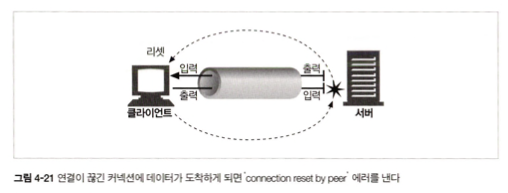

이런 상황은 파이프라인 커넥션에서 더 악화된다. 10개의 요청을 파이프라인 지속 커넥션을 통해 전송하였고,  
이미 응답은 운영체제 버퍼에 있지만 아직 애플리케이션이 읽지는 않았다고 해보자.  
그러고 나서 당신은 11번째 요청을 보냈지만, 서버는 이 커넥션을 충분히 오래 유지했다고 판단하고 연결을 끊어버렸다.  
그러면 11번쨰 요청은 이미 종료된 커넥션에 보내졌기 때문에, 서버는 요청을 처리하지 않고 'connection reset by peer' 메시지로 응답한다.  
이 리셋 메시지는 입력 버퍼에 있는 데이터를 지워버린다.  

#### **`우아하게 커넥션 끊기`**
그래서 일반적으로 우아한 커넥션 끊기는 어플리케이션이 본인의 출력 채널을 먼저 끊고, 반대편 기기의 출력 채널이 끊기는 것을 기다리는 것이다.  
그리고 양쪽에서 더는 데이터를 전송하지 않는 상태가 되면, 커넥션의 데이터 리셋의 위험 없이 온전히 종료된다.  
그러나 안타깝게도 상대방이 절반 끊기를 구현했다는 보장도 없고, 내가 하는 절반 끊기를 검사해준다는 보장도 없다.  
따라서, `커넥션을 우아하게 끊고자 하는 애플리케이션은 출력 채널을 끊은 후, 데이터 전송이 끝났는지 확인하기 위해 입력 채널에 대해 상태 검사를 주기적으로 해야 한다. `   
만약 입력 채널이 특정 타임아웃 시간 내에 끊어지지 않으면, 애플리케이션은 리소스를 보호하기 위해 커넥션을 강제로 끊을 수도 있다.

 
 

 

TIME_WAIT 상태란 무엇인가 : 
https://docs.likejazz.com/time-wait/