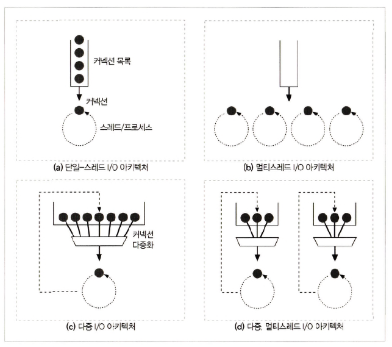

# 5장 웹 서버

## 5.3 진짜 웹 서버가 하는 일

<div align="center">
    
</div>

```text
// 웹 서버 프로세스

1. 커넥션을 맺는다          -> 클라이언트 접속을 받아들이거나 원치 않는 클라이언트라면 닫는다.
2. 요청을 받는다            -> HTTP 요청 메시지를 네트워크로부터 읽어 들인다.
3. 요청을 처리한다          -> 요청 메시지를 해석하고 행동
4. 리소스에 접근한다        -> 메시지에서 지정한 리소스에 접근
5. 응답을 만든다            -> 올바른 헤더를 포함한 HTTP 응답 메시지를 생성
6. 응답을 보낸다            -> 클라이언트에게 응답
7. 트랜잭션을 로그로 남긴다  -> 로그 파일에 트랜잭션 완료에 대한 기록 
```

## 5.4 단계 1: 클라이언트 커넥션 수락

### 5.4.1 새 커넥션 다루기

```text
// 새로운 Connection 프로세스

1. 클라이언트가 웹 서버에 TCP Connection 요청
2. 웹 서버는 그 Connection을 맺는다
3. TCP Connection에서 IP 주소 추출하여 클라이언트 정보 확인
4. 웹 서버가 새 Connection을 Connection 목록에 추가하고 Connection에서 오가는 데이터를 지켜보기 위한 준비 
```

### 5.4.2 클라이언트 호스트 명 식별

> 대부분 웹 서버는 `Reverse DNS`를 사용하여 클라이언트 IP 주소 &rarr; 호스트 명 변환하도록 설정

#### DNS란?

> 숫자로 이루어진 IP 주소를 사람이 인식하기 쉬운 문자열로 반환, 역반환

- 정방향 : 호스트 명 &rarr; IP 주소
- 역방향 : IP 주소 &rarr; 호스트 명

### 5.4.3 ident를 통해 클라이언트 사용자 알아내기

> ident 프로토콜이란, 서버에 HTTP 커넥션을 초기화한 사용자 이름 질의/응답

<div align="center">
    
</div>

```text
// ident 프로토콜 프로세스

1. 클라이언트 ident 결과 위해 TCP 포트 113 listen
2. 클라이언트 HTTP Connection 
3. 서버는 자신의 Connection을 identd 서버 포트(113)을 향해 연다
4. 해당 Connection에 대응하는 사용자 이름을 질의 요청 전송
5. 클라이언트 사용자 이름 반환
```

하지만 다음과 같은 이유로 **잘 사용하지 않는다.**

- 많은 클라이언트 PC는 `identd` 신원 확인 프로토콜 데몬 소프트웨어 실행 x
- `identd` 프로토콜은 HTTP 트랜잭션 지연
- 방화벽이 `ident` 트래픽을 막는 경우 &uarr;
- `ident` 프로토콜은 안전하지 않고 조작 쉽다
- `ident` 프로토콜은 가상 IP 주소를 잘 지원 x
- 클라이언트 사용자 이름 노출로 인한 privacy 침해 우려

## 5.5 단계 2: 요청 메시지 수신

> Connection에 데이터 도착하면 웹 서버는 데이터를 읽고 파싱하여 요청 메시지 구성

<div align="center">
    
</div>

```text
// 요청 메시지 파싱할 때의 웹 서버 프로세스

1. 요청줄을 파싱하여 요청 메서드, URI, 버전 번호 확인
2. 메시지 헤더 조회
3. 헤더의 끝을 의미하는 CRLF로 끝나는 빈줄 찾아낸다.
4. 요청 본문이 읽다면 조회
```

### 5.5.1 메시지의 내부 표현

<div align="center">
    
</div>

### 5.5.2 커넥션 입력/출력 처리 아키텍처

<div align="center">
    
</div>

#### (a) 단일 스레드 웹 서버

> 한 번에 하나씩 요청 처리 &rarr; 트랜잭션 완료되면 다음 Connection 처리

- 처리 도중 모든 다른 Connection 무시
- 심각한 성능 문제를 야기하여 오직 트래픽이 적은 서버에 적당

#### (b) 멀티 프로세스와 멀티 스레드 웹 서버

> 여러 요청을 동시에 처리하기 위해 여러 개의 프로세스 혹은 고효율 스레드 할당

- 서버가 무수히 많은 동시 Connection을 처리하기 위해 만들어진 프로세스와 스레드 리소스 &uarr; &uarr; &uarr; &rarr; **스레드/프로세스 최대 개수 제한**

#### (c) 다중 I/O 서버

> Connection에 대해 작업을 수행하는 때는 실제로 해야할 일이 있을 때만 

- 스레드와 프로세스는 idle 상태의 Connection에 얽매여 기다리느라 리소스 낭비 x

#### (d) 다중 멀티스레드와 웹 서버

> 여러 스레드는 각 열려있는 Connection을 감시하고 작업 수행

### 5.7 단계 4: 리소스 매핑과 접근

> 웹 서버 = 리소스 서버  

- HTML, JPEG 등 미리 만들어진 컨텐츠 제공
- 서버 위에서 동작하는 리소스 생성 애플리케이션을 통해 만들어진 동적 컨텐츠도 제공

### 5.7.1 Docroot

> docroot란, 웹 서버 파일 시스템의 특정 폴더를 지정하여 파일 시스템 상대 위치의 기준이 됨

<div align="center">
    
</div>

아래와 같이 `httpd.conf` 설정 파일에 `DocumentRoot` 를 추가하여 설정 가능

```text
DocumentRoot /usr/local/httpd/files
```

서버는 `상대 url`이 `docroot`를 벗어나서 파일 시스템의 `docroot` 이외 부분이 노출되지 않도록 해야한다.

`Joe's Hardware`의 `docroot` 위의 파일을 보려고 하는 아래와 같은 `URI`를 허용 x

```http request
http://www.joes-hardware.com/../
```

### *가상화된 docroot*

> 가상 호스팅이란, 서버 1대에 여러 도메인을 호스팅 

<div align="center">
    
</div>

- 가상 호스팅 `docroot` 설정 

```xml
<VirtualHost www.joes-hardware.com>
ServerName www.joes-hardware.com
DocumentRoot /docs/joe
TransferLog /logs/joe.access_log
ErrorLog /logs/joe.error_log
</VirtualHost>


<VirtualHost www.marys-antiques.com>
ServerName www.marys-antiques.com
DocumentRoot /docs/mary
TransferLog /logs/mary.access_log
ErrorLog /logs/mary.error_log
</VirtualHost>
```

### *사용자 홈 디렉터리 docroots*

> 서버 한 대의 웹 서버에서 각자 개인 웹 사이트를 만들 때 사용

<div align="center">
    
</div>

개인 `docroot`는 주로 사용자 홈 디렉터리 안에 있는 `public_html` 설정에 따라 다르다.

## 5.8 단계 5: 응답 만들기

### 5.8.1 응답 엔터티

응답 메시지에 주로 포함되는 내용

- 응답 본문의 `MIME` 타입을 서술하는 `Content-Type` 헤더
- 응답 본문 길이를 서술하는 `Content-Length` 헤더
- 실제 응답 본문의 내용

### 5.8.2 MIME 타입 결정하기

<div align="center">
    
</div>

|종류| <div align="center">설명</div>                                                               |
|:----:|:-------------------------------------------------------------------------------------------|
|`mime.types`| **파일 이름 확장자 사용**, 확장자별 MIME 타입이 담겨 있는 파일로 MIME 타입 매핑                                       |
|`Magic typing`| 파일의 내용을 검사해서 알려진 패턴이 대한 테이블(= magic file)에서 확인  <br/>(느리긴 하지만 파일이 **표준 확장자 없이 지어진 경우** 유용) |
|`Explicit typing`| 특정 파일이나 디렉터리 안의 파일들이 파일 확장자나 내용에 상관없이 **특정 MIME 타입을 갖도록 설정**                               |
|`Type negotiation`|한 리소스가 **여러 종류의 문서 형식에 속하도록 설정**  <br/>사용자와의 협상 과정을 통해 사용하기 가장 좋은 형식(대응 하는 MIME 타입)을 판별 여부도 설정 가능|

### 5.8.3 리다이렉션

리다이렉션은 다음의 경우에 유용하다.

#### 영구히 리소스가 옮겨진 경우

> 새 URL이 할당돼 새로운 위치로 옮겨졌거나 이름이 바뀐 경우 &rarr; `301 Moved Permanently` 사용

#### 임시로 리소스가 옮겨진 경우

> 리소스가 임시로 옮겨지거나 이름이 변경된 경우 &rarr; `303 See Other`, `307 Temporary Redirect` 사용

#### URL 증강

> 트랜잭션 간 상태를 유지하고 싶은 경우 &rarr; `303 See Other`, `307 Temporary Redirect` 사용

1. 서버는 상태 정보를 내포한 새 URL을 생성하고 사용자를 리다이렉트 시킨다
2. 클라이언트는 리다이렉트를 따라간다.
3. 상태 정보가 추가된 완전한 URL을 포함한 요청을 다시 보낸다.

#### 부하 균형

> 트래픽 분산하고 싶은 경우 &rarr; `303 See Other`, `307 Temporary Redirect` 사용

과부하된 서버로 들어온 요청을 **좀 덜 부하가 걸린 서버로 리다이렉트** 시킴

#### 친밀한 다른 서버가 있을 때

> 특정 사용자에 대한 정보를 갖고 있는 서버로 리다이렉트 시키는 경우 &rarr; `303 See Other`, `307 Temporary Redirect` 사용

#### 디렉터리 이름 정규화

> 클라이언트가 디렉터리 이름에 대한 URL이 틀린 경우 &rarr; 상대 경로가 정상적으로 동작할 수 있는 URL을 추가하여 리다이렉트 시킴