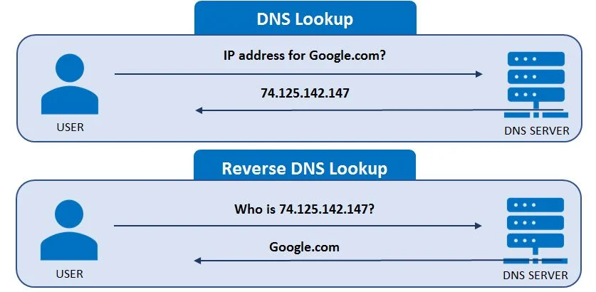
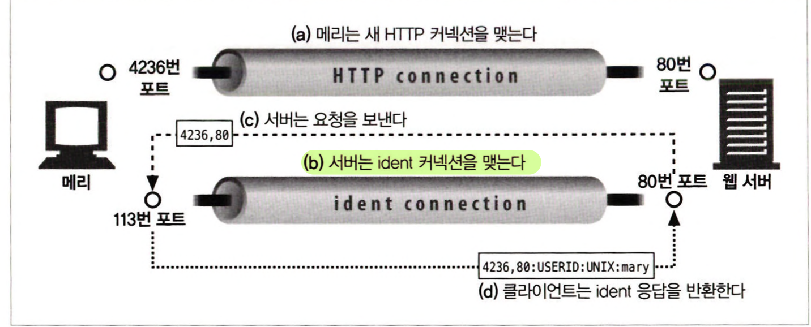
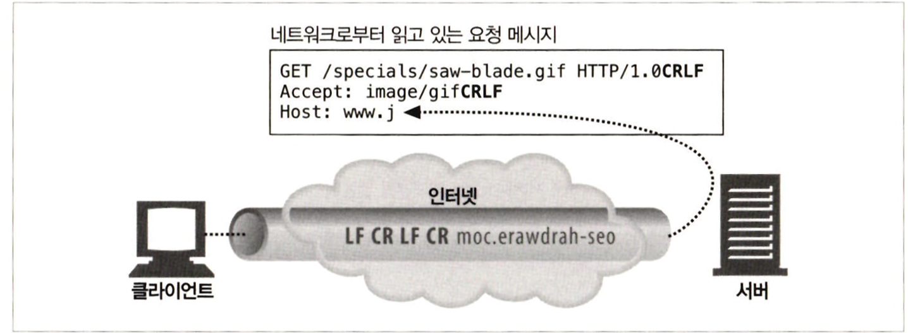
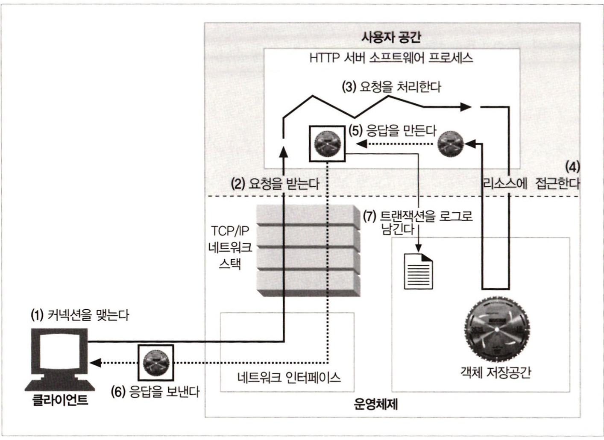

# 5장 웹 서버

# 웹 서버란?

웹 서버는 TCP 커넥션 관리에 대한 책임을 운영체제와 나눠 갖는다.

### 웹 서버

- HTTP 및 그와 관련된 TCP 처리를 구현한 것이다.
- 자신이 제공하는 리소스를 관리하고 웹 서버를 설정, 통제, 확장하기 위한 관리 기능을 제공한다.

### 운영체제

- 컴퓨터 시스템의 하드웨어를 관리한다.
- TCP/IP 네트워크 지원, 웹 리소스를 유지하기 위한 파일 시스템, 현재 연산 활동을 제어하기 위한 프로세스 관리를 제공한다.

### go언어로 간단한 웹 서버 만들기

```go
package main

import (
	"fmt"
	"net"
	"os"
)

// socket-server project main.go

const (
	SERVER_HOST = "localhost"
	SERVER_PORT = "9090"
	SERVER_TYPE = "tcp"
)

func main() {
	fmt.Println("Server Running")

	// TCP 소켓을 생성하고 커넥션을 기다리도록(listen 설정)
	server, err := net.Listen(SERVER_TYPE, SERVER_HOST+":"+SERVER_PORT)
	if err != nil {
		fmt.Println("Error listening:", err.Error())
		os.Exit(1)
	}
	defer server.Close()
	fmt.Println("Listening on " + SERVER_HOST + ":" + SERVER_PORT)
	fmt.Println("Waiting for client...")

	for {
		connection, err := server.Accept()
		if err != nil {
			fmt.Println("Error accepting: ", err.Error())
			os.Exit(1)
		}
		fmt.Println("client connected")
		go processClient(connection)
	}
}

func processClient(connection net.Conn) {
	buffer := make([]byte, 1024)
	// buffer에 값 읽어오기
	mLen, err := connection.Read(buffer)
	if err != nil {
		fmt.Println("Error reading:", err.Error())
	}
	fmt.Println("Received: ", string(buffer[:mLen]))

	// client에게 응답 메시지 적어주기
	_, err = connection.Write([]byte("Thanks! Got your message: " + string(buffer[:mLen])))
	connection.Close()
}
```
<br/>

# 웹 서버가 하는 일

1. 커넥션을 맺는다.
2. 요청을 받는다. - HTTP 요청 메시지 받기
3. 요청을 처리한다.
4. 리소스에 접근한다.
5. 응답을 만든다. - HTTP 응답 메시지 생성하기
6. 응답을 보낸다. 
7. 트랜잭션을 로그로 남긴다.

<div align="center">
    
</div>

<br/>

## 단계 1 : 클라이언트 커넥션 수락

### 1-1. 새 커넥션 다루기

1. 클라이언트가 웹 서버에 TCP 커넥션 요청
2. 웹 서버 커넥션 맺기
3. TCP 커넥션에서 IP 주소 추출해 클라이언트 확인하기
4. 서버는 새 커넥션을 커넥션 목록에 추가하기

<br/>

### 1-2. 클라이언트 호스트 명 식별

<div align="center">
    
</div>

- 대부분의 웹 서버는 역방향 DNS를 사용해 클라이언트의 IP 주소를 클라이언트의 호스트 명으로 반환하도록 설정되어 있다.
- hostname lookup은 꽤 시간이 많이 걸릴 수 있어 웹 트랜잭션을 느려지게 할 수 있어 대용량 웹 서버는 이 기능을 꺼두거나 특정 콘텐츠에 대해서만 켜놓는다.

<br/>

### 1-3. ident 프로토콜로 클라이언트 사용자 알아내기

<div align="center">
    
</div>


- ident : TCP client Identity Protocol
    - 서버에게 어떤 사용자 이름이 HTTP 커넥션을 초기화했는지 찾아낼 수 있게 해준다.
- ident 프로토콜로 사용자 이름을 확인하는 이유
    - 웹 서버 로깅에 유용 : 로그 포맷의 두 번째 필드에 ident 사용자 이름을 담음

<br/>

## 단계 2: 요청 메시지 수신

1. 데이터 읽기
2. 파싱하기
3. 요청 메시지 구성하기

<div align="center">
    
</div>


- 요청줄 파싱하여 요청 메서드, URL, 버전 번호 찾는다. CRLF로 끝난다.
- 메시지 헤더를 읽는다. 각 메시지 헤더는 CRLF로 끝난다.
- 헤더의 끝을 의미하는 CRLF로 끝나는 빈 줄을 찾아낸다.
- (존재한다면) 요청 본문을 읽는다.

웹 서버는 입력 데이터를 네트워크로부터 불규칙적으로 받는다.

따라서, 파싱해서 데이터를 이해할 수 있는 수준의 분량을 확보할 때까지 메시지 일부분을 메모리에 임시로 저장한다.

<br/>

### 2-1. 메시지의 내부 표현

웹 서버는 파싱한 요청 메시지를 쉽게 다룰 수 있도록 내부의 자료 구조에 저장한다.

- 파싱된 데이터에 대한 포인터와 길이를 담는다.
- 헤더는 룩업 테이블에 저장되어 각 필드에 빠르게 접근할 수 있다.

<br/>

### 2-2. 커넥션 입력/출력 처리 아키텍쳐

웹 서버는 아키텍쳐에 따라 요청을 처리하는 방식이 달라진다.

1. 단일 스레드 웹 서버
    - 한 번에 하나씩 요청을 처리한다.
    - 하나의 트랜잭션이 완료되면, 다음 커넥션을 처리한다.
    - 하나의 트랜잭션 처리 중, 다른 요청은 무시되므로 서비스의 성능 문제가 생긴다.
2. 멀티 프로세스와 멀티 스레드 웹 서버
    - 여러 요청을 동시에 처리하기 위해 여러 개의 프로세스 혹은 고효율 스레드를 할당한다.
    - 너무 많은 프로세스와 스레드가 생겨서 리소스를 많이 소비하는 것을 막기 위해, 운영체제는 최대 스레드와 프로세스 수의 제한을 건다.
3. 다중 I/O 서버
    - 모든 커넥션은 동시에 활동을 감시당한다.
    - 커넥션의 상태가 바뀌면 그 커넥션에 대해 작은 양의 처리가 수행된다.
    - 유휴 상태의 커넥션에 매여 기다리느라 리소스를 낭비하지 않는다.
4. **다중 멀티스레드 웹 서버**
    - CPU 여러개의 이점을 살리기 위해 멀티스레딩과 다중화를 결합하기도 한다.
    - 각 열려있는 커넥션을 감시하고 각 커넥션에 대해 작업을 수행한다.
    
<br/>

## 단계 3: 요청 처리

<br/>

## 단계 4: 리소스의 매핑과 접근

웹서버는 리소스 서버다.

- 정적 컨텐츠 제공 : HTML 문서나 이미지 같은 미리 만들어진 컨텐츠 제공
- 동적 컨텐츠 제공 : 웹 애플리케이션 서버를 통해 동적 컨텐츠를 만들어서 제공

웹 서버가 클라이언트에게 컨텐츠를 전달하려면 요청 메시지의 URI에 맞는 컨텐츠나 컨텐츠 생성기를 찾아서 그 콘텐츠의 원천을 식별해야한다.
<br/>

### 4-1. Docroot

일반적으로 웹 서버 파일 시스템의 특별한 폴더를 웹 콘텐츠를 위해 예약해 둔다.

요청 URL : /specials/saw-blade.gif

Docroot : /usr/local/httpd/files

⇒ 서버 리소스 : Docroot + 요청 URL 

/usr/local/httpd/files/specials/saw-blade.gif

- 아파치의 httpd.conf

```
DocumentRoot /usr/local/httpd/files
```
<br/>

### 가상 호스팅된 docroot

가상 호스팅 웹 서버는 여러 웹 사이트를 호스팅하기 위해, 각 사이트마다 문서 루트를 둘 수 있다.

- 서버는 HTTP Host 헤더나 서로 다른 IP 주소를 확인해 docroot에 맞는 리소스를 제공한다.
- 아파치
    - VirtualHost 블록 DocumentRoot 지시자 포함

```
<VirtualHost www.joes-hardware.com>
    DocumentRoot /docs/joe
<VirtualHost>
<VirtualHost www.chaewons-antique.com>
    DocumentRoot /docs/chaewon
<VirtualHost>
```
<br/>

### 사용자 홈 디렉토리 docroots

사용자들이 한 대의 웹 서버에서 개인의 웹 사이트를 만들 수 있게 해준다.

- 보통 빗금(/)와 물결표(~) 다음에 사용자 이름이 오는 것으로 시작하는 URI는 개인 문서 루트를 가리킨다.
    - /~chaewon/index.html
<br/>

### 4-2. 디렉토리 목록

- 웹서버는 경로가 파일이 아닌 디렉터리를 가리키는 **요청**을 받을 경우, 다음과 같은 선택지가 있다.
    1. 에러를 반환
    2. 디렉터리 대신 특별한 색인 파일(index.html)을 반환
    3. 디렉토리 탐색 후 그 내용을 담은 HTML 파일 반환
        - 일반적으로는 발견할 수 없는 파일이 드러날 수 있으므로, 이 설정을 끌 수 있음
<br/>

### 4-3. 동적 컨텐츠 리소스 매핑

- 웹서버는 URI와 컨텐츠를 생성하는 프로그램을 매핑할 수 있다.
- 애플리케이션 서버는 웹 서버를 복잡한 백엔드 애플리케이션과 연결하는 일을 한다.
- 애플리케이션은 동적 리소스에 대한 동적 콘텐츠 생성 프로그램이 어디에 있는지, 어떻게 그 프로그램을 실행하는지 알려줄 수 있어야 한다.
- 아파치 설정
    - URI 경로가 /cgi-bin/으로 시작할 경우 실행시킬 프로그램

```
ScriptAlias /cgi-bin /usr/local/etc/httpd/cgi-programs/
```
<br/>

### 4-4. 서버사이드 인클루드 (SSI)
<br/>

### 4-5. 접근 제어

웹 서버는 리소스에 대한 접근을 제어하거나, 리소스에 접근하기 위한 비밀번호를 물어볼 수 있다.
<br/>

## 단계 5. 응답 만들기

리소스를 클라이언트에게 전송하기 위해 응답 메시지를 만들어야 한다.
<br/>

### 5-1. 응답 엔티티

- Content-Type 헤더 : MIME 타입
- Content-Length 헤더 : body의 길이
- 실제 응답 본문의 내용
<br/>

### 5-2. MIME 타입 결정하기

웹 서버는 응답 본문의 MIME 타입을 결정해야 한다.

- MIME 타입 결정 방법
    - mime.types
        - 파일 이름의 확장자를 사용
        - 확장자별 MIME 타입이 담겨있는 파일을 탐색
    - 매직 타이핑
        - 파일의 내용을 검사해서 매직 파일(알려진 패턴에 대한 테이블)에 해당하는 패턴을 찾아 타입을 정함.
        - 파일이 표준 확장자 이름 없이 지어진 경우에 유용함.
    - 유형 명시
        - 파일 확장자와 관계 없이, 특정 파일이나 디렉토리 내의 파일에 대한 MIME 타입을 지정
    - 유형 협상
        - 한 리소스가 여러 종류의 MIME에 속하도록 설정
<br/>

### 5-3. 리다이렉션

웹 서버는 리다이렉션 응답(3xx)을 반환할 수 있다.

- 리소스가 영구적으로 옮겨진 경우
    - 301 Moved Permanently
- 임시로 리소스가 옮겨진 경우
    - 303 See Other, 307 Temporary Redirect
- URL 증강
    - 서버는 상태 정보를 URL에 추가하여 클라이언트를 새 URL로 리다이렉트 시킨다.
    - 클라이언트는 리다이렉트를 따라가서, 상태정보가 추가된 완전한 URL을 포함한 요청을 다시 보낸다.
    - 트랜젝션 간 상태를 유지한다.
    - 303 See Other, 307 Temporary Redirect
- 부하 균형(Load Balancing)
    - 과부화된 서버가 요청을 받으면, 덜 부하가 걸린 서버로 리다이렉트
    - 303 See Other, 307 Temporary Redirect
- 친밀한 다른 서버가 있을 때
    - 웹 서버가 클라이언트에 대한 정보를 갖고 있을 수 있음
    - 요청한 클라이언트에 대한 정보를 갖고 있는 다른 서버로 리다이렉트
    - 303 See Other, 307 Temporary Redirect
- 디렉토리 이름 정규화
    - 클라이언트가 디렉토리 이름에 대한 URI를 요청하는데, 슬래쉬를 빠뜨렸다면 슬래쉬를 추가한 URI로 리다이렉트
<br/>

## 단계 6: 응답 보내기

- 비지속적 커넥션 : 서버는 데이터 전송 후, 커넥션 닫기
- 지속적 커넥션 : 데이터 전송 후 커넥션 유지
<br/>

## 단계 7: 로깅

- 트랜잭션 완료 후 어떻게 트랜잭션이 수행되었는지를 로그 파일에 기록