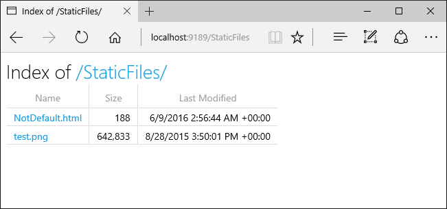

<br>
<br>
<br>

### 5.1 다채로운 웹  서버
'웹 서버'라는 용어는 `웹 서버 소프트웨`어와 웹페이지 제공에 특화된 `장비` 양쪽을 다 가리킨다  

<br><br>

### 5.1.1 웹 서버 구현
<br>

> **웹 서버의 역할**
> 1. HTTP 프로토콜을 구현
> 2. 웹 리소스를 관리
> 3. 웹 서버 관리 기능을 제공

<br>

> **운영체제의 역할**
> 1. 컴퓨터 시스템의 하드웨어를 관리
> 2. TCP/IP 네트워크 지원
> 3. 웹 리소스를 유지하기 위한 파일 시스템 관리
> 4. 현재 연산 활동 제어를 위한 프로세스 관리

-> TCP 커넥션 관리에 대한 책임은 웹 서버와 운영체제가 나눠 갖음  
<br>

> **웹 서버의 형태**
> - 다목적 소프트웨어 웹 서버를 표준 컴퓨터 시스템에 설치하고 실행하는 형태 (ex. 마이크로소프트 웹서버, 아파치 웹 서버, nginx 웹 서버,..)
> - 제품에 내장될 목적으로 만들어진 임베디드 웹 서버

<br>
<br>

### 5.3 진짜 웹 서버가 하는 일
<div align="center">
    
</div>

<br><br>

### 5.4 단계 1: 클라이언트 커넥션 수락

### 5.4.1 새 커넥션 다루기

`클라이언트가 웹 서버에 TCP 커넥션을 요청`하면, 웹 서버는 그 커넥션을 맺고 TCP 커넥션에서 `IP를 추출하여 커넥션 맞은편에 어떤 클라이언트가 있는지 확인`한다.  
일단 새 커넥션이 맺어지고 받아들여지면, 서버는 `새 커넥션을 커넥션 목록에 추가`하고, 커넥션에서 오가는 데이터를 지켜보기 위한 준비를 한다.  
`한편` 웹 서버는 어떤 커넥션이든 마음대로 거절하거나 즉시 닫을 수 있다.

<br><br>

### 5.4.2 클라이언트 호스트 명 식별 (Reverse DNS)
대부분 웹 서버는 역방향 DNS를 통해 클라이언트의 IP 주소를 호스트 명으로 변환하고, 이를 접근 제어와 로깅에 이용할 수 있다.  
그러나 호스트 명 룩업(hostname lookup)은 꽤 많은 시간이 걸릴 수 있기 떄문에, 대부분의 대용량 웹 서버는 호스트 명 분석을 꺼두거나 특정 콘텐츠에 대해서만 켜놓는다.

> cf. Reverse DNS로 인한 응답 지연 사례  
> https://d2.naver.com/helloworld/4744401

<br><br>

### 5.4.3 ident를 통해 클라이언트 사용자 알아내기
<div align="center">
    
</div>
-> 잘 쓰이지 않는 듯하다

<br><Br>

### 5.5 단계 2: 요청 메시지 수신

<Br>

> `요청 메시지를 파싱할 때 웹 서버가 하는 일`
> - 요청 줄을 파싱하여 메서드, URL, 버전 번호를 찾음 (스페이스로 분리되어 있음/요청줄은 캐리지 리턴 줄바꿈(CRLF) 문자열로 끝남)
> - 메시지 헤더를 읽음 (마찬가지로 CRLF로 끝남)
> - 헤더의 끝을 의미하는 CRLF로 끝나는 빈 줄을 찾음 (존재한다면)
> - 요청 본문이 있다면 읽어들임

<br>

또한, 웹 서버는 파싱해서 이해 가능한 수준의 `분량을 확보할 때까지` 데이터를 네트워크로부터 읽어서 `메시지 일부분을 메모리에 임시로 저장`해둔다.

<br><br>

### 5.5.1 메시지의 내부 표현
<div align="center">
    
</div>

그림 왼쪽의 파싱된 요청 메시지를 보면, 요청 메시지의 각 부분에 대한 포인터와 길이를 담고 있다.   
또 헤더는 속도가 빠른 룩업 테이블에 저장되어 headers에서 참조하고 있다.

<br><br>

### 5.5.2 커넥션 입력/출력 처리 아키텍처
요청은 언제라도 도착할 수 있기 때문에 웹 서버들은 항상 새 요청을 주시하고 있다.
이때, 웹 서버 아키텍처의 차이에 따라 요청을 처리하는 세부적인 방식이 달라진다.  

<div align="center">
    
</div>

<br>

#### `(a) 단일 쓰레드 웹 서버`
한 번에 요청을 하나씩 처리  
구현은 간단하지만 처리 도중에는 다른 모든 커넥션이 기다리고 있어야함

<br>

#### `(b) 멀티 프로세스와 멀티쓰레드 웹 서버`
여러 요청을 동시 처리하기 위해 여러 개의 프로세스 혹은 고효율 쓰레드를 할당  
쓰레드/프로세스는 필요할 때마다 만들어질 수도 있고 미리 만들어질 수도 있음  
쓰레드/프로세스가 너무 많으면 메모리나 시스템 리소스를 소비하기 때문에 보통 최대 개수를 제한함

<br>

#### `(c) 다중 I/O 서버`
이 아키텍처에서는, 모든 커넥션이 동시에 그 활동을 감시당함  
그리고 어떤 커넥션의 상태가 바뀌면(ex. 데이터를 사용할 수 있게 되거나 에러가 발생), 그 커넥션에 대한 처리가 수행됨.  
그 처리가 완료되면 커넥션은 열린 커넥션 목록으로 돌아감  
이렇게 처리했을 때 장점은 실제 데이터 처리가 일어나지 않는 커넥션에게 쓸데없이 차례가 돌아가서 리소스를 낭비하지 않는다는 것

<br>

#### `(d) 다중 멀티스레드 웹 서버`
CPU 여러 개의 이점을 살리기 위해 멀티쓰레딩(b)와 다중화(c)를 결합
여러 개의 쓰레드(보통 하나의 물리적 프로세스)는 각각 열려있는 커넥션을 감시하고 각 커넥션에 대해 조금씩 작업을 수행

<br><br>

### 5.6 단계 3: 요청 처리
웹 서버는 POST를 비롯한 몇몇 메서드는 엔티티 본문이 있을 것을 요구, OPTIONS를 비롯한 다수 메서드는 엔티티 본문이 있는 것을 허용, GET과 같은 메서드에서는 엔티티 본문이 있는 것을 금지함

<br><br>

### 5.7 단계 4: 리소스의 매핑과 접근

### 5.7.1 Docroot (Document Root)
- 리소스 매핑의 가장 단순한 형태는 요청 URI를 웹 서버의 파일 이름으로 사용하는 것  
- `웹 서버의 특별한 폴더를 웹 콘텐츠를 통해 예약해두는데, 이 폴더를 docroot이라고 부름`  
- 웹 서버 내부 설정에서 문서 루트를 설정 가능  
- 대부분의 성숙한 웹 서버는 루트 위의 파일을 보려고 하는 URI를 허용하지 않음  

<br>

#### `가상 호스팅된 docroot`
가상 호스팅 웹 서버는 각 사이트에 그들만의 분리된 문서 루트를 주는 방법으로 하나의 웹 서버에서 여러 개의 웹 사이트를 호스팅함  
이때 웹 서버는 URI나 Host 헤더에서 얻은 IP 주소나 호스트 명을 이용해서 올바른 문서 루트를 식별함  

<div align="center">
    
</div>

<br>

#### `사용자 별로 다른 docroot 갖게 하기`
사용자들이 한 대의 웹 서버에서 각자의 개인 웹사이트를 만들 수 있도록 해주는 경우도 있음  
이때 보통 빗금(/)과 물결표(~) 다음에 사용자 이름이 오는 것으로 시작하는 URI는 그 사용자의 개인 docroot를 가리킴
<div align="center">
    
</div>

<br><br>

### 5.7.2 디렉터리 목록
`요청 경로가 파일이 아닌 디렉터리를 가리키는 경우`,
대부분의 웹 서버는 요청한 URL에 대응되는 디렉터리 안에서 index.html 혹은 htm으로 이름 붙은 파일을 찾음  
> 아파치 웹 서버의 경우, DirectoryIndex 설정 지시자를 사용해서 기본 디렉터리 파일로 사용될 파일 이름의 집합을 설정할 수 있음 (우선순위대로 나열)
```yml
DirectoryIndex index.html index.htm home.html home.htm index.cgi
```

그런데, 사용자가 디렉터리 URI를 요청했을 때 기본 색인 파일이 없고 디렉터리 색인 기능이 꺼져 있지 않다면, 많은 웹 서버는 자동으로 해당 디렉터리 내 파일들을 크기, 변경일 및 해당 파일에 대한 링크와 함께 열거한 HTML 파일을 반환한다.  
<div align="center">
    
</div>


<br><br>

### 5.7.3 동적 콘텐츠 리소스 매핑
웹 서버는 URI를 동적 리소스에 매핑할 수도 있다.  
-> 즉 요청에 맞게 콘텐츠를 생성하는 프로그램에 URI를 매핑  
사실 웹 서버 중에서 웹 애플리케이션 서버(WAS)라고 불리는 것들은 거의 이런 식으로 웹 서버를 복잡한 백엔드 애플리케이션과 연결하는 일을 한다.  
<div align="center">
    
</div>


<br><br>

### 5.7.4 서버사이드 인클루드(Server-Side Includes, SSI)
과거 JSP에서 많이 사용하던 아래와 같은 방식
```jsp
<%@ include file="포함할 파일"%>
```
이걸 웹 서버에서 클라이언트에 보내기 전에 실제 값으로 치환해줌  

<br><br>

### 5.8 단계 5: 응답 만들기

### 5.8.2 MIME 타입 결정하기
웹 서버는 응답 본문의 MIME 타입을 결정해야하는 책임이 있다.

#### `mime.types (확장자 기반 타입 연계)`
서버가 MIME 타입 결정을 위해 파일의 확장자를 읽고, 확장자별 MIME 타입이 담겨 있는 파일을 탐색하여 MIME 타입을 결정짓는다.  
<div align="center">
    
</div>

<br>

#### `매직 타이핑(Magic typing)`
파일 내용을 검사해서 알려진 패턴에 대한 테이블(매직 파일)에 해당하는 패턴이 있는지 찾아보는 방식  
느리긴 하지만 파일이 표준 확장자 없이 이름 지어진 경우에 사용하면 좋음  

<br>

#### `유형 명시(Explicit typing)`
파일 확장자나 내용에 관계없이 어떤 MIME 타입을 갖도록 웹 서버가 지정하는 방식

<br><br>

### 5.9 단계 6: 응답 보내기
비지속적인 커넥션 - 모든 메시지를 전송 후 서버 쪽에서 커넥션을 닫음  
지속 커넥션 - 서버가 Content-Length 헤더를 바르게 계산하기 위해 특별한 주의를 필요로 하는 경우 / 클라이언트가 응답이 언제 끝나는지 알 수 없는 경우 커넥션을 열린 상태로 유지