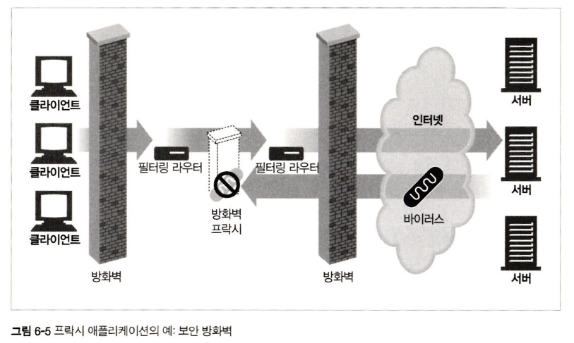
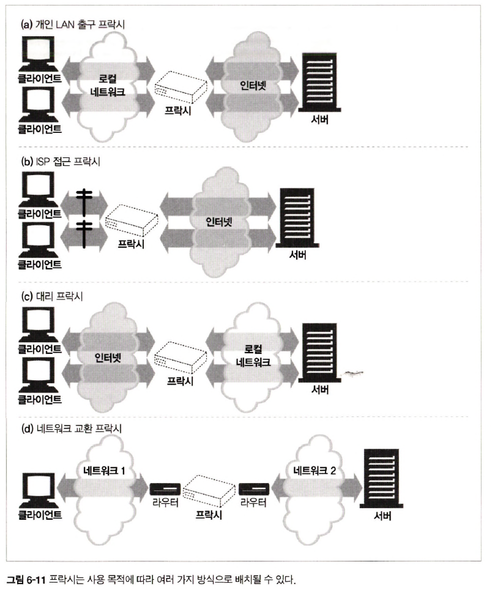

# 6장 프락시

## 6.1 웹 중개자

> 웹 프락시 서버란, 클라이언트 입장에서 트랜잭션을 수행하는 중개인

<div align="center">
    
</div>

### 6.1.1 개인 프락시와 공유 프락시

> 개인 프락시란, 하나의 클라이언트만을 위한 프락시  
> 공용 프락시란, 여러 클라이언트가 함께 사용하는 프락시

| 공용 프락시                                                                         | 개인 프락시                               |
|:-------------------------------------------------------------------------------|:-------------------------------------|
| 대부분의 프락시는 공용이며 공유된 프락시                                                         | 클라이언트에서 직접 실행되는 형태로 종종 사용            |
| <br/>프락시를 사용하는 사용자가 많을수록 유리  <br/> 여러 사용자들의 공통된 요청에서의 이점 때문 <br/>ex) 캐시 프락시 서버 | 브라우저 기능 확장 및 성능 개선, 무료 ISP 서비스 광고 목적 |

### 6.1.2 프락시 대 게이트웨이

> 프락시 &rarr; `같은 프로토콜`을 사용하는 둘 이상의 애플리케이션 연결  
> 게이트웨이 &rarr; `서로 다른 프로토콜`을 사용하는 둘 이상의 애플리케이션 연결

<div align="center">
    
</div>

## 6.2 왜 프락시를 사용하는가?

- 프락시 사용 예시

|                           어린이 필터                           |                         문서 접근 제어자                          |  
|:----------------------------------------------------------:|:----------------------------------------------------------:|
| <div align="center"></div> | <div align="center"></div> | 

|                           보안 방화벽                            |                            웹 캐시                            |
|:-----------------------------------------------------------:|:----------------------------------------------------------:|
| <div align="center"></div>  | <div align="center"></div> |

|                           대리 프락시                           |                          콘텐츠 라우터                           |
|:----------------------------------------------------------:|:----------------------------------------------------------:|
| <div align="center"></div> | <div align="center"></div> |

|                           트랜스코더                            |                          콘텐츠 라우터                           |
|:----------------------------------------------------------:|:----------------------------------------------------------:|
| <div align="center"></div> | <div align="center"></div> |

|                         콘텐츠 트랜스코더                          |                           익명화 프락시                           |
|:----------------------------------------------------------:|:-----------------------------------------------------------:|
| <div align="center"></div> | <div align="center"></div> |

## 6.3 프락시는 어디에 있는가?

### 6.3.1 프락시 서버 배치

<div align="center">
    
</div>

**출구 프락시**
> 로컬 네트워크와 인터넷 사이의 트랜잭션을 제어하기 위한 프락시

**접근 프락시**
> 사용자 다운로드 속도를 개선하고 인터넷 대역폭 비용을 줄이기 위해 캐시 프락시로 사용

**대리 프락시(= 리버스 프락시)**
> 웹 서버로 향하는 모든 요청을 처리하고 필요할 때만 웹 서버에 자원 요청  
> 일반적으로 웹 서버의 이름과 IP 주소로 가려 모든 요청은 서버가 아닌 프락시로 향함

**네트워크 교환 프락시**
> 트래픽 분산을 위해 분산 처리 능력을 갖춘 프락시

### 6.3.2 프락시 계층

프락시 계층 내에서 다음과 같은 근거로 프락시 서버를 선택하게 된다.

| 근거                   | 설명                                    |
|:---------------------|:--------------------------------------|
| **부하 균형**            | 부하를 분산하기 위해 다른 프락시 서버 트래픽을 고려하여 선택    |
| **지리적 인접성에 근거한 라우팅** | 원 서버의 지역을 담당하는 프락시 선택                 |
| **프로토콜/타입 라우팅**      | URI에 근거하여 라우팅                         |
| **특정 사용자를 위한 라우팅**   | 빠른 서비스를 원하는 사용자를 위해 캐시나 성능 개선을 위해 라우팅 |

### 6.3.3 어떻게 프락시가 트래픽을 처리하는가

클라이언트가 프락시 서버로 트래픽을 위임하는 4가지 방법

<div align="center">
    
</div>

|항목|설명|
|:-----|:-----|
|(a) 클라이언트 수정|클라이언트는 HTTP 요청을 바로 프락시로 전송|
|(b) 네트워크 수정|클라이언트가 보낸 HTTP 요청을 클라이언트 모르게 프락시 서버가 가로챈다 &rarr; 인터셉트 프락시|
|(c) DNS name space 수정|웹 서버 앞에 위치하는 프락시 서버는 웹 서버의 이름과 IP 주소를 자신이 직접 사용하여 클라이언트에서 보낸 HTTP 요청은 프락시로 향함|
|(d) 웹 서버 수정|웹 서버가 305를 클라이언트에게 반환하여 프락시로 리다이렉트 시킴|

## 6.4 클라이언트 프락시 설정

### 6.4.2 클라이언트 프락시 설정: PAC 파일

**PAC(= Proxy Auto-Config)란**
> 별도의 프록시 서버 설정 없이 특정 URL에 대해 자동으로 프록시 설정을 해주는 스크립트

리소스 접근시마다 클라이언트가 `PAC` 스크립트를 통해 적절한 프락시 서버 선택


- `PAC` 스크립트 예시
```js
function FindProxyForURL(url, host) { 
    if (url.substring(0,5) = "http:") {
        return "PROXY http-proxy.mydomain.com:8080";
    } else if (url.substring(0,4) = "ftp:") {
        return "PROXY ftp-proxy.mydomain.com:8080";
    } else {
        return "DIRECT";
    }
}
```

### 6.4.3 클라이언트 프락시 설정: WPAD

**WPAD(= Web Proxy Auto Discovery Protocol)이란**
> 브라우저에 알맞은 `PAC` 파일을 자동으로 찾아주는 알고리즘

- `WPAD`이 구현된 **클라이언트가 HTTP 요청 처리**하는 방식
```text
1. PAC URI를 찾기 위해 WPAD 사용
2. 주어진 URI에서 PAC 파일 조회
3. 프락시 서버를 알아내기 위해 PAC 파일 실행
4. 알아낸 프락시 서버를 이용해 요청 처리
```

- `WPAD`가 **올바른 `PAC` 파일을 찾기 위한 명세** 기법
```text
- 동적 호스트 발견 규약(= DHCP)
- 서비스 위치 교육(= SLP)
- DNS 잘 알려진 호스트 명
- DNS SRV 레코드
- DNS TXT 레코드 안의 서비스 URI
```

## 6.5 프락시 요청의 미묘한 특징들

### 6.5.1 프락시 URI는 서버의 URI와 다르다

|                        클라이언트 &rarr; 웹 서버                        |                                       클라이언트 &rarr; 프락시                                        |
|:---------------------------------------------------------------:|:---------------------------------------------------------------------------------------------:|
| GET /index.html HTTP/1.0<br/>User-Agent: SuperBrowservl. | GET http://www.marys-antiques.com/index.html HTTP/1.0<br/>User-Agent: SuperBrowser vl.3 |
|                     without 스킴, 호스트, 포트 번호                      |                                          완전한 URI 형태                                           |

> 기존 HTTP 설계는 클라이언트 &harr; 서버로 불필요한 정보 전송 방지를 위해 `스킴`, `호스트`가 없는 URI 전송  
> 프락시가 부상하면서 프락시 &harr; 서버 connection을 맺어야 하기 때문에 서버 정보를 알 필요가 있어 완전한 URI 전송

### 6.5.2 가상 호스팅에서 일어나는 같은 문제

> 가상 호스팅 웹 서버는 `Host` & `Port`에 대한 정보가 담겨 있는 `Host` 헤더 요구

<div align="center">
    
</div>

### 6.5.4 프락시는 프락시 요청과 서버 요청을 모두 다룰 수 있다

- `완전한 URI` &rarr; 프락시 해당 URL 사용
- `부분 URI`
  - `Host 헤더 있는 경우` &rarr; Host 헤더로 서버 Host와 포트 번호 확인
  - `Host 헤더 없는 경우` 
    - `프락시 = 리버스 프락시인 경우` &rarr; 프록시 내부에 서버 주소 및 포트 번호 설정
    - `프락시 = 인터셉트 프락시인 경우` &rarr; 원 IP 주소와 포트 번호 사용
- `모두 실패한 경우` &rarr; 에러 메시지(= Host 헤더를 지원 요청) 반환

### 6.5.6 URI 클라이언트 자동확장과 호스트 명 분석(Hostname Resolution)

> 호스트가 발견되지 않는 경우 호스트 명의 짧은 약어로 판단 &rarr; 확장 URI 제공  
> "yahoo" 입력 &rarr; "www.yahoo.com" 로 리다이렉션

- 확장 URI 반례
  - `oreilly.com` 도메인 존재하고 `host7`을 입력한다면 도메인의 DNS는 자동으로 `host7.oreilly.com` 확장 &rarr; **완전하지도 유효하지도 않은 호스트 명**

### 6.5.7 프락시 없는 URI 분석(URI Resolution)

<div align="center">
    
</div>

### 6.5.8 명시적인 프락시를 사용할 때의 URI 분석

> 명시적인 프락시가 있는 경우 부분 호스트 명 자동 확장 X

<div align="center">
    
</div>

### 6.5.9 인터셉트 프락시를 이용한 URI 분석

<div align="center">
    
</div>

```text
(1) 사용자는 브라우저로 "oreilly" 타이핑하여 URI 접근
(2a) 브라우저는 호스트 "oreilly"를 DNS를 통해 찾아보지만 실패
(3a) 브라우저는 ""oreilly -> "www.oreilly.com"으로 자동확장
(3b) 브라우저는 DNS를 통해 해당 호스트를 IP 주소로 변환하여 브라우저에 반환
(4a) 클라이언트는 성공할 때까지 모든 IP 주소에 대해 접속 시도, 첫 번째 접속 시도는 프락시 서버에 의해 종료 -> 클라이언트 입장에선 웹 서버와 통신했다고 판단하지만 웹 서버가 죽었을 가능성 존재
(5b) 프락시가 원 서버와 통신할 준비가 되었을 때 프락시가 다운된 서버를 바라보고 있었다는 사실 파악 -> 역방향 DNS lookup을 통해 다른 IP 주소 시도
```

## 6.6 메시지 추적

<div align="center">
    
</div>

### 6.6.1 Via 헤더

> Via 헤더 필드는 메시지가 지나는 각 중간 노드 정보 나열

```http request
Via: 1.1 proxy-62.irenes-isp.net, 1.0 cache.joes-hardware.com
```

<div align="center">
    
</div>

- Via 헤더 문법

|항목|설명|
|:-----:|:-------|
|프로토콜 이름|`HTTP` 생략 가능|
|프로토콜 버전|수신한 메시지의 버전, 버전의 형태|
|노드 이름|중개자의 호스트와 포트 번호|
|노드 코멘트|중개자 노드를 서술하는 선택적인 주석|
|Via 요청과 응답 경로|요청 메시지와 응답 메시지 모두 프락시를 지나므로 Via 헤더 필요|
|Via와 게이트웨이|특정 프락시는 HTTP 외 프로토콜을 사용할 수 있는 게이트웨이 기능 제공|
|Server 헤더와 Via 헤더|원 서버에 의해 사용되는 소프트웨어 ex) Server: Apache/1.3.14<br/>Server 헤더는 원 서버를 위해 존재하고 Via 헤더는 프락시를 위해 존재|
|Via가 개인정보 보호와 보안에 미치는 영향|프락시 서버가 네트워크 방화벽 일부인 경우 호스트, 포트 정보 전달 x<br/>방화벽 뒤 네트워크 아키텍쳐 정보 악이용 가능<br/>```Via: 1.0 foo, 1.1 devirus.company.com, 1.1 access-logger.company.com```<br/>-> ```Via: 1.0 foo, 1.1 concealed-stuff```|

<div align="center">
    
</div>

### 6.6.2 TRACE 메서드

<div align="center">
    
</div>

- `Max-Forwards 헤더` : 요청 메시지가 다음 홉으로 전달될 수 있는 횟수
  - 만약 `Max-Forwards = 0`이면 더 이상 전달하지 않고 반드시 클라이언트에게 반환

## 6.7 프락시 인증

> `Proxy Authorization` 헤더 필드를 통해 접근 권한 판단 가능

<div align="center">
    
</div>

- 접근 권한 없는 경우
  - 407 `Proxy Authorization Required` 상태코드 반환 
  - 자격을 다시 획득하여 `Proxy Authorization` 헤더 필드에 담아 재요청

## 6.8 프락시 상호운용성

### 6.8.2 OPTIONS: 어떤 기능을 지원하는지 알아보기

<div align="center">
    
</div>

- `OPTIONS` 메서드 예시

```
// 서버 전체 정보 요청

OPTIONS * HTTP/1.1
```

```
OPTIONS http://www.joes-hardware.com/index.html HTTP/1.1
static HTML file wouldn't accept a POST method.
```

### 6.8.3 Allow 헤더

> Allow 헤더를 통해 요청 URI가 지원하는 메서드 정보 반환

```http request
Allow: GET, HEAD, PUT
```

- `Allow 헤더`는 **새 리소스가 지원했으면 하는 메서드를 추천**하기 위해 요청 헤더로 사용 가능