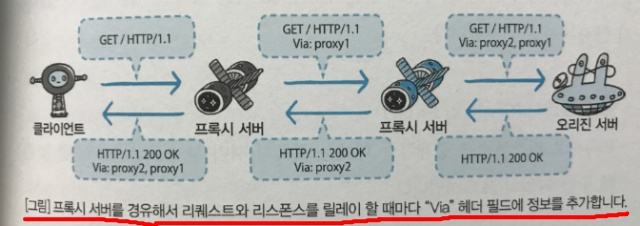
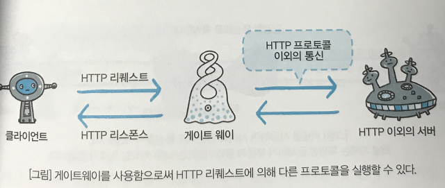
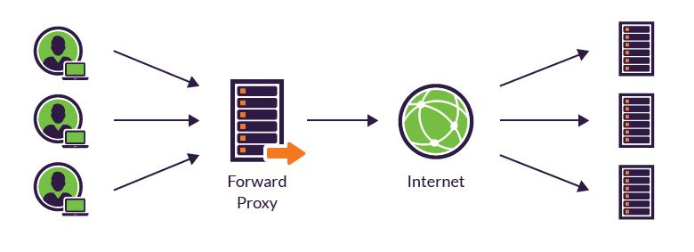
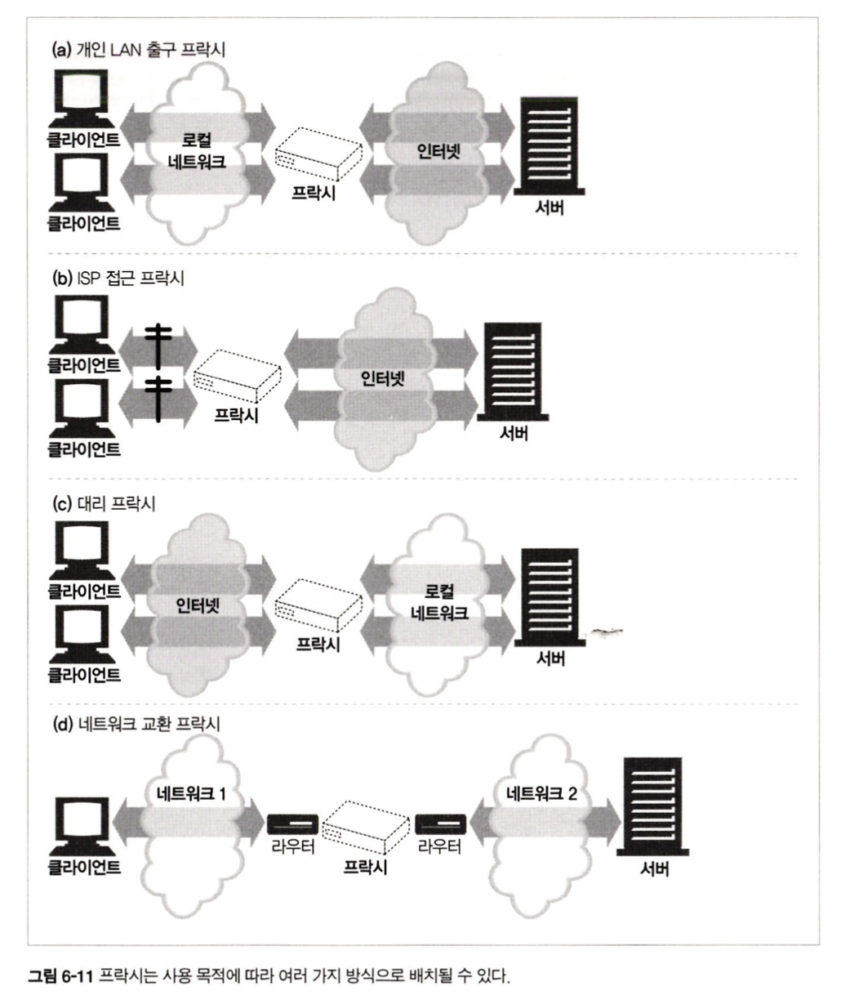
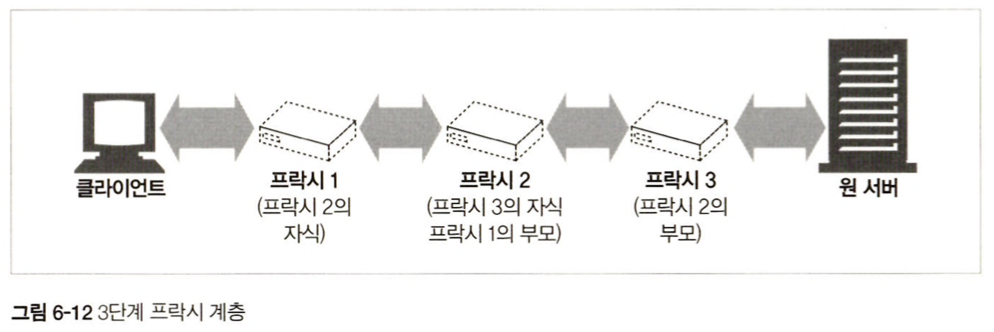
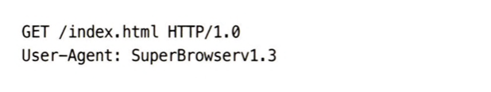
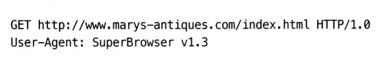
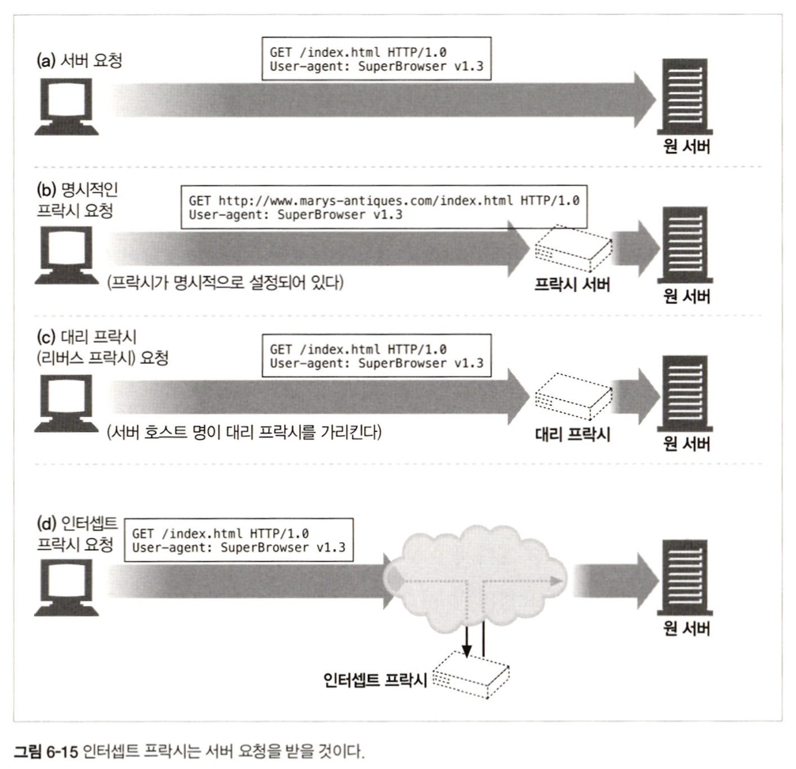
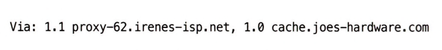
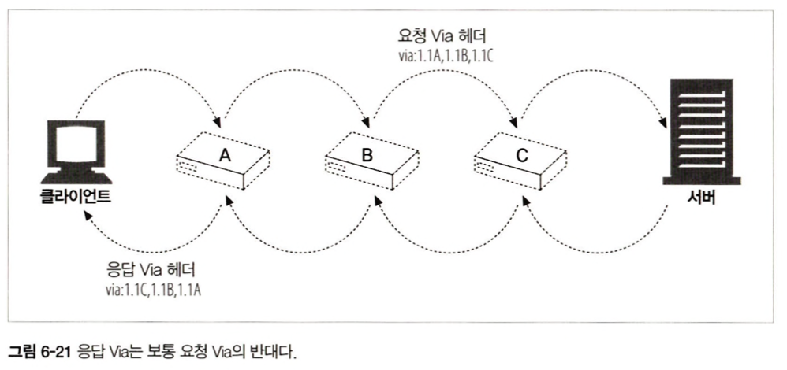

 
 
 

### 6.1.2 프록시 vs 게이트웨이

**`프록시`**  
클라이언트와 서버 사이의 중개자.  
클라이언트 서버 사이에서 요청, 응답을 건네준다.    
서로 다른 HTTP 버전을 중개하는 경우 약간의 프로토콜 변환을 하기도 한다.
사용 목적: 네트워크 캐싱, 특정 웹 사이트 액세스 방지, 보안 방화벽 (보안 강화), 웹 캐시 문서 접근 등

    

**`게이트웨이`**  
리소스와 어플리케이션 사이의 중개자.  
어플리케이션이 보내는 HTTP 트래픽을 다른 프로토콜의 트래픽으로 변환해서 전달한다.  
사용 목적: 애플리케이션에서 다른 프로토콜을 쓰는 리소스를 받아오기 위해

    

`공통점`  
둘 다 내부 네트워크를 인터넷으로 라우팅한다.

 

#### cf. **`API 게이트웨이 `**
위에서 말하는 게이트웨이보다는 프록시 서버에 가깝다.  
서버 최앞단에 위치하여 모든 API 호출을 받는다.  
인증, IP 허용/차단, 클라이언트 속도 제한, 응답 캐싱, 방화벽, GZIP 압축, 정적 콘텐츠 서빙, 모니터링 및 로깅, SSL 지원 등 다양한 기능을 한다. 
MSA에서는 한 서비스에 한 개 이상의 서버, 그리고 이로 인한 다수의 엔드포인트가 생기기 때문에 엔드 포인트 변경 등을 관리하기가 힘든데, API 게이트웨이를 이용하면 단일 진입점을 통해 이를 관리할 수 있다.  
`구현 옵션`  
리버스 프록시 서버(ex. Nginx, HAProxy..)  
서비스 메시 수신 컨트롤러(linkerd/istio 같은 서비스 메시를 사용하는 경우 수신 컨트롤러가 해당 기능을 제공)

    

 
 

#### cf. **`리버스 프록시와 포워드 프록시`**

    

    

 
 
 

### 6.2 왜 프락시를 사용하는가?
프록시는 보안을 개선하고, 성능을 높여주며, 비용을 절약한다.  
또 모든 HTTP 트래픽을 들여다보고 건드릴 수 있다.  

`하는 일`
- 필터링
- 리소스 접근 제어
- 보안 방화벽 : 내부로 들어오거나 나가는 응용 레벨 프로토콜 흐름을 한 지점에서 통제
- 웹 캐시
- 대리 프록시
- 콘텐츠 라우터 : 요청을 가까운 복제 캐시로 전달
- 트랜스 코더 : 프록시 서버는 콘텐츠를 클라이언트에 전달하기 전에 본문 포맷을 수정할 수 있다. 이처럼 데이터 표현 방식을 자연스럽게 변환하는 것을 트랜스코딩이라고 한다.(ex. 크기를 줄이기 위해 자신을 거쳐가는 gif 이미지를 jpg 이미지로 변환)
- 익명화 프록시 : HTTP 메시지에서 신원을 식별할 수 있는 특성들(클라이언트 IP, From 헤더, Referer 헤더, 쿠키, URI 세션 아이디)을 제거

 
 

### 6.3.1 프록시 서버 배치

    

#### `출구(Egress) 프록시`
프록시가 로컬 네트워크의 출구에 존재.
사용 예시 : 방화벽, 필터링 출구 프록시(ex.어린이 필터)

#### `접근(입구) 프록시`
ISP 접근 지점에 위치.
사용 예시 : ISP가 인터넷 사용자들의 다운로드 속도 개선, 대역폭 비용을 줄이기 위해 캐시 프록시를 사용해 많이 찾는 문서들의 사본을 저장

#### `대리 프록시`
가장 끝에 있는 웹 서버 바로 앞에 위치. 일반적으로 웹 서버의 이름과 IP 주소로 스스로를 가장.  
사용 예시 : 보안 기능 추가, 웹 서버 캐시

#### `네트워크 교환 프록시`
충분한 처리 능력을 갖춘 프록시가 네트워크 사이의 인터넷 피어링 교환 지점에 위치
사용 예시 : 캐시를 이용해 인터넷 교차로의 혼잡을 완화, 트래픽 흐름을 감시

 
 

### 6.3.2 프록시 계층
프록시 계층에서 프록시 서버들은 부모와 자식 관계를 갖는다.  
서버에 가까운 쪽을 `부모(인바운드 프록시)`라고 부르고, 클라이언트에 가까운 쪽을 `자식(아웃바운드 프록시)`이라고 부른다.  

    

 
 

### 프록시 계층 콘텐츠 라우팅
프록시가 항상 정적인 방향으로만 메시지를 보내는 건 아니며, 상황에 맞게 프록시 혹은 서버에 라우팅을 해주기도 한다.  

> ex)
> - 요청된 객체가 콘텐츠 분산을 위해 돈을 지불한 웹 서버에 속한다면, 프록시는 요청을 가까운 캐시 서버에 보내거나 그럴 수 없을 때에는 원 서버에 보낸다.
> - 요청이 특정 종류 이미지인 경우, 접근 프록시는 그 요청을 특화된 압축 프록시에 보내 압축하여 느린 모뎀으로 접속했더라도 빠르게 다운로드할 수 있게 한다.

 

`동적 부모 선택의 유형`
1. 부하 균형 : 자식 프록시는 부하 분산을 위해 현재 부모들의 작업량 수준에 근거하여 부모 프록시를 고른다.
2. 지리적 인접성에 근거한 라우팅 : 자식 프록시는 원 서버의 지역을 담당하는 부모를 선택할 수 있다.
3. 프로토콜/타입 라우팅 : URI에 근거하여 다른 부모나 원 서버로 라우팅 할 수 있다.
4. 유로 서비스 가입자를 위한 라우팅 : 웹 서비스 운영자가 빠른 서비스를 위해 추가금을 지불했다면, 대형 캐시나 성능 개선을 위한 압축 엔진으로 라우팅될 수 있다.

 
 

### 6.3.3 어떻게 HTTP 트래픽이 프록시로 향하는 길을 찾아내는가

1. 클라이언트를 수정한다.  
구글 크롬 등 많은 웹 클라이언트들은 수동 혹은 자동 프록시 설정을 지원한다. 만약 클라이언트가 프록시를 사용하도록 설정되어 있다면, 클라이언트 HTTP 요청을 여기에서 바로 프록시로 보낸다.  

2. 네트워크를 수정한다.  
클라이언트는 알지 못하는 상태에서, 네트워크 인프라를 가로채서 웹 트래픽이 프록시로 가도록 조정한다. 이런 역할을 수행하는 스위칭 장치와 라우팅 장치를 필요로 하며, 이러한 프록시를 `인터셉트 프록시`라고 부른다.

3. DNS 이름공간을 수정한다.  
대리 프록시는 웹 서버의 이름과 IP 주소를 자신이 직접 사용한다. 그러면 모든 요청은 서버 대신 대리 프록시로 가는데, 이는 DNS 이름 테이블을 수동으로 편집하거나 사용할 적절한 프록시 서버를 계산해주는 특별한 동적 DNS 서버를 이용해서 조종될 수 있다.  
(때로 실제 서버의 IP 주소와 이름이 변경되고, 대리 프록시에게는 이전 주소와 이름이 주어지기도 함)

4. 웹 서버를 수정한다.  
웹 서버는 HTTP 리다이렉션 명령을 클라이언트에 돌려주고, 리다이렉트를 받는 즉시 클라이언트는 프록시와의 트랜잭션을 시작한다.  

 
 

### 6.4 브라우저가 프록시를 설정하는 방법

1. `수동 설정` : 프록시를 사용하겠다고 **명시적으로 설정**한다. 하나의 프록시 서버만을 지정할 수 있고, 장애 시 대체 작동 지원도 없다. (설정 > 고급 설정 > 프록시 설정 변경에서 사용자가 수동으로 설정할 수 있다)
2. `브라우저 기본 설정` : 브라우저 벤더 혹은 배포자가 기본 설정을 해둘 수 있다.
3. `프록시 자동 설정` (Proxy Auto Configuration, PAC) : PAC 파일에 대한 URI를 제공할 수 있다. 이 파일에는 프록시를 써야하는지, 그렇다면 어떤 프록시 서버를 써야하는지 정보가 담겨있다.
4. `WPAD 프록시 발견` : 대부분 프라우저는 웹 프록시 자동발견 프로토콜(Web Proxy Auto Discovery protocol, WPAD)을 제공한다. WPAD는 브라우저에게 알맞은 PAC 파일을 자동으로 찾아주는 알고리즘이다.

 
 

### 6.5.1 프록시 URI는 서버 URI와 다르다

서버 URI : 부분 URI

    

-> 단일 서버는 자신의 호스트 명과 포트번호를 알고 있으므로.  
-> 클라이언트가 프록시를 사용하지 않도록 설정되어 있다면 부분 URI를 보낸다

 

프록시 URI : 완전한 URI

    

-> 프록시는 목적지 서버와 커넥션을 맺어야 하기 때문에 서버 이름을 알 필요가 있다.   
-> 클라이언트가 프록시를 사용도록 설정되어 있다면 완전한 URI를 보낸다

 
 

### 6.5.2 가상 호스팅에서 일어나는 같은 문제
한편, 가상으로 호스팅 되는 웹 서버는 여러 웹 사이트가 같은 물리적 웹 서버를 공유하므로, 요청이 접근하고자 하는 웹 사이트의 호스트 명을 알 필요가 있다(프록시 URI처럼)  
`해결 방안` : 프록시와 달리, 가상 호스팅 웹 서버는 호스트, 포트에 대한 정보가 담겨 있는 Host 헤더를 요구한다.

 
 

### 6.5.3 인터셉트 프록시는 부분 URI를 받는다

    

`인터셉트 프록시`를 사용할 경우, 클라이언트는 프록시의 존재를 모르기 때문에, 부분 URI를 보낸다.  
`대리 프록시`도 이유는 다르지만 부분 URI를 받는다. (원 서버의 호스트 명과 아이피 주소를 사용해 원 서버를 대신하기 때문)

 
 

### 6.5.4 프록시는 프록시 요청과 서버 요청을 모두 다룰 수 있다
다목적 프록시 서버는 요청 메시지의 완전한 URI와 부분 URI 모두를 지원해야한다.  
프록시는 명시적 프록시 요청에 대해서는 완전 URI를 사용하고 아니면 부분 URI를 사용해야하며, 웹 서버 요청의 경우 가상 Host 헤더를 사용해야한다.  
> 사용 규칙
> - 부분 URI + Host 헤더가 주어지면 이를 조합해서 완전 URI를 알아냄
> - 부분 URI + 대리 프록시라면 프록시에 실제 서버의 주소와 포트 번호가 설정되어 있을 수 있다
> - 부분 URI + Host 헤더가 없지만 이전에 어떤 인터셉트 프록시가 가로챘던 트래픽을 받았고 그 프록시가 원 IP 주소와 포트번호를 사용할 수 있도록 해두었다면 그 IP 주소와 포트를 사용할 수 있다(20장 참고)
> - 모두 실패했다면 에러 메시지를 반환

 
 

### 6.5.5 전송 중 URI 변경
프록시 서버는 요청 URI 변경을 되도록 하지 않아야 한다. (사소해보이더라도 다운스트림 서버와 상호운용성 문제를 일으킬 수 있음)
따라서 프록시 서버는 **가능한 한 모든 실수에 관대해야하고, 프로토콜 경찰처럼 굴어서는 안된다.**  
특히 HTTP 명세는 인터셉트 프록시가 URI를 전달할 때 경로를 고쳐쓰는 것을 절대 금지한다(유일한 예외는 빈 경로를 '/'로 교체하는 것)

 
 

### 6.5.8 명시적인 프록시를 사용할 때의 URI 분석
명시적 프록시를 쓰면, 브라우저는 어떤 URI 확장도 수행할 수 없다

 
 

### 6.6.1 Via 헤더
via 헤더는 메시지가 지나는 각 중간 노드(프록시나 게이트웨이)의 정보를 나열한다.

    

이 필드는 메시지 전달을 추적하고, 메시지 루프를 진단하고, 요청과 응답 과정에 관여하는 모든 메시지 발송자들의 프로토콜을 다루는 능력을 알아보기 위해 사용된다.  

 

> `Via 헤더를 통한 라우팅 루프 탐지`  
`라우팅 루프`? 패킷이 목적지를 찾지 못하고 끊임없이 순환하는 현상. 2개 이상의 라우터들이 동일 목적지 네트워크 경로에 대해 부정확한 정보를 가질 때 발생.
이를 탐지하기 위해 요청을 보내기 전에 자신을 가리키는 unique한 문자열을 via 헤더에 삽입하고 이 문자열로 들어온 요청이 있는지를 검사한다.

#### Via 요청과 응답 경로

    

 

#### Via가 개인정보 보호와 보안에 미치는 영향 
via를 통해 호스트 이름과 포트가 노출되면 이를 악의적인 집단에서 이용할 수도 있기 떄문에, 보안 경계선에 존재하는 프록시는 호스트 명을 적당한 가명으로 교체해줘야한다.  
또 강력한 보안 요구 사항이 있을 경우, 여러 경유지 항목들이 하나로 뭉뚱그려지기도 한다.

 
 

### 6.6.2 TRACE 메서드

#### `Max-Forwards`
TRACE, OPTIONS 요청이 건널 수 있는 프록시 홉 갯수를 제한하는 헤더. 하나의 홉을 지날 때 마다 값이 1만큼 감소하고, 0이 되면 origin 서버에 도착하지 않았다할지라도 클라이언트로 메시지를 돌려줘야 한다.

 
 

### 6.7 프록시 인증
- 제한된 콘텐츠에 대한 요청이 오면, 프록시 서버는 접근 자격을 요구하는 407 Proxy Authorization Required 상태 코드를 어떻게 그러한 자격을 제출할 수 있는지 설명하는 Proxy-Authenticate 헤더 필드와 함께 반환할 수 있다.
- 407 응답을 받은 클라이언트는 자격을 수집해(로컬 db 확인, 사용자에게 질의..) 이를 Proxy-Authorization 헤더에 담아 요청을 다시 보낸다.

한편, 프록시 인증은 인증에 참여하는 프록시가 프록시 연쇄(pipeline)상 여러 개 있을 때는 일반적으로 잘 동작하지 않는다. 
특정 경유지와 인증 자겨을 서로 짝지어 주는 HTTP의 기능 확장을 제안했지만, 널리 구현되지는 않았다.

 
 

### 6.8.1 지원하지 않는 헤더와 메서드 다루기
**`프록시는 이해할 수 없는 헤더 필드와 메서드도 반드시 다음 홉으로 전달해야 한다.`** (간혹 그렇지 않은 프록시가 있다면 잘못 구현된 것)

 
 

### 6.8.2 OPTIONS: 어떤 기능을 지원하는지 알아보기
서로 다른 기능 수준의 서버와 프록시가 더 쉽게 상호작용할 수 있도록 클라이언트는 OPTIONS를 이용해 서버의 능력을 먼저 알아낼 수 있다.  
이떄 Allow 헤더가 응답으로 오는데, 프록시는 자신이 이해할 수 없는 메서드가 담긴 allow 헤더도 그대로 bypass 한다.