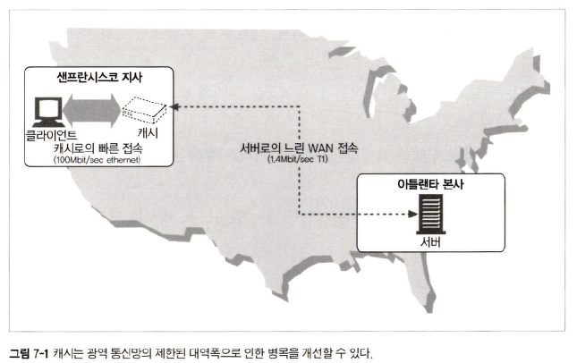
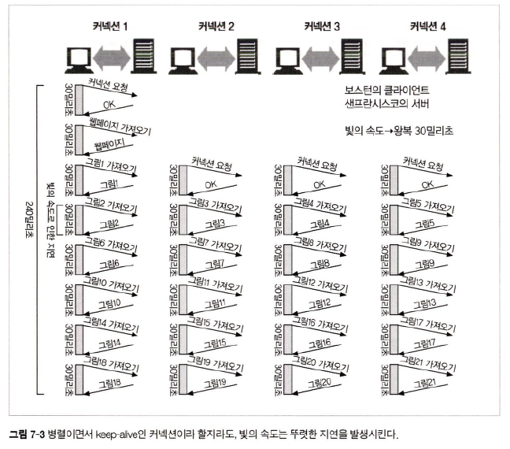
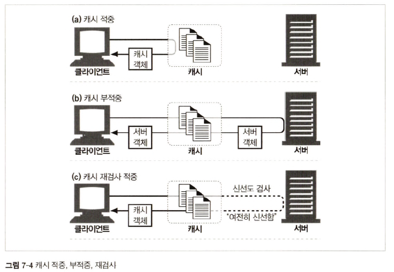
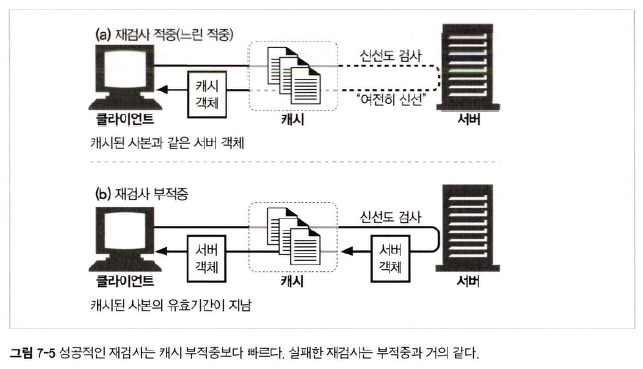
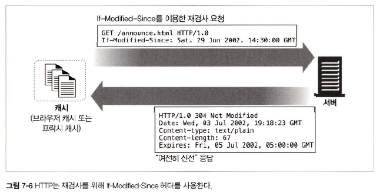
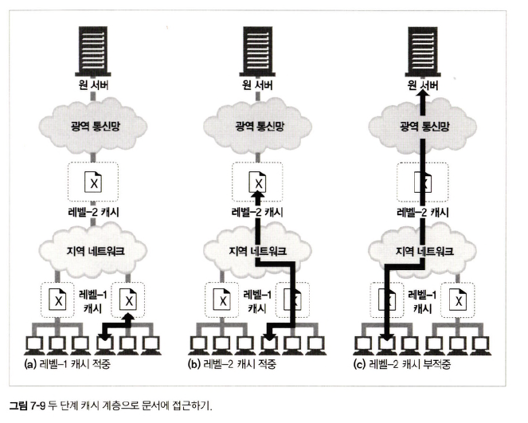
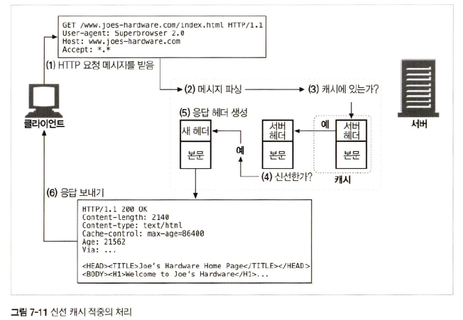
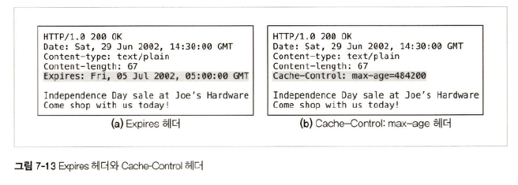
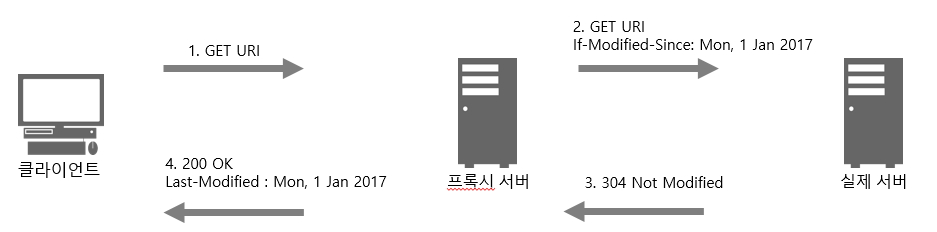

# 7장 캐시

## 7.2 대역폭 병목

> 클라이언트 &harr; 서버 접근 속도 = 해당 경로에 있는 가장 느린 네트워크 속도  
> 클라이언트가 빠른 LAN에 있는 캐시로 접근 &rarr; 성능 대폭 개선 가능

<div align="center">
    
</div>

- `샌프란시스코 <-> 아틀란타` 속도 < `샌프란시스코 <-> 샌프란시스코 근처 캐시` 속도

## 7.4 거리로 인한 지연

<div align="center">
    
</div>

## 7.5 적중과 부적중

- `cache hit` : 캐시에 요청이 도착했을 때 이에 **대응하는 리소스가 있는 경우**
- `cache miss` : 캐시에 요청이 도착했을 때 이에 **대응하는 리소스가 없어 원 서버로 요청을 전달하는 경우**

<div align="center">
    
</div>

### 7.5.1 재검사(Revalidation)

> 신선도 검사(= HTTP 재검사)란, 캐시 서버가 갖고 있는 리소스 == 원 서버 리소스 &rarr; 최신 상태 확인

<div align="center">
    
</div>

#### `재검사 적중(= 느린 적중)`
- 캐시 리소스가 최신 상태인지 확인하기 위해 원 서버에 확인 요청
- if 최신 상태 &rarr; 원 서버 `304 Not Modified` 응답
- 캐시 리소스가 최신 상태임을 알게돼 클라이언트에게 해당 리소스 응답 &rarr; `느린 적중`
- `cache miss` 보다는 빠름 ∵ 캐시 &rarr; 원 서버 요청 x

#### If-Modified-Since 헤더

> 캐시된 리소스를 재확인 하기 위한 HTTP 헤더  
> GET 요청에 해당 헤더를 추가하면 캐시된 시간 이후 변경된 경우에만 리소스 응답 요청

|재검사 적중(= 캐시가 최신 상태인 경우)| 재검사 부적중(= 캐시가 최신 상태가 아닌 경우)                      | 본 리소스가 삭제된 경우                            |
|:-------|:-------------------------------------------------|:-----------------------------------------|
|<div align="center"></div>| 원 서버 캐시 리소스에 해당하는 <br/> **최신 리소스와 함께 200 OK 응답** | 원 서버가 `404 NOT FOUND` 응답하여 **캐시 리소스 삭제** |

### 7.5.2 적중률

> 캐시가 요청을 처리하는 비율

### 7.5.3 바이트 적중률

> 캐시를 통해 제공된 모든 바이트의 비율 &rarr; 트래픽 절감 정도 확인

## 7.6 캐시 토폴로지

|private cache|public cache|
|:------------|:----------|
|한 명에게만 할당된 캐시|공유된 캐시|
|타인과 공유되는 프록시 서버에 캐시 저장 x|어떤 요청에 대해서든 캐시 저장|
|ex) 보통 한 명의 사용자가 자주 찾는 페이지|ex) 사용자 집단에게 자주 쓰이는 페이지|

### 7.6.3 프락시 캐시 계층들

<div align="center">
    
</div>

## 7.7 캐시 처리 단계

<div align="center">
    
</div>

```text
1. 요청 받기 : 캐시로 도착한 요청 메세지 읽음
2. 파싱 : 메세지를 파싱하여 URL, 헤더 추출
3. 검색 : 캐시에 리소스 확인하고 없으면 원 서버에 요청하여 저장
4. 신선도 검사 : 캐시 리소스가 최신 상태인지 검사하고 아니라면 변경 사항이 있는지 원 서버에 요청
5. 응답 생성 : 캐시 -> 새로운 헤더와 캐시된 본문으로 응답 메세지 생성(캐시 신선도 정보 삽입 ex) Cache-Control, Age, Expires)
6. 발송 : 클라이언트 응답
7. 로깅 : 캐시된 트랜잭션에 대해 로그
```

## 7.8 사본을 신선하게 유지하기

### 7.8.1 문서 만료

<div align="center">
    
</div>

- `Expires 헤더` : 리소스 유효 기간  
- `Cache-Control` 헤더
  - `max-age = n` : n초 단위로 캐시 신선도 설정, n초 이후 원 서버에 요청한 뒤 304 응답을 받을 때에만 캐시 이용
  - `no-cache` : 캐시가 유효한지 확인하기 위해 매번 서버에 요청
  - `no-store` : 어떤 요청도 캐시로 저장 x

### 7.8.4 조건부 메서드와의 재검사

#### If-Modified-Since <date>

<div align="center">
    
</div>

```text
1. 클라이언트 리소스 요청
2. 프록시 서버는 클라이언트 요청 전달할 때 캐시된 리소스임을 알고 If-Modified-Since 헤더에 Last-Modified 값을 담아 전달
3. 실제 서버는 동일한 리소스임을 확인하고 캐시 리소스를 제공하라는 의미로 304 Not Modified 응답
4. 캐시 리소스 클라이언트에 전달
```

#### If-Match <tags> &rarr; 캐시 리소스가 변경되지 않고 같은 경우

> 웹 서버 리소스 별로 `ETAG` 태그를 부여  
> 리소스 변경시 동시 작업의 경우 무결성 훼손 방지를 위해 `If-Match` 헤더 사용  
> `ETag 헤더`란, 웹 서버가 제공하는 리소스에 부여되는 ID &rarr; 클라이언트, 프록시 해당 정보를 다음 요청(subsequence request)에 활용

- 같은 이름의 파일이지만 파일 변경이 일어난 경우 &rarr; **ETag도 변경**

#### If-None-Match <tags> &rarr; 캐시 리소스가 변경된 경우

> GET 요청에서는 `If-Modified-Since` 헤더와 유사하게 처리  
> `If-None-Match` 헤더를 이용해 캐시 변경 여부를 묻고 동일하다면 `304 Not Modified` 응답, 다르면 `200 OK`로 변경된 데이터와 함께 응답

### 7.9.4 Must-Revalidate 응답 헤더

> 캐시를 원 서버와의 최초의 재검사 없이 캐시 리소스 제공 x

- `no-cache` : `must-revalidate` = 매번 재검사 : 최초 재검사
