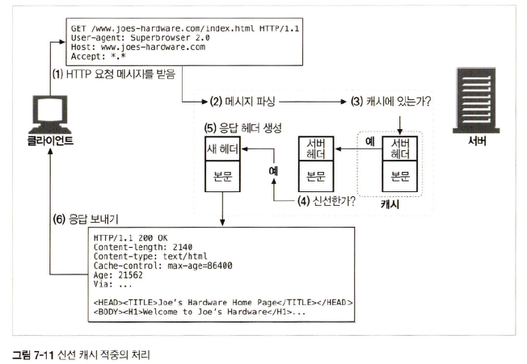

# 7장 캐시

웹 캐시는 자주 쓰이는 문서의 사본을 자동으로 보관하는 HTTP 장치다.

웹 요청이 캐시에 도착했을 때, 캐시된 로컬 사본이 존재한다면, 그 문서는 원 서버가 아니라 그 캐시로 부터 제공된다.

## 7.1 불필요한 데이터 전송

- 다수의 클라이언트가 하나의 페이지를 서버에 요청시에 서버는 같은 문서를 네트워크를 통해 각각 전송한다.
- 값비싼 네트워크 대역폭을 잡아먹고, 전송을 느리게 만들며, 웹 서버에 부하를 준다.

## 7.2 대역폭 병목

- 캐시는 네크워크 병목을 줄여준다.
- 많은 네트워크가 원격 서버보다 로컬 네트워크 클라이언트에 더 넓은 대역폭을 제공한다.

## 7.3 갑작스런 요청 쇄도(Flash Crowds)

- 많은 사람들이 거의 동시에 웹 문서에 접근할 때 트래픽이 급증하고 네트워크와 웹 서버의 장애를 일으키는데, `캐싱`은 중요한 역할을 한다.

## 7.4 거리로 인한 지연

- 클라이언트와 서버 사이에 라우터가 그지 많지 않더라도, 빛의 속도 그 자체가 유의미한 지연을 유발한다.
- 클라이언트와 서버간의 거리가 멀수록, 커넥션의 개수가 많아지면, 네트워크 지연은 커지게 된다.

## 7.5 적중과 부적중

`캐시 적중(cache hit)`이란 캐시에 요청이 도착했을 때, 만약 그에 대응하는 사본이 있다면 그것을 이용해 요청을 처리하는 것이다.

`캐시 부적중(cache miss)`이란 대응하는 사본이 없다면 그냥 원 서버로 전달된다.

### 7.5.1 재검사(Revalidation)

- 원 서버 리소스는 변경될 수 있기 때문에, 반드시 그들이 갖고 있는 사본이 최신인지 서버를 통해서 점검해야한다.
- `신선도 검사`를 `HTTP 재검사`라고 부른다.
- 캐시는 스스로 원한다면 언제든지 사본을 재검사할 수 있다.
- 캐시가 문서를 수백만 개씩 갖고 있는 경우에는 네트워크 대역폭이 부족하므로, 캐시는 클라이언트가 사본을 요청하였으며 그 사본이 검사를 할 필요가 있을 정도로 충분히 오래된 경우에만 재검사를 한다.

### 7.5.2 적중률

- 캐시가 요청을 처리하는 비율을 `캐시 적중률` 이라고 부른다.
- 캐시 적중률이 100%에 근접할 수록 모든 요청이 캐시에 적중한 것이다.
- 일반적으로 40%면 웹 캐시로 괜찮다고 본다.

### 7.5.3 바이트 적중률

- 문서들이 모든 같은 크기가 아니기 때문에 문서 적중률이 모든 것을 말해주지 않는다.
- 바이트 단위 적중률은 캐시를 통해 제공된 모든 바이트의 비율을 표현한다.
- 문서 적중률을 개선하면 전체 대기시간(지연)이 줄어든다.
- 바이트 단위 적중률은 얼마나 많은 바이트가 인터넷으로 나가지 않았는지 보여준다.
- 바이트 단위 적중률을 개선하면 대역폭 절약을 최적화한다.

### 7.5.4 적중과 부적중의 구별

- HTTP는 클라이언트에게 응답이 캐시 적중이었는지 아니었는지에 대해서 말해주지 않는다.
- 클라이언트는 Date 헤더 값을 현재 시각과 비교하여, 응답의 생성일이 더 오래되었다면 클라이언트는 응답이 캐시된 것임을 알아낼 수 있다.

## 7.6 캐시 토폴로지

### 7.6.1 개인 전용 캐시

- 많은 에너지나 저장 공간을 필요로 하지 않으므로, 작고 저렴하다.
- 웹 브라우저는 개인 전용 캐시를 내장하고 있다.
- 대부분의 브라우저는 자주 쓰이는 문서를 개인용 컴퓨터의 디스크와 메모리에 캐시해 놓고, 사용자가 캐시 사이즈와 설정을 수정할 수 있도록 허용한다.
- 크롬에서는 특별한 url인 `about:cache` 를 통해 확인한다.

### 7.6.2 공용 프락시 캐시

- 로컬 캐시에서 문서를 제공하거나, 혹은 사용자의 입장에서 서버에 접근한다.
- 공용 캐시에는 여러 사용자가 접근하기 때문에, 불필요한 트래픽을 줄일 수가 있다.
- 캐시는 자주 찾는 객체를 단 한 번만 가져와 모든 요청에 대해 공유된 사본을 제공하여 네트워크 트래픽을 줄인다.

### 7.6.3 프락시 캐시 계층들

- 작은 캐시에서 캐시 부적중이 발생했을 때 더 큰 부모 캐시가 그 ‘걸러 남겨진’ 트래픽을 처리하도록 하는 계층 을 만드는 방식이 합리적인 경우가 있다.
- 클라이언트 주위에는 작고 저렴한 캐시를 사용하고, 계층 상단에는 많은 사용자들에 의해 공유되는 문서를 유지하기 위해 더 크고 강력한 캐시를 사용한다.
- 캐시 계층이 깊다면 캐시의 긴 연쇄를 따라가게 되고, 각 중간 프락시는 성능 저하가 발생한다.

### 7.6.4 캐시망, 콘텐츠 라우팅, 피어링

- 네트워크 아키텍쳐 중 `캐시망`을 만들고 복잡한 방법으로 서로 대화하여, 어떤 부모 캐시와 대화할 것인지, 아니면 요청이 캐시를 완전히 우회해서 원 서버로 바로 가도록 할것인지에 대한 커뮤니케이션 결정을 내린다.

## 7.7 캐시처리 단계

### 단계 1: 요청받기

캐시는 네트워크로부터 들어오는 데이터를 읽어들인다.

### 단계 2: 파싱

캐시는 요청 메시지를 여러 부분으로 파싱하여 헤더 부분을 조작하기 쉬운 자료 구조에 담는다.

### 단계 3: 검색

캐시는 URL을 알아내고 그에 해당하는 로컬 사본이 있는지 검사한다.

만약 문서를 로컬에서 가져올 수 없다면, 캐시는 원 서버나 부모 프락시에서 가져오거나 혹은 실패를 반환한다.

캐시된 객체는 서버 응답 본문과 원 서버 응답 헤더를 포함하고 있으므로, 캐시 적중 동안 올바른 서버 헤더가 반환될 수 있다.

### 단계 4: 신선도 검사

HTTP는 캐시가 일정 기간 동안 서버 문서의 사본을 보유할 수 있도록 해준다.

이 기간 동안, 문서는 `신선`한 것으로 간주되고 서버를 통하지 않고 이 문서를 제공할 수 있다.

캐시된 사본을 신선도 한계를 넘을 정도로 오래 갖고 있었다면, 그 객체는 `신선하지 않은` 것으로 간주되며, 캐시는 그 문서를 제공하기 전에 문서에 어떤 변경이 있었는지 검사하기 위해 서버와 재검사를 해야 한다.

### 단계 5: 응답 생성

캐시는 캐시된 서버 응답 헤더를 토대로 응답 헤더를 생성한다.

캐시는 클라이언트에 맞게 이 헤더를 조정해야 하는 책임이 있다.

캐시는 캐시 신선도 정보(`Cache-Control`, `Age`, `Expires 헤더`)를 삽입하며, 요청이 프락시 캐시를 거쳐갔음을 알려주기 위해 종종 Via 헤더를 포함시킨다.

### 단계 6: 전송

캐시는 응답 헤더가 준비되면, 응답을 클라이언트에게 돌려준다.

### 단계 7: 로깅

대부분의 캐시는 로그 파일과 캐시 사용에 대한 통계를 유지한다.

각 캐시 트랜잭션이 완료된 후, 통계 캐시 적중과 부적중 횟수에 대한 통계를 갱신하고 로그 파일에 요청 종류, URL 그리고 무엇이 일어났는지를 알려주는 항목을 추가한다.

### 캐시 처리 플로 차트

<div align="center">
    
</div>

## 7.8 사본을 신선하게 유지하기

캐시된 사본 모두가 서버의 문서와 항상 일치하는 것이 아니므로 캐시된 데이터는 서버의 데이터와 일치하도록 관리되어야 한다.

HTTP는 캐시된 사본이 서버와 일치하도록 `문서 만료와 서버 재검사`라는 단순한 메커니즘을 갖는다.

### 1. 문서 만료

HTTP는 `Cache-Control`과 `Expires`라는 헤더들을 이용해서 원 서버가 각 문서에 유효기간을 붙일 수 있게 한다.

이 헤더들은 콘텐츠가 얼마 오랫동안 신선한 상태로 보일 수 있는지 좌우한다.

### 2. 유효기간과 나이

- Cache-Control: max-age
    - max-age 값은 문서의 최대 나이를 정의한다. 문서가 처음 생성된 이후부터, 제공하기엔 더 이상 신선하지 않다고 간주될 때가지 경과한 시간의 최대값(초)이다.
    - `Cache-Control: max-age=484200`
- Expires
    - 절대 유효기간을 명시한다. 만약 유효기간이 경과했다면, 그 문서는 더 이상 신선하지 않다.
    - `Expires: Fri, 05 Oct 2019, 05:00:00 GMT`

### 3. 서버 재검사

캐시된 문서가 만료되었다는 것은 `검사할 시간이 되었음`을 의미하며, 캐시가 원 서버에게 문서가 변경되었는지 여부를 확인하는 `서버 재검사`를 한다.

- 재검사 결과 문서가 변경되었다면, 캐시는 그 문서의 새로운 사본을 가져와 오래된 데이터 대신 저장한 뒤 클라이언트에게 보내준다.
- 재검사 결과 문서가 변경되지 않았다면, 캐시는 새 만료일을 포함한 새 헤더들만 가져와서 캐시 안의 헤더들을 갱신한다.

캐시는 문서의 신선도를 매 요청마다 검증할 필요가 없으며, 문서가 만료되었을 때 한번만 서버와 재검사를 하면 되기 때문에 서버 트래픽을 절약하고 사용자 응답 시간을 개선한다.

### 4. 조건부 메서드와의 재검사

- HTTP는 캐시가 서버에게 조건부 GET 이라는 요청을 보낼 수 있도록 해준다.
- 이 요청은 서버가 갖고있는 문서가 캐시가 갖고 있는 것과 다른 경우에만 객체 본문을 보내달라고 하는 것이다.
- 조건부 GET은 GET 요청 메시지에 특별한 조건부 헤더를 추가함으로써 시작된다.
- HTTP는 다섯 가지 조건부 요청 헤더 중 `If-Modified-Since`와 `If-None-Match`를 가장 유용하게 사용한다.

### 5. If-Modified-Since: 날짜 재검사

`IMS`요청은 서버에게 리소스가 특정 날짜 이후로 변경된 경우에만 요청한 본문을 보내달라고 한다.

- 만약 문서가 주어진 날짜 이후에 변경되었다면, If-Modified-Since 조건은 참이고, GET 요청은 성공한다. 새 문서가, 새로운 만료 날짜와 그 외 다른 정보들이 담긴 헤더들과 함께 캐시에게 반환된다.
- 만약 문서가 주어진 날짜 이후에 변경되지 않았다면 조건은 거짓이고, 서버는 `304 Not Modified` 응답 메시지를 클라이언트에 돌려준다. 효율을 위해 본문은 보내지 않는다.
- If-Modified-Since 헤더는 `Last-Modified` 헤더와 함께 동작한다. 서버가 최근 변경 일시를 붙인다.

### 6. If-None-Match: 엔터티 태그 재검사

퍼블리셔가 문서를 변경했을 때, 그는 문서의 엔터티 태그를 새로운 버전으로 표현 할 수 있다.

엔터티 태그가 변경되었다면, 캐시는 새 문서의 사본을 얻기 위해 If-None-Match 조건부 헤더를 사용할 수 있다.

- 캐시는 엔터티 태그 ‘V2.6’인 문서를 갖고있다.
- 캐시는 서버에게 엔터티 태그가 ‘V2.6’이 아닌 경우에만 새 객체를 달라는 요청 방식으로 유효한지 여부를 재검사한다.
- 서버의 엔터티 태그가 변하지 않았다면, `304 Not Modified` 응답이 반환된다.

캐시가 객체에 대한 여러 개의 사본을 갖고 있는 경우, 하나의 If-None-Match에 여러개의 엔터티 태그를 포함 시킬 수 있다.

`If-None-Match: "V2.4", "V2.5", "V2.6"`

### 7. 약한 검사기와 강한 검사기

서버는 때때로 모든 캐시된 사본을 무효화시키지 않고 문서를 살짝 고칠 수 있도록 허용하고 싶은 경우가 있다.

- 약한 검사기
    - 콘텐츠가 조금 변경되었더라도 `그 정도면 같은 것`이라고 서버가 주장할 수 있도록 해준다
    - 서버는 `W/` 접두사로 약한 검사기를 구분한다.
    - `If-None-Match: W/"v1.0"`
- 강한 검사기
    - 콘텐츠가 바뀔 때마다 바뀐다.

### 8. 언제 엔터티 태그를 사용하고 언제 Last-Modified 일시를 사용하는가

HTTP 클라이언트는 서버가 엔터티 태그를 반환했다면, 반드시 엔터티 태그 검사기를 사용해야 한다.

서버가 `Last-Modified` 값만을 반환했다면, 클라이언트는 If-Modified-Since 검사를 사용할 수 있다.

## 7.9 캐시 제어

HTTP는 문서가 만료되기 전까지 얼마나 오랫동안 캐시될 수 있게 할 것인지 서버가 설정할 수 있는 여러 가지 방법을 정의한다.

### 1. no-cache와 no-store 응답 헤더

```
Cache-Control: no-store
Cache-Control: no-cache
Pragma: no-cache
```

- no-store가 표시된 응답은 캐시가 그 응답의 사본을 만드는 것을 금지한다.
- no-cache로 표시된 응답은 사실 로컬 캐시 저장소에 저장될 수 있다.
- Pragma: no-cache 헤더는 HTTP/1.0+와의 하위호환성을 위해 HTTP/1.1에 포함되어 있다.

### 2. Max-Age 응답 헤더

신선하다고 간주되었던 문서가 서버로부터 온 이후로 흐른 시간이고, 초를 나타낸다.

`s-maxage` 헤더는 `max-age`와 같지만, 공유된(공용) 캐시에만 적용된다.

```
Cache-Control: max-age=3600
Cache-Control: s-maxage=3600
```

서버는 최대 maximum aging을 0으로 설정함으로써, 캐시가 매 접근마다 문서를 캐시하거나 리프레시하지 않도록 요청할 수 있다.

### 3. Expires 응답 헤더

(deprecated) Expires 헤더는 초 단위의 시간 대신 실제 만료 날짜를 명시한다.

HTTP를 설계한 사람들은 많은 서버가 동기화 되어 있지 않거나 부정확한 시계를 갖고 있기 때문에, 만료를 절대시간 대신 경과된 시간으로 표현하는 것이 낫다고 판단한다.

`Expires: Fri 05 Oct 2019, 05:00:00 GMT`

### 4. Must-Revalidate 응답 헤더

캐시는 성능을 개선하기 위해 신선하지 않은 객체를 제공하도록 설정될 수 있다.

캐시가 만료 정보를 엄격하게 따르길 원한다면, 원 서버는 `Cache-Control: must-revalidate` 를 붙인다.

캐시가 이 객체의 신선하지 않은 사본을 원 서버와의 최초의 재검사 없이는 제공해서는 안 됨을 의미한다.

### 5. 휴리스틱 만료

만약 응답이 max-age 헤더나 expires 헤더 중 어느 것도 포함하지 않고 있다면, 캐시는 경험적인 방법으로(heurisitic) 최대 나이를 계산한다.

## 7.10 자세한 알고리즘

### 1. 나이와 신선도 수명

캐시된 문서가 신선하지 알려주려면, 캐시는 `사본의 나이`와 `신선도 수명` 단 두 가지만 계산하면 된다.

```
$충분히_신선한가 = ($나이 < $신선도_수명)
```

문서의 나이 = 서버가 문서를 보낸 후 그 문서가 `나이를 먹은` 시간의 총합

신선도 수명 = 아직 문서가 신선하다고 볼 수 있는 수명

### 2. 나이 계산

- 응답이 서버에서 생서되었을 때부터 지금까지의 총 시간
- 인터넷상의 라우터들과 게이트웨들 사이를 떠돌아다닌 시간과 응답이 캐시에 머물렀던 시간을 포함
    
    겉보기나이=max(0,겉보기나이=max(0,응답을_받은_시각 - Date헤더값);Date헤더값);보정된_겉보기_나이 = max(겉보기나이,겉보기나이,Age_헤더값);
    
    응답지연추정값=(응답지연추정값=(응답을_받은_시각 - 요청을보낸시각);요청을보낸시각);문서가_우리의_캐시에_도착했을_때의_나이 = 보정된겉보기나이+보정된겉보기나이+응답_지연_추정값;사본이우리의캐시에머무른시간=사본이우리의캐시에머무른시간=현재_시각 - $응답을_받은_시각;
    
    나이=나이=문서가_우리의_캐시에_도착했을_때의_나이 + $사본이_우리의_캐시에_머무른_시간;
    

### 3. 완전한 나이 계산 알고리즘

문서에 대한 요청이 캐시에 도착했을 때, 문서의 현재 나이를 계산하기 위해 그 문서가 캐시에 얼마나 오랫동안 머물렀는지 알 필요가 있다.

```
$나이 = $문서가_우리의_캐시에_도착했을_때의_나이 + $사본이_얼마나_오래_우리의_캐시에_있었는지;
```

- 언제 문서가 캐시에 도착했는지 = `$time_got_response`
- 언제 현재 요청이 도착했는지 = `$current_time`