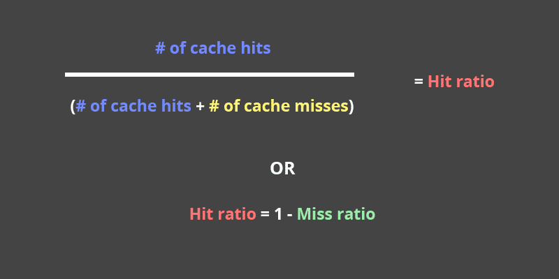
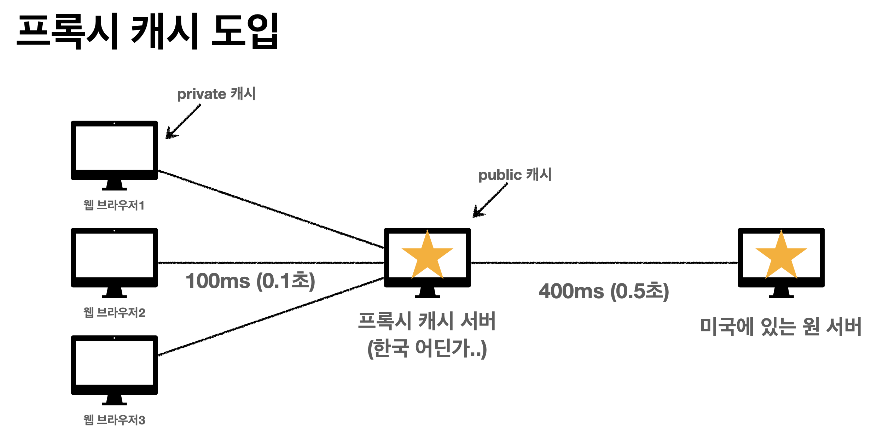
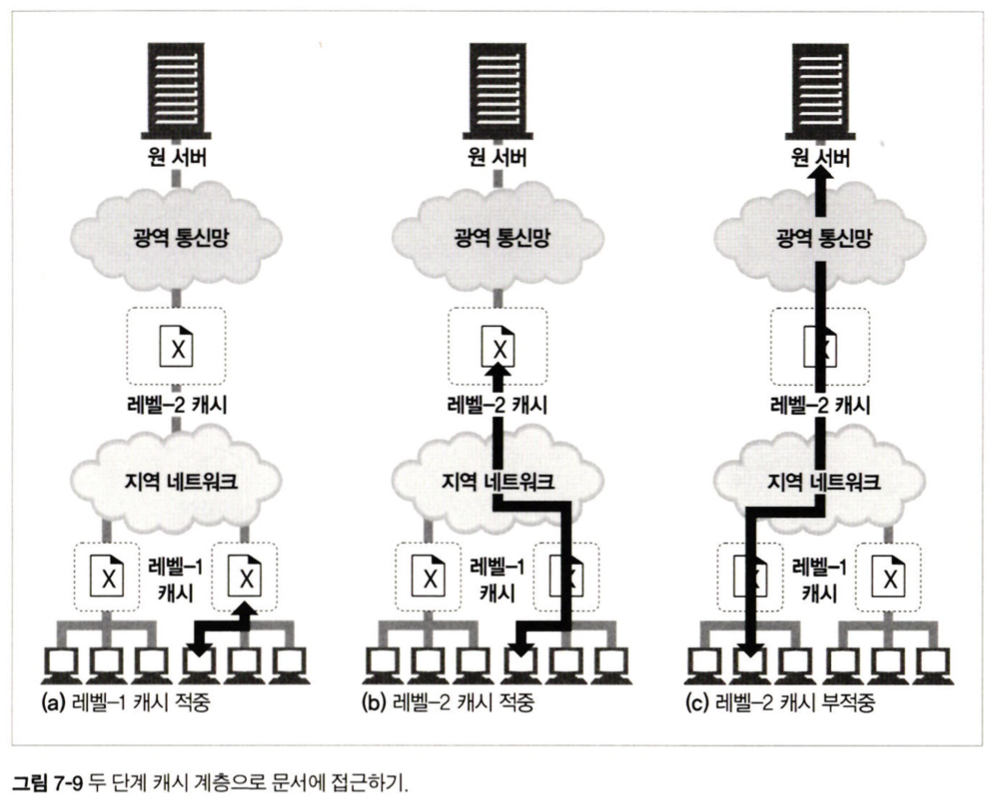
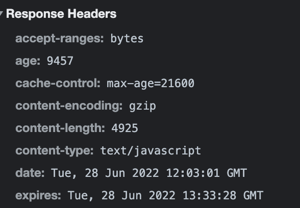
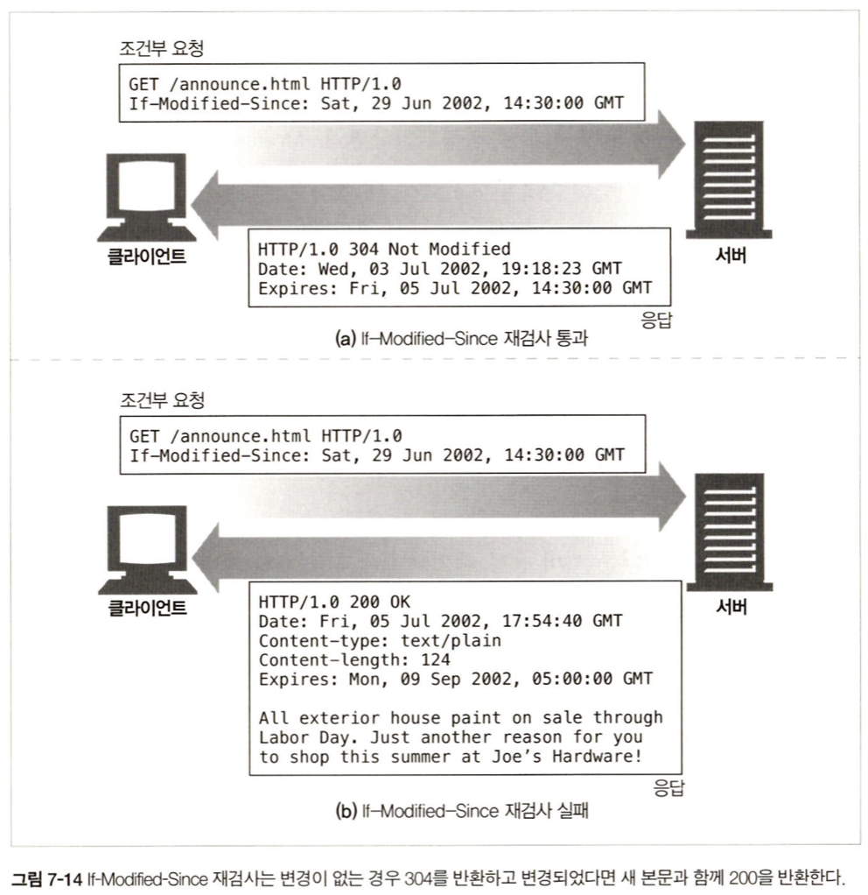
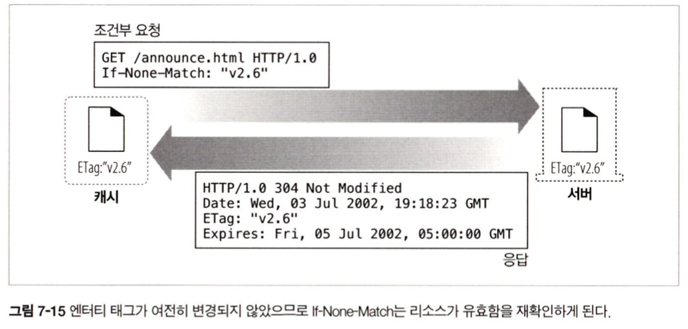

<br>
<br>
<br>

이번 장에서 이야기하는 이야기하는 캐시는 웹 캐시(HTTP Cache)이다.
> 웹 캐시의 종류
> 1. `브라우저 캐시` : 사용자 컴퓨터의 로컬 저장소에 이전 방문한 웹페이지의 정적 자원을 저장해 사용한다.
> 2. `프록시 웹 캐시` : 클라이언트와 origin 서버 간의 프록시  
> -> ex) `CDN` : 콘텐츠 전송 네트워크(Content Distribution Network). 이를 통해 트래픽을 지역화

<br>
<br>

### 7.2 대역폭 병목
- 캐시는 불필요한 데이터 전송을 줄여 대역폭을 늘리지 않고도 페이지를 빨리 불러올 수 있게 함
- 보통 WAN보다 LAN이 빠름 -> 대부분의 네트워크가 원격 서버보다 로컬 네트워크 클라이언트에 더 넓은 대역폭을 제공하기 떄문

<br>
<br>

### 7.5.1 재검사(Revalidation)
캐시가 자신이 갖고 있는 사본이 최신인지 서버를 통해 점검하는 것 = 신선도 검사 = HTTP 재검사  
-> 재검사 요청에 대해 콘텐츠 변경이 없다면 서버는 아주 작은 304 Not Modified 응답을 보냄  

> 재검사를 위해 HTTP가 제공하는 도구  
> `If-Modified-Since 헤더`  
> GET 요청에 이 헤어가 있으면 해당 시간 이후에 변경된 사본만 보내달라는 의미 (조건부 GET)  

<br>
<br>

### 7.5.2 적중률
<div align="center">
    
</div>

캐시 문서 적중률이 모든 것을 알려주지 않기 때문에, 때로는 바이트 단위 적중률을 측정  
대부분의 웹사이트에 대해서 캐시 적중률은 95-99%, 부적중률은 1-5% 정도가 가장 이상적이라고 한다  
-> 그런데, 높은 적중률 == 빠른 서빙은 아님. cache hit 했지만 매우 멀리있는 서버에서 가져오는 경우는 느릴 수 있음

<br>
<br>

### 7.5.4 적중(hit)과 부적중(miss)의 구별
HTTP는 클라이언트에게 응답이 캐시 적중이었는지 다음과 같은 방식으로 보여준다.
<div align="center">
    
</div>
<div align="center">
    
</div>
이 외에도 응답의 생성일을 표시하는 Date 헤더, 응답이 얼마나 오래되었는지 말해주는 Age 헤더를 통해 해당 응답이 캐시에서 왔는지 여부를 알 수 있다.

<br>
<br>
<br>

### 7.6 캐시 토폴로지

<div align="center">
    
</div>

### 7.6.1 개인 전용 캐시 (private cache)
대부분의 웹브라우저는 private cache를 내장하고 있다. 이 공간에 자주 쓰이는 document를 사용자의 disk와 memory에 캐시해두고, 사용자가 캐시 사이즈와 설정을 수정할 수 있도록 허용한다.  

<br>

### 7.6.2 공용 프록시 캐시
공용 캐시는 흔히 프록시 캐시 / 캐시 프록시 서버라고 불리는 특별한 종류의 공유된 프록시 서비이다.  
수동 프록시를 지정하거나 프록시 자동설정 파일을 설정해 브라우저가 프록시 캐시를 사용하도록 설정할 수 있고, 또 인터셉트 프록시를 이용해 브라우저 설정 없이도 HTTP 요청이 캐시를 통하도록 강제할 수 있다.  

<br>

### 7.6.3 프록시 캐시 계층 (proxy cache layers)
프록시 연쇄가 너무 길어지면 성능 저하가 발생할 수 있다.

<div align="center">
    
</div>

<br>

### 7.6.4 캐시망, 콘텐츠 라우팅, 피어링
캐시망에서 프록시 캐시들은 다음과 같이 복잡한 방법으로 서로 대화하여 동적 라우팅을 수행한다.  

- URL에 근거하여 부모 캐시와 원 서버 중 하나를 동적으로 선택
- URL에 근거하여 특정 부모 캐시를 동적으로 선택
- 부모 캐시에게 가기 전에 캐시된 사본을 로컬에서 찾아봄
- 다른 캐시들이 그들이 캐시된 콘텐츠에 부분적으로 접근할 수 있도록 허용하되, 인터넷 트랜짓(트래픽이 아예 다른 네트워크로 건너가는 것)은 허용하지 않는다.  

<br>

> cf. 피어링과 트랜짓  
> `피어링(동등접속)`: ISP와 ISP가 서로의 가입자에게 트래픽을 전달하는 방식  
> `트랜짓(중계접속)`: 상대측 트래픽을 자사 망 뿐만 아니라 전세계에 있는 모든 ISP의 망에 전달하는 방식. 하위 계위 ISP가 상위 계위 ISP에 트랜짓 대가를 지불하고 트래픽을 보내면 상위 계위 ISP는 자신에게 접속된 이용자를 포함해 전세계 인터넷 이용자에게 트래픽을 전송 (직접 계약되지 않은 제 3의 ISP로 트래픽 전달 가능)

<br>
<br>

### 7.8.1 문서 만료
HTTP는 `Cache-Control`, `Expires` (Response Header) 라는 특별한 헤더를 이용해 origin 서버가 각 문서에 유효기간을 붙일 수 있게 해준다.

<div align="center">
    
</div>
해당 유효 기간이 만료되면 캐시는 반드시 서버와 문서에 변경된 것이 있는지 검사하고, 변경되었다면 신선한 사본(+새 유효기간)을 얻어와야한다.

<br>
<br>

### 7.8.4 조건부 메서드와의 재검사
조건부 GET: 특정 조건을 만족할 때에만 가져오기  
이때 조건을 나열하는 `요청 헤더`의 예시는 아래와 같다.  
> `If-Modified-Since: <date>` 만약 문서가 주어진 날짜 이후로 수정되었다면 요청을 처리. 서버가 `Last-Modified` `응답 헤더`를 반환하면 해당 헤더 사용 가능    
> `If-None-Match: <tags>` 캐시된 태그가 서버에 있는 문서의 태그와 다를 떄만 요청을 처리. 서버가 엔터티 태그(ex.아래의 Etag)를 반환했다면 해당 헤더 사용 가능  

<div align="center">
    
</div>
<div align="center">
    
</div>

<br>

> cf. `Weak Validator` (약한 검사기)  
> 문서가 조금 변경되었더라도 그 정도면 같은 것이라고 서버가 주장할 수 있도록 해줌  
> 아래와 같이 사용  
```yaml
Etag: W/"v2.6"
If-None-Match: W/"v.2.6"
```

<br>
<br>

### 7.9 Cache Control 응답 헤더

- `no-store` : 이게 표시된 응답은 캐시에서 사본을 만들 수 없음
- `no-cache` : 캐시 가능. 재검사 없이는 사용하지 말라는 의미 (간혹 Pragma: no-cache로도 씀)
- `max-age` : 해당 문서가 서버로부터 온 이후로 흐른 시간. (s-maxage는 동작은 같지만 공용 캐시에만 사용됨)
- `must-revalidate` : origin 서버와의 최초의 재검사 없이는 제공해서는 안됨
- `max-stale` : 신선하지 않은 문서라도 제공 가능
- `min-fresh` : 지금부터 n초 동안은 오직 신선한 문서만 받아들임
- `only-if-cached` : 캐시에 들어있는 사본만을 원함  

<br>

>`cf. stale-while-revalidate`  
> ```yaml
> Cache-Control: max-age=600, stale-while-revalidate=60
> ```
> - 600초 까지는 fresh한 상태 (캐시된 데이터를 이용)  
> - 600-660초 범위에서는 Cache data 제공 후 Stale(dirty) 여부 체크 : stale하다면 백그라운드에서 캐시를 새로운 값을 채움  
> - 660초 이후 들어온 요청은 무조건 origin 서버로 보냄


<br>
<br>

### 7.9.3 Expires 응답 헤더
실제 만료 날짜를 명시.  
항상 만료되도록 하기 위해 간혹 0을 주는데, 이는 권장하지 않는 방식.  

<br>
<br>

### 7.9.5 휴리스틱 만료
**`만약 응답에 Cache-Control: max-age나 Expires 둘 다 없다면 캐시는 경험적인(Heuristic) 방법으로 최대 나이를 계산한다.`**  

> ex. LM 인자 알고리즘
> 1. 문서가 변경된 게 상당히 예전이라면, 이 문서는 변경 가능성이 적은 정적 문서일 것이므로 더 오래 보관하고 있어도 안전
> 2. 최근 변경되었다면, 재검사하기 전까지 짧은 시간 동안만 캐시  
```javascript
(now() - Last-Modifed) * 0.10(LM 인자)
```

- 휴리스틱 신선도 유지기간은 보통 1주일, 보수적인 사이트의 경우 하루 정도의 상한이 설정된다.  
- 만약 최근 변경일조차 없다면, 해당 문서는 기본 신선도 유지기간을 설정한다 (보통 한 시간~하루)
- 아직 많은 서버들이 Expires, max-age 헤더를 설정하지 못하므로, 휴리스틱 신선도 계산이 생각보다 흔하게 사용됨 -> 캐시 만료 기본값을 신중하게 설정할 필요성     

> 관련 포스팅 : [HTTP caching gotcha: Heuristic Freshness](https://www.kabisa.nl/tech/http-caching-gotcha-heuristic-freshness/)

<br>
<br>

### 7.12.1 광고 회사의 딜레마
광고 쪽에서는 캐시가 광고 지표를 낮추기 때문에 때로 캐시 무력화 기법을 사용하기도 한다.  
