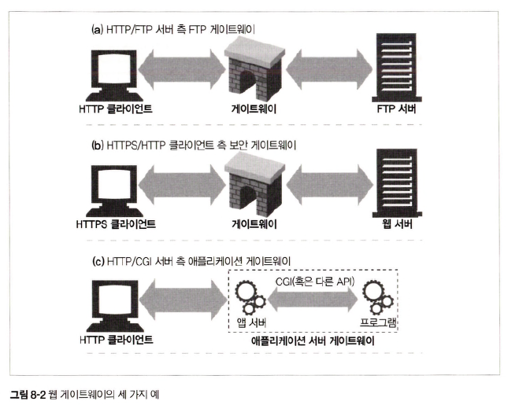
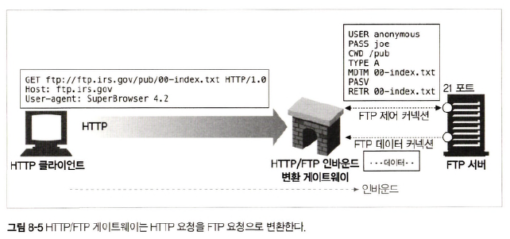
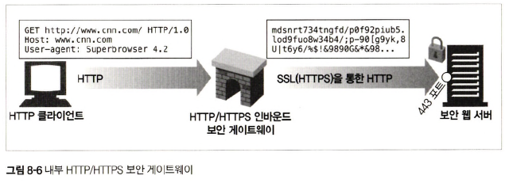
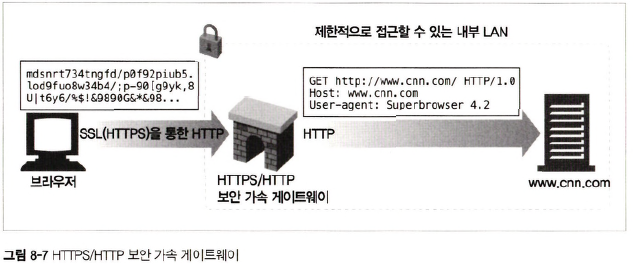
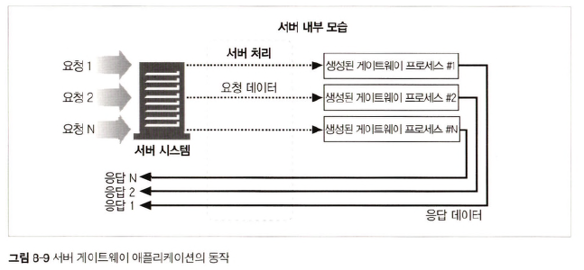
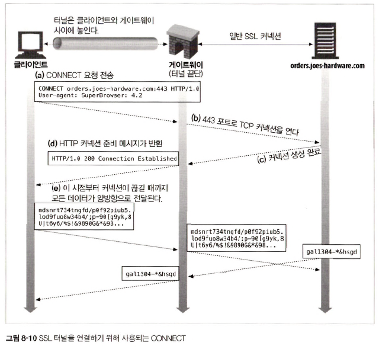
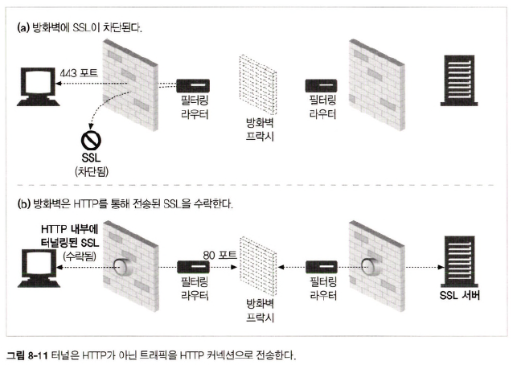
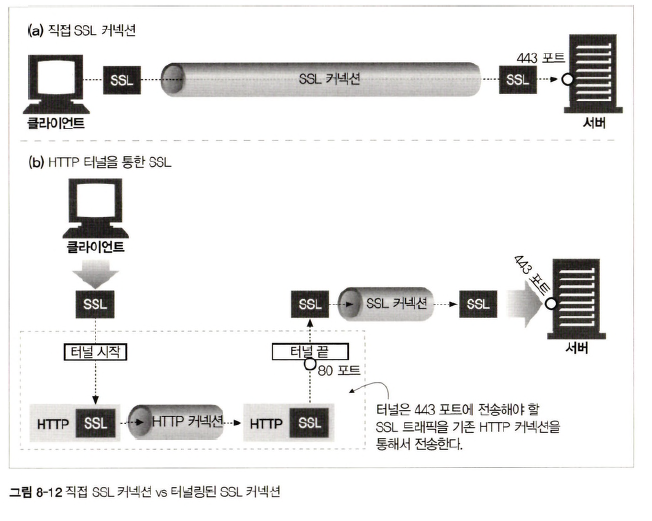
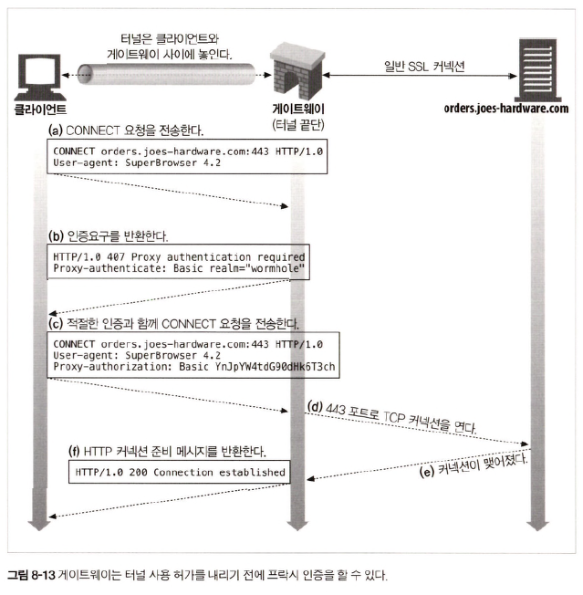
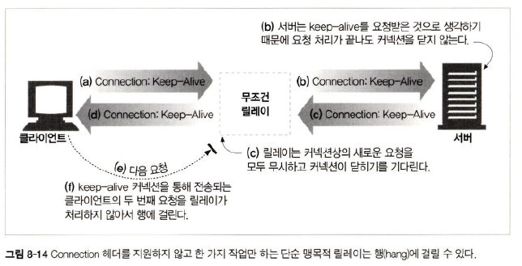

# 8장 통합점: 게이트웨이, 터널, 릴레이

## 8.1 게이트웨이

> HTTP 트래픽을 다른 프로토콜로 변환하여 HTTP 클라이언트가 다른 프로토콜을 알 필요없이 서버에 접속 가능하게 함

<div align="center">
    
</div>

## 8.2 프로토콜 게이트웨이

### 8.2.1 HTTP/*: 서버 측 웹 게이트웨이

<div align="center">
    
</div>

### 8.2.2 HTTP/HTTPS: 서버 측 보안 게이트웨이

<div align="center">
    
</div>

### 8.2.3 HTTPS/HTTP: 클라이언트 측 보안 가속 게이트웨이

> 보안 HTTPS 트래픽을 받아 복호화하고 웹 서버로 보낼 일반 HTTP 요청 전송

<div align="center">
    
</div>

## 8.3 리소스 게이트웨이

> CGI(= Common Gateway Interface)란, 특정 URL에 대한 HTTP 요청에 따라 프로그램을 실행, 출력 수집, HTTP 응답 등 웹 서버가 사용되는 표준화된 인터페이스 집합

<div align="center">
    
</div>

## 8.5 터널

> 웹 터널 &rarr; HTTP 프로토콜을 지원하지 않는 애플리케이션에 HTTP 애플리케이션을 사용해 접근하는 방법 제공

### 8.5.1 CONNECT로 HTTP 터널 커넥션 맺기

> 웹 터널 &rarr; HTTP CONNECT 메서드로 connection 맺음

<div align="center">
    
</div>

### 8.5.3 SSL 터널링

> 웹 터널 본래 목적 : 방화벽을 통해 암호화된 SSL 트래픽 전달  
> 터널을 사용하여 SSL 트래픽을 HTTP connection으로 전송하여 80 포트의 HTTP만을 허용하는 방화벽 통과 가능

<div align="center">
    
</div>

<div align="center">
    
</div>

- 터널을 이용해 80포트의 HTTP 프로토콜만 허용하는 방화벽을 통화시켜 기존 프록시 방화벽 통과
- 해당 경로로 악의적인 트래픽 유입 가능

### 8.5.4 SSL 터널링 vs HTTP/HTTPS 게이트웨이

#### SSL 터널링

- SSL 사용하면 프록시에 SSL 구현 필요 x &rarr; SSL 세션은 클라이언트가 생성한 요청과 보안이 적용된 웹 서버 간 생성
- 프록시 서버 &rarr; 트랜잭션 보안엔 관여하지 않고 암호화된 데이터를 그대로 터널링

#### HTTP/HTTPS 게이트웨이

- 클라이언트 &harr; 게이트웨이 사이에는 보안이 적용되지 않은 일반 HTTP connection
- 클라이언트 &rarr; 원격 서버에 SSL 클라이언트 인증 x ∵ 프록시가 인증 담당
- 게이트웨이 &rarr; SSL 완벽 지원 보장 필요

### 8.5.5 터널 인증

<div align="center">
    
</div>

## 8.6 릴레이

<div align="center">
    
</div>

- 릴레이 문제
```text
1. 클라이언트는 Connection: Keep-Alive 헤더를 보내 릴레이와 Keep-Alive 상태 유지하기를 원함
2. 릴레이는 이해하지 못해 서버에 그대로 전달
3. 서버는 릴레이가 서버 <-> 릴레이 Keep-Alive 상태를 유지하기를 원한다고 생각
4. 릴레이는 받은 Keep-Alive를 그대로 클라이언트에 응답
5. 클라이언트는 릴레이와 Keep-Alive 유지한다고 생각
6. 클라이언트는 릴레이에 다음 요청 전송
7. 릴레이는 서버와의 connection을 유지하고 있어 connection 닫히기를 기다림
8. 브라우저는 계속 돌지만 아무런 작업 x
```