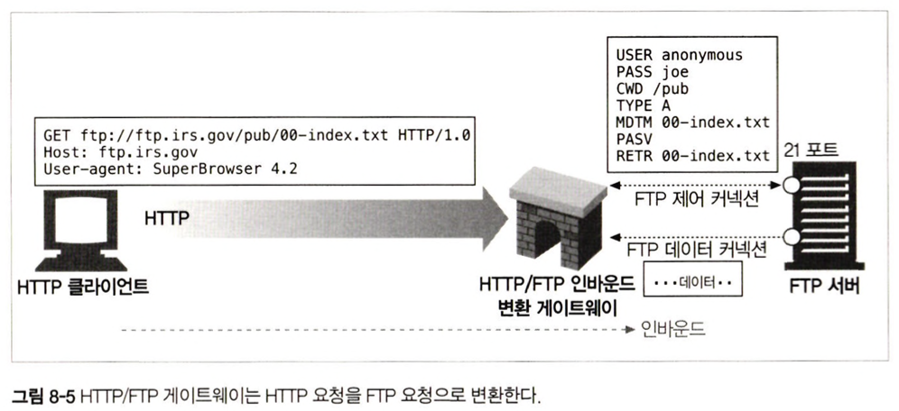
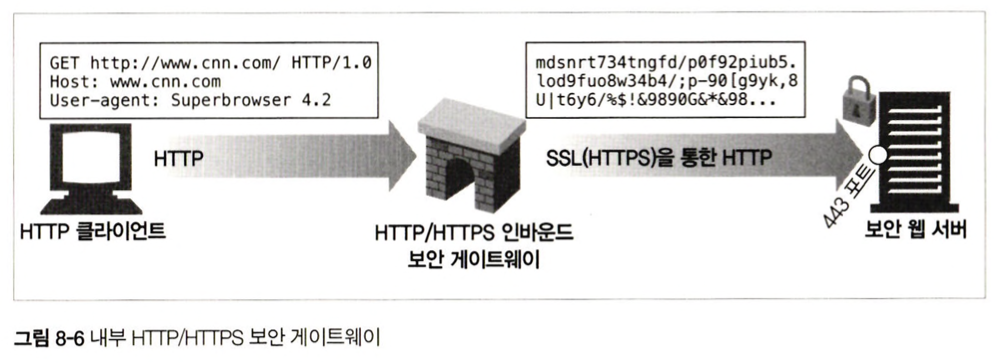
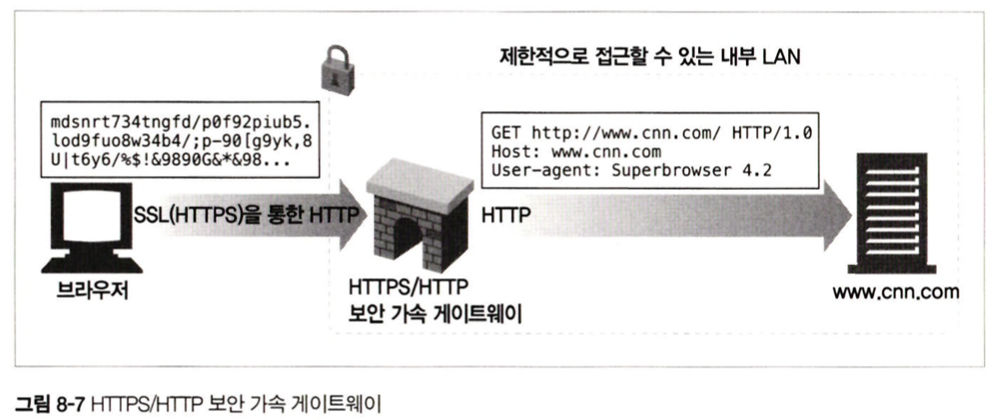
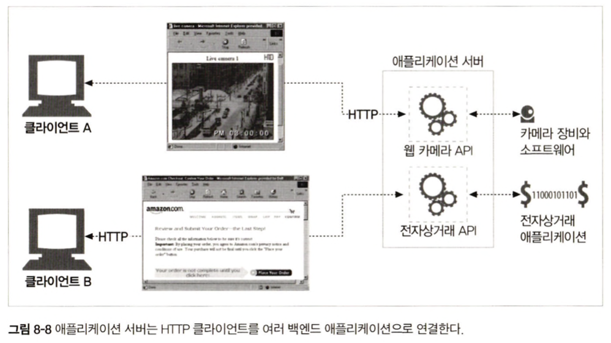
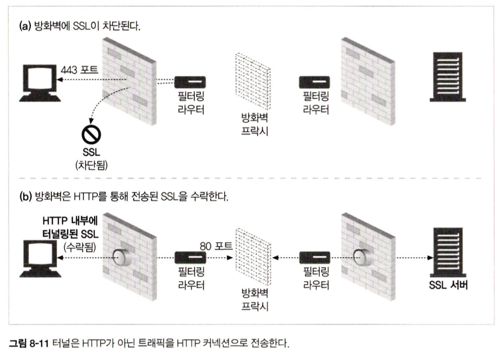
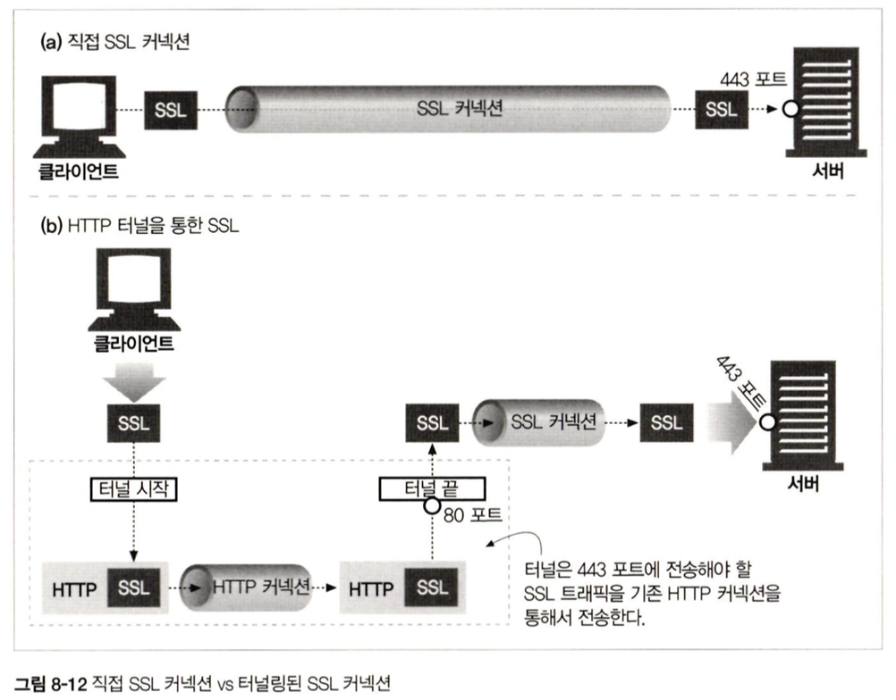
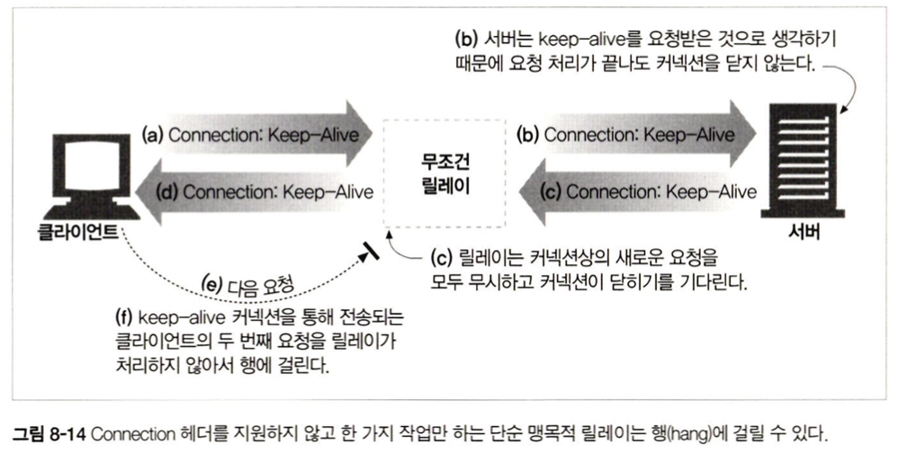

 
 
 

### 8.1 게이트웨이
게이트웨이는 HTTP 트래픽을 다른 프로토콜로 자동 변환 

 
 

### 8.2 프로토콜 게이트웨이

#### 1) HTTP/* : 서버 측 웹 게이트웨이

    

 

#### 2) HTTP/HTTPS : 서버 측 보안 게이트웨이

    

 

#### 3) HTTPS/HTTP : 클라이언트 측 보안 가속 게이트웨이 (= SSL 오프로딩, SSL 터미네이션)

    

-> **`원 서버의 부하를 줄여주지만, 게이트웨이와 원 서버 사이에 있는 네트워크가 안전한지 확실히 확인하고 써야함`**

 
 

### 8.3 리소스 게이트웨이
**`애플리케이션 서버도 게이트웨이의 일종`**. 애플리케이션 서버는 게이트웨이와 목적지 서버를 한 개의 서버로 결합하고 클라이언트와는 HTTP로 통신한다.

    

애플리케이션 게이트웨이에서 **`유명했던 최초의 API는 공용 게이트웨이 인터페이스(Common Gateway Interface, CGI)`** 였다.

 

> `CGI`  
> 특정 URL에 대한 HTTP 요청에 따라 프로그램을 실행, 프로그램의 출력을 수집, HTTP 응답으로 회신하는데 웹 서버가 사용하는 표준화된 인터페이스 집합

 
 

### 8.5 터널

    

- HTTP 커넥션을 통해서 HTTP가 아닌 트래픽을 전송하는 데 사용  
- HTTP CONNECT 메서드를 사용해서 커넥션을 맺음  

 

### 8.5.2 데이터 터널링, 시간, 커넥션 관리
터널을 통해 전달되는 데이터는 게이트웨이에서 볼 수 없어서, 게이트웨이는 터널을 통해 전달되는 패킷의 순서나 흐름에 대한 어떤 가정도 할 수 없다.  

 

### 8.5.3 SSL 터널링
웹 터널은 원래 방화벽을 통해서 암호화된 SSL 트래픽을 전달하기 위해 개발되었다.
터널을 이용하면 SSL 트래픽을 HTTP 커넥션으로 전송하여 80 포트의 HTTP 만을 허용하는 방화벽을 통과시킬 수 있다.
-> 하지만 터널은 악의적인 트래픽이 사내로 유입되는 경로가 될 수 있으므로 주의가 필요하다

    

    

 
 

### 8.6 릴레이
HTTP 명세를 완전히 준수하지 않는 심플한 HTTP 프록시로, 커넥션을 맺기 위해 HTTP 통신을 한 다음, 바이트를 맹목적으로 전달  

    

