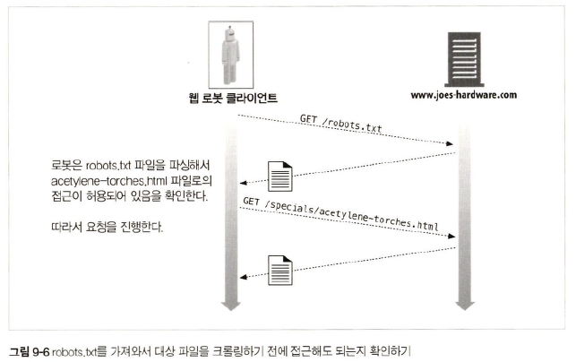

# 9장 웹 로봇

## 9.1 크롤러와 크롤링

> 웹 크롤러란, 웹 페이지에 포함된 정보들을 재귀적으로 반복하여 웹을 순회하는 로봇  
> 웹을 돌아다니면서 모든 데이터를 끌어오기 위해 크롤러 사용

## 9.2 로봇의 HTTP

### 9.2.1 요청 헤더 식별하기

|항목| 설명                  |
|:----:|:--------------------|
|User-Agent| 서버에 요청을 만든 로봇 이름 명시 |
|From|로봇의 사용자/관리자 이메일 주소 제공|
|Accept|서버에 어떤 미디어 타입을 보내도 되는지 명시<br/>특정 컨텐츠(텍스트, 이미지 등)만 받도록 제한 가능|
|Referer|현재 요청 URL을 포함한 문서 URL 제공|

## 9.4 로봇 차단하기

<div align="center">
    
</div>

### 9.4.3 robots.txt 파일 포맷

```text
#이 robots.txt파일은Slurp과Webcrawler가우리사이트의공개된
#영역올 크롤링하는 것을 허락한다. 그러나 다른 로봇은 안 된다. . .

User-Agent: slurp
User-Agent: webcrawler
Disallow: /private

User-Agent: *
Disallow:
```