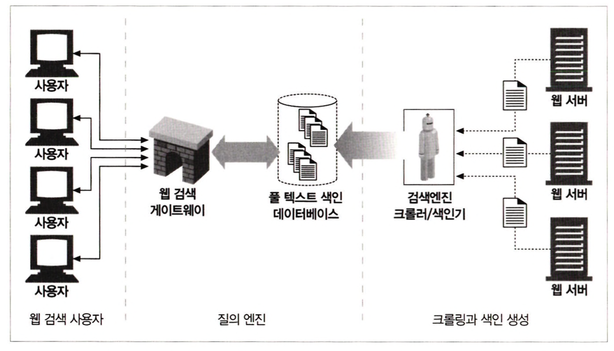

# 9장 웹로봇

웹 로봇은 사람과의 상호작용 없이 연속된 웹 트렌젝션을 자동으로 수행하는 소프트웨어 프로그램이다.

## 1 크롤러와 크롤링

웹 크롤러는, 먼저 웹페이지를 한 개 가져오고, 그 다음 그 페이지가 가리키는 모든 웹페이지를 가져오고, 다시 그 페이지들이 가리키는 모든 웹페이지들을 가져오는, 이러한 일을 재귀적으로 반복하는 방식으로 웹을 순회하는 로봇이다.

### 1.1 루트 집합

- 크롤러가 방문을 시작하는 URL들의 초기 집합은 루트 집합이라고 불린다.
- 루트 집합을 고를 때 모든 링크를 크롤링하면 결과적으로 관심 있는 웹페이지들의 대부분을 가져오게 될 수 있도록 충분히 다른 장소에서 URL들을 선택해야한다.
- 인터넷 검색엔진에 쓰이는 거소가 같은 많은 대규모 크롤러 제품들은 사용자들이 루트집합에 새 페이지나 잘 알려지지 않은 페이지들을 추가하는 기능을 제공한다.

### 1.2 링크 추출과 상대 링크 정상화

- 크롤러는 검색한 각 페이지 안에 들어있는 URL 링크들을 파싱해서 크롤링할 페이지들의 목록에 추가 해야 한다.
- 크롤러들은 간단한 HTML 파싱을 해서 이들 링크들을 추출하고 상대링크를 절대링크로 변환할 필요가 있다.

### 1.3 순환 피하기

로봇이 웹을 크롤링할 때, 루프나 순환에 빠지지 않도록 매우 조심해야 한다.

페이지 A → 페이지 B → 페이지 C → 페이지 A → …

로봇들은 순환을 피하기 위해 반드시 그들이 어디를 방문했는지 알아야한다.

### 1.4 빵 부스러기의 흔적

- URL은 굉장히 많기 때문에, 어떤 URL을 방문했는지 빠르게 판단하기 위해서는 복잡한 자료 구조를 사용할 필요가 있다.
- 이 자료 구조는 속도와 메모리 사용 면에서 효과적이어야 한다.
1. 트리와 해시 테이블
2. 느슨한 존재 비트맵
3. 체크 포인트
4. 파티셔닝

### 1.5 별칭과 로봇 순환

한 URL이 또 다른 URL에 대한 별칭이라면, 그 둘이 서로 달라 보이더라도 사실은 같은 리소스를 가리키고 있다.

<div align="center">
    
</div>

### 1.6 URL 정규화하기

대부분의 웹 로봇은 URL들을 표준 형식으로 정규화함으로써 다른 URL과 같은 리소스를 가리키고 있음이 확실한 것들을 미리 제거하려 시도한다.

1. 포트 번호가 명시되지 않았다면, 호스트 명에 ‘:80’을 추가한다.
2. 모든 %xx 이스케이핑된 문자들을 대응되는 문자로 변환한다.
3. # 태그들을 제거한다.

URL 정규화는 기본적인 문법의 별칭을 제거할 수 있찌만, 로봇들은 URL 표준 형식으로 변환하는 것만으로는 제거할 수 없는 다른 URL 별칭도 만나게 될 것이다.

### 1.7 파일 시스템 링크 순환

파일 시스템의 심벌릭 링크는 순환을 유발할 수 있다.

<div align="center">
    
</div>

(b)의 파일 시스템에서는 다음과 같은 일이 일어났을 것이다.

1. GET http://www.foo.com/index.html
/index.html을 가져와서 subdir/index.html로 이어지는 링크를 발견한다.
2. GET http://www.foo.com/subdir/index.html
subdir/index.html을 가져왔지만 같은 index.html로 되돌아간다.
3. GET http://www.foo.com/subdir/subdir/index.html
subdir/subdir/index.html을 가져온다.
4. GET http://www.foo.com/subdir/subdir/subdir/index.html
subdir/subdir/subdir/index.html을 가져온다.

subdir/이 /로 링크되어 있기 때문에 순환되는 것이지만 URL이 달라보이기 떄문에 로봇은 URL만으로는 문서가 같다는 것을 모른다.

## 2. 로봇의 HTTP

- 로봇들은 HTTP 요청을 만들고 스스로를 클라이언트로서 적절한 HTTP 요청 헤더를 사용해야 한다.

### 2.1 요청 헤더 식별하기

- 로봇 대부분은 약간의 신원 식별 헤더(능력, 신원, 출신)를 구현하고 전송한다.
- 이 정보들은 크롤러의 소유자를 찾아낼 때와 서버에게 로봇이 어떤 종류의 콘텐츠를 다룰 수 있는지에 대한 약간의 정보를 주려 할 때 유용하다.

**User-Agent**

- 서버에게 요청을 만든 로봇의 이름

**From**

- 로봇의 사용자/관리자의 이메일 주소를 제공한다.

**Accept**

- 서버에게 어떤 미디어 타입을 보내도 되는지 말해준다.

**Referer**

- 현재의 요청 URL을 포함한 문서의 URL을 제공한다.

### 2.2 가상 호스팅

- 로봇은 Host 헤더를 지원해야 한다.
- 요청에 Host 헤더를 포함 하지 않으면 로봇이 어떤 URL에 대해 잘못된 콘텐츠를 찾게된다.

### 2.3 조건부 요청

- 수십억 개의 웹페이지를 다운 받을 수 도 있으므로, 콘텐츠가 변경되었을때만 가져오도록 하는 것이 효과적이다.
- 시간이나 엔터티 태그를 비교함으로써 그들이 받아간 마지막 버전 이후에 업데이트 된 것이 있는지 알아보는 조건부 HTTP요청을 구현한다.

### 2.4 응답 다루기

- 로봇들은 주 관심사가 단순히 GET 메서드로 콘텐츠를 요청해서 가져오는 것이므로 `응답다루기` 를 거의 하지 않는다.
- 로봇들은 최소한 일반적인 `상태 코드`나 예상할 수 있는 `상태 코드`를 다룰 수 있어야한다.
- HTTP 헤더에 임베딩된 정보를 따라 로봇들은 엔터티 자체의 정보를 찾을 수 있다.
- 메타 `http-equiv` 태그와 같은 메타 HTML 태그는 리소스에 대해 콘텐츠 저자가 포함시킨 정보다.

### 2.5 User-Agent 타기팅

- 웹 사이트들은 그들의 여러 기능을 지원할 수 있도록 브라우저의 종류를 감지하여 그에 맞게 콘텐츠를 최적화한다.
- 사이트는 로봇에게 콘텐츠 대신 에러 페이지를 제공한다.

## 3 로봇 차단하기

- 웹 서버는 서버의 문서 루트에 robots.txt라고 이름 붙은 선택적인 파일을 제공할 수 있다. 이 파일은 어떤 로봇이 서버의 어떤 부분에 접근할 수 있는지에 대한 정보가 담겨있다.
- 웹 사이트 전체에 대한 robots.txt 파일은 단 하나만 존재한다.

**robots.txt 가져오기**

- HTTP GET 메서드를 이용해 robots.txt 리소스를 가져온다.
- robots.txt가 존재한다면 서버는 그 파일을 text/plain 본문으로 반환한다.
- From이나 User-Agent 헤더를 통해 신원 정보를 넘긴다.

**응답 코드**

- 2XX - 로봇은 차단 규칙을 따라야 한다.
- 404 - 로봇은 제약 없이 사이트에 접근할 수 있다.
- 401, 403 - 로봇은 사이트로의 접근은 완전히 제한되어 있다고 가정한다.
- 503 - 로봇은 그 사이트의 리소스를 검색하는 것을 뒤로 미루어야 한다.
- 3XX - 로봇은 리소스가 발견될 때까지 리다이렉트를 따라가야 한다.

### 3.1 robots.txt 파일 포맷

robots.txt 파일의 각 줄은 빈줄, 주석줄, 규칙 줄의 세 가지 종류가 있다.

```jsx
User-Agent: <robot-name>
Disallow: /private
Allow: /
```

**User-Agent** 

- 로봇 이름이 자신 이름의 부분 문자열이 될 수 있는 레코드들 중 첫 번째 것
- 로봇 이름이 *인 레코드들 중 첫 번째 것

**Allow/Disallow**

- 특정 로봇에 대해 어떤 URL 경로가 명시적으로 금지되어 있고 명시적으로 허용되는지 기술한다.
- 규칙 경로는 반드시 그 맞춰보고자 하는 경로의 대소문자를 구분하는 접두사여야한다.

<div align="center">
    
</div>

### 3.2 robots.txt 의 캐싱과 만료

- 로봇은 주기적으로 robots.txt를 가져와서 그 결과를 캐시해야 한다.
- robots.txt의 캐시된 사본은 robots.txt 파일이 만료될 때까지 로봇에 의해 사용된다.
- 로봇은 HTTP 응답의 Cache-Control과 Expires 헤더에 주의를 기울여야 한다.

### 3.3 HTML 로봇 제어 META 태그

HTML 문서의 <head> 태그내에 있는 <meta> 태그를 활용한다.

```
<head>
<meta name="robots" content="명령어">
</head>

```

로봇 메타 태그는 페이지 별로 검색로봇의 접근 여부를 제어할 수 있는 정보이다. 명령어에 noindex를 사용하면 해당 페이지는 검색 결과에서 제외되며, nofollow를 사용하면 검색로봇이 해당 페이지 내의 링크를 수집하지 않도록 설정할 수 있다.

- 색인 대상으로 처리, 페이지 내 링크 미 수집

```
<head>
<meta name="robots" content="index,nofollow">
</head>

```

- 색인 대상에서 제외, 페이지 내 링크 수집

```
<head>
<meta name="robots" content="noindex,follow">
</head>

```

- 색인 대상에서 제외, 페이지 내 링크 미 수집

```
<head>
<meta name="robots" content="noindex,nofollow">
</head>

```

검색로봇에 대하여 특별한 제약조건이 없다면 웹 페이지가 검색 결과에서 제외되지 않도록 로봇 메타 태그를 삭제하거나 아래와 같이 기본 설정인 index, follow로 설정하시는 것을 권장한다.

```
<head>
<meta name="robots" content="index,follow">
</head>
```

**추가적인 META 태그**

<div align="center">
    
</div>

## 4 검색 엔진

- 웹 크롤러들은 마치 먹이를 주듯 검색엔진에게 웹에 존재하는 문서를 가져다 주어서, 검색엔진이 어떤 문서에 어떤 단어들이 존재하는지에 대한 색인을 생성할 수 있게 한다.
- 오늘날의 검색엔진들은 그들이 갖고 있는 전 세계의 웹페이지들에 대해 ‘풀 텍스트 색인'이라고 하는 복잡한 로컬 데이터베이스를 생성한다. 이 색인은 웹의 모든 문서에 대한 일종의 카드 카탈로그처럼 동작한다.

<div align="center">
    
</div>

- 풀 텍스트 색인은 단어 하나를 입력 받아 그 단어를 포함하고 있는 문서를 즉각 알려줄 수 있는 데이터베이스다.

<div align="center">
    
</div>

### 4.1 질의 보내기

사용자가 질의를 웹 검색엔진 게이트웨이로 보내는 방법은, HTML 폼을 사용자가 채워 넣고 브라우저가 그 폼을 HTTP GET이나 POST 요청을 이용해서 게이트웨이로 보내는 식이다.

1. 사용자는 ‘drills’를 검색 상자 폼에 타이핑하고 브라우저는 이를 질의 매개변수를 URL의 일부로 포함하는 GET 요청으로 변역한다.
2. 죠의 하드웨어 웹 서버는 이 질의를 받아서 검색 게이트웨이 애플리케이션에게 념겨준다.
3. 게이트웨이는 웹 서버에게 문서의 목록을 결과로 돌려준다.
4. 웹 서버는 이 결과를 사용자를 위한 HTML 페이지로 변환한다.

<div align="center">
    
</div>

### 4.2 검색 결과를 정렬하고 보여주기

- 많은 웹페이지가 주어진 단어를 포함할 수 있기 때문에, 검색엔진은 결과에 순위를 매기기 위해 똑똑한 알고리즘을 사용한다.
- 예를 들어, 검색엔진은 그 문서들이 주어진 단어와 가장 관련이 많은 순서대로 결과 문서에 나타날 수 있도록 문서들 간의 순서를 알 필요가 있다. 관련도 랭킹이라고 불린다.